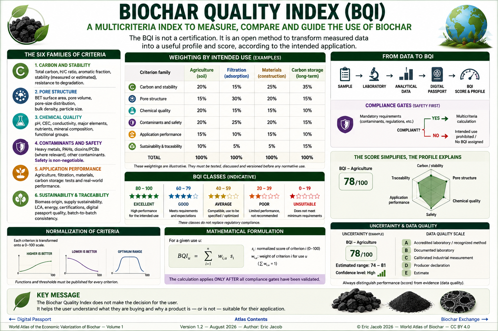

# Chapter 5.4 — Biochar Quality Index

> **World Atlas of the Economic Valorization of Biochar — Volume 1**  
> Version 1.2 — August 2026 · Author: Eric Jacob

**[← Digital Passport](ch5_en_biochar_passport.md) · [↑ Atlas Contents](README_en.md) · [Biochar Exchange →](ch5_en_biochar_exchange.md)**

---

## Turning Complex Analyses into Usable Information

A biochar cannot be properly described by a single property.

Its value simultaneously depends on carbon stability, pore structure, chemical composition, contaminants, traceability and, above all, its **suitability for the intended use**.

The Atlas therefore proposes a **Biochar Quality Index (BQI)**: not a new certification, but an open method for transforming a set of measured data into a comparable profile and, where useful, a synthetic score.

The objective is simple:

> **make quality understandable without concealing the scientific complexity behind it.**

<figure>
  
  <figcaption>
    <strong>Figure 1 — Biochar Quality Index: measure, compare and guide use.</strong>
    The BQI presented in this Atlas is a methodological proposal. The illustrated scores, thresholds and weightings do not constitute an official standard or certification.
    © Eric Jacob 2026 — World Atlas of Biochar — CC BY 4.0.
    <a href="ch5_en_quality_index.png">View full-size infographic</a>
  </figcaption>
</figure>

---

## Why an Index?

Markets can easily compare two products when their characteristics are simple: mass, dimensions, power or purity.

Biochar is different.

Two tonnes of biochar may have:

- the same carbon content but different stability;
- the same specific surface area but different pore-size distributions;
- the same pH but different mineral compositions;
- excellent agronomic quality but poor suitability for filtration;
- excellent technical performance but insufficient traceability.

A comparison based solely on price per tonne is therefore incomplete.

The BQI seeks to add another dimension:

```text
PRICE
  +
MEASURED QUALITY
  +
FIT FOR PURPOSE
  =
MORE RELEVANT COMPARISON
```

---

## Fundamental Principle: the Passport Provides the Data

The Index must not create its own data.

It should be calculated from the **[Digital Biochar Passport](ch5_en_biochar_passport.md)** or from a dataset providing an equivalent level of traceability.

The logical chain becomes:

```text
SAMPLE
   ↓
LABORATORY
   ↓
ANALYTICAL DATA
   ↓
DIGITAL PASSPORT
   ↓
NORMALIZATION
   ↓
USE-SPECIFIC WEIGHTING
   ↓
BQI
```

Every score can therefore be traced back to the measurement from which it was derived.

---

## Six Families of Criteria

A first BQI architecture can be based on six families.

### 1. Carbon and Stability

This family describes the nature of the carbonaceous material and its potential ability to retain a fraction of its carbon over long periods.

Possible indicators include:

- organic carbon;
- relevant atomic ratios;
- carbonization indicators;
- stability measured or estimated according to a recognized method;
- resistance to certain forms of degradation.

For an application primarily focused on carbon removal, this family will naturally receive substantial weight.

---

### 2. Pore Structure

Porosity influences water, gases, adsorbed molecules and biological interfaces.

Possible indicators include:

- BET surface area;
- pore volume;
- pore-size distribution;
- bulk density;
- particle-size distribution;
- pore accessibility.

A high specific surface area should never be interpreted in isolation: **pore geometry must correspond to the intended function**.

---

### 3. Chemical Quality

This family describes potential interactions with the surrounding medium.

It may include:

- pH;
- conductivity;
- cation exchange capacity;
- major elements;
- nutrients;
- mineral composition;
- functional groups when measured.

A high pH is neither intrinsically good nor bad: its relevance depends on the soil, material or process in which the biochar will be used.

---

### 4. Contaminants and Safety

This family must operate differently from the others.

A poor specific-surface-area value may reduce performance.

Exceeding a regulatory contaminant limit may **prohibit the intended use**.

Relevant parameters may include:

- heavy metals;
- polycyclic aromatic hydrocarbons;
- dioxins or PCBs where relevant;
- compounds specific to the feedstock;
- emerging contaminants where required by the application.

> **Safety must never be compensable by excellent performance elsewhere.**

This is a fundamental principle of the BQI. :contentReference[oaicite:2]{index=2}

---

### 5. Application Performance

Laboratory characterization describes the material; application testing verifies what it can actually do.

Depending on the intended use:

**Agriculture:** water, nutrients, soil interactions and agronomic trials.

**Filtration:** useful capacity, selectivity, kinetics, saturation and regeneration.

**Materials:** strength, density, thermal behaviour, water response and ageing.

**Carbon:** stability, permanence, net balance and traceability.

This family makes the index much more useful than a simple chemical ranking.

---

### 6. Sustainability and Traceability

A technically excellent product may be downgraded if its origin is opaque.

This family may include:

- biomass origin;
- residual or cultivated nature of the feedstock;
- sustainability of supply;
- transport distances;
- process energy;
- life cycle assessment;
- certification;
- passport quality;
- chain of custody;
- batch-to-batch reproducibility.

Biochar quality therefore begins **before thermolysis**. :contentReference[oaicite:3]{index=3}

---

## Disqualifying Criteria

Not every criterion should be averaged.

Suppose a biochar receives:

```text
stability       95/100
porosity        90/100
chemistry       85/100
performance     92/100
traceability    88/100
safety          NON-COMPLIANT
```

An arithmetic mean could still produce a high score.

That would be absurd.

The BQI must therefore include **compliance gates**:

```text
COMPLIANT?
   │
   ├── NO  → intended use prohibited / index cannot be assigned
   │
   └── YES → multicriteria calculation
```

This rule protects the index from one of the principal weaknesses of composite scores: artificial compensation. :contentReference[oaicite:4]{index=4}

---

## Normalizing Measurements

The underlying data do not use the same units.

To aggregate them, each criterion must be transformed onto a common scale, for example from 0 to 100.

A normalization function may be increasing:

```text
poor ───────────────── excellent
  0                       100
```

or decreasing when a lower value is preferable, as with certain contaminants.

In other cases, the optimum lies **between two limits**.

Agricultural pH provides a good example: an extreme value in either direction is not necessarily desirable.

The normalization function used for every criterion must therefore be published.

---

## Weighting According to Use

A universal weighting system would contradict the very nature of biochar.

The Atlas instead proposes several profiles.

| Family | Agriculture | Filtration | Materials | Carbon Storage |
|---|---:|---:|---:|---:|
| Carbon / stability | 20% | 15% | 25% | 35% |
| Pore structure | 15% | 30% | 20% | 15% |
| Chemical quality | 20% | 15% | 15% | 10% |
| Safety / contaminants | 20% | 25% | 20% | 15% |
| Application performance | 15% | 10% | 15% | 10% |
| Sustainability / traceability | 10% | 5% | 5% | 15% |

These weightings are **illustrative**. They must be tested, discussed and versioned before any normative use. :contentReference[oaicite:5]{index=5}

---

## Mathematical Formulation

For an application \(u\), a synthetic score can be defined as:

\[
BQI_u = \sum_{i=1}^{n} w_{i,u}\,s_i
\]

where:

- \(s_i\) is the normalized score for criterion \(i\), between 0 and 100;
- \(w_{i,u}\) is the weight assigned to criterion \(i\) for application \(u\);
- \(\sum w_{i,u}=1\).

However, this formula applies **only after all disqualifying criteria have been validated**.

Conceptually:

\[
BQI_u =
\begin{cases}
\text{Non-compliant}, & \text{if a mandatory requirement fails}\\
\sum_i w_{i,u}s_i, & \text{otherwise}
\end{cases}
\]

:contentReference[oaicite:6]{index=6}

---

## Do Not Hide the Profile Behind the Score

A score of `78/100` is easy to communicate.

It is also dangerous if it becomes the only information considered.

Two biochars may both score 78 while having very different profiles.

The Atlas therefore recommends displaying both:

```text
BQI AGRICULTURE: 78/100

Carbon/stability       ████████░░
Pore structure         ██████░░░░
Chemical quality       █████████░
Safety                 ██████████
Application performance███████░░░
Traceability           █████████░
```

The score simplifies.

The profile explains.

---

## Quality Classes

For easier interpretation, an indicative classification can be used:

| BQI | Indicative Class |
|---:|---|
| 80–100 | Excellent |
| 60–79 | Good |
| 40–59 | Average / application to be specified |
| 20–39 | Poor |
| 0–19 | Unsuitable |

These thresholds must not be confused with regulatory compliance.

A product may receive a good overall score while remaining unsuitable for a particular application.

Conversely, a biochar with an average general score may be excellent for a highly specific function. :contentReference[oaicite:7]{index=7}

---

## Adding Uncertainty

Laboratory measurements are not infinitely precise.

A future evolution of the BQI should therefore incorporate:

- analytical uncertainty;
- variability between samples;
- batch-to-batch variability;
- confidence in the data;
- quality of the analytical method.

Instead of publishing:

```text
BQI = 78
```

it might publish:

```text
BQI = 78
estimated interval: 74–81
confidence level: high
```

This would avoid creating false precision.

---

## Data Quality

Not all data provide the same level of evidence.

The Atlas can distinguish:

```text
A — accredited laboratory / recognized method
B — documented laboratory
C — calibrated industrial measurement
D — producer declaration
E — estimate
```

An index could display its **confidence level** independently from its score.

For example:

```text
BQI-Agriculture: 82/100
Data confidence: A-
```

This distinction between *performance* and *evidence* is essential. :contentReference[oaicite:8]{index=8}

---

## Versioning the Algorithm

A scientific index must be able to evolve.

Every calculation should therefore retain:

```text
BQI-Agriculture
Version: 1.0
Date: 2026-08-02
Weighting set: AGR-1.0
Normalization functions: NORM-1.0
```

If scientific knowledge changes, an older batch can be recalculated using a newer version without erasing its historical result.

The **Digital Passport** provides an ideal infrastructure for preserving these versions.

---

## Comparing Batches Rather Than Brands

The BQI should not assign a permanent reputation to a company.

It should evaluate **a batch or a sufficiently characterized product range**.

The same installation can produce different biochars depending on:

- biomass;
- feedstock blend;
- moisture;
- temperature;
- residence time;
- post-treatment.

This granularity encourages genuine improvement rather than brand-based communication. :contentReference[oaicite:9]{index=9}

---

## A Field Feedback Loop

Initial weightings will inevitably be imperfect.

They can be improved using observed results.

```text
PREDICTED BQI
      ↓
REAL-WORLD USE
      ↓
MEASURED RESULT
      ↓
COMPARISON
      ↓
MODEL ADJUSTMENT
```

If biochars with a particular profile consistently produce better results in sandy soils, this information can improve the agricultural model.

The index then becomes **learning-based**, while retaining audited versions.

---

## Artificial Intelligence and the Quality Index

With enough passports and field results, statistical or AI models could search for non-obvious relationships between:

```text
BIOMASS
+ PROCESS
+ ANALYSES
+ SOIL / WATER / MATERIAL
+ CLIMATE
+ DOSAGE
→ PERFORMANCE
```

AI should not replace safety thresholds or experimental validation.

It could, however, improve predictions of suitability for a particular application.

The system could progressively evolve from a **quality index** toward a **product–application compatibility index**. :contentReference[oaicite:10]{index=10}

---

## From BQI to Economic Value

Quality does not always have the same market value.

A highly porous biochar may command a premium in a filtration market while receiving no particular premium in an application where that property is irrelevant.

Price can therefore be conceptualized as:

```text
BASE PRICE
   +
RELEVANT QUALITY
   +
CERTIFICATION
   +
LOGISTICS
   +
CARBON ATTRIBUTE
   +
SCARCITY / DEMAND
```

The BQI provides part of the information required for this price formation.

It directly prepares the **[Biochar Exchange](ch5_en_biochar_exchange.md)** and the **[Global Price Index](ch5_en_global_price_index.md)**.

---

## Avoiding the Perverse Effect of the Score

Any indicator becomes dangerous when it becomes an objective in itself.

If the market mechanically rewards high BET surface area, some producers will optimize BET even where this does not improve the final application.

The BQI must therefore remain:

- multidimensional;
- application-oriented;
- versioned;
- transparent;
- revisable;
- connected to real-world results.

> **Production should never be optimized to maximize the score. It should be optimized to maximize the real function, with the score used to describe it.**

:contentReference[oaicite:11]{index=11}

---

## Toward an Open Index

Credible governance should publish:

- criteria;
- units;
- methods;
- normalization functions;
- weightings;
- disqualifying thresholds;
- versions;
- amendment procedures.

Producers, users, laboratories, researchers, certifiers and public authorities could propose changes.

The index would therefore belong neither to a vendor nor to a marketplace. :contentReference[oaicite:12]{index=12}

---

## Conceptual Example

Consider two batches intended for agriculture.

| Criterion | Batch A | Batch B |
|---|---:|---:|
| Stability | 92 | 75 |
| Porosity | 60 | 85 |
| Suitable chemistry | 78 | 82 |
| Safety | 100 | 100 |
| Field performance | 70 | 86 |
| Traceability | 95 | 72 |

It would be incorrect to immediately conclude that A or B is "better".

In a context where water retention and observed agronomic performance are priorities, B might be preferable.

In a project strongly focused on carbon permanence and traceability, A might be more attractive.

**The intended use determines what quality means.**

---

## From the Index to the "Ideal Biochar"

The chapter **[Toward the Ideal Biochar](ch5_en_biochar_ideal.md)** proposed designing the product from its intended function.

The BQI closes the loop:

```text
TARGET APPLICATION
      ↓
TARGET PROPERTIES
      ↓
PRODUCTION
      ↓
MEASUREMENTS
      ↓
BQI
      ↓
FIELD RESULTS
      ↓
IMPROVEMENT
```

The ideal biochar then ceases to be an abstract concept.

It becomes a measurable and improvable objective.

---

## Key Takeaways

> **The Biochar Quality Index should not make the decision for the user. It should allow the user to understand what they are buying and why that product is — or is not — suitable for their application.**

The passport provides the evidence.

The index organizes that evidence.

The field verifies performance.

The market can then begin to distinguish **one tonne of undifferentiated black carbon from a genuinely characterized technical material**. :contentReference[oaicite:13]{index=13}

---

## Continue Reading

**[← Digital Passport](ch5_en_biochar_passport.md) · [↑ Atlas Contents](README_en.md) · [Biochar Exchange →](ch5_en_biochar_exchange.md)**

See also: [Ideal Biochar](ch5_en_biochar_ideal.md) · [Certifications](ch4_en_certifications.md) · [Life Cycle Assessment](ch4_en_life_cycle_assessment.md) · [Global Price Index](ch5_en_global_price_index.md) · [Digital Twin](ch5_en_digital_twin.md)

---

*World Atlas of the Economic Valorization of Biochar — Eric Jacob — Version 1.2 — 2026*  
*License: Creative Commons CC BY 4.0*
