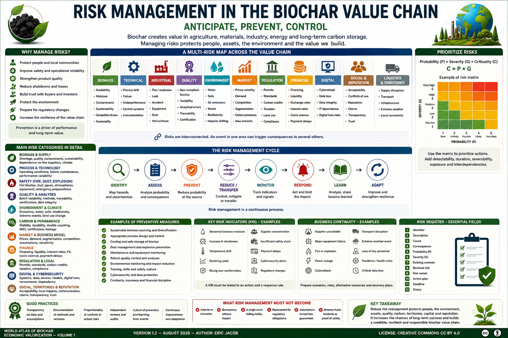

# Chapter 5 — Risk Management in the Biochar Value Chain

> **World Atlas of the Economic Valorization of Biochar — Volume 1**  
> Version 1.2 — August 2026 · Author: Eric Jacob

**[← Digital Twin](ch5_en_digital_twin.md) · [↑ Atlas Contents](README_en.md) · [Buyer's Guide →](ch5_en_buyer_guide.md)**

---

## Anticipate, Prevent and Control

Biochar offers opportunities in agriculture, materials, industry, energy and long-term carbon storage. Its development, however, takes place within complex chains involving biomass resources, thermochemical processes, industrial facilities, transport, markets, territories, regulation and digital systems.

A robust value chain does not claim that risk disappears. It seeks to **identify hazards and uncertainties, reduce their probability where possible, limit their consequences and learn from events**.

<figure>

<figcaption><strong>Figure 1 — Global risk map for the biochar value chain.</strong> Identify, assess, prevent, control, respond and learn in order to protect people, assets, the environment and the value created. © Eric Jacob 2026 — World Atlas of Biochar — CC BY 4.0. <a href="ch5_en_risk_management.png">View full-size infographic</a></figcaption>
</figure>

---

## Why Analyze Risks?

The objective is not to slow innovation. On the contrary, structured risk management can:

- improve safety;
- protect operators and local residents;
- strengthen product quality;
- reduce shutdowns and operating losses;
- improve buyer and investor confidence;
- protect the environment;
- prepare for regulatory developments;
- increase the resilience of the value chain.

Prevention therefore becomes a factor of economic performance as well as a requirement of responsibility.

---

## A Multi-Risk Map

| Area | Examples of Risks |
|---|---|
| Biomass | shortage, moisture, contaminants, unsustainable sourcing |
| Technical | process drift, failure, underperformance |
| Industrial | fire, explosion, leak, accident |
| Quality | non-compliant biochar, variability |
| Environment | water, soils, air, biodiversity |
| Climate | drought, storm, flooding, fire |
| Logistics | supply disruption, transport |
| Market | prices, demand, competition |
| Financial | financing, liquidity, exchange rates, interest rates |
| Regulatory | standards, permits, taxation |
| Digital | cyberattack, altered data |
| Social | acceptability, conflicts of use |
| Reputation | loss of confidence, unsupported claims |

These categories are interdependent. A drought can reduce the available resource, increase its price, disrupt production and weaken a contract. :contentReference[oaicite:3]{index=3}

---

## From Identification to Adaptation

```text
IDENTIFY
    ↓
ASSESS
    ↓
PREVENT
    ↓
REDUCE / TRANSFER
    ↓
MONITOR
    ↓
RESPOND
    ↓
ANALYZE LESSONS LEARNED
    ↓
ADAPT
    ↺
```

Risk management is therefore a continuous process.

---

## Probability, Severity and Criticality

A first prioritization can combine probability \(P\) and severity \(G\):

\[
C = P \times G
\]

where \(C\) represents an internal criticality index.

This relationship is a **ranking tool**, not a physical law. The scales used for \(P\) and \(G\), the thresholds and the decision rules must be explicitly defined.

A very rare but catastrophic event may require strong measures even if a simplified multiplication gives it a score comparable to a frequent but minor event. :contentReference[oaicite:4]{index=4}

---

## Beyond a Simple Risk Matrix

For some projects, the analysis may also consider:

- detectability;
- speed of onset;
- duration of consequences;
- reversibility;
- exposed population;
- interdependencies;
- recovery capacity;
- uncertainty in the assessment.

A colored matrix facilitates communication, but it does not replace technical expertise or the regulatory studies required.

---

## Biomass Supply Risks

Not all biomass feedstocks have the same availability or quality.

Key points of attention include:

- seasonality;
- excessive moisture;
- heterogeneity;
- contamination;
- collection distance;
- changes in competing uses;
- dependence on a small number of suppliers;
- climatic events;
- land-use change;
- overexploitation of residues.

A theoretical resource must not be confused with a sustainably mobilizable resource.

```text
THEORETICAL RESOURCE
− ECOLOGICAL NEEDS
− EXISTING USES
− TECHNICAL CONSTRAINTS
− NON-MOBILIZABLE AREAS
= POTENTIALLY AVAILABLE RESOURCE
```

Diversifying sources and using supply contracts can reduce certain risks without justifying the exploitation of ecologically necessary resources. :contentReference[oaicite:5]{index=5}

---

## Biomass Contaminants

The initial composition influences the final product.

Depending on the origin, it may be necessary to investigate or monitor:

- metals;
- salts;
- undesirable compounds;
- contamination by waste;
- foreign materials;
- mineral elements concentrated during conversion.

Complex or new biomass feedstocks should undergo appropriate characterization before industrialization.

---

## Thermochemical Process Risks

A facility must notably control:

- temperatures;
- flow rates;
- pressures where relevant;
- combustible gases;
- oxygen-deficient atmospheres;
- dust;
- hot surfaces;
- biomass feeding;
- biochar discharge;
- automation;
- emissions.

Safety design depends on the actual process. Applicable requirements must be established by competent professionals and according to the regulations governing the site. :contentReference[oaicite:6]{index=6}

---

## Fire and Self-Heating

A hot or insufficiently cooled carbonaceous material may present a fire risk. Storage must take into account the condition of the biochar, its temperature, moisture, particle size, ventilation, volumes and local conditions.

Industrial measures may include, depending on the context:

- controlled cooling;
- temperature monitoring;
- separation of areas;
- detection;
- appropriate extinguishing systems;
- emergency procedures;
- training.

The Atlas does not define a universal threshold: these depend on the products, facilities and applicable regulations.

---

## Dust and Hazardous Atmospheres

Handling dry and fine materials can generate dust.

Risk depends on the properties of the material, its concentration in the air, ignition sources and facility configuration. It must be assessed as part of the site's safety analysis.

Extraction, cleaning, limitation of accumulations and appropriate equipment design are among the possible preventive measures.

---

## Maintenance and Availability

Equipment degradation can affect both safety and economic performance.

A maintenance strategy can combine:

```text
PREVENTIVE + CONDITION-BASED + PREDICTIVE + CORRECTIVE
```

The **[Digital Twin](ch5_en_digital_twin.md)** can help detect certain deviations without replacing independent safety systems. :contentReference[oaicite:7]{index=7}

---

## Biochar Quality

Insufficiently characterized biochar can lead to:

- reduced effectiveness;
- variable results;
- incompatibility with an intended use;
- certification difficulties;
- disputes;
- loss of confidence.

Quality must be linked to the batch, analyses and intended use.

The **[Digital Biochar Passport](ch5_en_biochar_passport.md)** and **[Carbon Metrology](ch5_en_carbon_metrology.md)** are two complementary components of this traceability.

---

## Chemical Risks

Depending on biomass and process, characterization may need to take into account:

- polycyclic aromatic hydrocarbons;
- metals and trace elements;
- residual volatile compounds;
- pH;
- salts;
- contaminants specific to the feedstock.

The existence of a risk depends on concentration, exposure and use. An analytical result must therefore be interpreted according to the appropriate frameworks.

---

## Agriculture: Avoid the "One Biochar for All" Approach

Before significant agronomic use, the following should be considered:

- soil characteristics;
- pH;
- crop;
- climate;
- dose;
- particle size;
- formulation;
- contaminants;
- interactions with composts, fertilizers and other amendments.

A biochar that is useful in one context may be neutral or unsuitable in another.

Progressive and documented trials reduce uncertainty before large-scale deployment.

---

## Water and Environment

Potential impacts should be examined across the entire chain:

```text
BIOMASS
→ COLLECTION
→ TRANSPORT
→ PRETREATMENT
→ CONVERSION
→ CONDITIONING
→ TRANSPORT
→ USE
→ POSSIBLE END OF LIFE
```

**[Life Cycle Assessment](ch4_en_life_cycle_assessment.md)** helps prevent an impact from simply being shifted from one stage to another.

Points requiring attention may concern water, soils, air, biodiversity, emissions, energy consumption and transport. :contentReference[oaicite:8]{index=8}

---

## Physical Climate Risks

Facilities and supply chains may be exposed to:

- droughts;
- heat waves;
- fires;
- storms;
- floods;
- landslides;
- changes in agricultural or forestry yields.

A robust strategy should consider business continuity and diversification where the context warrants it.

---

## Carbon Permanence

Climate risk concerns not only the quantity of carbon measured, but also its permanence.

It is necessary to distinguish:

```text
MEASURED CARBON
≠
ESTIMATED DURABLE CARBON
≠
NET REMOVAL
≠
CERTIFIED REMOVAL
```

Stability assumptions and the rules of the applicable framework must remain visible. This issue is discussed in detail in **[Carbon Metrology](ch5_en_carbon_metrology.md)**.

---

## Double-Counting Risk

The same quantity of carbon must not be claimed multiple times by incompatible actors.

Tracking batches, certificates, transactions and retirements is therefore a governance risk as much as a commercial one.

The **[Global Observatory](ch5_en_global_observatory.md)** and the traceability infrastructures proposed in the Atlas are specifically intended to improve this transparency. :contentReference[oaicite:9]{index=9}

---

## Construction and Materials

In materials, risks may concern:

- mechanical strength;
- compatibility with binders;
- moisture;
- ageing;
- durability;
- fire behaviour;
- possible emissions;
- reproducibility of formulations.

Each formulation must be validated according to its intended use and applicable rules. Performance observed in a prototype should not automatically be generalized to all materials containing biochar.

---

## Market Risks

The biochar market is still developing and may experience:

- price volatility;
- demand below forecasts;
- competition;
- rapid segmentation by quality;
- changes in carbon-related premiums;
- emergence of new processes;
- different expectations according to use.

Diversification of outlets can improve resilience when it corresponds to genuine markets. :contentReference[oaicite:10]{index=10}

---

## Business-Model Risk

A project may appear profitable when several favorable assumptions are combined:

```text
HIGH BIOCHAR PRICE
+ HIGH CARBON-CREDIT VALUE
+ 100% ENERGY VALORIZATION
+ MAXIMUM AVAILABILITY
+ LOW LOGISTICS COST
```

A prudent analysis should test adverse scenarios.

---

## Sensitivity and Scenarios

For an economic variable \(x\), an analysis may compare several assumptions:

```text
LOW CASE
BASE CASE
HIGH CASE
```

The objective is not to predict the future exactly, but to determine the variables to which the project is most sensitive.

Combined scenarios are necessary when several risks are correlated.

---

## Financing and Liquidity

Risks may include:

- cost of capital;
- access to financing;
- commissioning delays;
- budget overruns;
- working-capital requirements;
- payment delays;
- dependence on subsidies;
- exchange rates and interest rates;
- contractual clauses.

An industrial project that is profitable in the long term can nevertheless fail because of a short-term liquidity shortage. :contentReference[oaicite:11]{index=11}

---

## Regulation

The framework may evolve regarding:

- biomass status;
- waste and by-products;
- industrial permits;
- emissions;
- agricultural uses;
- materials;
- carbon credits;
- transport;
- taxation;
- safety.

Regulatory monitoring must be continuous and adapted to the jurisdictions concerned.

---

## Claims and Reputation Risk

Communication can create risk when it transforms:

- a hypothesis into a fact;
- a laboratory result into universal performance;
- a project into an operating installation;
- physical carbon into certified removal;
- potentially avoided emissions into a guaranteed reduction.

Transparency about the status of data protects the credibility of the value chain.

> **An excessive promise can destroy more trust than a properly explained uncertainty.** :contentReference[oaicite:12]{index=12}

---

## Territorial Acceptance

Even a technically high-performing project may encounter local opposition.

Concerns may include:

- traffic;
- noise;
- dust;
- landscape;
- biomass extraction;
- safety;
- distribution of value;
- trust in the operator.

Early consultation, accessible data and clearly documented local benefits can reduce certain conflicts.

---

## Social and Supply-Chain Risks

Sustainability must also consider working conditions, supplier safety, usage rights and impacts on communities.

Seeking the lowest cost must not shift human or environmental risks toward the least visible links in the chain.

---

## Cybersecurity

Increasing digitalization exposes:

- sensors;
- programmable controllers;
- industrial networks;
- databases;
- digital passports;
- supervisory systems;
- models and digital twins.

Risks include data loss, alteration, ransomware, unauthorized access or manipulation of measurements.

Critical systems must be capable of remaining safe even if a non-essential digital layer becomes unavailable. :contentReference[oaicite:13]{index=13}

---

## Technological Dependence

A project can become vulnerable to:

- a single supplier;
- proprietary software that cannot be exported;
- a rare component;
- a single cloud provider;
- a closed data format;
- expertise held by only a few people.

Interoperability, documentation, critical stocks, support contracts and recovery capability reduce these dependencies.

---

## Artificial Intelligence and Models

A model can be wrong while producing an extremely precise-looking output.

Risks include:

- non-representative training data;
- drift;
- extrapolation outside the domain;
- correlation interpreted as causation;
- excessive automation;
- lack of explanation.

The model should retain its version, assumptions, input data, domain of validity and uncertainty indicators.

---

## Risk Governance

A robust policy defines:

- responsibilities;
- an owner for each risk;
- alert thresholds;
- review frequency;
- escalation procedures;
- business-continuity plans;
- crisis communication;
- lessons learned.

Important risks should not be "everyone's responsibility", which often means that they are nobody's responsibility. :contentReference[oaicite:14]{index=14}

---

## Risk Register

A register may contain:

| Field | Function |
|---|---|
| Identifier | track the risk over time |
| Description | precisely define the event |
| Cause | understand its origin |
| Consequence | describe the impact |
| Probability | estimate frequency or likelihood |
| Severity | estimate consequences |
| Existing controls | document protections |
| Residual risk | assess risk after controls |
| Owner | assign monitoring |
| Action | reduce or monitor |
| Deadline | manage implementation |
| Status | open, monitored, treated, accepted |

The register should remain active and versioned.

---

## Risk Indicators

**KRI — Key Risk Indicators** can signal a deviation before an event occurs.

Examples include:

- abnormal biomass moisture;
- increasing shutdown frequency;
- temperature drift;
- declining yield;
- increasing non-conformities;
- supplier concentration;
- insufficient safety stock;
- payment delays;
- increasing cyber alerts.

A KRI must be associated with a response rule; otherwise it becomes merely a decorative indicator. :contentReference[oaicite:15]{index=15}

---

## Business-Continuity Plans

Certain scenarios should be considered before they occur:

```text
SUPPLIER UNAVAILABLE
MAJOR FAILURE
FIRE
POWER OUTAGE
CYBERATTACK
LOGISTICS DISRUPTION
CLIMATE EVENT
```

The plan may define responsibilities, alternative resources, backups, communication and recovery conditions.

---

## Lessons Learned

After an incident, anomaly or near miss, the useful question is not merely "who made the mistake?"

The investigation should ask:

```text
WHAT HAPPENED?
WHY?
WHICH BARRIERS FAILED?
WHAT LIMITED THE CONSEQUENCES?
WHAT SHOULD BE CHANGED?
HOW WILL EFFECTIVENESS BE VERIFIED?
```

Near misses can provide valuable information before a serious event occurs.

---

## Risk Management at Global Scale

As the sector grows, the **[Global Observatory](ch5_en_global_observatory.md)** could aggregate anonymized information on:

- types of incidents;
- non-conformities;
- risk factors;
- climate effects;
- supply disruptions;
- regulatory trends;
- good practices.

The objective would not be to publicly rank companies on the basis of incomplete data, but to identify trends useful to the entire value chain. :contentReference[oaicite:16]{index=16}

---

## What Risk Management Must Not Become

It must not be used to:

- block all innovation because it involves uncertainty;
- create bureaucracy without operational effect;
- conceal risks behind a single score;
- replace regulatory obligations;
- turn assumptions into guarantees;
- assume that the absence of past incidents proves the absence of future risk.

> **Zero risk does not exist; lack of preparedness is not a strategy.**

---

## A Culture of Prevention

Robustness comes as much from behavior as from procedures.

A culture of prevention encourages:

- reporting anomalies;
- the right to report a hazard;
- training;
- sharing lessons learned;
- revising assumptions;
- learning between sites;
- clear accountability.

Transparency about difficulties can become a strength when it leads to their resolution.

---

## Outlook

As the value chain develops, risk-management methods can mature through:

- international lessons learned;
- Observatory data;
- interlaboratory testing;
- digital twins;
- common frameworks;
- research on biomass and applications;
- improved measurement methods.

Useful standardization should not freeze innovation: it should provide a common language for understanding and reducing risk. :contentReference[oaicite:17]{index=17}

---

## Conclusion

The success of the biochar value chain will depend as much on its capacity for innovation as on its capacity to anticipate difficulties.

Rigorous risk management simultaneously protects:

```text
PEOPLE
+ FACILITIES
+ ENVIRONMENT
+ QUALITY
+ CARBON
+ TERRITORIES
+ CAPITAL
+ REPUTATION
```

It does not reduce the ambition of the value chain. It makes that ambition **more credible, more durable and more resilient**.

> **Prevention does not mean giving up on action: it increases the chances of long-term success.** :contentReference[oaicite:18]{index=18}

---

## Figure and Associated Documents

- [Infographic — Risk Management](ch5_en_risk_management.png)
- [Digital Twin](ch5_en_digital_twin.md)
- [Carbon Metrology](ch5_en_carbon_metrology.md)
- [Digital Biochar Passport](ch5_en_biochar_passport.md)
- [Life Cycle Assessment](ch4_en_life_cycle_assessment.md)
- [Global Observatory](ch5_en_global_observatory.md)
- [Risk Matrix — SVG](ch5_en_risk_matrix.svg)
- [Risk Cycle — SVG](ch5_en_risk_cycle.svg)
- [Risk Sources — SVG](ch5_en_risk_sources.svg)
- [Criticality Analysis — SVG](ch5_en_criticality_analysis.svg)
- [Prevention — SVG](ch5_en_prevention.svg)

---

**[← Digital Twin](ch5_en_digital_twin.md) · [↑ Atlas Contents](README_en.md) · [Buyer's Guide →](ch5_en_buyer_guide.md)**

---

*World Atlas of the Economic Valorization of Biochar — Eric Jacob — Version 1.2 — 2026*  
*License: Creative Commons CC BY 4.0*
