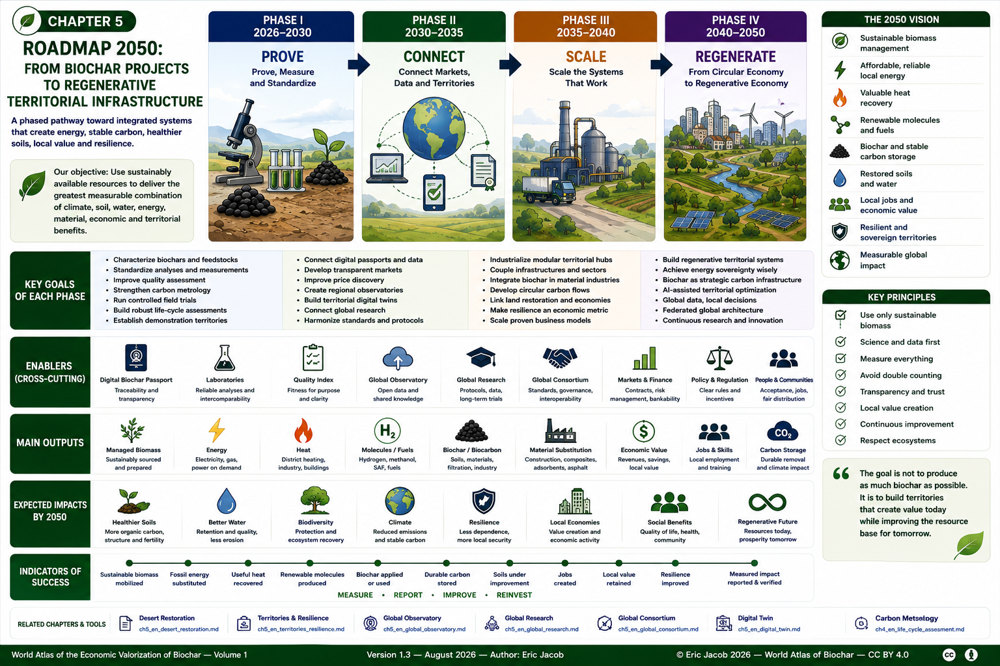

# Chapter 5 — Roadmap 2050: From Biochar Projects to Regenerative Territorial Infrastructure

> **World Atlas of the Economic Valorization of Biochar — Volume 1**  
> Version 1.3 — August 2026 · Author: Eric Jacob

**[← Territories & Resilience](ch5_en_territories_resilience.md) · [↑ Atlas Contents](README_en.md)**

---

## From Emerging Solutions to Territorial Infrastructure

Biochar is still often considered as an isolated product:

- a soil amendment;
- a carbon-removal material;
- an adsorbent;
- a component for construction materials;
- a by-product of biomass conversion.

By 2050, its greatest potential may lie in something broader.

Biochar can become one element of **integrated territorial systems** connecting:

```text
BIOMASS
   +
ENERGY
   +
CARBON
   +
SOILS
   +
WATER
   +
MATERIALS
   +
INDUSTRY
   +
DIGITAL INFRASTRUCTURE
   +
LOCAL ECONOMIES
```

The objective is not to predict exactly what the world will look like in 2050.

It is to identify the technical, economic, scientific and institutional conditions that could allow biochar and thermolysis to move from fragmented projects toward **measurable regenerative infrastructure**.



**Figure 1 — Roadmap 2050: from isolated projects to regenerative territorial infrastructure.**  
This roadmap is prospective. Dates indicate possible stages of development rather than guaranteed deployment schedules.  
© Eric Jacob 2026 — World Atlas of Biochar — CC BY 4.0.

---

## 1. The Starting Point — 2026

The biochar ecosystem already contains many of the components required for larger-scale deployment:

- industrial thermolysis and pyrolysis technologies;
- biochar production;
- scientific research;
- agricultural applications;
- carbon-removal methodologies;
- certification systems;
- emerging marketplaces;
- material applications;
- filtration and remediation uses;
- territorial projects.

But these components remain fragmented.

```text
PRODUCERS
   │
LABORATORIES
   │
CERTIFIERS
   │
FARMERS
   │
INDUSTRIES
   │
CARBON MARKETS
   │
TERRITORIES
```

The principal challenge is therefore not merely technological.

It is **integration**.

---

## 2. The 2050 Vision

A mature territorial system could connect local resources and local needs through several coordinated infrastructures.

```text
SUSTAINABLE BIOMASS
        ↓
COLLECTION + PREPARATION
        ↓
THERMOLYSIS
        ↓
┌────────────┬─────────────┬──────────────┐
↓            ↓             ↓              ↓
ENERGY      HEAT       MOLECULES      BIOCHAR
↓            ↓             ↓              ↓
INDUSTRY   BUILDINGS    MOBILITY       SOILS
DATA       NETWORKS     FUELS          MATERIALS
CENTERS    GREENHOUSES  CHEMISTRY      FILTRATION
        \       |          |              /
         \      |          |             /
          └──── TERRITORIAL ECONOMY ────┘
                       ↓
              MEASURED IMPACTS
                       ↓
          SOILS + WATER + CARBON
             + JOBS + RESILIENCE
```

Such a system would not necessarily exist everywhere.

Its relevance depends on the availability of sustainable biomass, local energy needs, logistics, environmental constraints and economics.

---

## 3. Four Development Phases

A possible trajectory can be divided into four broad phases.

```text
2026–2030
PROVE

2030–2035
CONNECT

2035–2040
SCALE

2040–2050
REGENERATE
```

These dates are indicative.

Different countries and sectors may progress at very different speeds.

---

# PHASE I — 2026–2030

## Prove, Measure and Standardize

The first phase should prioritize credibility.

The objective is not to deploy the maximum possible number of installations.

It is to determine which systems actually work.

---

## 4. Characterize Biochars Properly

Every biochar should progressively be described by a minimum set of comparable properties.

These may include:

- feedstock;
- production process;
- temperature;
- carbon content;
- moisture;
- ash;
- pH;
- particle size;
- contaminants;
- stability;
- intended applications.

The **[Digital Biochar Passport](ch5_en_biochar_passport.md)** can provide the common digital structure.

```text
BIOMASS
   ↓
PROCESS
   ↓
BATCH
   ↓
ANALYSIS
   ↓
PASSPORT
   ↓
APPLICATION
```

The objective is simple:

> **A biochar should become an identifiable material rather than an anonymous black powder.**

---

## 5. Improve Quality Assessment

The market needs tools capable of distinguishing products according to their actual properties.

The **[Biochar Quality Index](ch5_en_quality_index.md)** proposes a framework for this purpose.

By 2030, progress could include:

- harmonized measurements;
- clearer application categories;
- comparable analytical data;
- better matching between product and use;
- stronger buyer information.

Quality should not mean that one biochar is universally "better" than another.

It should indicate **fitness for purpose**.

---

## 6. Strengthen Carbon Metrology

Carbon-removal claims require rigorous measurement.

The basic chain remains:

```text
BIOCHAR MASS
      ↓
DRY MASS
      ↓
CARBON CONTENT
      ↓
STABILITY
      ↓
LIFE-CYCLE EMISSIONS
      ↓
NET REMOVAL
      ↓
MRV
```

See **[Carbon Metrology](ch5_en_carbon_metrology.md)**.

By 2030, the priority should be to reduce uncertainty and improve interoperability between methodologies.

---

## 7. Multiply Controlled Field Trials

Agricultural deployment requires more than laboratory measurements.

Projects should compare:

```text
CONTROL
   vs
BIOCHAR
   vs
BIOCHAR + ORGANIC AMENDMENT
```

where relevant.

Measurements may include:

- yield;
- water;
- nutrients;
- soil carbon;
- pH;
- biological activity;
- soil structure;
- long-term evolution.

The objective is to identify where biochar provides real benefits and where it does not.

---

## 8. Build Reliable Life-Cycle Assessments

A project should not be called sustainable merely because it produces biochar.

The complete chain matters:

```text
RESOURCE
   ↓
COLLECTION
   ↓
TRANSPORT
   ↓
PREPARATION
   ↓
CONVERSION
   ↓
PRODUCTS
   ↓
USE
   ↓
END OF LIFE
```

See **[Life Cycle Assessment](ch4_en_life_cycle_assessment.md)**.

The reference scenario must also be explicit.

---

## 9. Establish Demonstration Territories

Rather than testing isolated machines, the first phase can test complete local loops.

Examples may include:

- agricultural cooperatives;
- food-processing areas;
- forest-management territories;
- industrial zones;
- logistics hubs;
- district-heating systems;
- hospitals;
- datacenter campuses.

These pilots should measure not only technical output but also:

- logistics;
- economics;
- local employment;
- environmental impacts;
- social acceptance.

---

# PHASE II — 2030–2035

## Connect Markets, Data and Territories

Once technologies and measurements become more reliable, the next challenge is interoperability.

---

## 10. Connect Digital Passports

Digital passports can progressively communicate with:

- laboratories;
- certification systems;
- buyers;
- carbon registries;
- marketplaces;
- public authorities;
- research databases.

```text
PRODUCER
   ↓
PASSPORT
   ↔
LABORATORY
   ↔
CERTIFIER
   ↔
MARKET
   ↔
USER
```

Open standards are important because no single company should own the entire information chain.

---

## 11. Develop Transparent Markets

A mature market requires more than classified advertisements.

Buyers need information about:

- quality;
- quantity;
- location;
- certification;
- logistics;
- price;
- intended use.

Sellers need:

- qualified demand;
- contracts;
- traceability;
- predictable outlets.

The market can then evolve from:

```text
"BIOCHAR FOR SALE"
```

toward:

```text
CHARACTERIZED PRODUCT
+
DEFINED APPLICATION
+
TRACEABLE BATCH
+
VERIFIED DATA
+
LOGISTICS
+
CONTRACT
```

---

## 12. Improve Price Discovery

Prices can differ substantially according to:

- quality;
- geography;
- volume;
- certification;
- packaging;
- application;
- logistics.

A global price index should therefore not pretend that all biochar has one universal price.

The objective is to progressively build **segmented and transparent price information**.

---

## 13. Create Regional Observatories

The **[Global Biochar Observatory](ch5_en_global_observatory.md)** can be built through regional and national nodes.

Possible data include:

```text
PRODUCTION
CAPACITY
FEEDSTOCKS
QUALITY
PRICES
USES
CARBON
PROJECTS
RESEARCH
```

The global layer can aggregate comparable information while preserving appropriate territorial governance.

---

## 14. Develop Territorial Digital Twins

Before investing in a large infrastructure project, a territory may model:

- biomass availability;
- transport distances;
- energy demand;
- heat demand;
- conversion pathways;
- biochar outlets;
- carbon;
- economics.

The **[Digital Twin](ch5_en_digital_twin.md)** can compare alternative configurations.

```text
SCENARIO A
ENERGY PRIORITY

SCENARIO B
BIOCHAR PRIORITY

SCENARIO C
HEAT + BIOCHAR

SCENARIO D
MOLECULES + TERRITORIAL SERVICES
```

The model should support decisions, not replace measurements.

---

## 15. Connect Research Globally

The **[Global Biochar Research](ch5_en_global_research.md)** network can progressively harmonize:

- protocols;
- reference materials;
- interlaboratory comparisons;
- multicenter trials;
- long-term experimental sites;
- FAIR data.

The scientific ecosystem then becomes cumulative rather than fragmented.

---

# PHASE III — 2035–2040

## Scale the Systems That Have Proven Their Value

By this stage, deployment should increasingly concentrate on configurations supported by real data.

---

## 16. Industrialize Modular Territorial Hubs

A mature hub can combine several functions:

```text
BIOMASS MANAGEMENT
        ↓
THERMOLYSIS
        ↓
┌──────────┬─────────┬──────────┐
↓          ↓         ↓           ↓
POWER     HEAT      GAS       BIOCHAR
↓          ↓         ↓           ↓
LOCAL     NETWORK   INDUSTRY    SOILS
LOADS     USERS     MOBILITY    MATERIALS
```

Modularity can allow capacity to grow with the available resource and demand.

The objective is to avoid oversized plants that must search increasingly far away for biomass.

---

## 17. Couple Infrastructure

The strongest projects may emerge where several infrastructures intersect.

For example:

```text
DATACENTER
     +
DISTRICT HEATING
     +
AGRICULTURE
     +
THERMOLYSIS
     +
LOCAL BIOMASS
```

or:

```text
PORT
  +
INDUSTRY
  +
HYDROGEN / METHANOL
  +
BIOMASS
  +
BIOCHAR
```

or:

```text
WHOLESALE MARKET
      +
COLD STORAGE
      +
LOGISTICS
      +
FOOD RESIDUES
      +
AGRICULTURE
```

The territorial value comes from the connections.

---

## 18. Integrate Biochar into Material Industries

By 2040, mature applications may increasingly use characterized biocarbon or biochar in:

- construction materials;
- composites;
- polymers;
- filtration;
- industrial adsorbents;
- asphalt;
- specialized materials.

The objective should remain functional performance.

A material should not receive environmental preference solely because it contains biochar.

---

## 19. Develop Circular Carbon Flows

Carbon can increasingly be managed as a material flow.

```text
ATMOSPHERIC CO₂
      ↓
BIOMASS
      ↓
THERMOLYSIS
      ↓
STABLE CARBON
      ↓
SOILS / MATERIALS
      ↓
LONG-TERM STORAGE
```

The actual climate benefit depends on:

- biomass sustainability;
- carbon stability;
- process emissions;
- transport;
- alternative uses;
- end of life.

---

## 20. Link Restoration and Productive Economies

The **[Desert Restoration](ch5_en_desert_restoration.md)** approach can evolve from isolated land-restoration projects toward integrated territorial economies.

```text
DEGRADED LAND
      ↓
RESTORATION
      ↓
VEGETATION
      ↓
SUSTAINABLE BIOMASS FLOWS
      ↓
LOCAL TRANSFORMATION
      ↓
ENERGY + BIOCHAR
      ↓
SOILS + ECONOMIC ACTIVITY
```

The loop must remain ecologically constrained.

Restoration must never become an excuse for biomass overexploitation.

---

## 21. Make Resilience an Economic Metric

Energy systems are usually evaluated through cost.

By 2040, resilience may become a more explicit economic variable.

A territory can ask:

- How dependent are we on imported fuels?
- How vulnerable are we to grid interruptions?
- What happens if transport is disrupted?
- Can local resources provide critical services?
- How much redundancy exists?

The cheapest energy source under normal conditions is not necessarily the most valuable under disruption.

---

# PHASE IV — 2040–2050

## From Circular Economy to Regenerative Economy

The final phase of this roadmap is not simply about producing more biochar.

It is about designing systems that improve the resource base on which they depend.

---

## 22. Regenerative Territorial Infrastructure

A regenerative system aims to produce useful services while improving, or at least preserving, its ecological foundations.

```text
TERRITORY
   ↓
SUSTAINABLE RESOURCE MANAGEMENT
   ↓
ENERGY + MATERIALS
   ↓
ECONOMIC VALUE
   ↓
REINVESTMENT
   ↓
SOILS + WATER + BIODIVERSITY
   ↓
MORE RESILIENT TERRITORY
```

The loop should become progressively stronger rather than progressively exhausting its resource.

---

## 23. Energy Sovereignty Without Ecological Predation

Local energy production can improve sovereignty.

But sovereignty should not mean consuming every available local resource.

The correct objective is:

> **Maximum useful value from the sustainably mobilizable fraction of local resources.**

This distinction is fundamental.

A forest, agricultural soil or ecosystem is not an energy reserve waiting to be emptied.

---

## 24. Biochar as Strategic Carbon Infrastructure

By 2050, biochar may be considered not only as a commercial product but as part of carbon-management infrastructure.

Possible functions include:

- durable carbon storage;
- soil improvement;
- water management;
- materials;
- filtration;
- industrial carbon substitution.

The exact mix will depend on local needs.

---

## 25. AI-Assisted Territorial Management

Artificial intelligence may help optimize complex systems involving:

```text
WEATHER
+ BIOMASS
+ ENERGY PRICES
+ ELECTRICITY DEMAND
+ HEAT DEMAND
+ LOGISTICS
+ BIOCHAR MARKETS
+ CARBON
```

An AI system could recommend operational strategies such as:

- when to store biomass;
- when to operate;
- which product configuration to prioritize;
- where to send heat;
- which biochar market is most appropriate.

But automated optimization must remain constrained by ecological and regulatory limits.

The economically optimal solution is not necessarily the environmentally acceptable one.

---

## 26. Global Data, Local Decisions

By 2050, global databases may contain information from millions of:

- biochar batches;
- soil applications;
- laboratory analyses;
- industrial processes;
- carbon measurements;
- market transactions.

This can improve knowledge enormously.

But the final decision remains territorial.

```text
GLOBAL KNOWLEDGE
       ↓
LOCAL CONTEXT
       ↓
LOCAL DECISION
```

No global algorithm can erase differences in soil, climate, water, biodiversity, infrastructure and society.

---

## 27. A Federated Global Architecture

The institutional architecture proposed in this Atlas can ultimately become:

```text
GLOBAL CONSORTIUM
        ↓
OPEN STANDARDS
        ↓
REGIONAL SYSTEMS
        ↓
NATIONAL / TERRITORIAL NODES
        ↓
PRODUCERS + USERS + LABORATORIES
```

The **[Global Biochar Consortium](ch5_en_global_consortium.md)** would not need to own the infrastructure.

Its role would be to ensure that the components can understand one another.

---

## 28. Research Never Ends

A 2050 system should not assume that all important questions have been solved.

Research must continue to examine:

- long-term soil effects;
- ageing;
- carbon permanence;
- ecosystem interactions;
- new materials;
- contaminants;
- process optimization;
- water;
- economics;
- social impacts.

The scientific architecture must remain capable of saying:

> **"This does not work as expected."**

A mature industry is not one that never fails.

It is one that detects failure and learns from it.

---

## 29. What Could Prevent This Roadmap?

Several factors could slow or prevent deployment.

### Unsustainable Biomass Demand

If industrial demand exceeds sustainable resource availability, the system becomes destructive.

### Poor Economics

Projects without reliable revenues or avoided costs will not scale sustainably.

### Weak Standards

Incomparable data undermine trust.

### Carbon Overclaiming

Exaggerated climate claims can damage the credibility of the entire sector.

### Contamination

Poorly characterized biochars can create environmental or health risks.

### Regulatory Fragmentation

Incompatible rules can prevent markets from developing.

### Infrastructure Lock-In

Oversized installations can become dependent on increasingly distant resources.

### Social Rejection

Projects imposed without local legitimacy may fail even when technically sound.

These risks are not secondary.

They determine whether the roadmap remains possible.

---

## 30. Indicators for 2050

Success should not be measured only in tonnes of biochar.

A more complete dashboard could include:

```text
SUSTAINABLY MOBILIZED BIOMASS
            +
FOSSIL ENERGY SUBSTITUTED
            +
USEFUL HEAT RECOVERED
            +
DURABLE CARBON STORED
            +
SOILS RESTORED
            +
WATER SAVED
            +
MATERIALS SUBSTITUTED
            +
LOCAL JOBS
            +
VALUE RETAINED LOCALLY
            +
BIODIVERSITY PROTECTED
```

The purpose is not to maximize every indicator simultaneously.

It is to find the best balance for each territory.

---

## 31. The Central Economic Transition

The deepest transformation described by this roadmap can be summarized as follows.

### Linear Model

```text
EXTRACT
   ↓
IMPORT
   ↓
CONSUME
   ↓
DISCARD
   ↓
PAY AGAIN
```

### Circular Model

```text
RESOURCE
   ↓
USE
   ↓
RECOVER
   ↓
TRANSFORM
   ↓
REUSE
```

### Regenerative Model

```text
RESOURCE
   ↓
CREATE VALUE
   ↓
RECOVER FLOWS
   ↓
TRANSFORM
   ↓
RETURN CARBON / NUTRIENTS / SERVICES
   ↓
RESTORE THE RESOURCE BASE
   ↓
CREATE FUTURE VALUE
```

This final loop is the long-term objective.

---

## 32. From Cost Center to Territorial Asset

A residue can initially appear only as a liability.

```text
RESIDUE
  ↓
COLLECTION COST
  ↓
TREATMENT COST
```

Integrated systems can potentially transform part of this equation:

```text
SELECTED RESIDUE / BIOMASS
          ↓
RESOURCE
          ↓
ENERGY + HEAT + PRODUCTS
          ↓
SAVINGS + REVENUES
          ↓
TERRITORIAL ASSET
```

This transformation is not automatic.

It depends on technology, logistics, regulation, markets and actual resource quality.

But it changes the way projects can be conceived.

---

## 33. A Possible 2050 Territorial Model

A mature territory could eventually operate through several connected hubs rather than one gigantic centralized plant.

```text
                 REGIONAL OBSERVATORY
                        ↓
              DIGITAL TERRITORIAL TWIN
                        ↓
     ┌──────────────────┼──────────────────┐
     ↓                  ↓                  ↓
AGRICULTURAL HUB   INDUSTRIAL HUB     URBAN HUB
     ↓                  ↓                  ↓
BIOCHAR + HEAT     ENERGY + CARBON    HEAT + SERVICES
     ↓                  ↓                  ↓
     └──────────────────┼──────────────────┘
                        ↓
                 SHARED NETWORKS
                        ↓
           SOILS + ENERGY + ECONOMY
```

Such a distributed architecture may improve:

- flexibility;
- proximity;
- resilience;
- heat valorization;
- adaptation to local resources.

Whether it is preferable to a more centralized architecture must be determined case by case.

---

## 34. The Role of Citizens and Local Communities

A regenerative economy cannot be reduced to industrial engineering.

Local communities influence:

- land use;
- biomass availability;
- project acceptance;
- employment;
- resource governance;
- benefit distribution.

Transparent information should therefore allow citizens to understand:

- what enters the plant;
- what comes out;
- where biomass comes from;
- what emissions are measured;
- where biochar goes;
- who receives the economic benefits.

Trust is part of the infrastructure.

---

## 35. The Role of Finance

Large-scale deployment requires capital.

Finance can support the transition when risks become measurable.

A bankable project increasingly requires:

```text
RESOURCE SECURITY
      +
PROVEN TECHNOLOGY
      +
ENERGY OFFTAKE
      +
PRODUCT OFFTAKE
      +
REGULATORY CLARITY
      +
MEASURED PERFORMANCE
      +
INSURANCE
      +
LONG-TERM CONTRACTS
```

Carbon revenues may improve a project.

They should not automatically be its only economic foundation.

---

## 36. The Role of Public Policy

Public policy can accelerate useful deployment by supporting:

- research;
- standards;
- demonstration projects;
- infrastructure;
- training;
- open data;
- sustainable biomass management.

It can also prevent harmful deployment through:

- environmental safeguards;
- contaminant limits;
- land-use rules;
- transparency;
- competition policy.

The objective should not be to subsidize tonnes.

It should be to accelerate **verified public value**.

---

## 37. The Role of Industry

Industry must move beyond technology demonstration toward complete systems.

This means integrating:

- feedstock;
- logistics;
- process;
- energy;
- heat;
- products;
- maintenance;
- measurement;
- contracts.

A machine alone does not create a territorial ecosystem.

The industrial offer of the future may increasingly be:

> **an integrated conversion and service system rather than a standalone reactor.**

---

## 38. The Role of Agriculture

Agriculture occupies a central position because it can simultaneously be:

- biomass supplier;
- energy user;
- biochar user;
- carbon-storage location;
- soil-restoration actor.

But agriculture must not become merely the feedstock supplier for an external industrial system.

The value returned to farms and soils must remain visible.

---

## 39. The Role of Cities

Cities can connect:

```text
WASTE / RESIDUES
      +
ENERGY DEMAND
      +
HEAT NETWORKS
      +
MOBILITY
      +
PUBLIC PROCUREMENT
      +
TERRITORIAL PLANNING
```

This makes local authorities potential organizers of integrated resource systems.

The city of 2050 may therefore manage not only waste and energy contracts but **territorial material and carbon flows**.

---

## 40. The Role of Datacenters and AI Infrastructure

The rapid growth of digital infrastructure creates very large electricity requirements.

Datacenters can become anchor consumers within diversified energy hubs where appropriate.

A possible architecture is:

```text
SUSTAINABLE TERRITORIAL BIOMASS
              ↓
          THERMOLYSIS
              ↓
       DISPATCHABLE ENERGY
              ↓
           DATACENTER
              ↓
          WASTE HEAT
              ↓
DISTRICT HEATING / GREENHOUSES / INDUSTRY

BIOCHAR*
   ↓
SOILS / MATERIALS / CARBON
```

`*` depending on the selected conversion configuration.

The value of such a system depends on real net electrical efficiency, biomass logistics, heat outlets, redundancy and economics.

Datacenters should therefore be considered as **potential anchor loads within territorial systems**, not as a justification for unlimited biomass consumption.

---

## 41. The Role of Ports and Logistics Hubs

Ports, wholesale markets and logistics platforms can become important nodes because they already concentrate:

- transport;
- storage;
- material flows;
- energy demand;
- industries;
- potential customers.

The infrastructure already present can reduce some of the barriers to building circular systems.

The strongest projects will be those that use existing logistics rather than creating unnecessary new flows.

---

## 42. The Role of the Global Observatory

By 2050, the **[Global Biochar Observatory](ch5_en_global_observatory.md)** could provide a continuously updated view of:

```text
WHERE BIOCHAR IS PRODUCED
WHAT IT IS MADE FROM
HOW IT IS PRODUCED
WHAT QUALITY IT HAS
WHERE IT IS USED
WHAT IT COSTS
WHAT RESULTS ARE OBSERVED
HOW MUCH CARBON IS STORED
```

This would transform the sector from a collection of isolated claims into an increasingly measurable global system.

---

## 43. The Role of the Global Consortium

The **[Global Biochar Consortium](ch5_en_global_consortium.md)** can provide common rules without becoming the owner of the market.

Its long-term role could include:

- interoperability;
- open standards;
- governance;
- scientific integrity;
- conflict-of-interest rules;
- audit mechanisms;
- data portability.

The objective is to allow innovation while preserving trust.

---

## 44. The Role of Global Research

The **[Global Biochar Research](ch5_en_global_research.md)** network closes the loop.

```text
FIELD
  ↓
DATA
  ↓
RESEARCH
  ↓
KNOWLEDGE
  ↓
STANDARDS
  ↓
DEPLOYMENT
  ↓
NEW FIELD DATA
```

Every large-scale deployment becomes an opportunity to improve knowledge.

---

## 45. The 2050 Objective

The objective is not:

> "Produce as much biochar as possible."

Nor is it:

> "Convert as much biomass as possible."

The objective is:

> **Use sustainably available resources to provide the greatest measurable combination of climate, soil, water, energy, material, economic and territorial benefits.**

That distinction determines whether the biochar economy becomes extractive or regenerative.

---

## Key Takeaway

The 2050 roadmap can be summarized in four verbs:

```text
2026–2030
PROVE

2030–2035
CONNECT

2035–2040
SCALE

2040–2050
REGENERATE
```

The first decade establishes evidence and infrastructure.

The second integrates systems at territorial scale.

By 2050, the ambition is no longer merely to manage biomass more efficiently.

It is to build **territories capable of transforming local resources into energy, stable carbon, healthier soils, useful materials, economic activity and greater resilience — without exhausting the ecosystems that make those resources possible.**

---

## Chapter 5 Architecture

This roadmap concludes a sequence built around complementary tools:

- [Ideal Biochar](ch5_en_biochar_ideal.md)
- [Biochar Quality Index](ch5_en_quality_index.md)
- [Buyer's Guide](ch5_en_buyer_guide.md)
- [Risk Management](ch5_en_risk_management.md)
- [Carbon Metrology](ch5_en_carbon_metrology.md)
- [Digital Twin](ch5_en_digital_twin.md)
- [Global Observatory](ch5_en_global_observatory.md)
- [Global Research](ch5_en_global_research.md)
- [Global Consortium](ch5_en_global_consortium.md)
- [Desert Restoration](ch5_en_desert_restoration.md)
- [Territories & Resilience](ch5_en_territories_resilience.md)

Together, these components form a possible architecture for moving from **biochar as a product** toward **biochar as one component of a measurable regenerative economy**.

---

## Continue Reading

**[← Territories & Resilience](ch5_en_territories_resilience.md) · [↑ Atlas Contents](README_en.md)**

See also: [Global Observatory](ch5_en_global_observatory.md) · [Global Consortium](ch5_en_global_consortium.md) · [Global Research](ch5_en_global_research.md) · [Digital Twin](ch5_en_digital_twin.md) · [Carbon Metrology](ch5_en_carbon_metrology.md) · [Life Cycle Assessment](ch4_en_life_cycle_assessment.md)

---

*World Atlas of the Economic Valorization of Biochar — Eric Jacob — Version 1.3 — August 2026*  
*License: Creative Commons CC BY 4.0*
