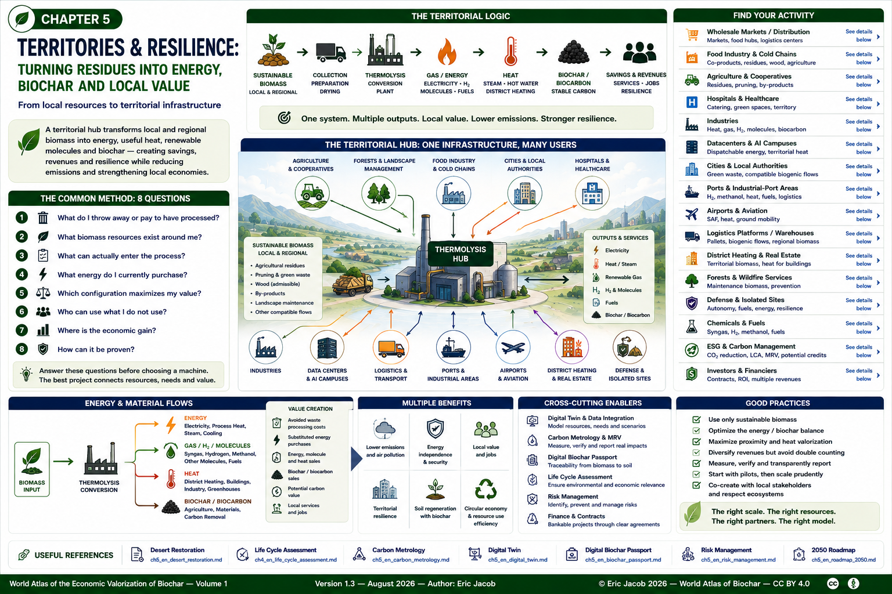

# Chapter 5 — Territories & Resilience: Turning Residues into Energy, Biochar and Local Value

> **World Atlas of the Economic Valorization of Biochar — Volume 1**  
> Version 1.3 — August 2026 · Author: Eric Jacob

**[← Desert Restoration](ch5_en_desert_restoration.md) · [↑ Atlas Contents](README_en.md) · [2050 Roadmap →](ch5_en_roadmap_2050.md)**

---

<a id="objective"></a>

## What If Part of Your Waste Became Your Energy?

A company, local authority or infrastructure operator often pays several times:

1. to collect, transport or process certain residues;
2. to purchase electricity, gas, heat or fuel;
3. to decarbonize its activities;
4. sometimes to purchase materials or services that could potentially be produced locally.

Territorial thermolysis proposes looking at these costs **as a single system**.

```text
SITE RESIDUES + TERRITORIAL BIOMASS
                  ↓
       SORTING / PREPARATION / DRYING
                  ↓
              THERMOLYSIS
                  ↓
       ┌──────────┼───────────┐
       ↓          ↓           ↓
 GAS / ENERGY    HEAT      SOLID CARBON*
       ↓          ↓           ↓
 electricity,  buildings,   biochar /
 H₂, molecules processes,   biocarbon
 or fuels       cooling
       └──────────┬───────────┘
                  ↓
       SAVINGS + REVENUES + SERVICES
                  ↓
         TERRITORIAL DECARBONIZATION

* depending on process configuration and the energy/carbon trade-off
```

The objective is therefore not merely environmental.

> **A flow that used to be a cost can become a feedstock; part of an energy expense can potentially be replaced by local production; and, in configurations that retain solid carbon, biochar can become an additional product and potentially support certifiable carbon removal.**

This model does not imply that biomass is genuinely "free." Even when a residue has no purchase price — or when its disposal currently costs money — sorting, collection, preparation, drying, storage, handling and transport must still be included.

However, a **low or negative feedstock cost** can fundamentally change project economics.

---

## A One-Minute Example — A Large Wholesale Market or Food Hub

Imagine a large regional food market.

It concentrates:

- fruit and vegetable residues;
- packaging and compatible wood flows;
- cold-storage requirements;
- warehouses;
- heavy logistics;
- transport fleets;
- restaurants and food-processing activities;
- nearby agricultural areas.

Instead of considering each flow independently:

```text
ORGANIC / BIOGENIC RESIDUES
           +
COMPATIBLE TERRITORIAL BIOMASS
           ↓
      PREPARATION
           ↓
      THERMOLYSIS
           ↓
 ┌─────────┼───────────┐
 ↓         ↓           ↓
ENERGY    HEAT       BIOCHAR*
 ↓         ↓           ↓
COLD /   BUILDINGS   AGRICULTURE
POWER    / PROCESS   / MATERIALS
 ↓
MOBILITY / H₂ / OTHER MOLECULES*
```

`*` depending on configuration and downstream equipment.

The hub can then simultaneously become:

- a **consumer** of the energy it produces;
- an **energy station** for its own fleet or transport operators;
- a **collection point** for compatible territorial biomass;
- a **redistribution point** for biochar toward farmers or other users;
- a **service producer** for neighboring businesses and local authorities.

The logistics infrastructure already exists: roads, loading docks, weighing systems, storage, handling equipment, suppliers and transport operators.

The challenge is to add a matter-energy loop where flows already converge.

---

<a id="method"></a>

## The Common Method: 8 Questions Before Choosing a Machine

The approach is the same for every sector.

### 1 — What Do I Throw Away or Pay to Have Processed?

Inventory the flows:

- mass;
- moisture;
- seasonality;
- composition;
- contaminants;
- current cost;
- current destination.

### 2 — What Biomass Resources Exist Around Me?

The site may complement its own flows with sustainable territorial resources:

- agriculture;
- green-space maintenance;
- admissible recovered wood;
- agro-industrial residues;
- other compatible biomass.

### 3 — What Can Actually Enter the Process?

**Biomass-agnostic does not mean universal waste processing.**

Cardboard, pallets, wood, RDF, food residues or other materials require sorting, characterization and regulatory compliance.

Plastics, glues, treatments, metals, chlorine, salts, moisture and regulation may modify or exclude a flow.

### 4 — What Energy Do I Currently Purchase?

Electricity, gas, steam, heat, cooling, diesel or hydrogen.

The first objective is to identify expenses that local production can realistically substitute.

### 5 — Which Configuration Maximizes My Value?

Two approaches can coexist:

```text
ENERGY / H₂ PRIORITY
→ more extensive valorization of carbon within the process
→ potentially higher energy yield
→ less solid carbon available

BIOCHAR / BIOCARBON PRIORITY
→ retention of a larger fraction of solid carbon
→ material product + potential durable carbon storage
→ trade-off with energy production
```

### 6 — Who Can Use What I Do Not Use?

Potential users include:

- neighboring industries;
- district-heating networks;
- farmers;
- transport operators;
- local authorities;
- greenhouses;
- materials manufacturers;
- biochar markets.

### 7 — Where Is the Economic Gain?

Potential value may come from several simultaneous sources:

```text
AVOIDED WASTE-TREATMENT COSTS
          +
SUBSTITUTED ENERGY PURCHASES
          +
ENERGY / MOLECULE SALES
          +
BIOCHAR / BIOCARBON SALES
          +
POTENTIAL CARBON VALUE
          +
LOCAL SERVICES
```

No single revenue stream should automatically be assumed to make the project profitable.

### 8 — How Can It Be Proven?

Through:

- measurements;
- life-cycle assessment;
- metrology;
- contracts;
- traceability;
- MRV.

---

<a id="sector-directory"></a>

## Find Your Activity

Go directly to the sector that corresponds to your situation.

| Your activity | Flows or resources to examine | Value sought | Details |
|---|---|---|---|
| Wholesale market / distribution | plant residues, compatible wood/pallets, regional biomass | cooling, energy, H₂/mobility, biochar | [Distribution](#logistics) |
| Food industry | co-products, plant residues, wood, agricultural biomass | steam, heat, cooling, energy, biochar | [Food industry](#food-industry) |
| Agriculture / cooperative | mobilizable residues, pruning, by-products | energy, molecules, biochar, soils | [Agriculture](#agriculture) |
| Hospital | catering, green spaces, compatible wood + surrounding territory | energy, heat, cooling, mobility, resilience | [Hospitals](#hospitals) |
| Industry | site residues + regional resources | heat, gas, H₂, molecules, biocarbon | [Industry](#industries) |
| Datacenter / AI | external territorial biomass | dispatchable energy, territorial heat | [Datacenters](#datacenters) |
| City / local authority | green waste and compatible biogenic flows | heat, energy, mobility, services | [Cities](#cities) |
| Port | wood/regional biomass and compatible flows | H₂, methanol, heat, fuels | [Ports](#ports) |
| Airport | compatible regional resources | SAF, heat, ground mobility | [Aviation](#aviation) |
| Warehouse / logistics platform | wood/pallets, biogenic flows, regional resources | energy, cooling, mobility | [Logistics](#logistics) |
| District heating / real estate | territorial biomass | heat, gas substitution | [District heating](#district-heating) |
| Forest / fire services | genuinely mobilizable maintenance biomass | prevention, energy, biochar | [Forests & wildfires](#forests) |
| Defense / isolated site | compatible waste + sustainable local biomass | autonomy, fuels, energy | [Defense](#defense) |
| Chemicals / fuels | suitable biomass | syngas, H₂, methanol, fuels | [Renewable molecules](#molecules) |
| ESG / carbon management | all preceding flows | CO₂ reduction, LCA, MRV, potential credits | [ESG](#esg) |
| Investor / financier | feedstock + energy + product contracts | ROI, multiple revenues, bankability | [Finance](#finance) |

---



**Figure 1 — Territories & Resilience: one underlying logic, different models for different sectors.**  
© Eric Jacob 2026 — World Atlas of Biochar — CC BY 4.0.

---

<a id="logistics"></a>

## Wholesale Markets, Distribution Centers and Logistics Hubs

### Why the Model Is Particularly Relevant

These sites already concentrate:

- incoming and outgoing material flows;
- warehouses;
- loading and unloading equipment;
- cold storage;
- transport;
- energy consumption;
- significant logistics infrastructure.

Some also generate plant residues, damaged pallets, packaging streams or food-industry by-products.

### Possible Loop

```text
COMPATIBLE RESIDUES
       +
REGIONAL BIOMASS
       ↓
THERMOLYSIS
       ↓
ENERGY → WAREHOUSES / COOLING / ELECTRICITY
       ↓
H₂ / FUELS* → LOGISTICS / FLEETS

BIOCHAR* → AGRICULTURE / MATERIALS / CARBON
```

`*` depending on configuration.

The economic advantage may come from combining several existing flows rather than creating an entirely new logistics system.

[↑ Choose a sector](#sector-directory)

---

<a id="food-industry"></a>

## Food Industry and Cold Chains

Food-processing sites may simultaneously generate residues and consume substantial quantities of:

- steam;
- heat;
- electricity;
- cooling;
- gas.

Potential feedstocks may include, depending on compatibility:

- shells;
- pits;
- husks;
- plant residues;
- certain processing by-products;
- wood resources from the surrounding territory.

```text
AGRO-INDUSTRIAL RESIDUES
          ↓
THERMOLYSIS
          ↓
HEAT / STEAM / ENERGY
          ↓
FOOD-PROCESSING SITE

BIOCHAR* → AGRICULTURE / FILTRATION / MATERIALS
```

The first priority is not to maximize the quantity of biomass processed but to identify the fractions whose valorization is technically, economically and environmentally coherent.

[↑ Choose a sector](#sector-directory)

---

<a id="agriculture"></a>

## Agriculture and Cooperatives

Agricultural territories can combine:

- pruning residues;
- crop residues that can sustainably be removed;
- shells, husks and pits;
- agro-industrial by-products;
- energy requirements;
- soil requirements.

A cooperative may become a natural aggregation point.

```text
FARMS
   ↓
MOBILIZABLE RESIDUES
   ↓
COOPERATIVE / HUB
   ↓
THERMOLYSIS
   ↓
ENERGY + BIOCHAR*
   ↓
LOCAL AGRICULTURE
```

The fundamental rule remains:

> **Not every agricultural residue should be removed from the soil.**

A fraction may need to remain in place to protect soil structure, organic matter, nutrients and biodiversity.

The sustainable mobilizable fraction must therefore be assessed before the industrial resource is calculated.

[↑ Choose a sector](#sector-directory)

---

<a id="hospitals"></a>

## Hospitals and Critical Infrastructure

Hospitals require high energy reliability.

Their needs can include:

- electricity;
- heating;
- domestic hot water;
- steam;
- cooling;
- emergency systems;
- mobility.

The hospital itself may not generate enough suitable biomass to supply a thermolysis system.

The relevant scale is therefore the surrounding territory.

```text
TERRITORIAL BIOMASS
        ↓
THERMOLYSIS
        ↓
ENERGY / HEAT
        ↓
HOSPITAL
        ↓
CRITICAL SERVICES

SURPLUS HEAT / ENERGY
        ↓
NEIGHBORING NETWORK / SERVICES
```

A local system cannot eliminate the need for redundancy.

Critical facilities still require backup, network connections, storage or other security arrangements according to their reliability requirements.

The value is therefore **additional resilience and diversification**, not the promise of absolute autonomy.

[↑ Choose a sector](#sector-directory)

---

<a id="industries"></a>

## Industries — Substituting Fossil Inputs Where They Are Actually Used

Industrial sites can require:

- process heat;
- steam;
- gas;
- hydrogen;
- electricity;
- reducing agents;
- carbonaceous materials.

Thermolysis can potentially connect regional biomass to some of these needs.

```text
BIOMASS
   ↓
THERMOLYSIS
   ↓
SYNGAS / ENERGY / HEAT
   ↓
INDUSTRIAL PROCESS

SOLID CARBON*
   ↓
BIOCHAR / BIOCARBON / MATERIAL USES
```

The strongest economic case may occur where a site simultaneously has:

- a reliable biomass supply;
- continuous energy demand;
- valuable heat use;
- an outlet for co-products;
- a significant fossil-energy bill.

The technology must be integrated into the industrial process rather than treated as an isolated machine.

[↑ Choose a sector](#sector-directory)

---

<a id="datacenters"></a>

## Datacenters and AI Campuses — Producing Dispatchable Energy Locally

A datacenter generates little relevant biomass.

Its interest therefore comes from the **territory around it**.

### Resource

Sustainable biomass from the surrounding logistics basin:

- agriculture;
- maintenance activities;
- food-processing industry;
- admissible recovered wood;
- other validated flows.

### Need

Continuous and highly secured electricity.

### Symbiosis

```text
TERRITORIAL BIOMASS
        ↓
THERMOLYSIS → GAS / ENERGY → DATACENTER
                               ↓
                           WASTE HEAT
                               ↓
                    NETWORK / GREENHOUSES /
                           INDUSTRY

BIOCHAR* → AGRICULTURE / MATERIALS / CARBON
```

Important:

$$
P_{\mathrm{gas}} \neq P_{\mathrm{net\ electric}}
$$

Conversion to electricity involves conversion efficiency and auxiliary consumption.

Grid connections, storage and backup systems remain necessary for critical loads.

The potential economic interest comes from the combination of **dispatchable energy + local resource + heat valorization + possible solid carbon**, not from any one of these elements in isolation.

[↑ Choose a sector](#sector-directory)

---

<a id="cities"></a>

## Cities and Local Authorities — Becoming Orchestrators Rather Than Simple Energy Buyers

A city rarely possesses a single gigantic biomass resource.

It does, however, have many smaller flows:

- park maintenance;
- pruning;
- markets;
- institutional catering;
- food platforms;
- admissible recovered wood;
- peri-urban activities;
- resources from neighboring territories.

It also contains the consumers:

- public buildings;
- swimming pools;
- hospitals;
- transport systems;
- district-heating networks;
- industrial areas.

The local authority can therefore map **resources + needs** and create one or more hubs instead of sending each flow separately to a distant value chain.

```text
URBAN + PERI-URBAN FLOWS
          ↓
RESOURCE MAPPING
          ↓
TERRITORIAL HUB
          ↓
HEAT + ENERGY + MOBILITY + BIOCHAR*
          ↓
LOCAL SERVICES
```

The role of the city can therefore evolve from simple purchaser to **orchestrator of local flows**.

[↑ Choose a sector](#sector-directory)

---

<a id="ports"></a>

## Ports and Industrial-Port Areas

A port is already a hub for matter and energy.

### Possible Resources

- admissible handling wood;
- local biogenic flows;
- biomass from the hinterland;
- compatible industrial co-products.

### On-Site Markets

- industrial heat;
- H₂;
- methanol;
- synthetic fuels;
- electricity;
- heavy mobility;
- biocarbon;
- biochar exports.

The strength of the port lies in its infrastructure:

- rail;
- road;
- storage;
- potential pipelines;
- industries;
- concentrated consumers.

Transporting biomass over long maritime distances does not become sustainable simply because a port exists.

The logistics balance and LCA must determine whether the chain makes sense.

[↑ Choose a sector](#sector-directory)

---

<a id="aviation"></a>

## Airports and Aviation — From Biomass to SAF

Aviation requires high-energy-density liquid fuels.

Thermolysis may form part of a broader conversion chain leading toward renewable molecules and potentially sustainable aviation fuels.

```text
SUSTAINABLE BIOMASS
       ↓
THERMOLYSIS / SYNGAS
       ↓
CONDITIONING + DOWNSTREAM CONVERSION
       ↓
RENEWABLE MOLECULES
       ↓
SAF*
```

`*` subject to the selected conversion route, specifications, certification and applicable regulation.

An airport can also offer concentrated demand for:

- ground mobility;
- heat;
- electricity;
- logistics.

But the biomass must not be described as sustainable merely because the final fuel is intended for aviation.

The entire chain remains subject to resource sustainability and life-cycle assessment.

[↑ Choose a sector](#sector-directory)

---

<a id="district-heating"></a>

## District Heating and Real Estate

Heat is one of the most direct territorial uses because it is costly to transport over long distances.

A thermolysis unit located near a stable thermal demand can potentially supply:

- district heating;
- public buildings;
- housing;
- swimming pools;
- greenhouses;
- industrial heat.

```text
LOCAL BIOMASS
     ↓
THERMOLYSIS
     ↓
USEFUL HEAT
     ↓
DISTRICT NETWORK / BUILDINGS / GREENHOUSES
```

The project should examine:

- seasonal demand;
- network temperature;
- distance;
- backup requirements;
- storage;
- competing heat sources.

A high-value heat outlet can fundamentally improve the economics of a territorial system.

[↑ Choose a sector](#sector-directory)

---

<a id="forests"></a>

## Forests, Wildfire Prevention and Landscape Maintenance

Forest-fire prevention can generate biomass through:

- thinning;
- brush clearing;
- pruning;
- maintenance of strategic areas.

Part of this biomass may potentially be valorized.

```text
PREVENTIVE MAINTENANCE
        ↓
MOBILIZABLE BIOMASS
        ↓
THERMOLYSIS
        ↓
ENERGY + BIOCHAR*
```

But the objective is not to remove every branch from the forest.

Dead wood and organic matter also perform ecological functions.

The resource must therefore be determined by forest-management and biodiversity objectives rather than by the appetite of the conversion unit.

A well-designed project may combine:

- reduced fuel loads in selected areas;
- local energy;
- biochar;
- jobs;
- landscape maintenance.

[↑ Choose a sector](#sector-directory)

---

<a id="defense"></a>

## Defense and Isolated Sites — Resilience Through Diversification

Military bases and isolated strategic sites may seek:

- energy security;
- reduced logistical dependence;
- local fuel production;
- heat;
- electricity;
- waste management.

Where sustainable biomass is genuinely available:

```text
LOCAL / REGIONAL BIOMASS
          ↓
THERMOLYSIS
          ↓
ENERGY / GAS / MOLECULES
          ↓
STRATEGIC SITE
```

The value proposition is not merely carbon reduction.

It may also include:

- resilience;
- diversified supply;
- reduced exposure to fuel logistics;
- local resource valorization.

Security requirements, storage, redundancy and operational constraints remain specific to each site.

[↑ Choose a sector](#sector-directory)

---

<a id="molecules"></a>

## Renewable Molecules — Hydrogen, Methanol and Fuels

Thermolysis can provide a gas stream that may become an intermediate feedstock for further conversion.

Depending on the architecture:

```text
BIOMASS
   ↓
THERMOLYSIS
   ↓
SYNGAS / GAS STREAM
   ↓
CLEANING + CONDITIONING
   ↓
H₂ / METHANOL / OTHER MOLECULES / FUELS
```

These downstream products require their own:

- equipment;
- energy;
- purification;
- specifications;
- certifications;
- markets.

The presence of thermolysis does not automatically mean that every downstream molecule is economically or technically available.

Each conversion chain must be evaluated separately.

[↑ Choose a sector](#sector-directory)

---

<a id="esg"></a>

## ESG and Decarbonization Management

For an ESG or sustainability director, the relevant object is not the machine but the **verified reduction in impacts**.

The project can potentially act on:

- fossil-energy purchases;
- waste-treatment costs;
- transport;
- local resource use;
- durable carbon storage;
- Scope 1, 2 or 3 emissions depending on the accounting boundary.

The proof chain should connect:

```text
BASELINE
   ↓
PROJECT
   ↓
MEASURED FLOWS
   ↓
LCA
   ↓
CARBON METROLOGY
   ↓
MRV
   ↓
VERIFIABLE CLAIM
```

Avoided emissions and carbon removals should not be mixed.

See:

- [Life Cycle Assessment](ch4_en_life_cycle_assessment.md)
- [Carbon Metrology](ch5_en_carbon_metrology.md)
- [Risk Management](ch5_en_risk_management.md)

[↑ Choose a sector](#sector-directory)

---

<a id="carbon"></a>

## Carbon and MRV

When solid carbon is retained as biochar or biocarbon, climate value depends on more than its mass.

The chain is:

```text
BIOCHAR MASS
      ↓
DRY MASS
      ↓
CARBON CONTENT
      ↓
STABILITY / PERMANENCE
      ↓
LIFE-CYCLE BALANCE
      ↓
VERIFICATION
      ↓
POSSIBLE CERTIFIED REMOVAL
```

This distinction protects the project against overclaiming.

The detailed methodology is developed in **[Carbon Metrology](ch5_en_carbon_metrology.md)**.

[↑ Choose a sector](#sector-directory)

---

<a id="finance"></a>

## Investors and Financiers — Bankability Comes from Contracts, Not from Slides

A territorial project may combine several revenue and savings streams:

- avoided residue-treatment costs;
- energy savings;
- heat sales;
- gas or molecule sales;
- biochar or biocarbon sales;
- possible carbon revenues;
- services.

But several uncertain revenues do not automatically create one certain business model.

The investor should examine:

```text
FEEDSTOCK CONTRACTS
        +
ENERGY OFFTAKE
        +
PRODUCT OFFTAKE
        +
CAPEX
        +
OPEX
        +
AVAILABILITY
        +
TECHNICAL PERFORMANCE
        +
REGULATORY RISK
        +
CARBON ASSUMPTIONS
        ↓
BANKABILITY
```

The strongest projects are those in which a significant part of the economics is supported by measurable physical flows and contractual relationships.

[↑ Choose a sector](#sector-directory)

---

## The Economic Logic: Stack Values Without Counting Them Twice

A territorial thermolysis project may create value at several levels.

```text
RESIDUE MANAGEMENT
      +
ENERGY
      +
HEAT
      +
MOLECULES
      +
BIOCHAR / BIOCARBON
      +
CARBON
      +
SERVICES
```

This stacking is one of the strengths of the model.

It is also one of its accounting risks.

The same environmental or economic benefit must not be counted several times under different labels.

For example:

- avoided disposal costs are not biochar revenues;
- energy savings are not carbon-removal revenues;
- avoided emissions are not automatically carbon removals;
- the same heat cannot be sold to two customers;
- the same tonne of biochar cannot be attributed twice.

---

## Proximity Is an Economic Variable

Territorial integration can reduce:

- biomass transport;
- product transport;
- heat losses;
- dependence on distant infrastructure;
- certain logistics risks.

It can also increase the ability to valorize heat, which is often more geographically constrained than fuels or electricity.

But proximity alone does not guarantee sustainability.

A local but inefficient chain may perform worse than a more distant but better-designed alternative.

The **[Life Cycle Assessment](ch4_en_life_cycle_assessment.md)** must arbitrate.

---

## A Hub Is Stronger When Several Needs Intersect

The most promising locations may be those where several of the following coexist:

```text
BIOMASS RESOURCE
        +
CONTINUOUS ENERGY DEMAND
        +
HEAT OUTLET
        +
LOGISTICS
        +
BIOCHAR / BIOCARBON MARKET
        +
DECARBONIZATION NEED
        +
FINANCING CAPACITY
```

This is why wholesale markets, ports, industrial zones, hospitals, datacenters, agricultural cooperatives and metropolitan areas can be particularly interesting cases to study.

The objective is to identify **intersections**, not simply empty land on which a machine could be installed.

---

## The Digital Twin as a Decision Tool

A territorial **[Digital Twin](ch5_en_digital_twin.md)** can connect:

```text
BIOMASS
+ LOGISTICS
+ ENERGY DEMAND
+ HEAT
+ PROCESS
+ BIOCHAR
+ CARBON
+ ECONOMICS
```

Several scenarios can then be compared before investment.

For example:

- energy-priority configuration;
- biochar-priority configuration;
- different biomass basins;
- different heat customers;
- different transport distances;
- different downstream molecules.

The model must remain connected to measured data and explicit assumptions.

---

## What Must Be Measured Before Deployment

At minimum:

### Resource

- annual mass;
- seasonality;
- moisture;
- composition;
- contaminants;
- current destination;
- current cost;
- collection radius.

### Energy

- electricity demand;
- gas demand;
- heat demand;
- load profile;
- peak requirements;
- backup requirements.

### Products

- expected gas;
- heat;
- solid carbon;
- downstream molecules;
- specifications;
- actual outlets.

### Economics

- CAPEX;
- OPEX;
- feedstock cost;
- avoided costs;
- energy value;
- product revenues;
- financing;
- maintenance.

### Environment

- emissions;
- transport;
- LCA;
- carbon;
- water;
- biodiversity;
- competing biomass uses.

---

## What Should Not Be Promised

A responsible project should not promise, without evidence:

- free biomass;
- zero emissions;
- complete energy independence;
- universal feedstock compatibility;
- automatic carbon credits;
- guaranteed biochar markets;
- identical performance for every biomass;
- guaranteed profitability;
- unlimited scalability.

The purpose of the Atlas is precisely to replace these shortcuts with a measurable architecture.

---

<a id="sources-repository"></a>

## Sectoral Articles Already Present in the Repository

This synthesis also builds on themes already explored in the **Technological Sovereignty Manifesto** repository, including:

- autonomous hospitals and decarbonization;
- tactical energy autonomy and defense;
- agriculture and food sovereignty;
- datacenters and artificial intelligence;
- logistics and transport;
- SAF and aviation;
- district heating;
- territorial hydrogen independence;
- wildfire prevention;
- economic modelling of H6 / S-iC and syngas derivatives;
- biochar uses;
- comparison of energy sources.

These articles constitute a **library of use cases and ideas**.

Where they contain older industrial figures, those figures should be verified before reuse because product ranges and technical communications evolve.

---

## Conclusion — A Different Entry Point for Every Decision-Maker

The same infrastructure cannot be presented with the same argument to everyone.

For an industrial director, it may be a route toward substituting fossil gas.

For a datacenter, it may be a potential source of dispatchable energy integrated into a hub.

For a logistics operator, it may connect energy, transport and material flows.

For a farmer, it may create a loop between residues, energy and soils.

For a metropolitan authority, it may become territorial infrastructure.

For an ESG director, it is a decarbonization pathway that must be measured.

For a carbon manager, it is a chain of evidence.

For an investor, it is a set of contracts and revenues that must become bankable.

> **The strength of thermolysis is therefore not that it offers the same solution to every sector, but that it provides a platform capable of connecting local resources to different needs.**

The next step is to transform these use cases into a deployment trajectory:

**[2050 Roadmap →](ch5_en_roadmap_2050.md)**

---

**[← Desert Restoration](ch5_en_desert_restoration.md) · [↑ Atlas Contents](README_en.md) · [2050 Roadmap →](ch5_en_roadmap_2050.md)**

---

*World Atlas of the Economic Valorization of Biochar — Eric Jacob — Version 1.3 — August 2026*  
*License: Creative Commons CC BY 4.0*
