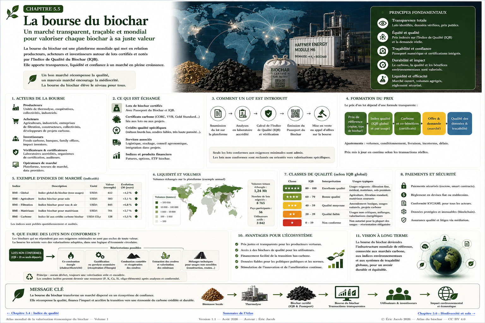

# Chapitre 5.5 — Bourse mondiale du biochar

> **Atlas mondial de la valorisation économique du biochar — Volume 1**  
> Version 1.2 — Août 2026 · Auteur : Eric Jacob

**[← Indice de qualité](ch5_fr_indice_qualite.md) · [↑ Sommaire de l’Atlas](README.md) · [Indice mondial des prix →](ch5_fr_indice_prix_mondial.md)**

---

## Passer d'un marché de tonnes à un marché de qualités vérifiables

Le biochar ne constitue pas une marchandise homogène. Deux lots de même masse peuvent différer par leur biomasse d'origine, leur stabilité, leur porosité, leur composition minérale, leurs contaminants, leur destination et leur valeur carbone.

Une véritable place de marché ne devrait donc pas coter « le biochar » comme s'il existait un produit universel.

Elle devrait organiser la rencontre entre **des lots caractérisés et des besoins caractérisés**.

<figure>
  
  <figcaption>
    <strong>Figure 1 — Bourse mondiale du biochar : qualité, transparence et formation du prix.</strong>
    Les prix, volumes et indices visibles dans l'infographie sont illustratifs. Ils ne constituent ni des cotations réelles ni des données de marché.
    © Eric Jacob 2026 — Atlas mondial du biochar — CC BY 4.0.
    <a href="ch5_fr_bourse_biochar.png">Agrandir l’infographie</a>
  </figcaption>
</figure>

---

## Pourquoi créer une place de marché spécialisée ?

Un marché naissant présente plusieurs difficultés :

- informations dispersées ;
- prix difficilement comparables ;
- qualités très différentes ;
- contrats non standardisés ;
- coûts logistiques importants ;
- faible visibilité sur les volumes ;
- confusion possible entre biochar physique et attribut carbone ;
- difficulté pour un nouvel acheteur à savoir ce qu'il achète.

Une place de marché spécialisée peut réduire ces frictions.

Son rôle n'est pas de décider de la valeur à la place des acteurs, mais de fournir une **infrastructure de comparaison, de preuve et de transaction**.

---

## Le lot comme unité fondamentale

L'unité négociée doit être le lot identifié par son **[Passeport numérique](ch5_fr_passeport_biochar.md)**.

Une offre pourrait être décrite ainsi :

```text
LOT : BC-2026-FR-000184
Masse disponible : 22,4 t
Origine : résidus d'entretien territorial
Grade : BA — agriculture
IQB-Agriculture : 82/100
Certification : référentiel indiqué
Carbone : analyse du lot
Granulométrie : 2–10 mm
Localisation : Grand Est, France
Conditionnement : vrac / big-bag
Attribut carbone : inclus / séparé / non disponible
```

L'acheteur ne voit plus seulement un prix.

Il voit **ce que ce prix achète**.

---

## Les acteurs

La plateforme peut mettre en relation plusieurs familles.

### Producteurs

Unités de thermolyse, industriels, coopératives, collectivités ou autres opérateurs produisant des lots caractérisés.

### Acheteurs

Agriculteurs, distributeurs, fabricants de matériaux, spécialistes de la filtration, collectivités, industriels et développeurs de projets.

### Laboratoires

Ils apportent les mesures nécessaires à la comparaison.

### Certificateurs et vérificateurs

Ils fournissent une couche indépendante de conformité ou de preuve.

### Logisticiens

Le biochar est un produit physique. Le transport, le stockage, le conditionnement et la sécurité font partie du prix réel.

### Acteurs carbone

Lorsque le lot donne lieu à un retrait carbone certifiable, les attributs correspondants doivent être reliés sans ambiguïté au lot physique.

### Financeurs et assureurs

Une information plus structurée peut réduire certains risques et faciliter le financement d'installations ou de contrats de long terme.

---

## Admission d'un lot

Une Bourse crédible ne devrait pas accepter une simple déclaration commerciale.

Le processus pourrait être :

```text
IDENTITÉ DU LOT
       ↓
PASSEPORT
       ↓
ANALYSES
       ↓
CONTRÔLES DE CONFORMITÉ
       ↓
IQB PAR USAGE
       ↓
DOCUMENTS LOGISTIQUES
       ↓
ADMISSION
```

Les données obligatoires dépendraient de la catégorie.

Un lot agricole et un carbone destiné à un matériau technique n'ont pas nécessairement les mêmes exigences.

---

## Plusieurs marchés plutôt qu'un seul prix

La plateforme pourrait distinguer :

```text
BIOCHAR — AGRICULTURE
BIOCHAR — FILTRATION
BIOCHAR — MATÉRIAUX
BIOCHAR — INDUSTRIE
BIOCHAR — CARBONE
BIOCHAR — GRADES SPÉCIAUX
```

Un même lot pourrait être éligible à plusieurs catégories lorsque ses caractéristiques le permettent.

Cette segmentation évite de comparer artificiellement des produits destinés à des fonctions différentes.

---

## Formation du prix

Le prix observé peut être décomposé conceptuellement :

```text
PRIX RÉGIONAL DE RÉFÉRENCE
          +
QUALITÉ PERTINENTE
          +
CERTIFICATION
          +
ATTRIBUT CARBONE
          +
CONDITIONNEMENT
          +
LOGISTIQUE
          +
OFFRE / DEMANDE
```

Cette formule n'impose pas le prix.

Elle explique pourquoi deux lots ne valent pas nécessairement la même chose.

---

## Prix départ usine et prix livré

La logistique peut représenter une fraction importante de la valeur.

La plateforme devrait donc distinguer au minimum :

- prix départ unité ;
- prix conditionné ;
- coût du transport ;
- prix livré ;
- distance ;
- mode de transport.

Une tonne vendue 500 € à 30 km n'est économiquement ni écologiquement équivalente à une tonne vendue 500 € à 2 000 km.

---

## Le territoire comme variable de marché

Le biochar est particulièrement adapté à des marchés régionaux.

La Bourse mondiale n'implique pas que les tonnes doivent circuler à travers le monde.

Elle peut au contraire permettre de découvrir :

> **le meilleur lot disponible à proximité.**

Un moteur de recherche pourrait intégrer :

```text
usage
+ qualité minimale
+ rayon maximal
+ volume
+ date
+ certification
+ prix livré
```

La plateforme mondiale devient alors un outil de **relocalisation intelligente**.

---

## Contrats spot

Un marché spot permet d'acheter un lot disponible immédiatement.

Il est utile pour :

- essais ;
- besoins ponctuels ;
- excédents ;
- premières transactions ;
- ajustements de stock.

Mais le marché du biochar peut avoir davantage besoin de contrats longs que de spéculation à très court terme.

---

## Contrats à terme physiques

Un agriculteur, un fabricant ou un distributeur peut vouloir sécuriser plusieurs années d'approvisionnement.

Un producteur a besoin de visibilité avant de financer une unité.

Un contrat pourrait donc définir :

```text
volume annuel
qualité minimale
formule de prix
indexation
origine
tolérances
calendrier
logistique
contrôle
```

Ces contrats d'offtake peuvent contribuer au financement des capacités industrielles.

---

## Ne pas construire un casino du biochar

Une place de marché utile doit faciliter l'économie réelle.

L'objectif n'est pas de créer une volatilité artificielle ou une multiplication de produits financiers détachés des tonnes physiques.

La priorité doit rester :

**producteur → lot → acheteur → usage réel**.

Les instruments financiers éventuels doivent servir la couverture du risque, le financement ou la stabilité des contrats, et non devenir la finalité du système.

---

## Séparer le biochar du certificat carbone

Une tonne physique et son attribut carbone sont deux objets liés mais distincts.

Plusieurs situations sont possibles :

```text
BIOCHAR + ATTRIBUT CARBONE
BIOCHAR SANS ATTRIBUT CARBONE
BIOCHAR DONT L'ATTRIBUT A DÉJÀ ÉTÉ TRANSFÉRÉ
```

Le passeport doit indiquer le statut.

Sans cette séparation, un acheteur pourrait croire acquérir un bénéfice carbone déjà vendu ailleurs.

---

## Le rôle de l'IQB

L'**[Indice de qualité du biochar](ch5_fr_indice_qualite.md)** ne doit pas fixer automatiquement le prix.

Il peut cependant faciliter :

- filtrage des offres ;
- comparaison ;
- primes de qualité ;
- contrats avec seuils ;
- statistiques de marché.

La Bourse pourrait publier plusieurs indices :

```text
BMI-A — agriculture
BMI-F — filtration
BMI-M — matériaux
BMI-C — carbone
```

Les noms sont ici des propositions conceptuelles de l'Atlas.

---

## Construire un indice mondial des prix

Les transactions réelles peuvent alimenter des références anonymisées :

```text
prix
+ qualité
+ région
+ volume
+ usage
+ date
```

Une méthodologie statistique peut ensuite construire des indices évitant qu'une seule transaction atypique déforme le marché.

Cette architecture est développée dans **[l'Indice mondial des prix du biochar](ch5_fr_indice_prix_mondial.md)**.

---

## Que faire des biochars hors spécifications ?

Un biochar refusé pour un usage n'est pas nécessairement un déchet sans valeur.

Il faut d'abord déterminer **pourquoi** il est hors spécifications.

### Défaut de performance

Surface trop faible, granulométrie inadéquate, pH peu adapté ou autre propriété fonctionnelle.

Le lot peut parfois être réorienté vers un usage moins exigeant.

### Défaut corrigeable

Humidité, granulométrie, poussières ou homogénéité peuvent parfois être corrigées par séchage, tamisage, granulation, mélange contrôlé ou post-traitement.

### Contamination organique ou pyrolyse insuffisante

Un retraitement thermique peut parfois être étudié.

Il doit être réalisé dans une installation adaptée, avec contrôle des gaz et nouvelle caractérisation.

### Métaux, sels ou contaminants minéraux

Ici, **brûler le carbone ne détruit pas les métaux**.

La combustion concentre au contraire les éléments minéraux dans les cendres.

Cela peut être utile si l'objectif est précisément de séparer la fraction carbonée de la fraction minérale, mais les cendres deviennent alors un flux concentré qui doit être analysé et orienté vers une filière autorisée.

---

## Combustion contrôlée : une voie possible, pas une règle générale

L'idée de consumer un biochar non valorisable mérite donc d'être conservée dans l'Atlas.

La chaîne serait :

```text
BIOCHAR HORS SPÉCIFICATION
          ↓
DIAGNOSTIC
          ↓
COMBUSTION CONTRÔLÉE ?
          ↓
ÉNERGIE / CHALEUR RÉCUPÉRÉE
          +
CENDRES CONCENTRÉES
          ↓
ANALYSES
    ↙             ↘
VALORISATION    TRAITEMENT /
MINÉRALE        ÉLIMINATION
```

Mais ce choix sacrifie le carbone stable : celui-ci retourne principalement sous forme de CO₂.

Il faut donc comparer cette option à la réorientation, au retraitement ou à l'incorporation dans un usage technique autorisé.

---

## Les cendres peuvent-elles devenir une ressource ?

Parfois.

Les cendres peuvent contenir :

- potassium ;
- calcium ;
- phosphore ;
- silicium ;
- autres éléments minéraux.

Mais elles peuvent également concentrer :

- métaux indésirables ;
- sels ;
- contaminants non détruits par la combustion.

Le mot **cendre** ne signifie donc ni engrais ni déchet dangereux par définition.

Il signifie : **nouveau matériau à caractériser**.

Une analyse peut conduire à une valorisation minérale, à une récupération d'éléments ou à une filière de traitement spécialisée.

---

## Une hiérarchie pour les lots non conformes

L'Atlas propose l'ordre suivant :

```text
1 — RÉÉVALUER L'USAGE
2 — CORRIGER LE DÉFAUT
3 — RETRAITER
4 — VALORISER DANS UN USAGE TECHNIQUE AUTORISÉ
5 — RÉCUPÉRER L'ÉNERGIE / CONCENTRER LES MINÉRAUX
6 — TRAITER OU ÉLIMINER EN FILIÈRE ADAPTÉE
```

Le choix dépend de la nature exacte du défaut.

Cette hiérarchie évite deux erreurs opposées :

- épandre un mauvais produit simplement parce qu'il s'appelle biochar ;
- détruire un matériau encore valorisable.

---

## La Bourse doit aussi organiser les refus

Une place de marché responsable ne doit pas seulement afficher les meilleurs produits.

Elle peut créer une catégorie privée de **réorientation industrielle** pour les lots hors spécifications.

Un lot refusé en agriculture pourrait être proposé, si légalement et techniquement compatible, à :

- un fabricant de matériaux ;
- un opérateur de retraitement ;
- une installation énergétique ;
- un spécialiste de récupération minérale.

Le lot reste identifié par son passeport.

Sa non-conformité n'est jamais effacée.

---

## Sécurité avant liquidité

La recherche d'un marché liquide ne doit jamais conduire à assouplir les critères de sécurité.

Un lot non conforme ne doit pas devenir commercialisable simplement parce qu'un acheteur accepte le risque.

Les exigences réglementaires et sanitaires restent prioritaires.

La plateforme doit donc distinguer :

```text
NON OPTIMAL
≠
NON CONFORME
≠
DANGEREUX
```

Ces trois situations appellent des décisions différentes.

---

## Paiement et livraison

Une transaction peut utiliser un mécanisme de séquestre :

```text
CONTRAT
   ↓
PAIEMENT BLOQUÉ
   ↓
EXPÉDITION
   ↓
RÉCEPTION
   ↓
CONTRÔLE
   ↓
PAIEMENT LIBÉRÉ
```

Pour les grands contrats, des procédures d'échantillonnage contradictoire peuvent être prévues.

La plateforme doit également gérer les litiges sur masse, humidité, qualité et délais.

---

## Transparence sans exposer les secrets industriels

Les acheteurs ont besoin de données.

Les producteurs ont besoin de protéger certaines informations.

Le système peut reprendre les trois niveaux du passeport :

**public · professionnel · audit**.

La transparence signifie que les affirmations importantes sont vérifiables.

Elle ne signifie pas que toute recette industrielle doit être publiée.

---

## Gouvernance

Une Bourse mondiale ne devrait pas être juge de ses propres produits.

Sa gouvernance doit séparer :

- opérateur de marché ;
- producteurs ;
- laboratoires ;
- certificateurs ;
- méthodologie des indices ;
- règlement des litiges ;
- audit.

Les règles d'admission et les méthodes de calcul doivent être publiques et versionnées.

---

## Intégrité institutionnelle

La confiance est plus importante que le nom de l'opérateur.

Une place de marché pourrait être portée par :

- une structure coopérative internationale ;
- une fondation ;
- un consortium multi-acteurs ;
- une société à gouvernance indépendante ;
- plusieurs plateformes interopérables partageant les mêmes standards.

Le modèle le plus robuste pourrait être **fédéré** : plusieurs opérateurs utilisent un langage commun, tandis que les données de référence et méthodologies restent ouvertes.

---

## Empêcher la manipulation des prix

Un petit marché est vulnérable aux transactions artificielles.

L'indice doit donc exclure ou pondérer :

- transactions entre parties liées ;
- volumes trop faibles ;
- opérations annulées ;
- prix non représentatifs ;
- lots sans qualité documentée.

Les volumes agrégés et la méthodologie doivent être publiés.

---

## Une infrastructure pour les coopératives

La Bourse n'est pas réservée aux grands industriels.

Des producteurs agricoles ou territoriaux peuvent mutualiser :

```text
BIOMASSES
   ↓
UNITÉ PARTAGÉE
   ↓
LOTS
   ↓
CONTRÔLE
   ↓
VENTE GROUPÉE
```

Une coopérative peut ainsi atteindre des volumes et une régularité impossibles pour un producteur isolé.

---

## Hubs, métropoles et grands consommateurs

Les mêmes mécanismes peuvent alimenter des architectures territoriales plus larges.

Un hub logistique, une métropole, un hôpital, une industrie ou un datacenter peut rechercher simultanément :

- énergie ;
- chaleur ;
- gestion de résidus ;
- biochar ;
- matériaux ;
- carbone.

La Bourse peut alors devenir une couche d'échange entre plusieurs infrastructures locales plutôt qu'un simple site de commerce électronique.

---

## Des données pour les politiques publiques

Les données agrégées peuvent montrer :

- volumes produits ;
- régions déficitaires ;
- prix ;
- usages ;
- qualités ;
- distances moyennes ;
- disponibilité de biomasses ;
- capacité industrielle.

Ces informations peuvent aider les collectivités à identifier les endroits où une nouvelle capacité de thermolyse est réellement pertinente.

---

## Ce que la Bourse ne doit jamais devenir

Elle ne doit pas :

- garantir une performance qu'elle n'a pas mesurée ;
- masquer les défauts d'un lot ;
- confondre certification et marketing ;
- créer de faux volumes ;
- vendre deux fois le même attribut carbone ;
- favoriser un producteur dans la méthodologie ;
- transformer un outil de transition écologique en machine spéculative.

La confiance se construit lentement et peut être détruite par quelques transactions opaques.

---

## De la Bourse à l'économie circulaire

La véritable ambition dépasse la cotation.

```text
DÉCHET / RÉSIDU
      ↓
RESSOURCE
      ↓
BIOCHAR CARACTÉRISÉ
      ↓
PASSEPORT
      ↓
IQB
      ↓
MARCHÉ
      ↓
USAGE OPTIMAL
      ↓
RETOUR DE PERFORMANCE
```

Même un lot imparfait peut entrer dans cette logique s'il est correctement identifié et réorienté.

Le marché devient alors un **système d'allocation de la matière vers l'usage où elle crée le plus de valeur avec le moins de risque**.

---

## À retenir

> **Une Bourse du biochar ne doit pas créer un prix unique. Elle doit rendre visibles les différences qui justifient les prix.**

Le passeport établit l'identité.

L'IQB décrit la qualité.

La Bourse organise la rencontre entre qualité, géographie, volume et usage.

L'indice mondial observe les transactions.

Et les lots non conformes ne sont ni maquillés ni automatiquement détruits : **ils sont diagnostiqués, réorientés, retraités ou dirigés vers une filière adaptée.**

---

## Continuer la lecture

**[← Indice de qualité](ch5_fr_indice_qualite.md) · [↑ Sommaire de l’Atlas](README.md) · [Indice mondial des prix →](ch5_fr_indice_prix_mondial.md)**

À consulter également : [Passeport numérique](ch5_fr_passeport_biochar.md) · [Certifications](ch4_fr_certifications.md) · [ACV](ch4_fr_analyse_cycle_vie.md) · [Consortium mondial](ch5_fr_consortium_mondial.md) · [Gestion des risques](ch5_fr_gestion_risques.md)

---

*Atlas mondial de la valorisation économique du biochar — Eric Jacob — Version 1.2 — 2026*  
*Licence : Creative Commons CC BY 4.0*
