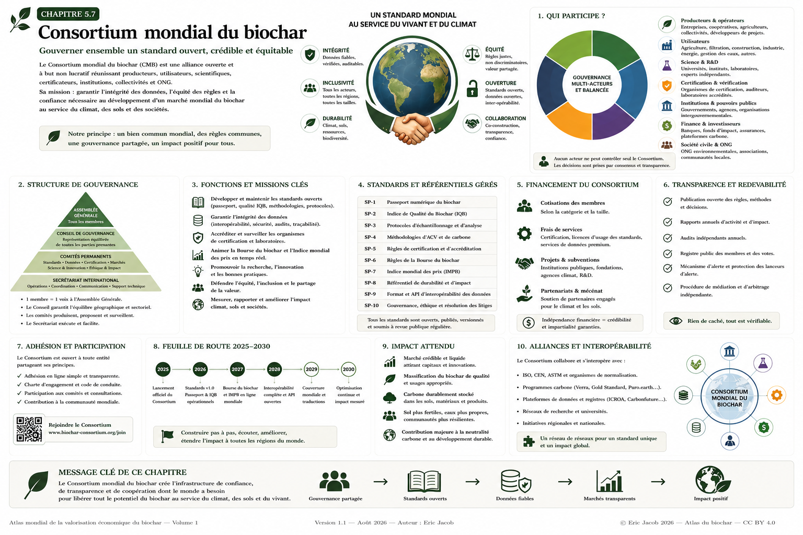

# Chapitre 5.7 — Consortium mondial du biochar

> **Atlas mondial de la valorisation économique du biochar — Volume 1**  
> Version 1.2 — Août 2026 · Auteur : Eric Jacob

**[← Indice mondial des prix](ch5_fr_indice_prix_mondial.md) · [↑ Sommaire de l’Atlas](README.md) · [Observatoire mondial →](ch5_fr_observatoire_mondial.md)**

---

## Une gouvernance commune pour une ressource mondiale

Le biochar concerne simultanément l'agriculture, l'eau, les matériaux, l'énergie, la gestion des biomasses, le carbone, la restauration des sols et l'aménagement des territoires. Une filière aussi transversale ne devrait être gouvernée exclusivement ni par un producteur, ni par une place de marché, ni par un organisme de certification, ni par un État.

L'Atlas propose donc le concept d'un **Consortium mondial du biochar (CMB)** : une structure ouverte, indépendante et multi-acteurs capable d'administrer des standards communs sans s'approprier le marché.

> **Le Consortium ne vend pas la vérité : il organise les conditions permettant de la vérifier.**

<figure>

<figcaption><strong>Figure 1 — Consortium mondial du biochar : gouverner ensemble un standard ouvert, crédible et équitable.</strong> Cette organisation est une proposition institutionnelle de l'Atlas et ne représente pas une organisation internationale actuellement constituée. © Eric Jacob 2026 — Atlas mondial du biochar — CC BY 4.0. <a href="ch5_fr_consortium_mondial.png">Agrandir l’infographie</a></figcaption>
</figure>

---

## Pourquoi un consortium ?

Les chapitres précédents ont construit plusieurs briques :

```text
PASSEPORT NUMÉRIQUE
       ↓
INDICE DE QUALITÉ
       ↓
BOURSE DU BIOCHAR
       ↓
INDICE MONDIAL DES PRIX
```

Ces outils deviennent dangereux s'ils sont contrôlés par un seul acteur. Celui qui définit la qualité pourrait favoriser ses propres produits ; celui qui gère la Bourse certains participants ; celui qui calcule l'indice des prix pourrait sélectionner les transactions qui l'arrangent.

Le Consortium constitue donc une **couche de gouvernance séparée des intérêts commerciaux particuliers**.

## Ce que le Consortium n'est pas

Il ne devrait être ni producteur, ni négociant dominant, ni registre carbone exclusif, ni certificateur unique, ni lobby industriel, ni propriétaire fermé des données. Son rôle est celui d'une **infrastructure de standardisation et de confiance**.

## Principes fondateurs

**Intégrité.** Une donnée publiée comme vérifiée doit pouvoir être reliée à une preuve.

**Neutralité.** Les règles ne favorisent ni technologie, ni entreprise, ni pays sans justification scientifique.

**Ouverture.** Formats, définitions et méthodes fondamentales sont publics.

**Interopérabilité.** Un producteur ne doit pas être prisonnier d'une plateforme.

**Subsidiarité.** Le niveau mondial définit ce qui doit être commun ; les territoires conservent ce qui doit rester local.

**Proportionnalité.** Une petite unité ne doit pas supporter la même bureaucratie qu'une installation industrielle majeure.

**Durabilité.** La qualité technique ne doit jamais masquer une biomasse ou une chaîne d'approvisionnement destructrice.

---

## Qui participe ?

Le Consortium peut réunir sept collèges :

- **Producteurs et opérateurs** : procédés, biomasses, contraintes industrielles et mise à l'échelle.
- **Utilisateurs** : agriculture, forêt, eau, matériaux, collectivités, industrie et énergie.
- **Science et laboratoires** : méthodes, mesures, recherche et reproductibilité.
- **Certification et audit** : conformité, échantillonnage et vérification indépendante.
- **Institutions publiques** : réglementation, santé, territoires et environnement.
- **Finance et assurance** : informations nécessaires au financement et à la gestion des risques.
- **Société civile** : associations, ONG et communautés locales.

Une règle fondamentale pourrait être : **aucune catégorie d'acteurs ne possède seule la majorité des droits de vote**.

Les décisions structurantes peuvent exiger simultanément une majorité des votes et une majorité des collèges.

---

## Architecture de gouvernance

```text
ASSEMBLÉE GÉNÉRALE
        ↓
CONSEIL DE GOUVERNANCE
        ↓
┌──────────┬───────────┬───────────┬────────────┐
│ Standards│ Science   │ Marchés   │ Éthique    │
│ & données│ & mesures │ & indices │ & impacts  │
└──────────┴───────────┴───────────┴────────────┘
        ↓
SECRÉTARIAT TECHNIQUE
```

L'Assemblée définit les orientations, le Conseil arbitre, les comités travaillent et le secrétariat exécute sans devenir propriétaire des règles.

### Standards et données

Passeport numérique, schémas de données, identifiants, API, vocabulaires, interopérabilité, versionnement et migrations.

### Science et métrologie

Échantillonnage, méthodes analytiques, incertitudes, comparaisons interlaboratoires, stabilité du carbone, ACV et protocoles de terrain.

### Marchés et indices

IQB, règles de marché, méthodologie de l'IMPB, prévention des manipulations et publication des niveaux de confiance.

### Éthique, territoires et impacts

Compétition pour la biomasse, biodiversité, eau, cultures dédiées, sécurité, impacts sociaux, conflits d'usage et greenwashing.

**Maximiser les tonnes de biochar n'est pas l'objectif final.**

---

## Catalogue de standards ouverts

Le Consortium pourrait maintenir :

```text
CMB-SP1   Passeport numérique
CMB-SP2   Indice de qualité
CMB-SP3   Échantillonnage
CMB-SP4   Données analytiques
CMB-SP5   ACV et carbone
CMB-SP6   Bourse et transactions
CMB-SP7   Indice mondial des prix
CMB-SP8   Données territoriales
CMB-SP9   API et interopérabilité
CMB-SP10  Gouvernance et audit
```

Ces identifiants sont des propositions conceptuelles de l'Atlas.

Un **standard n'est pas une certification** : le Consortium peut définir comment mesurer et représenter une information tandis qu'un organisme indépendant vérifie qu'un acteur respecte le référentiel. Cette séparation évite qu'une même structure écrive la règle, vende la certification et juge les contestations.

---

## Reconnaître l'existant

Le système ne doit pas imposer un monopole. Plusieurs certifications peuvent être reconnues lorsqu'elles démontrent leur compatibilité.

Le Consortium doit rechercher des passerelles avec les normes ISO, CEN, ASTM, les référentiels biochar, les méthodologies carbone et les systèmes de passeports numériques.

L'objectif est de **relier ce qui existe**, non de tout remplacer.

---

## Architecture fédérée et souveraineté territoriale

Il n'est pas nécessaire de construire une base centrale contenant toutes les données mondiales :

```text
EUROPE ─────┐
AFRIQUE ────┤
AMÉRIQUES ──┼→ STANDARD COMMUN
ASIE ───────┤
OCÉANIE ────┘
```

Chaque région peut exploiter ses propres infrastructures tandis que les systèmes communiquent grâce aux standards.

Les réalités diffèrent selon climat, sols, biomasses, agriculture, réglementation et infrastructures. Le Consortium peut définir **la forme de la donnée** sans imposer une recette agronomique mondiale.

---

## Une place réelle pour les pays émergents

Un standard mondial conçu uniquement par les marchés riches reproduirait leurs priorités.

Il faut prévoir représentation géographique, traductions, participation à distance, assistance technique, standards proportionnés, outils ouverts et formation.

Une petite coopérative doit pouvoir participer sans disposer d'un département réglementaire de vingt personnes.

Dans certaines régions, la valeur principale du biochar sera moins le certificat carbone que la restauration des sols, l'eau, la valorisation de résidus, la chaleur, les matériaux locaux ou l'activité économique.

---

## Financement et indépendance

Sources possibles :

- cotisations ;
- services techniques ;
- subventions publiques ;
- fondations ;
- recherche ;
- partenariats ;
- dons ;
- services avancés.

Mais les **standards fondamentaux ne devraient pas être enfermés derrière un péage**.

Pour éviter une dépendance, le Consortium peut plafonner la contribution d'un acteur ou d'un secteur et publier l'origine de ses principaux financements.

---

## Transparence et conflits d'intérêts

Le Consortium devrait publier ses statuts, membres, financeurs, votes, méthodologies, versions, conflits d'intérêts, rapports et audits.

> **La gouvernance de la transparence doit elle-même être transparente.**

La compétence et l'intérêt économique peuvent coexister. Les conflits doivent donc être déclarés plutôt que cachés : employeur, participations, clients pertinents, financements de recherche et mandats.

Des règles de récusation peuvent s'appliquer.

---

## Lanceurs d'alerte et audits

Une filière mondiale a besoin d'un mécanisme confidentiel pour signaler falsification de données, double comptage, contamination dissimulée, certification abusive ou manipulation de prix.

Le Consortium lui-même doit être audité sur ses finances, sa cybersécurité, ses méthodes, sa gouvernance et ses procédures.

---

## Modifier un standard sans casser l'écosystème

```text
PROPOSITION
    ↓
PUBLICATION
    ↓
COMMENTAIRES
    ↓
TESTS
    ↓
RÉVISION
    ↓
VOTE
    ↓
VERSION PUBLIÉE
```

Les anciennes versions restent archivées et une période de transition permet les migrations.

Les standards numériques doivent prévoir compatibilité, champs dépréciés et documentation historique : modifier une définition en 2032 ne doit pas rendre illisibles les passeports de 2027.

---

## Logiciels de référence et API

Le Consortium pourrait publier des logiciels ouverts :

```text
validateur de passeport
convertisseur de formats
bibliothèque IQB
client API
outil d'anonymisation
outils statistiques
```

Une API commune permettrait aux producteurs, laboratoires, marchés, administrations, chercheurs, observatoires et IA d'échanger automatiquement les données autorisées.

Les entreprises resteraient libres de construire des services commerciaux plus avancés.

---

## Cybersécurité et propriété des données

Une infrastructure mondiale doit intégrer authentification forte, chiffrement, signatures, sauvegardes, réplication, journalisation et procédures d'incident.

Le Consortium ne devrait pas devenir propriétaire de toutes les données. Il administre des standards et éventuellement certains registres de référence ; producteurs, laboratoires, utilisateurs et territoires conservent les droits définis sur leurs informations.

Le système organise **l'accès autorisé**, pas l'expropriation informationnelle.

---

## Observatoire et recherche mondiale

Les données agrégées peuvent alimenter l'**[Observatoire mondial du biochar](ch5_fr_observatoire_mondial.md)** :

```text
PRODUCTION
PRIX
QUALITÉ
USAGES
CAPACITÉS
CARBONE
TERRITOIRES
RECHERCHE
```

Le Consortium peut faciliter jeux de données anonymisés, protocoles communs, réplication d'expériences, comparaisons interlaboratoires et méta-analyses.

Voir également : **[Recherche mondiale](ch5_fr_recherche_mondiale.md)**.

---

## Transformer les retours de terrain en science

Le terrain ne doit être ni réduit à l'anecdote ni transformé immédiatement en certitude scientifique.

```text
OBSERVATION TERRAIN
       ↓
CONTEXTE DOCUMENTÉ
       ↓
LOT IDENTIFIÉ
       ↓
SIGNAL
       ↓
ESSAI CONTRÔLÉ
       ↓
CONNAISSANCE
```

Un retour agricole remarquable devient ainsi une **hypothèse à tester**, plutôt qu'une promesse marketing.

---

## Éviter la capture institutionnelle

Toute organisation finit par développer ses propres intérêts.

Il faut donc prévoir rotation des mandats, limites de durée, votes documentés, révisions externes et possibilité de réutiliser ou de dériver les standards ouverts.

Si une gouvernance devient mauvaise, **le standard doit pouvoir survivre à l'institution qui l'a créé**.

Un producteur quittant une plateforme doit également pouvoir conserver ses passeports, identifiants, historique et preuves.

---

## Feuille de route

```text
PHASE 1 — Définitions communes + passeport minimal
PHASE 2 — Méthodes analytiques + IQB expérimental
PHASE 3 — Interopérabilité + pilotes régionaux
PHASE 4 — Bourses + collecte de transactions
PHASE 5 — Indices de prix + Observatoire
PHASE 6 — Réseau mondial fédéré
```

Il vaut mieux quelques standards robustes qu'une architecture gigantesque impossible à appliquer.

---

## Mesurer l'impact

Le succès du Consortium ne doit pas être mesuré au nombre de réunions mais aux résultats :

- passeports interopérables ;
- données vérifiées ;
- baisse du coût de conformité ;
- rapidité des procédures ;
- régions couvertes ;
- volume caractérisé ;
- diminution des litiges ;
- accès des petits producteurs ;
- production de connaissances ;
- meilleure orientation des biochars vers leurs usages.

---

## Servir le vivant

Les standards, API, indices et audits sont des moyens :

```text
BIOMASSES MIEUX GÉRÉES
        ↓
CARBONE STABLE
        ↓
SOLS + EAU + MATÉRIAUX
        ↓
TERRITOIRES PLUS RÉSILIENTS
        ↓
MOINS DE PRESSION SUR LE CLIMAT
```

Si l'infrastructure devient bureaucratiquement parfaite mais écologiquement inutile, elle a échoué.

---

## À retenir

> **Une économie mondiale du biochar a besoin d'un langage commun, mais pas d'un propriétaire mondial.**

Le Consortium proposé par l'Atlas doit rendre compatibles les données, protéger l'intégrité des méthodes, organiser la gouvernance et laisser technologies, entreprises et territoires continuer à innover.

Le standard est commun. Les solutions restent multiples.

La finalité demeure : **transformer des ressources locales en bénéfices mesurables pour les sols, l'eau, le climat, les territoires et les sociétés.**

---

## Continuer la lecture

**[← Indice mondial des prix](ch5_fr_indice_prix_mondial.md) · [↑ Sommaire de l’Atlas](README.md) · [Observatoire mondial →](ch5_fr_observatoire_mondial.md)**

À consulter également : [Passeport numérique](ch5_fr_passeport_biochar.md) · [Indice de qualité](ch5_fr_indice_qualite.md) · [Bourse du biochar](ch5_fr_bourse_biochar.md) · [Métrologie carbone](ch5_fr_metrologie_carbone.md) · [Recherche mondiale](ch5_fr_recherche_mondiale.md)

---

*Atlas mondial de la valorisation économique du biochar — Eric Jacob — Version 1.2 — 2026*  
*Licence : Creative Commons CC BY 4.0*
