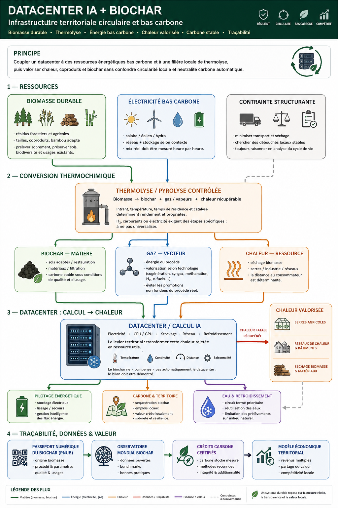

# Chapitre 5 — Datacenters IA, biochar et infrastructures territoriales

> **Atlas mondial de la valorisation économique du biochar — Volume 1**  
> Version 1.1 — Août 2026  
> Auteur : Eric Jacob

[← Sommaire de l’Atlas](./) · [Biochar idéal](ch5_fr_biochar_ideal.html) · [Passeport numérique →](ch5_fr_passeport_biochar.html)

---

## Résumé

L’essor de l’intelligence artificielle augmente les besoins en calcul, en électricité, en refroidissement et en infrastructures. Une question devient alors centrale : **peut-on concevoir un datacenter comme une composante d’un territoire circulaire plutôt que comme un consommateur d’énergie isolé ?**

Le modèle proposé ici associe, lorsque le contexte local le permet :

- électricité bas carbone ;
- biomasse résiduelle ou durable ;
- thermolyse ou pyrolyse contrôlée ;
- production de biochar ;
- valorisation des gaz et de la chaleur ;
- récupération de la chaleur fatale du datacenter ;
- usages agricoles, industriels ou territoriaux ;
- mesure et traçabilité des flux de carbone.

Il s’agit d’une **architecture prospective**, et non de l’affirmation qu’un datacenter devient automatiquement neutre ou négatif en carbone dès lors qu’il est associé au biochar.

---

## Vue d’ensemble

La figure suivante condense le modèle proposé.

[](ch5_fr_datacenters.png)

*Figure 1 — Datacenter IA + Biochar : articulation entre ressources locales, conversion thermochimique, calcul informatique, récupération de chaleur, stockage du carbone et traçabilité. Cliquer sur l’image pour l’ouvrir en pleine résolution.*

---

## 1. Le datacenter comme infrastructure territoriale

Un datacenter transforme presque toute l’électricité qu’il consomme en chaleur. Cette chaleur est fréquemment considérée comme une contrainte de refroidissement ; elle peut aussi devenir une **ressource territoriale**, à condition qu’un usage adapté existe à proximité.

Les débouchés possibles comprennent notamment :

- réseaux de chaleur ;
- bâtiments ;
- serres agricoles ;
- séchage de biomasse ou de matériaux ;
- certains procédés industriels ;
- production de froid ou relèvement de température par pompe à chaleur lorsque le bilan énergétique le justifie.

La proximité géographique est essentielle : transporter de la chaleur sur de longues distances peut annuler une partie de son intérêt économique.

---

## 2. Pourquoi introduire une filière biochar ?

Une filière de thermolyse peut valoriser certaines biomasses résiduelles en plusieurs flux.

**Le biochar** conserve une partie du carbone initial sous une forme plus stable. Selon sa qualité, il peut être destiné aux sols, aux matériaux, à la filtration ou à d’autres usages.

**Les gaz et vapeurs** issus du procédé peuvent participer aux besoins énergétiques du système ou faire l’objet de transformations supplémentaires selon la technologie retenue.

**La chaleur** peut servir au séchage de la biomasse, à des usages industriels ou à un réseau thermique.

Le modèle devient particulièrement intéressant lorsque plusieurs de ces flux trouvent simultanément un débouché local.

---

## 3. Biomasse : une ressource, pas une ressource infinie

Le caractère renouvelable de la biomasse ne suffit pas à garantir la durabilité d’un projet.

Une implantation sérieuse doit examiner :

- l’origine des intrants ;
- les usages concurrents ;
- les distances de collecte ;
- l’humidité et le besoin de séchage ;
- le maintien de matière organique dans les sols ;
- la biodiversité ;
- le renouvellement de la ressource ;
- les risques liés à des cultures dédiées mal adaptées.

Les résidus forestiers, agricoles ou industriels peuvent être intéressants lorsqu’ils sont réellement disponibles et qu’une partie suffisante de la matière organique reste dans les écosystèmes.

---

## 4. Électricité et flexibilité du calcul

Le biochar ne remplace pas la nécessité d’une électricité aussi décarbonée que possible.

Un datacenter pourrait combiner :

- réseau électrique ;
- solaire ;
- éolien ;
- hydroélectricité lorsque disponible ;
- stockage électrique ;
- production locale issue de coproduits énergétiques.

Certaines charges informatiques non urgentes peuvent également être déplacées dans le temps. À terme, le pilotage pourrait prendre en compte simultanément le prix de l’électricité, son intensité carbone, la disponibilité des renouvelables, le stockage et les contraintes thermiques.

Le calcul devient alors, dans certaines limites, **une charge énergétique pilotable**.

---

## 5. La chaleur fatale comme coproduit du calcul

Le rapprochement entre production informatique et consommateurs de chaleur est probablement l’un des éléments les plus importants du modèle.

Le principe est simple :

```text
Électricité
    ↓
Datacenter
    ↓
Calcul informatique
    ↓
Chaleur
    ↓
Récupération
    ↓
Serres / bâtiments / industrie / séchage
```

Mais la faisabilité dépend de quatre paramètres : **température, continuité, distance et saisonnalité**.

Une chaleur disponible à basse température peut nécessiter une pompe à chaleur. Son intérêt doit alors être calculé à partir du système complet et non du seul datacenter.

---

## 6. Le biochar comme stockage physique du carbone

L’intérêt climatique du biochar repose sur une différence fondamentale avec une simple compensation financière : une fraction du carbone de la biomasse peut rester physiquement présente dans un matériau carboné durable.

Cela ne signifie pas que chaque tonne de biochar correspond automatiquement à une quantité fixe de CO₂ retirée de l’atmosphère.

Il faut connaître notamment :

- la masse sèche ;
- la teneur en carbone organique ;
- la stabilité du carbone ;
- l’énergie consommée par le procédé ;
- le transport ;
- la préparation de la biomasse ;
- la destination finale du biochar.

Le bilan doit donc être établi par **analyse de cycle de vie** et selon une méthodologie carbone reconnue lorsque des crédits sont revendiqués.

---

## 7. Ne pas confondre biochar et droit à polluer

Associer un datacenter à une production de biochar ne doit pas devenir un mécanisme permettant de justifier n’importe quelle consommation énergétique.

L’ordre logique devrait rester :

1. améliorer l’efficacité du calcul ;
2. utiliser une électricité aussi bas carbone que possible ;
3. récupérer la chaleur lorsque cela est pertinent ;
4. valoriser durablement les ressources locales ;
5. mesurer le carbone réellement stocké ;
6. ne comptabiliser que les réductions ou retraits démontrables.

Le biochar devient alors **une composante du système**, et non un alibi environnemental.

---

## 8. Eau et refroidissement

Le refroidissement constitue un autre enjeu majeur.

Selon le climat et la technologie, le projet peut privilégier :

- circuits fermés ;
- refroidissement à air ;
- réutilisation d’eaux compatibles ;
- récupération thermique ;
- limitation des prélèvements d’eau potable.

Il n’existe pas de solution universelle. Un système pertinent dans une région froide et humide peut être inadapté dans une région aride.

C’est pourquoi l’eau doit figurer dans le bilan territorial au même titre que l’électricité, la biomasse et le carbone.

---

## 9. Une boucle territoriale

L’objectif final n’est pas seulement de produire du biochar ou d’alimenter des serveurs.

Il consiste à rechercher une **symbiose industrielle** :

```text
Résidus locaux
      ↓
Thermolyse
 ┌────┼──────────┐
 ↓    ↓          ↓
Biochar  Énergie  Chaleur
 ↓       ↓        ↓
Sols   Datacenter Séchage / réseau
          ↓
        Calcul
          ↓
        Chaleur
          ↓
Serres / bâtiments / industrie
```

Plus les flux trouvent des débouchés proches et complémentaires, plus l’infrastructure peut gagner en efficacité.

---

## 10. La couche numérique : mesurer pour pouvoir démontrer

Un tel système produit énormément de données.

Chaque lot de biochar pourrait être associé à un passeport numérique comprenant :

- origine de la biomasse ;
- masse et humidité ;
- paramètres du procédé ;
- analyses chimiques ;
- teneur en carbone ;
- destination du produit ;
- données de certification.

Le datacenter peut lui-même enregistrer :

- consommation électrique ;
- intensité carbone du réseau ;
- énergie renouvelable produite ;
- chaleur récupérée ;
- chaleur réellement utilisée ;
- consommation d’eau ;
- performances du refroidissement.

Cette couche de données est indispensable pour éviter le **double comptage** et les affirmations environnementales impossibles à vérifier.

---

## 11. Un modèle économique à revenus multiples

La viabilité d’un tel système ne devrait pas dépendre d’un seul revenu.

Selon le projet, plusieurs sources peuvent coexister :

| Flux | Valorisation possible |
|---|---|
| Calcul | services numériques / IA |
| Biochar | agriculture, matériaux, filtration |
| Chaleur | réseau, serre, industrie |
| Gaz / énergie | autoconsommation ou valorisation |
| Carbone | crédits certifiés si éligibles |
| Services territoriaux | traitement de certains résidus |
| Données | traçabilité et optimisation |

Cette diversification peut améliorer la résilience économique, mais chaque revenu doit être évalué séparément : **on ne doit pas additionner des marchés théoriques comme s’ils étaient garantis**.

---

## 12. Où ce modèle a-t-il le plus de sens ?

Les sites les plus intéressants seraient probablement ceux réunissant plusieurs conditions :

- besoin important de calcul ;
- électricité relativement décarbonée ;
- biomasse résiduelle disponible à proximité ;
- demande régulière de chaleur ;
- terrain industriel adapté ;
- réseau de transport numérique performant ;
- débouchés identifiés pour le biochar ;
- gouvernance territoriale capable de coordonner les acteurs.

L’implantation devient donc un problème d’optimisation multicritère.

---

## 13. Une piste pour l’intelligence artificielle

L’IA pourrait elle-même contribuer au pilotage de l’infrastructure qui l’héberge.

Elle pourrait prévoir :

- production renouvelable ;
- prix de l’électricité ;
- besoins de calcul ;
- demande thermique ;
- disponibilité de biomasse ;
- maintenance ;
- capacité de stockage.

On obtient alors une boucle intéressante :

> **l’intelligence artificielle participe à l’optimisation énergétique et matérielle de sa propre infrastructure.**

Cette optimisation ne supprime pas son empreinte physique ; elle peut en revanche contribuer à la réduire.

---

## 14. Conditions pour parler de système vertueux

Un projet devrait pouvoir démontrer simultanément :

| Critère | Question |
|---|---|
| Électricité | Quelle intensité carbone réelle ? |
| Biomasse | Est-elle durable et additionnelle ? |
| Transport | Quelles distances ? |
| Biochar | Quelle stabilité et quelle qualité ? |
| Chaleur | Quelle quantité est réellement utilisée ? |
| Eau | Quels prélèvements nets ? |
| Carbone | Quelle quantité est durablement stockée ? |
| Données | Les résultats sont-ils auditables ? |
| Économie | Le modèle fonctionne-t-il sans hypothèses irréalistes ? |

Un système qui échoue sur plusieurs de ces critères peut rester techniquement intéressant sans pouvoir être qualifié de « carbone négatif ».

---

## Conclusion

Le datacenter du futur peut être pensé autrement que comme une boîte informatique alimentée par un réseau électrique et refroidie en rejetant sa chaleur.

Il peut devenir un **nœud énergétique et numérique intégré à son territoire**.

La filière biochar apporte une dimension supplémentaire : la possibilité de transformer certaines ressources de biomasse en énergie utile tout en conservant une partie de leur carbone dans une matière stable.

L’intérêt du modèle réside précisément dans la combinaison :

**calcul + énergie bas carbone + chaleur valorisée + biomasse durable + biochar + mesure.**

Aucun de ces éléments ne suffit seul.

C’est leur intégration, leur proximité et la vérification des flux qui peuvent transformer une infrastructure informatique en composante d’une économie territoriale plus circulaire.

---

## Pour aller plus loin dans l’Atlas

- [Biochar idéal](ch5_fr_biochar_ideal.html)
- [Passeport numérique du biochar](ch5_fr_passeport_biochar.html)
- [Métrologie du carbone](ch5_fr_metrologie_carbone.html)
- [Territoires et résilience](ch5_fr_territoires_resilience_biochar_carbone.html)
- [Jumeau numérique](ch5_fr_jumeau_numerique.html)
- [Gestion des risques](ch5_fr_gestion_risques.html)
- [Feuille de route 2050](ch5_fr_feuille_route_2050.html)

---

[← Article précédent : Biochar idéal](ch5_fr_biochar_ideal.html) · **[↑ Sommaire de l’Atlas](./)** · [Article suivant : Passeport numérique →](ch5_fr_passeport_biochar.html)

---

*Atlas mondial de la valorisation économique du biochar — Eric Jacob — Version 1.1 — 2026*  
*Licence : Creative Commons CC BY 4.0*
