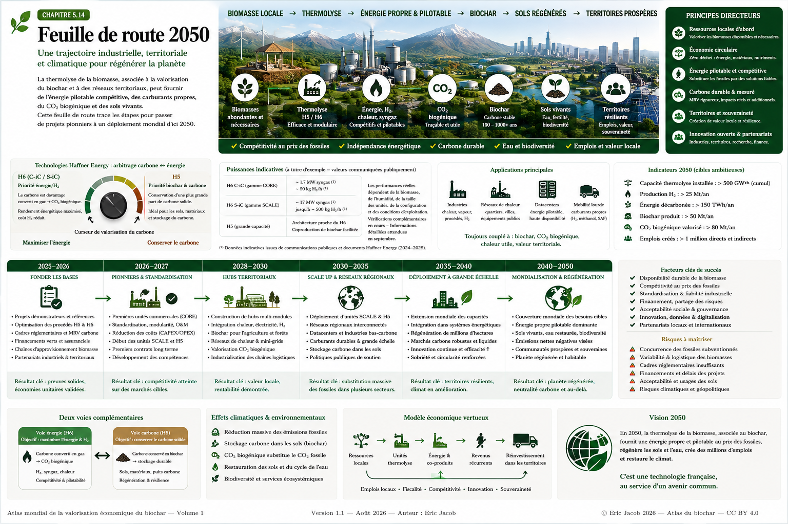

# Chapitre 5 — Feuille de route 2050 : thermolyse, biochar et territoires régénératifs

> **Atlas mondial de la valorisation économique du biochar — Volume 1**  
> Version 1.1 — Août 2026 · Auteur : Eric Jacob

**[← Territoires & résilience](ch5_fr_territoires_resilience.md) · [↑ Sommaire de l’Atlas](README.md)**

---

## De technologies disponibles à une infrastructure mondiale de régénération

Le biochar peut être étudié comme produit agricole, matériau, support de filtration ou réservoir de carbone durable. Mais son potentiel devient plus large lorsqu’il est replacé dans le système thermochimique qui le produit.

La thermolyse peut relier des ressources de biomasse durablement mobilisables à plusieurs besoins : énergie pilotable, chaleur industrielle, molécules renouvelables, biocarbone, biochar, stockage du carbone et restauration des sols.

La feuille de route proposée ici n’est **ni une prévision ni un engagement industriel**. Elle décrit une trajectoire possible pour passer de projets encore dispersés à des infrastructures territoriales capables de créer simultanément valeur économique, résilience énergétique et bénéfices environnementaux mesurables.



**Figure 1 — Feuille de route 2050 : une trajectoire industrielle, territoriale et climatique.**  
Les puissances et objectifs représentés dans l’infographie sont prospectifs ou illustratifs sauf lorsqu’une source industrielle est explicitement indiquée. Les caractéristiques des gammes Haffner Energy restent susceptibles d’évoluer ; les données détaillées attendues ultérieurement devront être intégrées dans une prochaine révision de l’Atlas.  
© Eric Jacob 2026 — Atlas mondial du biochar — CC BY 4.0.

---

## 1. Une feuille de route, pas une prophétie

Une trajectoire 2050 doit distinguer quatre niveaux :

```text
DONNÉES MESURÉES
≠
CARACTÉRISTIQUES CONSTRUCTEUR
≠
SCÉNARIOS
≠
OBJECTIFS PROSPECTIFS
```

L’Atlas refuse de transformer une hypothèse de développement en résultat acquis.

L’intérêt d’une feuille de route est de montrer **quelles conditions doivent être réunies** pour qu’une technologie passe du démonstrateur au déploiement territorial puis international.

---

## 2. Le point de départ : 2026

En 2026, plusieurs briques existent déjà :

- procédés de thermolyse industriels ;
- production de gaz renouvelables ;
- production de biochar et biocarbone ;
- marchés agricoles et industriels du biochar ;
- méthodes de certification carbone ;
- premières infrastructures de traçabilité ;
- développement des marchés de décarbonation industrielle ;
- croissance rapide de grands consommateurs électriques, notamment les datacenters.

L’enjeu n’est donc plus seulement de démontrer qu’une thermolyse est possible.

Il devient :

> **comment l’intégrer économiquement à des territoires et la déployer sans dépasser leurs ressources en biomasse ?**

---

## 3. Le cas Haffner Energy

Haffner Energy constitue dans cet Atlas un **cas industriel français particulièrement intéressant** parce que son architecture associe thermolyse, gaz renouvelable et valorisation du carbone biogénique.

Les communications disponibles distinguent notamment les familles **CORE / C-iC** et **SCALE / S-iC**, ainsi que les architectures H5 et H6.

Cependant, plusieurs chiffres communiqués à différentes périodes peuvent sembler difficiles à rapprocher.

On rencontre notamment des ordres de grandeur autour de :

- **1,7 MW de syngaz et environ 50 kg H₂/h** pour certaines présentations C-iC/H6 ;
- des communications antérieures ou différentes autour de **2 MW et environ 60 kg H₂/h** ;
- jusqu’à environ **17 MW de syngaz et 500 kg H₂/h** évoqués pour les architectures SCALE.

Ces valeurs ne doivent pas être mélangées.

---

## 4. Une ambiguïté technique à conserver comme telle

À la date de cette version de l’Atlas, les informations publiques disponibles ne permettent pas d’établir avec suffisamment de précision si les écarts observés entre certaines valeurs proviennent exclusivement :

- d’une évolution du procédé ;
- d’une évolution du dimensionnement ;
- d’hypothèses différentes sur la biomasse ;
- de la valorisation plus ou moins poussée du carbone solide ;
- d’un périmètre énergétique différent ;
- ou d’une combinaison de ces facteurs.

L’Atlas **ne tranche donc pas artificiellement cette question**.

Des informations techniques complémentaires annoncées pour septembre pourront permettre de préciser cette partie dans une version ultérieure.

> **Lorsqu’une donnée industrielle est ambiguë, la bonne pratique scientifique consiste à conserver l’ambiguïté visible plutôt qu’à inventer une explication.**

---

## 5. L’arbitrage fondamental : carbone ↔ énergie

La biomasse contient du carbone et de l’énergie chimique.

Après thermolyse, une partie du carbone peut rester sous forme solide tandis qu’une autre participe aux flux gazeux et aux transformations ultérieures.

Conceptuellement :

```text
                         ┌→ CARBONE SOLIDE → BIOCHAR
BIOMASSE → THERMOLYSE ──┤
                         └→ GAZ / VAPEURS → ÉNERGIE / H₂ / MOLÉCULES
```

La conception du procédé détermine donc un arbitrage.

---

## 6. Deux objectifs industriels complémentaires

### Priorité énergie

Une architecture peut chercher à maximiser la valorisation énergétique de la biomasse.

```text
DAVANTAGE DE CARBONE VALORISÉ DANS LE PROCÉDÉ
            ↓
DAVANTAGE DE GAZ / ÉNERGIE POTENTIELLE
            ↓
CO₂ BIOGÉNIQUE PLUS IMPORTANT
            ↓
MOINS DE CARBONE SOLIDE DISPONIBLE
```

### Priorité carbone solide

Une autre architecture peut conserver une part plus importante du carbone sous forme de biochar ou biocarbone :

```text
CARBONE SOLIDE CONSERVÉ
        ↓
BIOCHAR / BIOCARBONE
        ↓
SOLS / MATÉRIAUX / INDUSTRIE
        ↓
STOCKAGE DURABLE POTENTIEL
```

Ces deux stratégies ne s’opposent pas : elles répondent à des marchés et objectifs différents.

---

## 7. H6 et H5 : prudence sur la frontière exacte

Les échanges industriels publics étudiés pour cet Atlas indiquent que l’architecture H6 privilégie fortement la production énergétique/H₂, tandis que le H5, d’architecture proche, est présenté comme facilitant davantage la coproduction de biochar dans les projets de grande capacité.

Cette distinction est importante pour un Atlas consacré au biochar.

Elle ne doit cependant pas être transformée en séparation absolue tant que les bilans matière détaillés des configurations industrielles ne sont pas publiquement établis.

---

## 8. Le CO₂ biogénique n’est pas du CO₂ fossile

Lorsqu’un carbone provenant de biomasse récente est converti en CO₂, ce CO₂ est **biogénique**.

Cela ne signifie pas que son émission est sans importance.

Le bilan climatique dépend notamment :

- de l’origine de la biomasse ;
- du scénario de référence ;
- des émissions de collecte et transport ;
- du procédé ;
- de l’énergie substituée ;
- de la part de carbone conservée durablement ;
- de l’éventuelle capture du CO₂ ;
- du changement d’usage des terres.

L’**[Analyse du cycle de vie](ch4_fr_analyse_cycle_vie.md)** reste donc indispensable.

---

## 9. Une possibilité future : valoriser aussi le CO₂ biogénique

Dans certaines architectures industrielles futures, un flux concentré de CO₂ biogénique pourrait devenir une ressource plutôt qu’une émission finale.

Selon la pureté, la pression, la localisation et l’économie du projet, il pourrait être étudié pour :

- usages industriels ;
- synthèse de molécules ;
- méthanation ;
- carburants de synthèse ;
- minéralisation ;
- capture et stockage.

Cette possibilité doit être évaluée projet par projet.

---

## 10. 2025–2027 : consolider les fondations

La première étape consiste à démontrer :

- fiabilité industrielle ;
- disponibilité ;
- qualité des produits ;
- diversité réelle des biomasses acceptables ;
- coûts ;
- maintenance ;
- performances énergétiques ;
- bilans carbone ;
- marchés du biochar.

Il faut également constituer des séries de données suffisamment longues pour sortir de la logique du prototype.

---

## 11. Standardiser sans figer

L’industrialisation exige des composants répétables :

```text
MODULES
+ INTERFACES
+ CONTRÔLE
+ QUALITÉ
+ DOCUMENTATION
+ MAINTENANCE
```

Mais une biomasse n’est pas un combustible parfaitement uniforme.

La standardisation de l’installation doit donc coexister avec une capacité d’adaptation aux ressources locales.

---

## 12. 2026–2030 : les premiers hubs territoriaux

La seconde phase consiste à relier les unités à plusieurs consommateurs.

Un hub peut associer :

- industrie ;
- réseau de chaleur ;
- hôpital ;
- agriculture ;
- matériaux ;
- plateforme logistique ;
- datacenter.

La logique est détaillée dans **[Territoires & résilience](ch5_fr_territoires_resilience.md)**.

---

## 13. Ne plus construire une unité sans chercher sa chaleur

Une quantité importante d’énergie peut être perdue si la chaleur n’a pas de débouché.

Avant implantation, il faut donc cartographier :

```text
CHALEUR PRODUITE
        ↓
TEMPÉRATURE DISPONIBLE
        ↓
CONSOMMATEURS POSSIBLES
        ↓
DISTANCE
        ↓
SAISONNALITÉ
        ↓
VALEUR RÉELLEMENT SUBSTITUÉE
```

L’efficacité territoriale peut être aussi importante que l’efficacité interne de la machine.

---

## 14. Datacenters : un marché stratégique

Les datacenters ont trois caractéristiques majeures :

1. consommation électrique élevée ;
2. besoin de disponibilité presque continue ;
3. production importante de chaleur fatale.

Ils peuvent donc devenir un élément structurant d’un hub énergétique.

```text
THERMOLYSE → ÉNERGIE PILOTABLE → DATACENTER
                                  ↓
                             CHALEUR FATALE
                                  ↓
                     RÉSEAU / SERRES / INDUSTRIE
```

L’architecture doit néanmoins conserver les redondances électriques nécessaires aux infrastructures critiques.

---

## 15. De 1,7 MW à plusieurs dizaines de MW

Les gammes modulaires permettent d’envisager différentes échelles.

Mais :

$17\ \mathrm{MW_{syngaz}} \neq 17\ \mathrm{MW_{électriques}}$

et :

$1,7\ \mathrm{MW_{syngaz}} \neq 1,7\ \mathrm{MW_{électriques}}$

La puissance utile dépend du mode de conversion et de son rendement.

Cette distinction sera particulièrement importante pour les projets de datacenters.

---

## 16. Dimensionner à partir de la biomasse

Le raisonnement doit toujours commencer par la ressource soutenable.

```text
BIOMASSE DURABLEMENT MOBILISABLE
          ↓
ÉNERGIE PRIMAIRE DISPONIBLE
          ↓
CONFIGURATION TECHNOLOGIQUE
          ↓
ÉNERGIE UTILE
          ↓
CONSOMMATEURS
```

Construire d’abord une demande gigantesque puis chercher la biomasse nécessaire peut conduire à une pression écologique excessive.

---

## 17. 2030–2035 : passage à l’échelle

Cette période prospective correspondrait au développement de :

- unités SCALE ;
- hubs multi-MW ;
- grands contrats industriels ;
- infrastructures énergétiques territoriales ;
- marchés structurés du biochar ;
- systèmes de MRV interopérables.

L’objectif serait de passer de projets individuels à des **classes de projets reproductibles**.

---

## 18. La compétitivité avec les fossiles

La transition change de nature si une énergie renouvelable pilotable devient compétitive avec les solutions fossiles qu’elle remplace.

Mais le coût doit être calculé sur une base comparable.

Il dépend :

$C = f(B,L,I,F,O,\eta,V_b,V_c,V_h)$

avec notamment :

- $B$ : coût biomasse ;
- $L$ : logistique ;
- $I$ : investissement ;
- $F$ : financement ;
- $O$ : exploitation ;
- $\eta$ : rendement utile ;
- $V_b$ : valeur du biochar ;
- $V_c$ : valeur carbone ;
- $V_h$ : valeur de la chaleur.

L’Atlas considère donc la **compétitivité fossile comme objectif à démontrer**, pas comme garantie universelle.

---

## 19. Le biochar peut modifier l’économie du système

Dans une architecture qui en produit effectivement, le biochar représente simultanément :

- un produit ;
- un potentiel réservoir de carbone ;
- une matière première ;
- un outil agronomique selon les sols ;
- une source de revenus.

Sa valeur ne doit cependant jamais être comptée deux fois.

---

## 20. 2035–2040 : déploiement régional

À cette étape, plusieurs hubs pourraient former des réseaux.

Ils pourraient mutualiser :

- laboratoires ;
- maintenance ;
- logistique ;
- stocks ;
- formation ;
- données ;
- marchés ;
- expertise.

Le **[Jumeau numérique](ch5_fr_jumeau_numerique.md)** et l’**[Observatoire mondial](ch5_fr_observatoire_mondial.md)** peuvent fournir l’infrastructure de connaissance correspondante.

---

## 21. Une cartographie mondiale des ressources

Le déploiement ne doit pas suivre uniquement la demande énergétique.

Il faut superposer :

```text
BIOMASSES
+
BESOINS ÉNERGÉTIQUES
+
SOLS
+
EAU
+
INFRASTRUCTURES
+
MARCHÉS
+
RISQUES CLIMATIQUES
+
RÉGLEMENTATION
```

Les zones où plusieurs besoins se recoupent deviennent les candidats prioritaires.

---

## 22. Reconquête des terres dégradées

Dans certaines régions, le biochar peut être réinjecté dans des programmes de restauration.

La chaîne devient :

```text
RÉSIDUS
→ THERMOLYSE
→ ÉNERGIE + BIOCHAR
→ ACTIVITÉ ÉCONOMIQUE + SOLS
→ VÉGÉTATION + RÉSILIENCE
```

Voir **[Reconquête des déserts](ch5_fr_reconquete_deserts.md)**.

---

## 23. 2040–2050 : mondialisation raisonnée

La mondialisation ne doit pas signifier implantation uniforme.

Les modèles doivent être adaptés :

- aux biomasses ;
- aux climats ;
- aux économies ;
- aux réglementations ;
- aux sols ;
- aux infrastructures ;
- aux besoins sociaux.

Ce qui se mondialise est la **méthode**, pas nécessairement la configuration technique.

---

## 24. Une technologie française dans une chaîne mondiale

Une technologie française de thermolyse peut constituer un levier industriel international si elle combine :

- performance ;
- fiabilité ;
- coût compétitif ;
- modularité ;
- flexibilité des ressources ;
- maintenance ;
- documentation ;
- capacité de financement ;
- partenariats locaux.

La souveraineté technologique française peut ainsi coexister avec la création de valeur dans les pays d’implantation.

---

## 25. Des partenariats plutôt qu’une simple exportation

Un projet territorial nécessite :

```text
TECHNOLOGIE
+ FOURNISSEURS LOCAUX
+ AGRICULTEURS
+ INDUSTRIELS
+ COLLECTIVITÉS
+ FINANCEURS
+ CHERCHEURS
+ UTILISATEURS
```

La capacité à construire ces coalitions peut devenir aussi déterminante que la performance du procédé.

---

## 26. Financer le changement d’échelle

Le financement doit évoluer avec la maturité.

### Démonstration
Capital patient, innovation, aides ciblées.

### Premières unités
Financement industriel et garanties.

### Hubs
Project finance, contrats d’approvisionnement et d’énergie.

### Réseaux
Infrastructure funds, institutions publiques et privées.

### Déploiement mondial
Capital international et partenariats territoriaux.

Le risque doit progressivement quitter la technologie pour devenir un risque de projet comparable à celui d’autres infrastructures.

---

## 27. Le rôle du carbone

La valeur carbone peut accélérer certains projets.

Mais elle ne devrait pas constituer leur seule justification économique.

Un modèle robuste cherche d’abord :

```text
ÉNERGIE UTILE
+ PRODUITS UTILES
+ SERVICES RÉELS
```

puis ajoute la valeur climatique lorsqu’elle est mesurable, additionnelle et certifiable.

---

## 28. Mesurer plutôt que promettre

À chaque étape, il faut mesurer :

| Domaine | Mesures |
|---|---|
| Biomasse | origine, quantité, humidité, distance |
| Procédé | rendement, disponibilité, émissions |
| Énergie | production et substitution réelle |
| Biochar | masse, qualité, carbone |
| Sols | état initial et évolution |
| Carbone | mesure, stabilité, ACV |
| Économie | CAPEX, OPEX, revenus |
| Territoire | emplois, flux, résilience |

Cette logique est au cœur de la **[Métrologie du carbone](ch5_fr_metrologie_carbone.md)**.

---

## 29. Ce qui pourrait faire échouer la trajectoire

Les principaux obstacles sont :

- biomasse insuffisante ;
- surexploitation des ressources ;
- coûts non compétitifs ;
- technologie insuffisamment fiable ;
- absence de débouchés ;
- mauvaise valorisation de la chaleur ;
- financement trop coûteux ;
- réglementation instable ;
- opposition territoriale ;
- promesses excessives ;
- défaut de mesure ;
- accidents industriels ;
- concurrence d’autres technologies plus performantes.

Une feuille de route crédible doit présenter ses conditions d’échec.

---

## 30. Ce qui peut accélérer la trajectoire

À l’inverse :

- standardisation ;
- industrialisation ;
- production en série ;
- baisse du coût du capital ;
- contrats longs ;
- données ouvertes ;
- certification robuste ;
- infrastructures partagées ;
- politiques stables ;
- marchés du biochar ;
- hausse du coût des émissions fossiles ;
- demande d’énergie pilotable bas-carbone.

---

## 31. Une boucle économique régénérative

L’objectif ultime peut être représenté ainsi :

```text
RESSOURCES LOCALES
        ↓
INFRASTRUCTURE DE THERMOLYSE
        ↓
ÉNERGIE + MATIÈRES + BIOCHAR
        ↓
REVENUS ET SERVICES
        ↓
INVESTISSEMENT LOCAL
        ↓
SOLS + INDUSTRIES + INFRASTRUCTURES
        ↓
TERRITOIRE PLUS RÉSILIENT
        ↺
```

La technologie devient alors un moyen, non une finalité.

---

## 32. Vision 2050

Une trajectoire réussie ne se mesurerait pas seulement au nombre d’unités installées.

Elle se mesurerait à la capacité de produire :

- une énergie pilotable bas-carbone ;
- des sols plus résilients ;
- du carbone durable correctement mesuré ;
- des emplois ;
- des industries compétitives ;
- une moindre dépendance aux fossiles ;
- des territoires capables de conserver davantage de valeur localement.

---

## 33. Ce que l’Atlas propose aux décideurs

L’Atlas ne demande pas aux décideurs d’adopter une technologie sur la base d’une promesse.

Il leur propose une méthode :

```text
1. CARTOGRAPHIER
2. MESURER
3. COMPARER
4. TESTER
5. DIMENSIONNER
6. FINANCER
7. DÉPLOYER
8. CONTRÔLER
9. CORRIGER
10. RÉPLIQUER
```

Cette méthode permet de transformer une ambition climatique en projets industriels vérifiables.

---

## Conclusion

D’ici 2050, la thermolyse de biomasse pourrait devenir bien davantage qu’un procédé de conversion.

Dans les territoires où la ressource est réellement disponible et durable, elle peut potentiellement relier :

```text
BIOMASSE
→ ÉNERGIE PILOTABLE
→ INDUSTRIE ET INFRASTRUCTURES
→ BIOCHAR / BIOCARBONE
→ CARBONE DURABLE
→ SOLS
→ RÉSILIENCE
```

La question déterminante n’est donc pas :

> « combien de machines peut-on installer ? »

mais :

> **« combien de territoires peut-on rendre simultanément plus productifs, plus autonomes, plus résilients et moins dépendants du carbone fossile sans dégrader leurs ressources naturelles ? »**

C’est à cette condition qu’une technologie industrielle peut devenir un véritable outil de régénération planétaire.

---

## Documents associés

- [Infographie — Feuille de route 2050](ch5_fr_feuille_route_2050.png)
- [Territoires & résilience](ch5_fr_territoires_resilience.md)
- [Reconquête des déserts](ch5_fr_reconquete_deserts.md)
- [Métrologie du carbone](ch5_fr_metrologie_carbone.md)
- [Jumeau numérique](ch5_fr_jumeau_numerique.md)
- [Gestion des risques](ch5_fr_gestion_risques.md)
- [Observatoire mondial](ch5_fr_observatoire_mondial.md)
- [Analyse du cycle de vie](ch4_fr_analyse_cycle_vie.md)

---

**[← Territoires & résilience](ch5_fr_territoires_resilience.md) · [↑ Sommaire de l’Atlas](README.md)**

---

*Atlas mondial de la valorisation économique du biochar — Eric Jacob — Version 1.1 — Août 2026*  
*Licence : Creative Commons CC BY 4.0*
