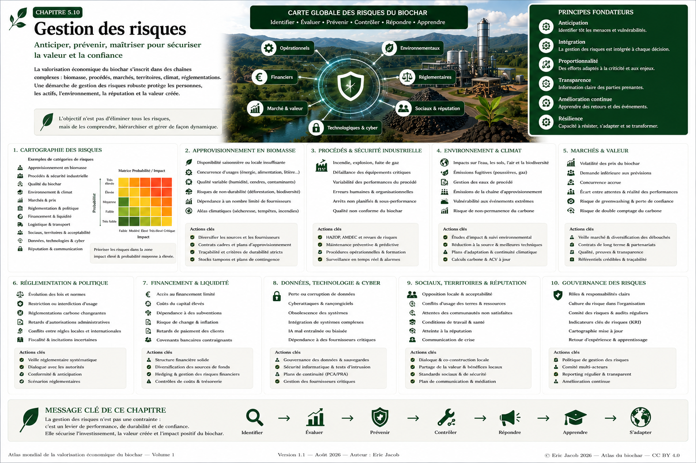

# Chapitre 5 — Gestion des risques dans la filière biochar

> **Atlas mondial de la valorisation économique du biochar — Volume 1**  
> Version 1.2 — Août 2026 · Auteur : Eric Jacob

**[← Jumeau numérique](ch5_fr_jumeau_numerique.md) · [↑ Sommaire de l’Atlas](README.md) · [Guide de l’acheteur →](ch5_fr_guide_acheteur.md)**

---

## Anticiper, prévenir, maîtriser

Le biochar ouvre des perspectives dans l’agriculture, les matériaux, l’industrie, l’énergie et le stockage durable du carbone. Son développement s’inscrit cependant dans des chaînes complexes : ressources en biomasse, procédés thermochimiques, installations industrielles, transport, marchés, territoires, réglementation et systèmes numériques.

Une filière robuste ne cherche pas à prétendre que le risque disparaît. Elle cherche à **identifier les dangers et incertitudes, réduire leur probabilité lorsque cela est possible, limiter leurs conséquences et apprendre des événements**.

<figure>

<figcaption><strong>Figure 1 — Carte globale des risques de la filière biochar.</strong> Identifier, évaluer, prévenir, contrôler, répondre et apprendre afin de protéger les personnes, les actifs, l’environnement et la valeur créée. © Eric Jacob 2026 — Atlas mondial du biochar — CC BY 4.0. <a href="ch5_fr_gestion_risques.png">Agrandir l’infographie</a></figcaption>
</figure>

---

## Pourquoi analyser les risques ?

L’objectif n’est pas de freiner l’innovation. Une gestion structurée des risques peut au contraire :

- améliorer la sécurité ;
- protéger les opérateurs et les riverains ;
- renforcer la qualité des produits ;
- réduire les arrêts et pertes d’exploitation ;
- améliorer la confiance des acheteurs et investisseurs ;
- protéger l’environnement ;
- préparer les évolutions réglementaires ;
- augmenter la résilience de la filière.

La prévention devient ainsi un facteur de performance économique autant qu’une exigence de responsabilité.

---

## Une cartographie multi-risques

| Domaine | Exemples de risques |
|---|---|
| Biomasse | pénurie, humidité, contaminants, non-durabilité |
| Technique | dérive du procédé, panne, sous-performance |
| Industriel | incendie, explosion, fuite, accident |
| Qualité | biochar non conforme, variabilité |
| Environnement | eau, sols, air, biodiversité |
| Climatique | sécheresse, tempête, inondation, incendie |
| Logistique | rupture d’approvisionnement, transport |
| Marché | prix, demande, concurrence |
| Financier | financement, liquidité, change, taux |
| Réglementaire | normes, autorisations, fiscalité |
| Numérique | cyberattaque, données altérées |
| Social | acceptabilité, conflits d’usage |
| Réputation | perte de confiance, allégations non démontrées |

Ces catégories sont interdépendantes. Une sécheresse peut réduire la ressource, augmenter son prix, perturber la production et fragiliser un contrat.

---

## De l’identification à l’adaptation

```text
IDENTIFIER
    ↓
ÉVALUER
    ↓
PRÉVENIR
    ↓
RÉDUIRE / TRANSFÉRER
    ↓
SURVEILLER
    ↓
RÉPONDRE
    ↓
ANALYSER LE RETOUR D'EXPÉRIENCE
    ↓
ADAPTER
    ↺
```

La gestion des risques est donc un processus continu.

---

## Probabilité, gravité et criticité

Une première hiérarchisation peut combiner probabilité $P$ et gravité $G$ :

$C = P \times G$

où $C$ représente un indice de criticité interne.

Cette relation est un **outil de classement**, pas une loi physique. Les échelles de $P$ et $G$, les seuils et les règles de décision doivent être explicitement définis.

Un événement très rare mais catastrophique peut nécessiter des mesures fortes même si une multiplication simplifiée lui attribue un score comparable à un événement fréquent mais mineur.

---

## Au-delà d’une matrice simple

Pour certains projets, l’analyse peut également considérer :

- détectabilité ;
- vitesse d’apparition ;
- durée des conséquences ;
- réversibilité ;
- population exposée ;
- interdépendances ;
- capacité de récupération ;
- incertitude sur l’évaluation.

Une matrice colorée facilite la communication, mais elle ne remplace ni l’expertise technique ni les études réglementaires requises.

---

## Risques liés à l’approvisionnement en biomasse

Toutes les biomasses n’ont pas la même disponibilité ni la même qualité.

Les principaux points de vigilance comprennent :

- saisonnalité ;
- humidité excessive ;
- hétérogénéité ;
- contamination ;
- distance de collecte ;
- évolution des usages concurrents ;
- dépendance à un petit nombre de fournisseurs ;
- événements climatiques ;
- changement d’affectation des terres ;
- surexploitation des résidus.

Une ressource théorique ne doit pas être assimilée à une ressource durablement mobilisable.

```text
RESSOURCE THÉORIQUE
− BESOINS ÉCOLOGIQUES
− USAGES EXISTANTS
− CONTRAINTES TECHNIQUES
− ZONES NON MOBILISABLES
= RESSOURCE POTENTIELLEMENT DISPONIBLE
```

La diversification des sources et les contrats d’approvisionnement peuvent réduire certains risques, sans justifier l’exploitation de ressources écologiquement nécessaires.

---

## Contaminants des biomasses

La composition initiale influence le produit final.

Selon l’origine, il peut être nécessaire de rechercher ou surveiller :

- métaux ;
- sels ;
- composés indésirables ;
- contamination par des déchets ;
- matériaux étrangers ;
- éléments minéraux concentrés lors de la conversion.

Les biomasses complexes ou nouvelles doivent faire l’objet d’une caractérisation adaptée avant industrialisation.

---

## Risques du procédé thermochimique

Une unité doit maîtriser notamment :

- températures ;
- débits ;
- pressions lorsque pertinentes ;
- gaz combustibles ;
- atmosphères pauvres en oxygène ;
- poussières ;
- surfaces chaudes ;
- alimentation en biomasse ;
- évacuation du biochar ;
- automatismes ;
- émissions.

La conception de sécurité dépend du procédé réel. Les prescriptions applicables doivent être établies par les professionnels compétents et selon la réglementation du site.

---

## Incendie et auto-échauffement

Un matériau carboné chaud ou mal refroidi peut présenter un risque d’incendie. Le stockage doit prendre en compte l’état du biochar, sa température, son humidité, sa granulométrie, la ventilation, les volumes et les conditions locales.

Les mesures industrielles peuvent notamment inclure, selon le contexte :

- refroidissement maîtrisé ;
- surveillance des températures ;
- séparation des zones ;
- détection ;
- moyens d’extinction adaptés ;
- procédures d’urgence ;
- formation.

L’Atlas ne fixe pas de seuil universel : ceux-ci dépendent des produits, installations et réglementations applicables.

---

## Poussières et atmosphères dangereuses

La manipulation de matériaux secs et fins peut générer des poussières.

Le risque dépend des propriétés du matériau, de sa concentration dans l’air, des sources d’ignition et de la configuration de l’installation. Il doit être évalué dans le cadre de l’analyse de sécurité du site.

Captage, nettoyage, limitation des accumulations et conception adaptée des équipements font partie des moyens de prévention possibles.

---

## Maintenance et disponibilité

Une panne peut provoquer :

- arrêt de production ;
- perte de matière ;
- non-respect de contrats ;
- baisse de qualité ;
- augmentation des coûts ;
- situation de sécurité dégradée.

Une stratégie de maintenance peut combiner :

```text
PRÉVENTIVE + CONDITIONNELLE + PRÉDICTIVE + CORRECTIVE
```

Le **[Jumeau numérique](ch5_fr_jumeau_numerique.md)** peut contribuer à détecter certaines dérives, sans remplacer les dispositifs de sécurité indépendants.

---

## Qualité du biochar

Un biochar insuffisamment caractérisé peut entraîner :

- efficacité réduite ;
- résultats variables ;
- incompatibilité avec un usage ;
- difficultés de certification ;
- litiges ;
- perte de confiance.

La qualité doit être reliée au lot, aux analyses et à l’usage.

Le **[Passeport numérique](ch5_fr_passeport_biochar.md)** et la **[Métrologie du carbone](ch5_fr_metrologie_carbone.md)** constituent deux briques complémentaires de cette traçabilité.

---

## Risques chimiques

Selon la biomasse et le procédé, la caractérisation peut devoir prendre en compte notamment :

- hydrocarbures aromatiques polycycliques ;
- métaux et éléments traces ;
- composés volatils résiduels ;
- pH ;
- sels ;
- contaminants spécifiques à la matière première.

L’existence d’un risque dépend de la concentration, de l’exposition et de l’usage. Un résultat analytique doit donc être interprété selon les référentiels appropriés.

---

## Agriculture : éviter la logique « un biochar pour tous »

Avant une utilisation agronomique importante, il convient de considérer :

- caractéristiques du sol ;
- pH ;
- culture ;
- climat ;
- dose ;
- granulométrie ;
- formulation ;
- contaminants ;
- interactions avec composts, fertilisants et autres amendements.

Un biochar utile dans un contexte peut être neutre ou inadapté dans un autre.

Des essais progressifs et documentés permettent de réduire l’incertitude avant un déploiement à grande échelle.

---

## Eau et environnement

Les impacts potentiels doivent être étudiés sur l’ensemble de la chaîne :

```text
BIOMASSE
→ COLLECTE
→ TRANSPORT
→ PRÉTRAITEMENT
→ CONVERSION
→ CONDITIONNEMENT
→ TRANSPORT
→ USAGE
→ FIN DE VIE ÉVENTUELLE
```

L’**[Analyse du cycle de vie](ch4_fr_analyse_cycle_vie.md)** aide à éviter de déplacer un impact d’une étape vers une autre.

Les points de vigilance peuvent concerner eau, sols, air, biodiversité, émissions, consommation énergétique et transport.

---

## Risques climatiques physiques

Les installations et chaînes d’approvisionnement peuvent être exposées à :

- sécheresses ;
- vagues de chaleur ;
- incendies ;
- tempêtes ;
- inondations ;
- glissements de terrain ;
- modification des rendements agricoles ou forestiers.

Une stratégie robuste doit envisager la continuité d’activité et la diversification lorsque le contexte le justifie.

---

## Permanence du carbone

Le risque climatique ne concerne pas uniquement la quantité de carbone mesurée, mais aussi sa permanence.

Il faut distinguer :

```text
CARBONE MESURÉ
≠
CARBONE DURABLE ESTIMÉ
≠
RETRAIT NET
≠
RETRAIT CERTIFIÉ
```

Les hypothèses de stabilité et les règles du référentiel doivent rester visibles. Cette question est détaillée dans la **[Métrologie du carbone](ch5_fr_metrologie_carbone.md)**.

---

## Risque de double comptage

Une même quantité de carbone ne doit pas être revendiquée plusieurs fois par des acteurs incompatibles.

Le suivi des lots, certificats, transactions et retraits constitue donc un risque de gouvernance autant qu’un risque commercial.

L’**[Observatoire mondial](ch5_fr_observatoire_mondial.md)** et les infrastructures de traçabilité proposées dans l’Atlas visent précisément à améliorer cette lisibilité.

---

## Construction et matériaux

Dans les matériaux, les risques peuvent concerner :

- résistance mécanique ;
- compatibilité avec les liants ;
- humidité ;
- vieillissement ;
- durabilité ;
- comportement au feu ;
- émissions éventuelles ;
- reproductibilité des formulations.

Chaque formulation doit être validée selon l’usage visé et les règles applicables. Une performance observée dans un prototype ne doit pas être généralisée automatiquement à tous les matériaux contenant du biochar.

---

## Risques de marché

Le marché du biochar reste en développement et peut connaître :

- volatilité des prix ;
- demande inférieure aux prévisions ;
- concurrence ;
- segmentation rapide des qualités ;
- évolution des primes associées au carbone ;
- apparition de nouveaux procédés ;
- attentes différentes selon les usages.

La diversification des débouchés peut améliorer la résilience lorsqu’elle correspond à des marchés réels.

---

## Risque de modèle économique

Un projet peut sembler rentable si plusieurs hypothèses favorables sont cumulées :

```text
PRIX ÉLEVÉ DU BIOCHAR
+ CRÉDIT CARBONE ÉLEVÉ
+ ÉNERGIE VALORISÉE À 100 %
+ DISPONIBILITÉ MAXIMALE
+ COÛT LOGISTIQUE FAIBLE
```

Une analyse prudente doit tester des scénarios dégradés.

Le **[Guide de l’investisseur](ch5_fr_guide_investisseur.md)** complète cette approche.

---

## Sensibilité et scénarios

Pour une variable économique $x$, une analyse peut comparer plusieurs hypothèses :

```text
SCÉNARIO BAS
SCÉNARIO CENTRAL
SCÉNARIO HAUT
```

L’objectif n’est pas de prédire exactement l’avenir mais de déterminer les variables auxquelles le projet est le plus sensible.

Des scénarios combinés sont nécessaires lorsque plusieurs risques sont corrélés.

---

## Financement et liquidité

Les risques peuvent inclure :

- coût du capital ;
- accès au financement ;
- retard de mise en service ;
- dépassement de budget ;
- besoin en fonds de roulement ;
- retard de paiement ;
- dépendance aux aides ;
- change et taux d’intérêt ;
- clauses contractuelles.

Un projet industriel rentable à long terme peut néanmoins échouer par manque de liquidité à court terme.

---

## Réglementation

Le cadre peut évoluer concernant :

- statut des biomasses ;
- déchets et sous-produits ;
- autorisations industrielles ;
- émissions ;
- usages agricoles ;
- matériaux ;
- crédits carbone ;
- transport ;
- fiscalité ;
- sécurité.

La veille réglementaire doit être continue et adaptée aux juridictions concernées.

---

## Risque d’allégation et de réputation

La communication peut créer un risque lorsqu’elle transforme :

- une hypothèse en fait ;
- un résultat de laboratoire en performance universelle ;
- un projet en installation opérationnelle ;
- un carbone physique en retrait certifié ;
- une émission potentiellement évitée en réduction garantie.

La transparence sur le statut des données protège la crédibilité de la filière.

> **Une promesse excessive peut détruire plus de confiance qu’une incertitude correctement expliquée.**

---

## Acceptabilité territoriale

Même un projet techniquement performant peut rencontrer une opposition locale.

Les préoccupations peuvent concerner :

- trafic ;
- bruit ;
- poussières ;
- paysage ;
- prélèvement de biomasse ;
- sécurité ;
- partage de la valeur ;
- confiance envers l’opérateur.

Une concertation précoce, des données accessibles et des bénéfices locaux clairement documentés peuvent réduire certains conflits.

---

## Risques sociaux et chaîne d’approvisionnement

La durabilité doit aussi considérer les conditions de travail, la sécurité des fournisseurs, les droits d’usage et les impacts sur les communautés.

La recherche du coût minimal ne doit pas déplacer les risques humains ou environnementaux vers les maillons les moins visibles de la chaîne.

---

## Cybersécurité

La numérisation croissante expose :

- capteurs ;
- automates ;
- réseaux industriels ;
- bases de données ;
- passeports numériques ;
- systèmes de supervision ;
- modèles et jumeaux numériques.

Les risques incluent perte de données, altération, rançongiciel, accès non autorisé ou manipulation de mesures.

Les systèmes critiques doivent pouvoir conserver un fonctionnement sûr même si une couche numérique non essentielle devient indisponible.

---

## Dépendance technologique

Un projet peut devenir vulnérable à :

- fournisseur unique ;
- logiciel propriétaire non exportable ;
- composant rare ;
- cloud unique ;
- format de données fermé ;
- compétence détenue par quelques personnes.

Interopérabilité, documentation, stocks critiques, contrats de support et capacité de reprise réduisent ces dépendances.

---

## Intelligence artificielle et modèles

Un modèle peut être faux tout en produisant une sortie très précise.

Les risques incluent :

- données d’entraînement non représentatives ;
- dérive ;
- extrapolation hors domaine ;
- corrélation interprétée comme causalité ;
- automatisation excessive ;
- absence d’explication.

Le modèle doit conserver version, hypothèses, données d’entrée, domaine de validité et indicateurs d’incertitude.

---

## Gouvernance des risques

Une politique robuste définit :

- responsabilités ;
- propriétaire de chaque risque ;
- seuils d’alerte ;
- fréquence de revue ;
- procédures d’escalade ;
- plans de continuité ;
- communication de crise ;
- retour d’expérience.

Les risques importants ne doivent pas être « la responsabilité de tout le monde », ce qui revient souvent à n’être celle de personne.

---

## Registre des risques

Un registre peut contenir :

| Champ | Fonction |
|---|---|
| Identifiant | suivre le risque dans le temps |
| Description | définir précisément l’événement |
| Cause | comprendre son origine |
| Conséquence | décrire l’impact |
| Probabilité | estimer la fréquence ou vraisemblance |
| Gravité | estimer les conséquences |
| Contrôles existants | documenter les protections |
| Risque résiduel | évaluer après contrôles |
| Responsable | attribuer le suivi |
| Action | réduire ou surveiller |
| Échéance | piloter la mise en œuvre |
| Statut | ouvert, surveillé, traité, accepté |

Le registre doit être vivant et versionné.

---

## Indicateurs de risque

Des **KRI — Key Risk Indicators** peuvent signaler une dérive avant un événement.

Exemples :

- humidité anormale de la biomasse ;
- hausse des arrêts ;
- dérive d’une température ;
- baisse de rendement ;
- augmentation des non-conformités ;
- concentration des fournisseurs ;
- stock de sécurité insuffisant ;
- retard de paiement ;
- multiplication des alertes cyber.

Un KRI doit être associé à une règle de réaction, faute de quoi il devient un simple indicateur décoratif.

---

## Plans de continuité

Il faut envisager certains scénarios avant qu’ils surviennent :

```text
FOURNISSEUR INDISPONIBLE
PANNE MAJEURE
INCENDIE
COUPURE ÉLECTRIQUE
CYBERATTAQUE
RUPTURE LOGISTIQUE
ÉVÉNEMENT CLIMATIQUE
```

Le plan peut définir responsabilités, moyens alternatifs, sauvegardes, communication et conditions de reprise.

---

## Retour d’expérience

Après incident, anomalie ou quasi-accident, la question utile n’est pas seulement « qui a commis l’erreur ? ».

Il faut rechercher :

```text
QUE S'EST-IL PASSÉ ?
POURQUOI ?
QUELLES BARRIÈRES ONT ÉCHOUÉ ?
QU'EST-CE QUI A LIMITÉ LES CONSÉQUENCES ?
QUE MODIFIER ?
COMMENT VÉRIFIER L'EFFICACITÉ ?
```

Les quasi-accidents peuvent fournir des informations précieuses avant qu’un événement grave ne survienne.

---

## Gestion des risques à l’échelle mondiale

Avec la croissance de la filière, l’**[Observatoire mondial](ch5_fr_observatoire_mondial.md)** pourrait agréger des informations anonymisées sur :

- types d’incidents ;
- non-conformités ;
- facteurs de risque ;
- effets climatiques ;
- ruptures d’approvisionnement ;
- tendances réglementaires ;
- bonnes pratiques.

L’objectif ne serait pas de classer publiquement les entreprises sur la base de données incomplètes, mais d’identifier des tendances utiles à toute la filière.

---

## Ce que la gestion des risques ne doit pas devenir

Elle ne doit pas servir à :

- bloquer toute innovation parce qu’elle comporte une incertitude ;
- créer une bureaucratie sans effet opérationnel ;
- masquer les risques derrière un score unique ;
- remplacer les obligations réglementaires ;
- transformer des hypothèses en garanties ;
- considérer que l’absence d’incident passé prouve l’absence de risque futur.

> **Le risque zéro n’existe pas ; l’impréparation n’est pas une stratégie.**

---

## Une culture de prévention

La robustesse vient autant des comportements que des procédures.

Une culture de prévention encourage :

- remontée des anomalies ;
- droit de signaler un danger ;
- formation ;
- partage du retour d’expérience ;
- révision des hypothèses ;
- apprentissage entre sites ;
- responsabilité claire.

La transparence sur les difficultés peut devenir une force lorsqu’elle conduit à leur résolution.

---

## Perspectives

À mesure que la filière se développera, les méthodes de gestion des risques pourront gagner en maturité grâce :

- aux retours d’expérience internationaux ;
- aux données de l’Observatoire ;
- aux essais interlaboratoires ;
- aux jumeaux numériques ;
- aux référentiels communs ;
- à la recherche sur les biomasses et usages ;
- à l’amélioration des méthodes de mesure.

La standardisation utile ne doit pas figer l’innovation : elle doit fournir un langage commun pour comprendre et réduire les risques.

---

## Conclusion

La réussite de la filière biochar dépendra autant de sa capacité d’innovation que de sa capacité à anticiper les difficultés.

Une gestion rigoureuse des risques protège simultanément :

```text
PERSONNES
+ INSTALLATIONS
+ ENVIRONNEMENT
+ QUALITÉ
+ CARBONE
+ TERRITOIRES
+ CAPITAL
+ RÉPUTATION
```

Elle ne diminue pas l’ambition de la filière. Elle rend cette ambition **plus crédible, plus durable et plus résiliente**.

> **Prévenir n’est pas renoncer à agir : c’est augmenter les chances de réussir durablement.**

---

## Figure et documents associés

- [Infographie — Gestion des risques](ch5_fr_gestion_risques.png)
- [Jumeau numérique](ch5_fr_jumeau_numerique.md)
- [Métrologie du carbone](ch5_fr_metrologie_carbone.md)
- [Passeport numérique](ch5_fr_passeport_biochar.md)
- [Analyse du cycle de vie](ch4_fr_analyse_cycle_vie.md)
- [Observatoire mondial](ch5_fr_observatoire_mondial.md)
- [Guide de l’investisseur](ch5_fr_guide_investisseur.md)
- [Matrice des risques — SVG](ch5_fr_matrice_risques.svg)
- [Cycle du risque — SVG](ch5_fr_cycle_risque.svg)
- [Sources de risques — SVG](ch5_fr_sources_risques.svg)
- [Analyse de criticité — SVG](ch5_fr_analyse_criticite.svg)
- [Prévention — SVG](ch5_fr_prevention.svg)

---

**[← Jumeau numérique](ch5_fr_jumeau_numerique.md) · [↑ Sommaire de l’Atlas](README.md) · [Guide de l’acheteur →](ch5_fr_guide_acheteur.md)**

---

*Atlas mondial de la valorisation économique du biochar — Eric Jacob — Version 1.2 — 2026*  
*Licence : Creative Commons CC BY 4.0*
