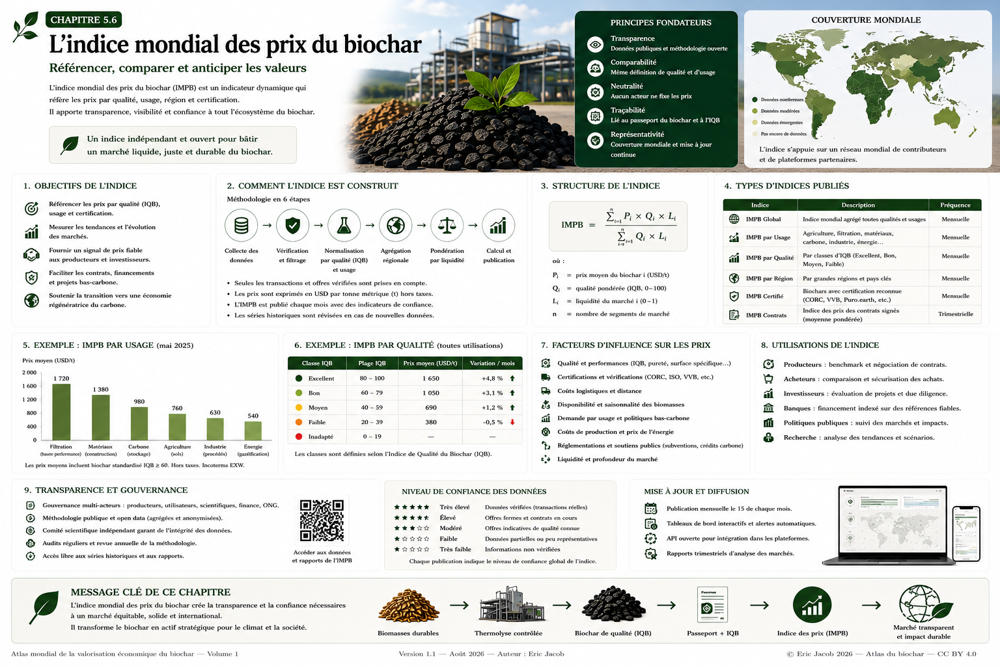

# Chapitre 5.6 — Indice mondial des prix du biochar

> **Atlas mondial de la valorisation économique du biochar — Volume 1**  
> Version 1.2 — Août 2026 · Auteur : Eric Jacob

**[← Bourse du biochar](ch5_fr_bourse_biochar.md) · [↑ Sommaire de l’Atlas](README.md) · [Consortium mondial →](ch5_fr_consortium_mondial.md)**

---

## Mesurer un marché sans inventer un prix universel

Le développement mondial du biochar crée un paradoxe : les prix circulent de plus en plus, mais ils restent difficiles à comparer.

Une tonne vendue pour l'agriculture locale, une tonne de carbone très poreux destinée à la filtration et une tonne associée à un retrait carbone certifié ne représentent pas le même produit économique.

L'Atlas propose donc un **Indice mondial des prix du biochar (IMPB)** fondé sur des transactions et offres suffisamment documentées, segmentées par qualité, usage, région et conditions commerciales.

L'objectif n'est pas de fixer les prix.

> **L'objectif est de rendre les prix observables, comparables et explicables.**

<figure>
  
  <figcaption>
    <strong>Figure 1 — Indice mondial des prix du biochar : référencer, comparer et suivre les marchés.</strong>
    Les valeurs, graphiques, cartes et exemples numériques visibles dans l'infographie sont illustratifs et ne constituent pas des cotations réelles.
    © Eric Jacob 2026 — Atlas mondial du biochar — CC BY 4.0.
    <a href="ch5_fr_indice_prix_mondial.png">Agrandir l’infographie</a>
  </figcaption>
</figure>

---

## Pourquoi un indice mondial ?

Sans référence structurée, plusieurs acteurs peuvent observer simultanément :

- des prix agricoles relativement bas ;
- des biochars spécialisés beaucoup plus chers ;
- des primes liées à une certification ;
- des valeurs carbone séparées ou intégrées ;
- des différences considérables entre régions ;
- des coûts de transport parfois supérieurs à la valeur départ usine.

Publier une simple moyenne mondiale mélangerait ces réalités.

L'IMPB doit donc fonctionner comme une **famille d'indices**.

---

## La donnée de base : une transaction documentée

Chaque observation doit contenir suffisamment d'informations pour être interprétable.

Exemple conceptuel :

```text
date
pays / région
usage
masse
prix
devise
Incoterm / conditions de livraison
conditionnement
IQB ou données de qualité
certification
attribut carbone inclus ? oui/non
distance ou zone logistique
transaction / offre
niveau de confiance
```

Une valeur `800 €/t` sans ces informations est difficilement exploitable.

---

## Transactions et offres ne valent pas la même chose

Un prix affiché par un vendeur n'est pas nécessairement un prix réellement payé.

L'Atlas propose donc de distinguer :

```text
T1 — transaction vérifiée
T2 — contrat vérifié mais prix partiellement confidentiel
O1 — offre ferme
O2 — prix catalogue
E  — estimation / enquête
```

L'indice principal devrait donner davantage de poids aux transactions réelles.

Les autres données peuvent enrichir l'analyse lorsque les marchés sont encore peu liquides.

---

## Une famille d'indices

L'architecture pourrait comprendre :

| Indice | Fonction |
|---|---|
| **IMPB-G** | agrégat mondial |
| **IMPB-A** | agriculture |
| **IMPB-F** | filtration |
| **IMPB-M** | matériaux |
| **IMPB-I** | industrie |
| **IMPB-C** | biochar associé au carbone |
| **IMPB-R** | indices régionaux |
| **IMPB-Q** | indices par classe de qualité |

Les noms sont des propositions de travail de l'Atlas.

Le plus important est que chaque série corresponde à une population clairement définie.

---

## Segmenter avant d'agréger

Une méthodologie robuste commence par créer des segments homogènes :

```text
TRANSACTIONS
    ↓
USAGE
    ↓
QUALITÉ
    ↓
RÉGION
    ↓
CONDITIONS COMMERCIALES
    ↓
SEGMENT COMPARABLE
```

Ce n'est qu'ensuite que plusieurs segments peuvent être agrégés.

Cette règle évite qu'un petit volume de biochar très spécialisé fasse artificiellement monter le prix supposé du biochar agricole mondial.

---

## L'IQB comme variable de normalisation

L'**[Indice de qualité du biochar](ch5_fr_indice_qualite.md)** peut fournir une information utile pour expliquer une partie des différences de prix.

On peut rechercher statistiquement :

\[
P = f(Q,U,R,V,L,C,\ldots)
\]

où :

- \(P\) = prix ;
- \(Q\) = qualité ;
- \(U\) = usage ;
- \(R\) = région ;
- \(V\) = volume ;
- \(L\) = logistique ;
- \(C\) = certification ou attribut carbone.

Le but n'est pas d'imposer cette fonction au marché, mais de comprendre les variables qui expliquent les transactions.

---

## Une moyenne pondérée simple

Pour un segment suffisamment homogène, un premier indice peut utiliser :

\[
I_t = \frac{\sum_{i=1}^{n} P_i V_i W_i}{\sum_{i=1}^{n} V_i W_i}
\]

avec :

- \(P_i\) : prix normalisé de la transaction ;
- \(V_i\) : volume ;
- \(W_i\) : poids de confiance ou de représentativité.

Ainsi, une vente de 100 tonnes pèse davantage qu'un échantillon de 100 kg, sans permettre à une transaction gigantesque de dominer nécessairement tout l'indice si des plafonds de pondération sont appliqués.

---

## Médiane et moyenne tronquée

Les marchés jeunes comportent souvent des valeurs extrêmes.

Il est donc utile de publier plusieurs statistiques :

- moyenne pondérée ;
- médiane ;
- quartiles ;
- fourchette ;
- volume observé ;
- nombre de transactions.

Une moyenne tronquée peut exclure les extrêmes selon une règle publiée.

Le lecteur peut alors distinguer **niveau central et dispersion**.

---

## Convertir les devises

Un indice mondial doit convertir les monnaies selon une méthode stable.

Chaque observation conserve :

```text
prix original
devise originale
date
taux de conversion utilisé
prix normalisé
```

Les séries historiques ne doivent pas perdre les données originales.

Cette traçabilité permet de recalculer ultérieurement l'indice avec une méthodologie différente.

---

## Normaliser les unités

Les offres peuvent être exprimées :

- par tonne ;
- par kilogramme ;
- par m³ ;
- par sac ;
- par palette.

Le prix massique exige une masse réellement connue.

Pour les produits vendus au volume, la densité doit être mesurée ou documentée avant conversion.

Une estimation de densité insuffisante doit réduire le niveau de confiance.

---

## Séparer départ usine et livraison

Deux séries peuvent être nécessaires :

### IMPB-EXW

Référence proche du prix départ producteur.

### IMPB-DEL

Prix livré sur une zone ou une distance définie.

Cette distinction est particulièrement importante pour le biochar, dont la densité et la géographie peuvent rendre le transport déterminant.

---

## Un indice de proximité

L'Atlas propose également un indicateur complémentaire :

> **prix du meilleur lot compatible dans un rayon donné.**

Pour un acheteur agricole :

```text
IQB-A ≥ 70
rayon ≤ 150 km
volume ≥ 10 t
certification requise
```

Le moteur peut calculer le prix livré médian des lots répondant réellement au besoin.

Cet indicateur territorial peut être plus utile qu'une moyenne mondiale.

---

## Le carbone doit rester identifiable

Lorsque le prix inclut un certificat ou attribut de retrait carbone, cette information doit être séparée.

On peut publier :

```text
prix biochar physique
+
valeur attribut carbone
=
prix contractuel total
```

Si la séparation contractuelle n'est pas disponible, la transaction est marquée comme telle.

Cela évite d'interpréter une hausse du prix du carbone comme une hausse de la valeur matérielle du biochar.

---

## Qualité de la donnée

Chaque publication devrait afficher un niveau de confiance.

Par exemple :

| Niveau | Interprétation |
|---|---|
| **A** | nombreuses transactions vérifiées |
| **B** | transactions suffisantes et représentatives |
| **C** | données limitées mais exploitables |
| **D** | offres et estimations dominantes |
| **E** | données insuffisantes |

Ainsi :

```text
IMPB-A Europe : 642 €/t
Confiance : B
Volume observé : 8 420 t
```

est beaucoup plus informatif que :

```text
Prix du biochar : 642 €/t
```

---

## Ne pas publier quand on ne sait pas

L'une des règles les plus importantes d'un indice crédible est la possibilité de dire :

> **données insuffisantes.**

Un chiffre artificiel donne une illusion de précision et peut influencer des contrats.

Une case vide correctement expliquée est scientifiquement préférable à une cotation inventée.

---

## Couverture géographique

La carte mondiale doit représenter non seulement les prix mais aussi **la densité des données**.

Une région avec trois observations ne doit pas sembler aussi fiable qu'une région avec plusieurs milliers de tonnes documentées.

L'Atlas recommande donc d'afficher simultanément :

```text
PRIX
VOLUME
NOMBRE D'OBSERVATIONS
CONFIANCE
```

---

## Fréquence de publication

Une publication mensuelle semble raisonnable pour un marché encore peu liquide.

À mesure que les volumes augmentent, certains segments pourraient devenir hebdomadaires.

Une fréquence quotidienne n'a de sens que si elle repose sur suffisamment de transactions.

La vitesse de publication ne doit jamais dépasser la vitesse réelle du marché.

---

## Révisions

Les statistiques peuvent être révisées lorsqu'une transaction est corrigée ou qu'une nouvelle information apparaît.

Chaque série doit conserver :

```text
valeur initiale
date de publication
révision
raison
version méthodologique
```

Les révisions ne doivent jamais être silencieuses.

---

## Méthodologie publique

Pour être crédible, l'IMPB doit publier :

- critères d'inclusion ;
- critères d'exclusion ;
- segmentation ;
- traitement des devises ;
- traitement du transport ;
- pondérations ;
- gestion des extrêmes ;
- seuil minimal de publication ;
- méthode de révision.

Un acteur doit pouvoir reproduire approximativement le calcul à partir du même jeu de données.

---

## Gouvernance indépendante

L'opérateur d'une **[Bourse du biochar](ch5_fr_bourse_biochar.md)** peut fournir une grande quantité de données, mais il ne devrait pas contrôler seul la méthodologie.

Une gouvernance multi-acteurs pourrait associer :

- producteurs ;
- acheteurs ;
- laboratoires ;
- statisticiens ;
- scientifiques ;
- acteurs publics ;
- finance ;
- utilisateurs finaux.

Un comité méthodologique indépendant peut surveiller les changements.

---

## Prévenir la manipulation

Un indice de prix peut devenir une cible économique.

Les protections doivent rechercher :

- transactions entre parties liées ;
- achats fictifs ;
- fractionnement artificiel ;
- prix extrêmes ;
- volumes incohérents ;
- doublons ;
- opérations annulées ;
- wash trading ;
- données volontairement retardées.

Les observations suspectes peuvent être exclues ou placées en quarantaine jusqu'à vérification.

---

## Confidentialité

Les entreprises ne voudront pas toujours publier leurs contrats.

L'indice peut donc travailler sur des données anonymisées.

Le public voit :

```text
segment
région
prix agrégé
volume agrégé
dispersion
confiance
```

L'auditeur autorisé peut accéder aux preuves nécessaires.

Cette séparation protège le secret commercial tout en permettant une référence publique.

---

## Un indice n'est pas un prix obligatoire

L'IMPB doit être explicitement présenté comme une **référence**.

Un contrat peut être :

```text
IMPB-A France
+ prime qualité
+ transport
+ conditionnement
```

ou totalement indépendant de l'indice.

La publication d'une référence ne doit pas empêcher deux acteurs de négocier librement.

---

## Indexer les contrats

Les contrats de plusieurs années peuvent utiliser une formule :

\[
P_t = P_0 \times \frac{IMPB_t}{IMPB_0}
\]

ou une formule plus complète intégrant énergie, inflation, transport et qualité.

Cette possibilité réduit le risque de fixer aujourd'hui un prix qui deviendrait irréaliste dans trois ans.

---

## Aider au financement des unités

Une banque ou un investisseur peut difficilement financer une installation si personne ne connaît la valeur probable de sa production.

Des indices historiques permettent d'étudier :

- volatilité ;
- prime de qualité ;
- profondeur du marché ;
- demande régionale ;
- scénarios de revenus.

L'IMPB peut donc devenir une infrastructure financière indirecte de la filière.

---

## Aider les agriculteurs et acheteurs

Un acheteur peut savoir si une proposition est cohérente avec :

- qualité ;
- région ;
- volume ;
- certification ;
- livraison.

Il ne s'agit pas de chercher systématiquement le moins cher.

Un biochar plus cher peut être économiquement supérieur si une dose plus faible ou une meilleure performance produit davantage de valeur.

---

## Prix par fonction rendue

À terme, le marché pourrait dépasser le prix à la tonne.

Pour certains usages, des indicateurs plus intelligents seraient :

```text
€/m³ d'eau effectivement retenue
€/kg de contaminant adsorbé
€/tCO₂e durablement retirée
€/unité de performance du matériau
€/ha pour un résultat agronomique mesuré
```

Ces métriques sont plus difficiles à établir mais rapprochent le prix de la **fonction réelle**.

---

## Retour terrain et correction de valeur

Le **Passeport numérique** peut relier les performances après usage au lot.

Si certaines familles de biochars démontrent régulièrement de meilleures performances, le marché peut progressivement leur attribuer une prime.

La chaîne devient :

```text
TRANSACTION
    ↓
USAGE
    ↓
RÉSULTAT
    ↓
DONNÉE
    ↓
MEILLEURE COMPRÉHENSION DE LA VALEUR
```

Le prix cesse progressivement de dépendre uniquement du marketing.

---

## IA et détection des anomalies

Une intelligence artificielle peut rechercher :

- prix anormaux ;
- doublons ;
- incohérences de qualité ;
- changements brusques ;
- erreurs de conversion ;
- groupes de transactions suspectes.

Elle peut également produire des prévisions.

Mais les prévisions doivent être clairement séparées des observations.

```text
INDICE OBSERVÉ ≠ PRÉVISION
```

Cette distinction doit rester visible dans toutes les interfaces.

---

## Prévisions

Des scénarios peuvent intégrer :

- nouvelles capacités ;
- prix de l'énergie ;
- demande agricole ;
- réglementation ;
- marchés carbone ;
- matériaux bas-carbone ;
- disponibilité des biomasses.

Les résultats doivent être publiés sous forme de scénarios et d'intervalles, pas comme certitudes.

---

## Un observatoire public du marché

L'IMPB pourrait alimenter un tableau de bord ouvert :

```text
CARTE MONDIALE
PRIX PAR USAGE
PRIX PAR QUALITÉ
VOLUMES
CAPACITÉS
CONFIANCE
ÉVOLUTION
```

Les données détaillées sensibles resteraient protégées.

Cette architecture rejoint l'**[Observatoire mondial](ch5_fr_observatoire_mondial.md)** prévu dans l'Atlas.

---

## Exemple de publication

Une fiche mensuelle pourrait ressembler à :

```text
IMPB — JUILLET 2027

Agriculture Europe
médiane : 610 €/t
Q1–Q3 : 480–790 €/t
volume observé : 11 800 t
confiance : B+

Filtration Europe
médiane : 1 320 €/t
Q1–Q3 : 980–1 740 €/t
volume observé : 2 100 t
confiance : C+

Les valeurs ci-dessus sont un exemple de format,
pas des données réelles.
```

Le lecteur comprend immédiatement la différence entre niveau de prix et solidité statistique.

---

## De l'indice au marché mature

La maturation peut suivre plusieurs étapes :

```text
PRIX ANECDOTIQUES
      ↓
COLLECTE STRUCTURÉE
      ↓
PASSEPORTS
      ↓
SEGMENTATION
      ↓
INDICES
      ↓
CONTRATS INDEXÉS
      ↓
FINANCEMENT
      ↓
MARCHÉ PLUS PROFOND
```

L'indice ne crée pas à lui seul le marché.

Il réduit l'opacité qui ralentit son développement.

---

## À retenir

> **Il n'existe pas un prix mondial du biochar. Il peut en revanche exister une méthodologie mondiale permettant de comparer des prix qui ont un sens.**

La qualité doit être connue.

L'usage doit être connu.

La géographie doit être connue.

Les conditions commerciales doivent être connues.

Et chaque chiffre doit indiquer **la quantité et la qualité des données qui le soutiennent**.

C'est à cette condition qu'un indice mondial peut devenir une référence plutôt qu'une nouvelle source de confusion.

---

## Continuer la lecture

**[← Bourse du biochar](ch5_fr_bourse_biochar.md) · [↑ Sommaire de l’Atlas](README.md) · [Consortium mondial →](ch5_fr_consortium_mondial.md)**

À consulter également : [Passeport numérique](ch5_fr_passeport_biochar.md) · [Indice de qualité](ch5_fr_indice_qualite.md) · [Observatoire mondial](ch5_fr_observatoire_mondial.md) · [Métrologie carbone](ch5_fr_metrologie_carbone.md)

---

*Atlas mondial de la valorisation économique du biochar — Eric Jacob — Version 1.2 — 2026*  
*Licence : Creative Commons CC BY 4.0*
