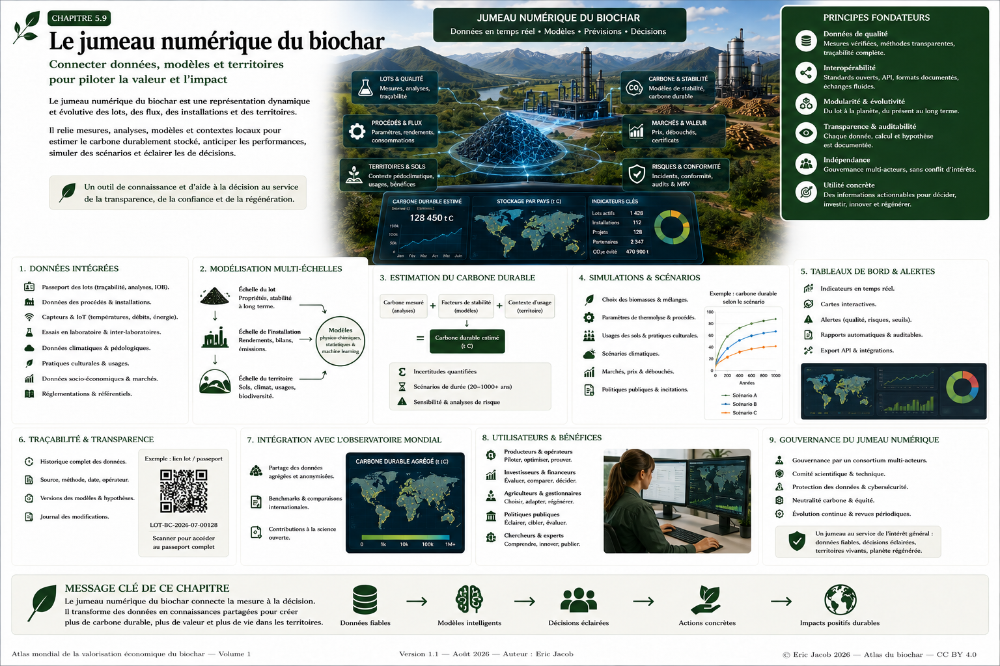

# Chapitre 5 — Le jumeau numérique de la filière biochar

> **Atlas mondial de la valorisation économique du biochar — Volume 1**  
> Version 1.2 — Août 2026 · Auteur : Eric Jacob

**[← Métrologie du carbone](ch5_fr_metrologie_carbone.md) · [↑ Sommaire de l’Atlas](README.md) · [Observatoire mondial →](ch5_fr_observatoire_mondial.md)**

---

## Connecter données, modèles et territoires pour décider

Les progrès des capteurs, de l’Internet des objets, des systèmes d’information, de la modélisation et de l’intelligence artificielle permettent de construire des représentations numériques évolutives de systèmes physiques complexes.

Dans la filière biochar, un **jumeau numérique** peut relier le lot de biomasse, l’installation de thermolyse, les analyses du biochar, les flux énergétiques et logistiques, les usages finaux, les données territoriales et les résultats observés.

Il ne s’agit pas d’une copie parfaite du réel. Il s’agit d’un système numérique **alimenté par des données identifiées**, capable de comparer l’état observé à un modèle, d’explorer des scénarios et d’aider à la décision.

<figure>

<figcaption><strong>Figure 1 — Le jumeau numérique du biochar : de la donnée à la décision.</strong> Architecture prospective reliant mesures, modèles, procédés, territoires, usages et scénarios. Les valeurs numériques visibles dans l’infographie sont illustratives et ne constituent pas des statistiques mondiales mesurées. © Eric Jacob 2026 — Atlas mondial du biochar — CC BY 4.0. <a href="ch5_fr_jumeau_numerique.png">Agrandir l’infographie</a></figcaption>
</figure>

---

## Du modèle numérique au véritable jumeau

Une simple base de données n’est pas nécessairement un jumeau numérique.

```text
OBJET PHYSIQUE
      ↓
DONNÉES NUMÉRIQUES
      ↓
MODÈLE NUMÉRIQUE
      ↓
MISES À JOUR PAR LE RÉEL
      ↓
COMPARAISON RÉEL ↔ MODÈLE
      ↓
SIMULATION / PRÉDICTION
      ↓
AIDE À LA DÉCISION
```

La valeur du jumeau vient de cette boucle : les mesures corrigent le modèle, le modèle signale des anomalies ou explore des scénarios, puis l’observation permet d’évaluer les prédictions.

---

## Les niveaux de représentation

| Niveau | Objet représenté | Exemples de données |
|---|---|---|
| Lot | biomasse ou biochar identifié | origine, analyses, humidité, carbone, contaminants |
| Procédé | transformation thermochimique | température, débits, énergie, rendements |
| Installation | unité industrielle | disponibilité, maintenance, émissions, production |
| Site | ensemble d’unités et de flux | chaleur, stockage, logistique, coproduits |
| Usage | application du biochar | dose, formulation, matériau, filtration |
| Territoire | système local | sols, eau, biomasses, besoins, transport, biodiversité |
| Réseau | plusieurs installations | comparaisons, apprentissage, mutualisation |
| Monde | données agrégées | Observatoire mondial |

Ces niveaux ne doivent pas nécessairement être fusionnés dans une seule base centrale. Une architecture fédérée peut conserver les données sensibles chez leurs détenteurs.

---

## Les données mobilisées

### Biomasses
Origine, catégorie, humidité, granulométrie, composition, minéraux, contaminants éventuels, distance de collecte et statut de durabilité. Une biomasse abondante n’est pas automatiquement une ressource durablement mobilisable.

### Procédé
Températures, temps de résidence, débits, consommations, gaz et chaleur valorisés, rendement matière, émissions mesurées, arrêts et maintenance.

### Biochar
Masse brute et sèche, carbone, cendres, propriétés physiques, H/Corg, contaminants, certifications et qualité selon l’usage. Ces informations peuvent être reliées au **[Passeport numérique](ch5_fr_passeport_biochar.md)**.

### Territoire et usage
Sol, climat, eau, culture, usages existants de la biomasse, distances, infrastructures, besoins énergétiques, débouchés et contraintes réglementaires.

---

## La qualité des données avant l’intelligence du modèle

Un modèle sophistiqué ne corrige pas automatiquement une mauvaise mesure. Chaque donnée devrait conserver :

```text
VALEUR + UNITÉ + SOURCE + DATE + MÉTHODE + INCERTITUDE + STATUT + VERSION
```

La distinction de la **[Métrologie du carbone](ch5_fr_metrologie_carbone.md)** reste fondamentale : **mesuré, calculé, estimé, vérifié, certifié**. Une valeur prédite ne doit jamais être affichée comme une analyse de laboratoire.

---

## Horodatage et versions

Le jumeau est un système temporel. Il doit permettre de retrouver l’état connu d’un lot, d’un modèle ou d’une installation à une date donnée. Données, modèles, paramètres, référentiels, logiciels et décisions doivent être versionnés.

---

## Simulation des procédés

Il peut explorer nouvelle biomasse ou mélange, humidité, température, temps de résidence, débit, valorisation énergétique ou spécification du produit.

```text
SCÉNARIO → MODÈLE → RÉSULTATS PRÉDITS → INCERTITUDE → ESSAI RÉEL → COMPARAISON
```

Le jumeau aide à choisir les essais les plus informatifs ; il ne dispense pas de les réaliser.

---

## Biomasses complexes

Pour une biomasse variable, le jumeau peut rapprocher composition, humidité, sels, minéraux, contaminants et paramètres du procédé afin d’étudier risques, rendements, qualité et émissions.

Pour les algues ou sargasses, lavage, égouttage, séchage ou mélange peuvent être étudiés comme **scénarios de recherche**. Cela ne signifie pas qu’une biomasse marine est automatiquement compatible avec un procédé industriel.

---

## Carbone : relier mesure, modèle et permanence

$M_s = M_b(1-H)$

$M_C = M_s f_C$

et, lorsque le référentiel le permet :

$M_{C,durable} = M_C f_s$

où $M_b$ est la masse brute, $H$ l’humidité, $M_s$ la masse sèche, $f_C$ la fraction de carbone et $f_s$ un facteur ou modèle de stabilité explicitement défini.

Le jumeau doit conserver la différence entre **mesure de carbone** et **estimation de carbone durable**, puis intégrer les émissions de la chaîne selon le périmètre retenu sans confondre carbone physique, permanence estimée et certification.

---

## Incertitudes et sensibilité

Un résultat numérique ne devrait pas perdre l’incertitude de ses entrées. Le jumeau peut propager les incertitudes et rechercher quelles variables dominent réellement le résultat. Cela aide à investir dans les mesures qui améliorent effectivement la connaissance.

---

## Analyse du cycle de vie dynamique

Le jumeau peut compléter l’**[Analyse du cycle de vie](ch4_fr_analyse_cycle_vie.md)** avec des données opérationnelles :

```text
BIOMASSE → COLLECTE → TRANSPORT → PRÉTRAITEMENT → PROCÉDÉ → COPRODUITS → BIOCHAR → TRANSPORT → USAGE
```

Il ne remplace pas les règles méthodologiques de l’ACV.

---

## Maintenance prédictive

Températures, vibrations, rendement, énergie, pression, encrassement, arrêts et interventions peuvent servir à détecter des dérives. Une alerte signifie qu’une vérification est nécessaire, pas qu’une panne est certaine.

---

## Qualité et conformité

```text
NOUVELLE BIOMASSE
      ↓
MODIFICATION DU PROCÉDÉ
      ↓
ANALYSES DU LOT
      ↓
ÉVOLUTION DE LA QUALITÉ
      ↓
USAGES COMPATIBLES
```

Cette traçabilité aide à identifier les causes de non-conformité et les possibilités de correction, retraitement ou réorientation.

---

## Du lot au sol : fermer la boucle

```text
LOT IDENTIFIÉ → SOL + CLIMAT + CULTURE → DOSE + APPLICATION → OBSERVATIONS → MESURES → RÉSULTATS → RETOUR VERS LE MODÈLE
```

Les retours d’agriculteurs peuvent être enregistrés comme observations contextualisées. Ils ne deviennent pas automatiquement des preuves expérimentales, mais des signaux répétés peuvent déclencher des essais contrôlés.

---

## Eau, sols et biodiversité

Le jumeau territorial peut rapprocher humidité du sol, précipitations, irrigation, biochar, type de sol, végétation, activité biologique, rendements et pratiques. L’objectif est de déterminer **où, quand et avec quel biochar un effet apparaît**, puis s’il persiste.

---

## Ressource biomasse : ne pas optimiser contre l’écosystème

```text
BIOMASSE THÉORIQUE
− BIOMASSE À LAISSER AU SOL
− USAGES EXISTANTS
− CONTRAINTES ÉCOLOGIQUES
− ZONES NON MOBILISABLES
= RESSOURCE POTENTIELLEMENT MOBILISABLE
```

Le but est de valoriser intelligemment certains flux, pas d’extraire toute la matière organique disponible.

---

## Logistique, énergie et chaleur

Le jumeau peut comparer unité centralisée, unités territoriales et système hybride en intégrant distances, coûts, énergie, émissions, chaleur disponible et demande locale. Une chaleur disponible sans utilisateur proche n’équivaut pas à une chaleur effectivement substituée.

---

## Jumeaux territoriaux

```text
RÉSIDUS AGRICOLES + RÉSIDUS FORESTIERS + ENTRETIEN TERRITORIAL
        ↓
UNITÉS DE CONVERSION
        ↓
BIOCHAR + ÉNERGIE + CHALEUR
        ↓
AGRICULTURE + MATÉRIAUX + FILTRATION + INDUSTRIE + RÉSEAUX DE CHALEUR
        ↓
MESURES DE TERRAIN
```

Cette architecture permet d’étudier zones industrielles, plateformes logistiques, grands équipements, hôpitaux, métropoles ou autres consommateurs de chaleur. Chaque cas doit être évalué selon ses flux réels, son ACV, ses coûts et ses contraintes.

---

## Intelligence artificielle : assistant, pas oracle

L’IA peut détecter anomalies et corrélations, proposer des réglages à tester, comparer des scénarios ou analyser des séries temporelles. Une corrélation ne prouve pas une causalité.

Chaque prédiction importante devrait conserver modèle, version, données d’entrée, date, hypothèses, incertitude et domaine de validité. Les décisions critiques restent sous responsabilité humaine.

---

## Apprentissage fédéré entre installations

Plusieurs jumeaux peuvent partager indicateurs ou modèles sans révéler toutes leurs données industrielles.

```text
SITE A ─┐
SITE B ─┼→ INDICATEURS / MODÈLES PARTAGÉS → CONNAISSANCE COMMUNE
SITE C ─┘
```

La gouvernance définit ce qui est public, partagé, confidentiel ou accessible uniquement en audit.

---

## Intégration avec l’Observatoire mondial

Les jumeaux locaux peuvent alimenter l’**[Observatoire mondial](ch5_fr_observatoire_mondial.md)** avec des données agrégées et qualifiées.

| Jumeau numérique | Observatoire mondial |
|---|---|
| suit un système déterminé | agrège de nombreux systèmes |
| peut utiliser des données fines | privilégie les données partageables |
| simule le fonctionnement | compare territoires et filières |
| aide à piloter | aide à comprendre et décider |
| peut contenir du confidentiel | organise diffusion et agrégation |

---

## Cybersécurité, gouvernance et interopérabilité

Les risques incluent falsification de capteurs, accès non autorisé, altération d’historiques, perte de données, modèle compromis ou dépendance excessive à un fournisseur. Authentification, droits, sauvegardes, journalisation, contrôle des versions et fonctionnement dégradé sont nécessaires.

Il faut distinguer propriétaire de la donnée, opérateur, développeur du modèle, vérificateur et utilisateur de la décision. Une correction doit rester traçable.

L’écosystème doit favoriser dictionnaires documentés, unités explicites, identifiants persistants, API, formats ouverts et portabilité. Cette approche rejoint le **[Consortium mondial](ch5_fr_consortium_mondial.md)**.

---

## Des tableaux de bord qui montrent aussi l’incertitude

Ils devraient afficher date de mise à jour, taux de données mesurées et vérifiées, couverture, incertitude, statut du modèle et hypothèses du scénario. Une zone sans données doit rester une zone sans données.

---

## Utilisateurs et bénéfices

- **Producteurs et opérateurs** : rendement, qualité, maintenance, énergie, dérives.
- **Agriculteurs et territoires** : cas comparables et résultats locaux.
- **Chercheurs** : confrontation modèles, essais et observations.
- **Investisseurs** : sensibilité aux prix, volumes, ressources et performances.
- **Institutions publiques** : cohérence territoriale, infrastructures, ressources et politiques.

---

## Ce que le jumeau ne doit jamais devenir

Il ne doit pas être une boîte noire qui décide sans explication, une justification automatique de crédits carbone, un substitut au laboratoire, un moyen d’effacer les incertitudes ou une centralisation forcée de données privées.

> **La précision graphique d’un modèle n’est pas la précision du monde réel.**

---

## Une infrastructure d’apprentissage continu

```text
MESURER → COMPRENDRE → SIMULER → DÉCIDER → OBSERVER → CORRIGER LE MODÈLE ↺
```

Les résultats négatifs ont autant d’importance que les succès : ils définissent les limites du domaine de validité.

---

## Perspectives

À terme, des lots, installations et territoires pourraient disposer de représentations numériques interopérables. Elles pourraient améliorer adaptation des procédés, maintenance, caractérisation, essais agronomiques, ACV, marchés, recherche multicentrique et compréhension territoriale.

L’ambition n’est pas de tout automatiser, mais de construire une infrastructure où **la mesure reste identifiable, le modèle reste contestable et la décision reste responsable**.

---

## Conclusion

Le jumeau numérique peut devenir le trait d’union entre le monde physique du biochar et l’infrastructure de connaissance proposée dans cet Atlas :

```text
MATIÈRE → MESURE → MODÈLE → SCÉNARIO → DÉCISION → OBSERVATION → CONNAISSANCE
```

Bien conçu, il peut améliorer simultanément qualité, efficacité industrielle, traçabilité, recherche et cohérence territoriale.

> **Un jumeau numérique n’est utile que s’il reste relié au réel.**

---

## Figure et documents associés

- [Infographie — Jumeau numérique](ch5_fr_jumeau_numerique.png)
- [Métrologie du carbone](ch5_fr_metrologie_carbone.md)
- [Passeport numérique](ch5_fr_passeport_biochar.md)
- [Analyse du cycle de vie](ch4_fr_analyse_cycle_vie.md)
- [Observatoire mondial](ch5_fr_observatoire_mondial.md)
- [Recherche mondiale](ch5_fr_recherche_mondiale.md)

---

**[← Métrologie du carbone](ch5_fr_metrologie_carbone.md) · [↑ Sommaire de l’Atlas](README.md) · [Observatoire mondial →](ch5_fr_observatoire_mondial.md)**

---

*Atlas mondial de la valorisation économique du biochar — Eric Jacob — Version 1.2 — 2026*  
*Licence : Creative Commons CC BY 4.0*
