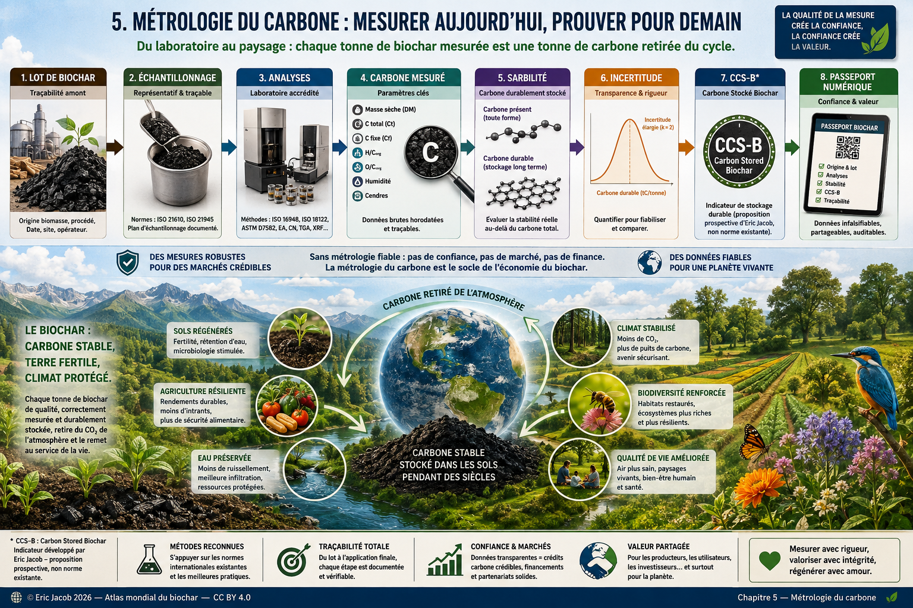

# Chapitre 5 — Métrologie du carbone stocké dans le biochar

> **Atlas mondial de la valorisation économique du biochar — Volume 1**  
> Version 1.2 — Août 2026 · Auteur : Eric Jacob

**[← Guide de l’acheteur](ch5_fr_guide_acheteur.md) · [↑ Sommaire de l’Atlas](README.md) · [Jumeau numérique →](ch5_fr_jumeau_numerique.md)**

---

## Introduction

Le développement du marché du biochar repose sur une question fondamentale :

> **Combien de carbone est réellement immobilisé, pendant combien de temps et avec quelle incertitude ?**

Deux biochars de masse identique peuvent présenter une humidité, une teneur en cendres, une composition chimique, une stabilité et une durée de stockage très différentes. Mesurer uniquement la masse du biochar ne suffit donc pas.

La métrologie doit distinguer **ce qui est mesuré**, **ce qui est calculé**, **ce qui est estimé par un modèle** et **ce qui est finalement vérifié ou certifié**.

<figure>

<figcaption><strong>Figure 1 — Métrologie du carbone stocké dans le biochar.</strong> Mesurer, documenter et rendre comparable le carbone durablement stocké. © Eric Jacob 2026 — Atlas mondial du biochar — CC BY 4.0. <a href="ch5_fr_metrologie_carbone.png">Agrandir l’infographie</a></figcaption>
</figure>

---

## Pourquoi mesurer ?

Une métrologie rigoureuse permet :

- d’améliorer la confiance ;
- de comparer les biochars et les procédés ;
- de garantir une meilleure reproductibilité scientifique ;
- de faciliter les audits et les échanges internationaux ;
- de documenter correctement les déclarations climatiques ;
- de réduire les risques de double comptage.

---

## Les grandeurs principales

Chaque lot devrait préciser au minimum la base sur laquelle les résultats sont exprimés.

| Paramètre | Unité / expression |
|---|---|
| Masse brute | kg ou t |
| Humidité | % |
| Masse sèche | kg ou t |
| Cendres | % matière sèche |
| Carbone total | % selon méthode |
| Carbone organique | % selon méthode |
| Carbone fixe | % selon méthode |
| H/Corg | rapport atomique |
| O/Corg | rapport atomique |
| Carbone durable estimé | kg C ou t C |
| Équivalent CO₂ | kg CO₂e ou t CO₂e |

**Une tonne de biochar n’est donc ni une tonne de carbone, ni une tonne de CO₂ retirée de l’atmosphère.**

---

## De la masse humide à la masse sèche

Pour une masse brute $M_b$ et une fraction massique d’humidité $H$ :

$M_s = M_b(1-H)$

où $M_s$ est la masse sèche.

Exemple : un lot de **1 000 kg** contenant 5 % d’humidité possède :

$M_s = 1000 \times (1-0,05) = 950\ \text{kg}$

La base humide ou sèche doit toujours être indiquée afin d’éviter des comparaisons artificiellement faussées.

---

## De la masse sèche au carbone

Si la fraction massique de carbone mesurée sur matière sèche vaut $f_C$ :

$M_C = M_s \times f_C$

Avec 950 kg de matière sèche et 89 % de carbone :

$M_C = 950 \times 0,89 = 845,5\ \text{kg C}$

Cette quantité décrit le carbone correspondant au lot selon l’analyse utilisée. Elle ne constitue pas encore, à elle seule, un retrait atmosphérique durable certifié.

---

## Carbone et équivalent CO₂

La conversion stœchiométrique entre carbone et dioxyde de carbone repose sur les masses molaires :

$M_{CO_2} = M_C \times \frac{44}{12}$

Ainsi :

$1\ \text{kg C} \approx 3,667\ \text{kg CO}_2$

Dans l’exemple précédent :

$845,5 \times \frac{44}{12} \approx 3\,100\ \text{kg CO}_2$

soit environ **3,10 t CO₂**.

Cette valeur est l’équivalent stœchiométrique du carbone contenu dans le lot. Elle ne signifie pas automatiquement que 3,10 t CO₂ peuvent être émises sous forme de crédits ou certificats : il faut encore considérer stabilité, permanence, périmètre, émissions de la chaîne, incertitudes et règles du référentiel.

---

## Le carbone fixe

Le **carbone fixe** est une grandeur de caractérisation issue de l’analyse immédiate. Il ne doit pas être assimilé directement à la fraction de carbone garantie comme stable pendant une durée donnée.

Une valeur élevée peut accompagner un matériau fortement carbonisé, mais :

> **le carbone fixe ne constitue pas, à lui seul, une preuve de permanence.**

Cette distinction est importante pour éviter de transformer une propriété analytique en durée de stockage non démontrée.

---

## Les rapports atomiques

Les rapports **H/Corg** et, selon les méthodes et objectifs, **O/Corg** renseignent sur le degré de carbonisation et la structure chimique du matériau.

Une diminution de H/Corg est généralement associée à une aromaticité plus importante et à une résistance accrue à la dégradation.

Cependant, un indicateur chimique ne doit pas être transformé abusivement en durée exacte de permanence sans méthode ou modèle explicitement défini.

---

## La chaîne métrologique

Une estimation robuste du carbone durable doit rester reconstructible :

```text
LOT DE BIOCHAR
      ↓
PLAN D'ÉCHANTILLONNAGE
      ↓
PRÉLÈVEMENTS
      ↓
PRÉPARATION
      ↓
ANALYSES
      ↓
MASSE SÈCHE + CARBONE + CENDRES + INDICATEURS DE STABILITÉ
      ↓
INCERTITUDES
      ↓
MODÈLE / RÉFÉRENTIEL
      ↓
CARBONE DURABLE ESTIMÉ
      ↓
CONVERSION EN CO₂e
      ↓
MRV / AUDIT / CERTIFICATION ÉVENTUELLE
```

La qualité du résultat final dépend de toute la chaîne, pas seulement de la précision de l’appareil de laboratoire.

---

## L’échantillonnage

Une analyse extrêmement précise peut décrire imparfaitement un lot si l’échantillon n’est pas représentatif.

Il faut documenter notamment :

- la taille du lot ;
- le nombre de prélèvements ;
- leur méthode et leur localisation ;
- l’homogénéisation ;
- la réduction de l’échantillon ;
- les conditions de stockage ;
- la date du prélèvement.

L’incertitude d’échantillonnage peut être différente de l’incertitude analytique et parfois la dominer.

---

## Les incertitudes

Toute mesure comporte une incertitude.

Elle peut provenir :

- de la pesée ;
- de la détermination de l’humidité ;
- de l’hétérogénéité du lot ;
- de l’échantillonnage ;
- de la préparation ;
- des méthodes analytiques ;
- des instruments ;
- du modèle de stabilité ;
- des facteurs utilisés dans les calculs.

Lorsque plusieurs grandeurs interviennent dans un résultat calculé, les incertitudes doivent être propagées selon une méthode adaptée.

Une valeur isolée est moins informative qu’une valeur accompagnée de sa méthode, de sa base de calcul, de sa date et de son incertitude.

---

## Mesuré, calculé, estimé, vérifié, certifié

Le vocabulaire doit empêcher les glissements de sens :

```text
MESURÉ
→ obtenu par une opération métrologique

CALCULÉ
→ dérivé mathématiquement de mesures

ESTIMÉ
→ dépend d'un modèle ou d'hypothèses

VÉRIFIÉ
→ contrôlé selon une procédure définie

CERTIFIÉ
→ reconnu selon un référentiel déterminé
```

Cette distinction rejoint celle utilisée dans l’[Observatoire mondial](ch5_fr_observatoire_mondial.md).

---

## Du carbone physique au retrait net

Le carbone contenu dans le biochar n’est qu’une partie du bilan climatique.

Selon le référentiel et le périmètre retenus, le retrait net peut devoir intégrer :

```text
CARBONE DURABLE DANS LE BIOCHAR
− COLLECTE ET PRÉTRAITEMENT
− TRANSPORT DE LA BIOMASSE
− ÉMISSIONS DU PROCÉDÉ
− CONDITIONNEMENT
− TRANSPORT DU BIOCHAR
− MISE EN ŒUVRE
± EFFETS ADMISSIBLES DU SYSTÈME
= RETRAIT NET SELON LE RÉFÉRENTIEL
```

Les frontières du système doivent donc être explicites.

Cette métrologie est directement liée à l’[Analyse du cycle de vie](ch4_fr_analyse_cycle_vie.md).

---

## Émissions évitées : ne pas les supposer

La thermolyse peut produire de la chaleur, du gaz ou d’autres coproduits susceptibles de remplacer d’autres sources d’énergie ou de matière.

Une émission dite « évitée » ne doit cependant être comptabilisée que si le scénario de référence et la substitution sont démontrables selon la méthode retenue.

Un même bénéfice ne doit pas être attribué plusieurs fois à plusieurs produits ou acteurs.

---

## Le risque de double comptage

Une même quantité de carbone ne doit pas devenir simultanément :

- un retrait vendu par le producteur ;
- un retrait revendiqué une seconde fois par l’acheteur ;
- un crédit attribué à un intermédiaire ;
- une réduction réutilisée dans une comptabilité incompatible.

Le [Passeport numérique du biochar](ch5_fr_passeport_biochar.md) peut contribuer à conserver l’identité du lot, son historique et les statuts associés.

---

## MRV : mesure, déclaration et vérification

Une architecture de **MRV — Measurement, Reporting and Verification** peut relier la matière physique aux déclarations climatiques :

1. identifier le lot ;
2. mesurer sa masse ;
3. déterminer son humidité ;
4. caractériser sa composition ;
5. déterminer ou estimer sa stabilité selon le référentiel ;
6. documenter le procédé et le périmètre ;
7. calculer le bilan ;
8. enregistrer les données ;
9. faire vérifier le résultat lorsque nécessaire ;
10. suivre les droits associés afin d’éviter les doubles revendications.

Le MRV ne remplace pas la mesure : **il organise la preuve**.

---

## Métrologie numérique

Chaque résultat analytique pourrait être enregistré dans le passeport numérique avec :

- identifiant du lot ;
- date ;
- laboratoire ;
- méthode ;
- version du protocole ;
- unité ;
- base humide ou sèche ;
- résultat ;
- incertitude ;
- statut de vérification.

La traçabilité scientifique et commerciale s’en trouverait renforcée.

---

## Proposition de l’Atlas : CCS-B

L’Atlas propose comme piste de réflexion une grandeur complémentaire :

> **CCS-B — Carbone Certifié Stocké dans le Biochar**

Elle représenterait une quantité de carbone dont le stockage durable serait documenté à partir de mesures, d’un critère ou modèle de stabilité explicite, d’un périmètre défini, d’une traçabilité et, lorsque nécessaire, d’une vérification indépendante.

**CCS-B n’est pas une norme internationale existante.**

Sa fonction conceptuelle est de rappeler la chaîne :

```text
MASSE DE BIOCHAR
≠
MASSE DE CARBONE
≠
CARBONE STABLE
≠
RETRAIT NET
≠
RETRAIT CERTIFIÉ
```

---

## Exemple conceptuel complet

| Paramètre | Valeur |
|---|---:|
| Masse brute | 1 000 kg |
| Humidité | 5 % |
| Masse sèche | 950 kg |
| Carbone sur matière sèche | 89 % |
| Carbone calculé | 845,5 kg C |
| Équivalent stœchiométrique | ≈ 3,10 t CO₂ |

Supposons ensuite, **uniquement à titre pédagogique**, qu’un référentiel attribue un facteur de carbone durable $f_s$.

$M_{C,durable} = M_C \times f_s$

puis :

$M_{CO_2,durable} = M_{C,durable} \times \frac{44}{12}$

Il faudrait encore appliquer les règles du référentiel relatives au périmètre, aux émissions de la chaîne, aux incertitudes, à la permanence et à la vérification avant de parler de retrait net certifié.

Cet exemple illustre une chaîne de calcul ; il ne définit pas un nouveau standard.

---

## Comparabilité mondiale

Une métrologie harmonisée permettrait :

- de comparer les producteurs ;
- de comparer les technologies ;
- de comparer les biomasses ;
- d’améliorer les études scientifiques ;
- de faciliter les audits ;
- de rendre les marchés plus transparents.

Harmoniser ne signifie toutefois pas masquer les différences : chaque résultat doit rester relié à sa méthode d’origine.

---

## Essais interlaboratoires

La comparabilité mondiale suppose aussi de vérifier que plusieurs laboratoires obtiennent des résultats compatibles sur des matériaux comparables.

Des essais interlaboratoires peuvent quantifier :

- répétabilité ;
- reproductibilité ;
- biais ;
- dispersion ;
- effets de préparation ;
- différences instrumentales.

Cette démarche rejoint le programme de [Recherche mondiale](ch5_fr_recherche_mondiale.md).

---

## Automatisation : utile mais auditable

À terme, balances, capteurs industriels, laboratoires, passeports numériques et systèmes d’aide à la décision peuvent automatiser une partie de la chaîne.

L’automatisation ne doit pas produire une boîte noire.

Il faut pouvoir reconstruire :

```text
DONNÉE SOURCE
→ MÉTHODE
→ VERSION
→ CALCUL
→ INCERTITUDE
→ RÉSULTAT
```

---

## Les bénéfices

Une métrologie rigoureuse protège simultanément :

- **le climat**, en évitant de comptabiliser un carbone qui n’est pas réellement durable ;
- **l’acheteur**, en donnant une quantité documentée ;
- **le producteur sérieux**, en distinguant les produits correctement caractérisés ;
- **le marché**, en réduisant les doubles comptes et les comparaisons trompeuses ;
- **la recherche**, en améliorant reproductibilité et comparabilité.

---

## Conclusion

Le développement du biochar ne dépendra pas uniquement des progrès des procédés de thermolyse.

Il dépendra également de la capacité des acteurs à **mesurer, documenter, comparer et vérifier** la quantité de carbone durablement stockée.

> **On ne certifie pas une couleur noire ni une tonne de matière : on documente une chaîne de mesure, de stabilité, de calcul et de preuve.**

Le concept de **CCS-B** est proposé comme piste de réflexion et non comme norme existante. Il cherche à rapprocher les exigences de la recherche, de l’industrie et des marchés du carbone tout en conservant une distinction nette entre mesure physique, estimation de permanence et certification.

---

## Figure et documents associés

- [Infographie — Métrologie carbone](ch5_fr_metrologie_carbone.png)
- [Passeport numérique](ch5_fr_passeport_biochar.md)
- [Analyse du cycle de vie](ch4_fr_analyse_cycle_vie.md)
- [Observatoire mondial](ch5_fr_observatoire_mondial.md)
- [Recherche mondiale](ch5_fr_recherche_mondiale.md)

---

**[← Guide de l’acheteur](ch5_fr_guide_acheteur.md) · [↑ Sommaire de l’Atlas](README.md) · [Jumeau numérique →](ch5_fr_jumeau_numerique.md)**

---

*Atlas mondial de la valorisation économique du biochar — Eric Jacob — Version 1.2 — 2026*  
*Licence : Creative Commons CC BY 4.0*
