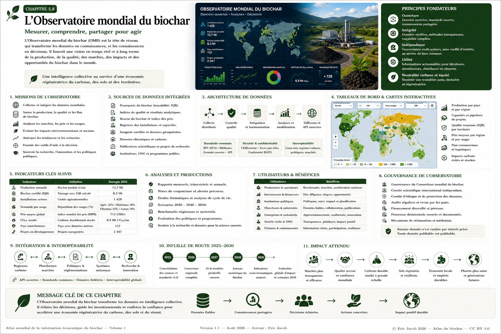

# Chapitre 5.8 — Observatoire mondial du biochar

> **Atlas mondial de la valorisation économique du biochar — Volume 1**  
> Version 1.2 — Août 2026 · Auteur : Eric Jacob

**[← Consortium mondial](ch5_fr_consortium_mondial.md) · [↑ Sommaire de l’Atlas](README.md) · [Recherche mondiale →](ch5_fr_recherche_mondiale.md)**

---

## Mesurer, comprendre, partager pour agir

Une filière mondiale ne peut être pilotée à partir d'une succession d'annonces, de prix isolés, d'études locales ou de chiffres commerciaux impossibles à comparer.

L'Atlas propose un **Observatoire mondial du biochar (OMB)** : une infrastructure d'information capable de transformer des données hétérogènes en connaissances comparables, puis en outils d'aide à la décision.

L'Observatoire ne doit pas seulement répondre à la question :

> **Combien de biochar produit-on ?**

Il doit progressivement permettre de demander :

> Où est-il produit ? Avec quelles biomasses ? Avec quelle qualité ? À quel prix ? Pour quel usage ? Avec quelle logistique ? Quels résultats sont réellement observés sur les sols, l'eau, les matériaux et le carbone ?

<figure>

<figcaption><strong>Figure 1 — Observatoire mondial du biochar : des données aux décisions.</strong> Les chiffres et visualisations contenus dans cette infographie sont illustratifs et décrivent l'architecture proposée ; ils ne constituent pas des statistiques mondiales mesurées. © Eric Jacob 2026 — Atlas mondial du biochar — CC BY 4.0. <a href="ch5_fr_observatoire_mondial.png">Agrandir l’infographie</a></figcaption>
</figure>

---

## Une distinction essentielle : observé, estimé, modélisé

L'Observatoire doit éviter l'un des défauts les plus fréquents des tableaux de bord : afficher des nombres de statuts différents comme s'ils possédaient la même certitude.

Chaque donnée devrait être qualifiée :

```text
M — mesurée
V — vérifiée
D — déclarée
E — estimée
P — prédite / modélisée
```

Un volume industriel mesuré n'est pas équivalent à une capacité annoncée.

Un projet financé n'est pas équivalent à une installation en exploitation.

Une prévision n'est pas une observation.

Cette séparation doit rester visible jusque dans les cartes et graphiques.

---

## Les missions de l'Observatoire

L'OMB pourrait assurer sept fonctions principales :

- collecter et intégrer les données disponibles ;
- suivre production, capacités, qualités et flux ;
- analyser marchés, prix et usages ;
- mesurer les effets environnementaux et territoriaux documentés ;
- identifier les tendances et ruptures ;
- fournir des outils de décision ;
- mettre des données structurées à disposition de la recherche.

Il ne doit pas produire une accumulation de chiffres mais une **intelligence collective du secteur**.

---

## Sources de données

L'Observatoire peut agréger plusieurs familles de sources.

### Passeports numériques

Le **[Passeport du biochar](ch5_fr_passeport_biochar.md)** fournit l'identité du lot, sa provenance, ses caractéristiques et ses preuves.

### Indices de qualité

L'**[IQB](ch5_fr_indice_qualite.md)** permet de comparer des propriétés pertinentes selon les usages sans prétendre qu'un score unique résume tous les biochars.

### Marchés et transactions

La **[Bourse du biochar](ch5_fr_bourse_biochar.md)** et d'autres places de marché peuvent transmettre des données anonymisées sur volumes, catégories et transactions.

### Indices de prix

L'**[Indice mondial des prix](ch5_fr_indice_prix_mondial.md)** fournit des séries segmentées par usage, région et qualité.

### Installations

Registres publics, opérateurs et institutions peuvent renseigner les unités en exploitation, en construction ou en projet.

### Observation de la Terre

L'imagerie satellitaire peut aider à documenter occupation des sols, biomasses, incendies, sécheresse, végétation ou évolution de certains territoires.

### Recherche

Publications scientifiques, essais agronomiques, universités et programmes de recherche fournissent des résultats indépendants.

### Données publiques

Climat, agriculture, sols, eau, énergie, transport, population et statistiques territoriales peuvent compléter le contexte.

---

## Une architecture distribuée

L'Observatoire ne nécessite pas que toutes les informations privées soient copiées dans un serveur mondial.

```text
SOURCES DISTRIBUÉES
        ↓
CONTRÔLES
        ↓
NORMALISATION
        ↓
DONNÉES FÉDÉRÉES
        ↓
ANALYSES
        ↓
API + TABLEAUX DE BORD
```

Les données sensibles peuvent rester chez leur détenteur et être interrogées selon des droits définis.

Cette architecture rejoint le modèle fédéré du **[Consortium mondial](ch5_fr_consortium_mondial.md)**.

---

## Un dictionnaire mondial de données

Avant de construire une carte spectaculaire, il faut définir les mots.

Par exemple :

```text
installation_active
capacité_nominale_t_an
production_réelle_t_an
biochar_certifié_t
biochar_caractérisé_t
prix_depart_usine
prix_livré
usage_final
biomasse_principale
```

Sans définitions partagées, deux pays peuvent publier le même indicateur tout en mesurant des choses différentes.

Le dictionnaire doit être public et versionné.

---

## La carte mondiale

La carte constitue l'une des interfaces les plus naturelles de l'Observatoire.

Elle pourrait afficher des couches indépendantes :

```text
UNITÉS DE PRODUCTION
CAPACITÉS
BIOMASSES
PRIX
IQB
USAGES
PROJETS
SOL
EAU
SÉCHERESSE
INCENDIES
CARBONE
LOGISTIQUE
RECHERCHE
```

L'utilisateur active seulement les couches nécessaires.

La carte devient ainsi un outil d'exploration plutôt qu'une image surchargée.

---

## Échelle mondiale, lecture locale

Une donnée mondiale devient utile lorsqu'elle permet de revenir au territoire.

L'utilisateur pourrait naviguer :

```text
MONDE
 ↓
CONTINENT
 ↓
PAYS
 ↓
RÉGION
 ↓
TERRITOIRE
```

Les données publiques seraient progressivement agrégées lorsque la précision géographique risquerait de révéler une information privée.

---

## Les installations : capacité n'est pas production

Pour chaque unité, plusieurs statuts doivent être distingués :

```text
annoncée
étude
financée
construction
commissionnement
active
arrêt temporaire
fermée
```

Et deux valeurs séparées :

```text
CAPACITÉ NOMINALE
≠
PRODUCTION RÉELLE
```

Cette distinction empêche de transformer des annonces de projets en production mondiale fictive.

---

## Les biomasses

L'Observatoire peut suivre les grandes catégories de ressources :

- résidus forestiers ;
- résidus agricoles ;
- coques et noyaux ;
- tailles et entretien territorial ;
- sous-produits industriels biogéniques ;
- bambous et plantes pérennes dans les territoires adaptés ;
- autres biomasses qualifiées.

Le but n'est pas d'encourager la consommation maximale de biomasse.

Il est de comprendre **quelles ressources sont réellement utilisées, où et avec quels effets**.

---

## Biomasse durable et pression territoriale

Une hausse rapide de la valeur du biochar peut créer une pression sur les ressources.

L'Observatoire doit donc pouvoir croiser :

```text
CAPACITÉ DE PYROLYSE
        +
BIOMASSE DISPONIBLE
        +
USAGES EXISTANTS
        +
BIODIVERSITÉ
        +
RISQUE INCENDIE
        +
EAU
```

Une région possédant une biomasse abondante sur le papier peut ne disposer que d'une fraction réellement mobilisable de façon durable.

---

## Incendies et entretien des territoires

Dans certaines zones, une partie de la biomasse issue du débroussaillement, des coupes de sécurité ou de l'entretien peut être valorisée.

L'Observatoire pourrait rapprocher :

- zones à risque ;
- infrastructures de prévention ;
- volumes d'entretien ;
- distances vers les unités ;
- débouchés du biochar.

Cela permet d'étudier une logique territoriale :

```text
PRÉVENTION
   +
RESSOURCE RÉSIDUELLE
   ↓
VALORISATION
```

Il ne s'agit jamais de retirer toute la matière organique d'un écosystème : une partie doit rester nécessaire au fonctionnement biologique des sols et des habitats.

---

## Sols et agriculture

Le tableau de bord agricole pourrait suivre :

- type de sol ;
- climat ;
- biochar utilisé ;
- dose ;
- préparation ;
- association avec compost ou autres amendements ;
- culture ;
- rétention hydrique ;
- rendements ;
- activité biologique ;
- durée d'observation.

Les résultats doivent être contextualisés.

> **Un résultat remarquable sur un sol ne devient pas automatiquement une règle universelle.**

---

## Donner une place aux retours de terrain

Les agriculteurs et utilisateurs observent parfois des phénomènes bien avant qu'ils soient étudiés systématiquement.

L'Observatoire peut recueillir ces signaux avec une méthodologie spécifique :

```text
TÉMOIGNAGE
    ↓
LOCALISATION APPROXIMATIVE
    ↓
CONTEXTE
    ↓
BIOCHAR / LOT
    ↓
OBSERVATION
    ↓
PHOTOS / MESURES ÉVENTUELLES
    ↓
NIVEAU DE PREUVE
```

Les témoignages ne sont ni rejetés ni présentés comme des essais contrôlés.

Les signaux répétés peuvent déclencher des programmes de recherche.

---

## Eau

La capacité de certains biochars à modifier les propriétés hydriques des sols est un domaine particulièrement intéressant.

L'Observatoire pourrait relier :

```text
POROSITÉ
+
SOL
+
DOSE
+
CLIMAT
+
PRÉCIPITATIONS
+
IRRIGATION
+
HUMIDITÉ MESURÉE
```

L'objectif est de déterminer **dans quelles conditions** un bénéfice hydrique apparaît et combien de temps il persiste.

---

## Biodiversité et vie du sol

Les données peuvent inclure, lorsque des protocoles comparables existent :

- vers de terre ;
- activité microbienne ;
- champignons ;
- structure du sol ;
- matière organique ;
- végétation ;
- biodiversité fonctionnelle.

Un changement spectaculaire observé localement doit être documenté avec un témoin lorsque cela est possible.

L'Observatoire peut ainsi transformer des observations dispersées en questions scientifiques testables.

---

## Marchés et prix

Les données de prix doivent rester segmentées.

Une carte pourrait afficher :

```text
PRIX AGRICOLE
PRIX FILTRATION
PRIX MATÉRIAUX
PRIX INDUSTRIEL
VALEUR CARBONE
```

Chaque valeur doit préciser volume observé et niveau de confiance.

Une zone sans données doit apparaître comme **zone sans données**, pas être remplie artificiellement par interpolation sans avertissement.

---

## Flux commerciaux

Les flux permettent de savoir si une économie est réellement locale.

L'Observatoire peut mesurer :

- distances moyennes ;
- importations ;
- exportations ;
- transport routier, ferroviaire, maritime ;
- prix départ usine ;
- prix livré.

Ces informations peuvent révéler les territoires où une nouvelle unité locale réduirait transport et dépendance.

---

## Carbone

Les données carbone peuvent suivre séparément :

```text
CARBONE PHYSIQUE DANS LE BIOCHAR
CARBONE STABLE ESTIMÉ
RETRAIT CERTIFIÉ
CRÉDIT ÉMIS
CRÉDIT VENDU
CRÉDIT RETIRÉ
```

Cette séparation réduit les risques de double comptage.

La **[Métrologie carbone](ch5_fr_metrologie_carbone.md)** doit préciser les méthodes et incertitudes.

---

## ACV : voir au-delà de la tonne produite

L'Observatoire doit pouvoir intégrer l'**[Analyse du cycle de vie](ch4_fr_analyse_cycle_vie.md)** :

```text
BIOMASSE
↓
COLLECTE
↓
TRANSPORT
↓
PROCÉDÉ
↓
COPRODUITS
↓
BIOCHAR
↓
TRANSPORT
↓
USAGE
↓
FIN DE VIE
```

Deux biochars physiquement comparables peuvent avoir des bilans très différents selon leur chaîne de production.

---

## Qualité et sécurité

Les données agrégées peuvent montrer :

- distribution des IQB ;
- fréquences de non-conformité ;
- causes de refus ;
- contaminants observés ;
- types de retraitement ;
- destinations finales.

Ces statistiques aideraient l'ensemble de la filière à comprendre où se trouvent les difficultés récurrentes.

Les données individuelles sensibles resteraient protégées.

---

## Recherche mondiale

L'Observatoire peut devenir un moteur de recherche scientifique appliqué.

Un chercheur pourrait demander :

```text
biochar de résidus forestiers
+
sol sableux
+
climat méditerranéen
+
dose 5–20 t/ha
+
observation > 3 ans
```

et identifier études, essais et jeux de données correspondants.

Voir **[Recherche mondiale](ch5_fr_recherche_mondiale.md)**.

---

## IA : outil d'exploration, pas oracle

Une IA peut rechercher des corrélations difficiles à détecter manuellement :

- qualité et prix ;
- biomasse et propriétés ;
- procédé et contaminants ;
- sol et réponse hydrique ;
- distance et compétitivité ;
- climat et résultats agronomiques.

Mais une corrélation ne prouve pas une causalité.

Les modèles doivent donc indiquer :

```text
DONNÉES UTILISÉES
VERSION
INCERTITUDE
LIMITES
DATE
```

Une prédiction doit rester identifiable comme prédiction.

---

## Détecter les anomalies

L'IA et les méthodes statistiques peuvent aussi signaler :

- prix aberrants ;
- volumes incohérents ;
- données dupliquées ;
- changements inhabituels ;
- passeports incompatibles ;
- déclarations contradictoires.

L'anomalie déclenche une vérification ; elle ne constitue pas automatiquement une fraude.

---

## Scénarios

L'Observatoire peut construire plusieurs futurs possibles.

Exemple :

```text
SCÉNARIO A — croissance tendancielle
SCÉNARIO B — forte demande agricole
SCÉNARIO C — développement matériaux
SCÉNARIO D — contrainte biomasse
SCÉNARIO E — valeur carbone élevée
SCÉNARIO F — priorité résilience eau / sols
```

Chaque scénario doit publier ses hypothèses.

---

## Un outil pour les collectivités

Une collectivité pourrait utiliser l'Observatoire pour étudier :

- résidus disponibles ;
- entretien des espaces ;
- besoins de chaleur ;
- agriculture locale ;
- sols dégradés ;
- besoins en eau ;
- infrastructures ;
- distances ;
- débouchés.

Elle peut alors déterminer si une filière locale possède une cohérence réelle avant d'investir.

---

## Un outil pour les producteurs

Un producteur peut identifier :

- marchés proches ;
- qualités demandées ;
- prix régionaux ;
- besoins non couverts ;
- laboratoires ;
- infrastructures logistiques ;
- résultats associés à des biochars comparables.

La donnée réduit une partie du risque industriel.

---

## Un outil pour les agriculteurs

L'agriculteur pourrait rechercher des expériences comparables à son propre contexte plutôt qu'une moyenne mondiale abstraite.

```text
MON SOL
+
MON CLIMAT
+
MA CULTURE
+
BIOCHAR DISPONIBLE
        ↓
CAS COMPARABLES
```

C'est potentiellement beaucoup plus utile qu'une affirmation générale selon laquelle « le biochar augmente les rendements ».

---

## Un outil pour les investisseurs

L'Observatoire peut fournir :

- profondeur du marché ;
- historique des prix ;
- projets ;
- capacités ;
- disponibilité des biomasses ;
- risques ;
- débouchés ;
- maturité réglementaire.

L'objectif n'est pas de recommander un investissement, mais de rendre les hypothèses vérifiables.

---

## Données ouvertes et données protégées

Trois niveaux peuvent être conservés :

```text
PUBLIC
PROFESSIONNEL
AUDIT
```

Les données publiques servent à la transparence et à la recherche.

Les données professionnelles servent aux transactions autorisées.

Les données d'audit permettent la vérification sans exposition générale.

---

## Indicateurs clés

L'Observatoire pourrait suivre notamment :

| Domaine | Indicateurs |
|---|---|
| Production | tonnes réelles, capacité, taux d'utilisation |
| Qualité | IQB, analyses, non-conformités |
| Marché | prix, volumes, usages |
| Territoire | distances, biomasses, installations |
| Sols | essais, rétention, rendements, biologie |
| Carbone | stock physique, retrait certifié |
| Recherche | études, essais, jeux de données |
| Développement | projets, investissements, emplois |

Les indicateurs doivent être accompagnés de leur définition et de leur niveau de confiance.

---

## Ne pas confondre exhaustivité et précision

L'Observatoire mondial ne connaîtra jamais immédiatement toutes les installations et tous les flux.

Il doit donc afficher sa couverture :

```text
COUVERTURE GÉOGRAPHIQUE
COUVERTURE DU MARCHÉ
TAUX DE DONNÉES VÉRIFIÉES
DATE DE MISE À JOUR
```

Dire « nous couvrons environ 45 % du marché estimé » est plus crédible que présenter une carte incomplète comme exhaustive.

---

## Gouvernance

L'Observatoire peut être supervisé par le Consortium, mais son comité scientifique doit disposer d'une autonomie méthodologique.

Des audits doivent contrôler :

- origine des données ;
- transformations ;
- modèles ;
- sécurité ;
- biais ;
- conflits d'intérêts.

Les méthodologies publiques permettent une critique externe.

---

## Une infrastructure de connaissance cumulative

La valeur de l'Observatoire augmente avec le temps.

```text
ANNÉE 1 : quelques milliers de lots
ANNÉE 3 : séries régionales
ANNÉE 5 : résultats de terrain reliés
ANNÉE 10 : historiques longs
```

Les effets à long terme du biochar deviennent alors étudiables avec une profondeur impossible dans un système fragmenté.

---

## De la donnée à l'action

La chaîne complète proposée par l'Atlas devient :

```text
PASSEPORTS
    ↓
QUALITÉ
    ↓
TRANSACTIONS
    ↓
PRIX
    ↓
OBSERVATOIRE
    ↓
CONNAISSANCE
    ↓
DÉCISIONS
    ↓
RÉSULTATS TERRAIN
    ↓
NOUVELLES DONNÉES
```

Il s'agit d'une boucle d'apprentissage.

Chaque utilisation peut améliorer la compréhension des suivantes.

---

## À retenir

> **L'Observatoire mondial du biochar ne doit pas être une vitrine de chiffres : il doit être la mémoire vérifiable de la filière.**

Il doit distinguer ce qui est mesuré de ce qui est annoncé, ce qui est observé de ce qui est prédit et ce qui est prouvé de ce qui reste hypothétique.

Son ambition est de relier industrie, agriculture, territoires, marchés et science afin que les décisions reposent progressivement sur une connaissance cumulative plutôt que sur des impressions isolées.

Et surtout, il doit permettre de regarder derrière les tonnes : **sols restaurés, eau mieux gérée, biomasses mieux valorisées, carbone durable, territoires plus résilients et connaissances partagées.**

---

## Continuer la lecture

**[← Consortium mondial](ch5_fr_consortium_mondial.md) · [↑ Sommaire de l’Atlas](README.md) · [Recherche mondiale →](ch5_fr_recherche_mondiale.md)**

À consulter également : [Passeport numérique](ch5_fr_passeport_biochar.md) · [Indice de qualité](ch5_fr_indice_qualite.md) · [Bourse du biochar](ch5_fr_bourse_biochar.md) · [Indice mondial des prix](ch5_fr_indice_prix_mondial.md) · [ACV](ch4_fr_analyse_cycle_vie.md) · [Métrologie carbone](ch5_fr_metrologie_carbone.md)

---

*Atlas mondial de la valorisation économique du biochar — Eric Jacob — Version 1.2 — 2026*  
*Licence : Creative Commons CC BY 4.0*
