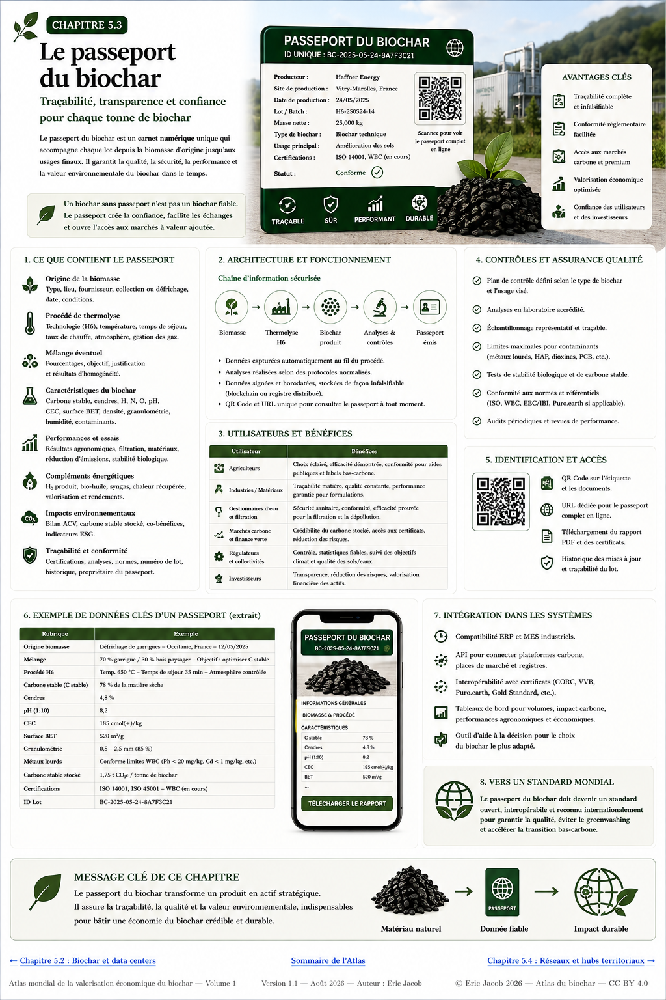

# Chapitre 5.3 — Passeport numérique du biochar

> **Atlas mondial de la valorisation économique du biochar — Volume 1**  
> Version 1.2 — Août 2026 · Auteur : Eric Jacob

**[← Datacenters IA + biochar](ch5_fr_datacenters.md) · [↑ Sommaire de l’Atlas](README.md) · [Indice de qualité →](ch5_fr_indice_qualite.md)**

---

## Donner une identité vérifiable à chaque lot

Le marché du biochar ne pourra pas devenir une infrastructure mondiale crédible si l’acheteur reçoit seulement une facture, un certificat PDF isolé et quelques valeurs analytiques impossibles à relier durablement au produit physique.

L’Atlas propose donc un **Passeport numérique du biochar** : un dossier structuré, versionné et lisible par les humains comme par les machines, associé à un lot identifiable depuis la biomasse d’origine jusqu’à son usage final.

Ce concept s’inscrit dans la logique plus générale des passeports numériques de produits : identité, composition, provenance, données environnementales, conformité et cycle de vie peuvent être reliés à un identifiant persistant. Le cadre européen du Digital Product Passport fournit déjà un précédent réglementaire important. citeturn0search0

<figure>
  
  <figcaption>
    <strong>Figure 1 — Passeport numérique du biochar : de la matière à la preuve.</strong>
    Les identifiants, valeurs et certifications visibles dans l’infographie sont illustratifs et ne décrivent pas un lot commercial réel.
    © Eric Jacob 2026 — Atlas mondial du biochar — CC BY 4.0.
    <a href="ch5_fr_passeport_biochar.png">Agrandir l’infographie</a>
  </figcaption>
</figure>

---

## Le passeport n’est pas un certificat supplémentaire

L’objectif n’est pas d’ajouter une couche bureaucratique.

Le passeport est **le conteneur de preuves** permettant de relier des informations qui existent déjà mais restent souvent dispersées :

```text
BIOMASSE
   ↓
LOT D’INTRANT
   ↓
PROCÉDÉ
   ↓
LOT DE BIOCHAR
   ↓
ANALYSES
   ↓
CERTIFICATION
   ↓
ACV / CARBONE
   ↓
TRANSPORT
   ↓
USAGE FINAL
```

Une certification peut être l’une des pièces du passeport. Elle n’est pas le passeport lui-même.

---

## Une identité unique

Chaque lot devrait recevoir un identifiant persistant, par exemple :

```text
EJ-BIO-FR-2026-00001284
```

La syntaxe exacte importe moins que quatre propriétés :

- unicité ;
- permanence ;
- lisibilité machine ;
- impossibilité pratique de confondre deux lots.

Cet identifiant peut ensuite être porté par un QR code, une étiquette, un document logistique ou une API.

---

## Couche 1 — Origine de la biomasse

Le passeport doit documenter la matière avant même sa conversion.

Champs possibles :

| Donnée | Exemple |
|---|---|
| Type | résidus de taille |
| Origine | entretien d’espaces verts |
| Zone | territoire / bassin d’approvisionnement |
| Date | collecte ou réception |
| Fournisseur | identifiant |
| Humidité | mesure |
| Mélange | composition documentée |
| Usage alternatif | information si pertinente |
| Statut | résidu, coproduit, entretien, culture dédiée… |

Cette dernière information est importante. Un biochar de grande qualité technique peut présenter un mauvais bilan global si sa biomasse résulte d’une exploitation non durable.

---

## Couche 2 — Caractérisation avant conversion

Pour les technologies capables d’accepter des ressources diverses, l’agnosticisme vis-à-vis de la biomasse doit être associé à une caractérisation rigoureuse.

Le passeport peut enregistrer :

- humidité ;
- matières minérales et cendres ;
- sels ;
- chlore ;
- métaux ;
- composition élémentaire ;
- comportement thermique ;
- mélange avec d’autres ressources ;
- essais préalables ;
- décision de faisabilité.

Une ressource difficile — par exemple certaines biomasses marines — peut ainsi être documentée comme composant minoritaire d’un mélange plutôt que présentée abusivement comme intrant universel.

---

## Couche 3 — Recette de production

Le passeport ne doit pas nécessairement publier tous les secrets industriels.

Il doit cependant conserver suffisamment de données pour relier le produit au procédé :

```text
unité
date / campagne
température(s)
temps de séjour
atmosphère
débit
préparation
refroidissement
post-traitement
```

Certaines données peuvent être publiques ; d’autres réservées à l’auditeur ou au producteur.

Cette architecture à niveaux d’accès est déjà envisagée dans d’autres familles de passeports numériques, précisément pour concilier traçabilité et confidentialité industrielle. citeturn0search2

---

## Couche 4 — Analyses du biochar

Le cœur du passeport est la caractérisation du lot.

Selon l’usage :

- carbone ;
- hydrogène et oxygène ;
- H/Corg ;
- cendres ;
- humidité ;
- pH ;
- conductivité ;
- capacité d’échange ;
- surface spécifique ;
- volume et distribution des pores ;
- granulométrie ;
- HAP ;
- métaux ;
- autres contaminants requis.

Le passeport doit enregistrer **la valeur, l’unité, la méthode, le laboratoire, la date et l’incertitude lorsqu’elle est disponible**.

Une valeur sans méthode de mesure est une information incomplète.

---

## Couche 5 — Certification et conformité

Le passeport peut pointer vers :

- référentiel ;
- version du référentiel ;
- organisme ;
- certificat ;
- date d’émission ;
- période de validité ;
- périmètre ;
- analyses associées.

L’objectif est d’éviter qu’un logo de certification soit détaché de la réalité du lot.

Voir : **[Normes et certifications](ch4_fr_certifications.md)**.

---

## Couche 6 — Analyse du cycle de vie

Un bilan carbone crédible nécessite de conserver les hypothèses qui l’ont produit.

Le passeport peut contenir ou référencer :

- frontières de l’étude ;
- unité fonctionnelle ;
- transport ;
- énergie ;
- émissions directes ;
- coproduits ;
- allocations ;
- scénario de référence ;
- carbone stable ;
- version de la méthode.

Ainsi, une valeur `−X kgCO₂e` cesse d’être un nombre publicitaire isolé : elle devient un résultat reproductible dans un cadre défini.

Voir : **[Analyse du cycle de vie](ch4_fr_analyse_cycle_vie.md)**.

---

## Couche 7 — Destination finale

La traçabilité ne doit pas s’arrêter à la sortie de l’usine.

Le passeport doit pouvoir suivre :

```text
LOT PRODUIT
   ↓
CONDITIONNEMENT
   ↓
TRANSPORT
   ↓
ACHETEUR
   ↓
USAGE
   ↓
LOCALISATION / OUVRAGE / PARCELLE
   ↓
DATE
```

La granularité doit naturellement respecter la confidentialité et la réglementation.

Pour le carbone, cette dernière étape est particulièrement importante : la permanence dépend aussi de la destination du matériau.

---

## Fractionner et fusionner les lots

La réalité logistique pose un problème intéressant.

Un lot de 20 tonnes peut être divisé entre plusieurs clients. Plusieurs petits lots peuvent aussi être mélangés.

Le passeport doit donc gérer une généalogie :

```text
LOT A
 ├── A1 → ferme
 ├── A2 → matériau
 └── A3 → filtration

LOT B ─┐
LOT C ─┼→ LOT D (mélange)
LOT E ─┘
```

Chaque descendant conserve un lien avec ses parents.

Cette structure est essentielle pour éviter les doubles revendications de matière ou de carbone.

---

## QR code : une porte, pas la base de données

Le QR code est utile parce qu’un téléphone peut l’ouvrir immédiatement.

Mais il ne doit contenir qu’un identifiant ou une adresse stable.

```text
QR
 ↓
IDENTIFIANT
 ↓
PASSEPORT
 ↓
DONNÉES + PREUVES
```

Si l’adresse change, un système de résolution doit maintenir le lien.

Un QR imprimé n’est donc pas la preuve. **Il est la porte d’entrée vers la preuve.**

---

## Des données signées

Un passeport sérieux doit permettre de distinguer :

- déclaration du producteur ;
- mesure automatique ;
- résultat du laboratoire ;
- validation de l’auditeur ;
- donnée de l’utilisateur final.

Chaque événement peut recevoir :

```text
auteur
horodatage
version
empreinte cryptographique
signature
```

Modifier une analyse ne doit pas effacer l’ancienne valeur. Une nouvelle version doit être créée.

---

## Blockchain : utile parfois, obligatoire jamais

Une blockchain peut fournir un registre partagé et rendre certaines modifications difficiles.

Mais elle n’est pas nécessaire à toutes les architectures.

Une base de données correctement administrée, avec signatures, journal d’audit, sauvegardes et réplication, peut offrir une excellente traçabilité.

Le principe de l’Atlas est donc :

> **choisir l’architecture la plus simple capable de fournir le niveau de preuve requis.**

La technologie ne doit pas devenir plus importante que la donnée.

---

## Trois niveaux d’accès

Un passeport mondial gagnerait à distinguer plusieurs niveaux.

### Public

Accessible à tous :

- identifiant ;
- origine générale ;
- catégorie ;
- principales analyses ;
- certifications ;
- carbone vérifié ;
- usages autorisés.

### Professionnel

Accessible aux parties autorisées :

- analyses détaillées ;
- documents logistiques ;
- méthodes ;
- informations de formulation nécessaires.

### Audit

Accessible aux vérificateurs :

- données brutes ;
- chaîne complète ;
- journaux ;
- paramètres sensibles nécessaires au contrôle.

Cette séparation protège les secrets industriels sans rendre la preuve opaque.

---

## Un format lisible par les machines

Le HTML ou le PDF est pratique pour l’humain.

Pour une économie mondiale, il faut aussi un format structuré, par exemple JSON :

```json
{
  "passport_id": "EJ-BIO-FR-2026-00001284",
  "batch": {
    "feedstock": "green-waste-residues",
    "production_date": "2026-08-02"
  },
  "biochar": {
    "carbon_pct": 78.2,
    "ash_pct": 5.1,
    "ph": 8.2
  },
  "certification": [],
  "destination": []
}
```

Ce format permet aux places de marché, laboratoires, administrations, chercheurs et IA d’interroger les données sans relire manuellement des milliers de PDF.

---

## API et interopérabilité

Le passeport devient beaucoup plus puissant si ses données peuvent être échangées avec :

- ERP industriels ;
- laboratoires ;
- systèmes logistiques ;
- registres carbone ;
- certifications ;
- plateformes agricoles ;
- systèmes de bâtiments ;
- places de marché ;
- observatoires ;
- jumeaux numériques.

L’objectif n’est pas de construire une gigantesque base mondiale unique, mais **un langage commun permettant à plusieurs systèmes de se comprendre**.

---

## Le passeport et l’Indice de qualité

Les données analytiques du passeport peuvent alimenter automatiquement un profil ou un indice de qualité.

```text
PASSEPORT
   ↓
DONNÉES VÉRIFIÉES
   ↓
ALGORITHME VERSIONNÉ
   ↓
PROFIL DE QUALITÉ
   ↓
ADÉQUATION À L’USAGE
```

Si l’algorithme change, la version utilisée doit rester enregistrée.

Voir : **[Indice de qualité](ch5_fr_indice_qualite.md)**.

---

## Le passeport et la Bourse du biochar

Une place de marché sérieuse ne devrait pas négocier uniquement :

> « biochar — 700 €/t ».

Elle devrait pouvoir négocier un lot défini par son passeport :

```text
origine
+ grade
+ analyses
+ certification
+ carbone
+ localisation
+ disponibilité
+ destination autorisée
```

Le passeport devient alors la fiche d’identité du produit négocié.

Voir : **[Bourse du biochar](ch5_fr_bourse_biochar.md)** et **[Indice mondial des prix](ch5_fr_indice_prix_mondial.md)**.

---

## Le passeport et le carbone

Lorsqu’un certificat de retrait carbone est associé au biochar, il faut empêcher qu’une même tonne soit revendiquée plusieurs fois.

Le passeport peut relier :

```text
LOT PHYSIQUE
    ↕
QUANTITÉ DE CARBONE
    ↕
CERTIFICAT
    ↕
STATUT
émis / transféré / retiré
```

Il devient ainsi possible de distinguer la propriété du biochar physique et celle de l’attribut carbone.

---

## Le passeport et les résultats du terrain

Le passeport peut évoluer après la vente.

Pour un usage agricole, des observations volontaires pourraient être reliées au lot :

- sol initial ;
- dosage ;
- culture ;
- pluviométrie ;
- irrigation ;
- rendement ;
- humidité du sol ;
- évolution biologique ;
- observations à plusieurs années.

Pour un filtre :

- volume traité ;
- contaminant ;
- perte de charge ;
- saturation ;
- régénération.

Pour un matériau :

- formulation ;
- résistance ;
- vieillissement.

Le passeport devient alors **un dossier vivant de performance**.

---

## Des retours terrain vers la recherche

Des millions de lots associés à leurs résultats créeraient progressivement une ressource scientifique considérable.

```text
PASSEPORTS
    ↓
DONNÉES ANONYMISÉES
    ↓
STATISTIQUES
    ↓
MODÈLES
    ↓
NOUVELLES HYPOTHÈSES
    ↓
ESSAIS
    ↓
MEILLEURS BIOCHARS
```

Les observations remarquables pourraient être repérées automatiquement puis étudiées scientifiquement.

L’Atlas rejoint ici le concept du **[Jumeau numérique](ch5_fr_jumeau_numerique.md)**.

---

## Gouvernance : ne pas confier la vérité à un acteur unique

Le passeport ne devrait pas dépendre exclusivement :

- d’un producteur ;
- d’une certification ;
- d’un registre carbone ;
- d’une place de marché ;
- d’un gouvernement ;
- d’un fournisseur informatique.

L’interopérabilité et la portabilité sont des garanties de résilience.

Le producteur doit pouvoir changer de prestataire sans perdre l’histoire de ses lots.

---

## Un standard ouvert

L’Atlas propose qu’un futur format mondial définisse au minimum :

```text
IDENTITÉ
ORIGINE
PROCÉDÉ
ANALYSES
CERTIFICATION
ACV
CARBONE
LOGISTIQUE
DESTINATION
HISTORIQUE
SIGNATURES
```

Les champs peuvent être publics ou protégés, mais leur définition devrait être ouverte.

Un tel standard pourrait être élaboré par un consortium associant producteurs, laboratoires, agriculteurs, industriels, chercheurs, organismes de certification, acteurs carbone et administrations.

Voir : **[Consortium mondial](ch5_fr_consortium_mondial.md)**.

---

## Ce que le passeport empêche

Un bon système rend plus difficiles :

- changement opportuniste de l’origine ;
- certificat appliqué au mauvais lot ;
- double comptage ;
- falsification d’analyses ;
- vente d’un grade sous un autre ;
- revendication carbone sans destination ;
- disparition de l’historique ;
- greenwashing par sélection de quelques chiffres favorables.

Il ne supprime pas la fraude, mais il augmente fortement le coût de la fraude et facilite sa détection.

---

## Ce qu’il ne faut pas faire

Le passeport ne doit pas devenir une bureaucratie numérique obligeant un petit producteur à saisir cent champs à la main.

Une grande partie des données peut être importée automatiquement :

```text
CAPTEURS ─┐
ERP ──────┤
LABO ─────┤
LOGISTIQUE├→ PASSEPORT
AUDITEUR ─┤
UTILISATEUR┘
```

Le système idéal collecte une donnée **une fois** puis la réutilise partout où elle est légitimement nécessaire.

---

## À retenir

> **Le passeport numérique transforme une tonne anonyme de biochar en matériau identifiable, mesuré, traçable et comparable.**

Il ne remplace ni la science, ni le laboratoire, ni la certification.

Il les relie.

Et cette connexion peut devenir l’une des infrastructures les plus importantes d’un marché mondial du biochar : **la donnée accompagne la matière, depuis son origine jusqu’à son effet réel.**

---

## Continuer la lecture

**[← Datacenters IA + biochar](ch5_fr_datacenters.md) · [↑ Sommaire de l’Atlas](README.md) · [Indice de qualité →](ch5_fr_indice_qualite.md)**

À consulter également : [Certifications](ch4_fr_certifications.md) · [ACV](ch4_fr_analyse_cycle_vie.md) · [Biochar idéal](ch5_fr_biochar_ideal.md) · [Bourse du biochar](ch5_fr_bourse_biochar.md) · [Jumeau numérique](ch5_fr_jumeau_numerique.md)

---

*Atlas mondial de la valorisation économique du biochar — Eric Jacob — Version 1.2 — 2026*  
*Licence : Creative Commons CC BY 4.0*
