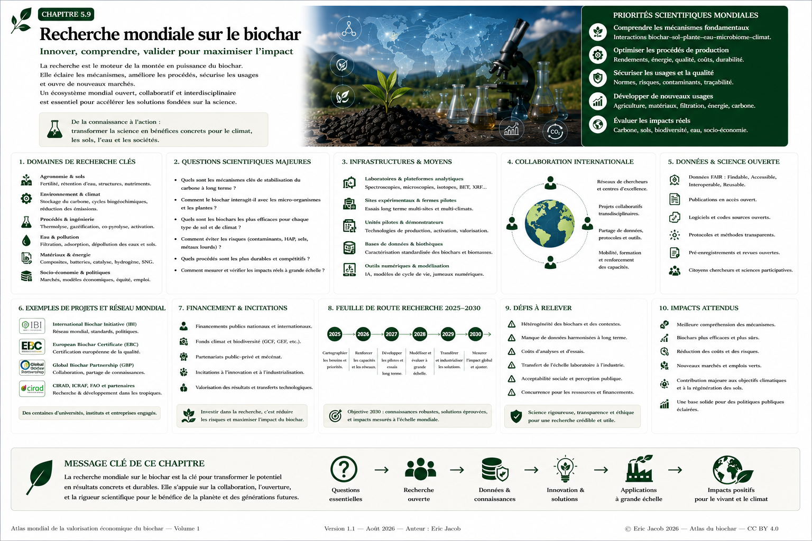

# Chapitre 5.9 — Recherche mondiale sur le biochar

> **Atlas mondial de la valorisation économique du biochar — Volume 1**  
> Version 1.2 — Août 2026 · Auteur : Eric Jacob

**[← Observatoire mondial](ch5_fr_observatoire_mondial.md) · [↑ Sommaire de l’Atlas](README.md) · [Métrologie carbone →](ch5_fr_metrologie_carbone.md)**

---

## Innover, comprendre et valider pour maximiser l'impact

Le biochar se situe au croisement de disciplines qui communiquent encore imparfaitement : sciences des sols, microbiologie, chimie, génie des procédés, hydrologie, climatologie, matériaux, énergie, économie et politiques publiques.

Le fichier initial de cet Atlas proposait déjà un **Réseau Mondial de Recherche sur le Biochar** destiné à rapprocher universités, laboratoires, centres techniques, producteurs et certificateurs. Cette version conserve ce principe et l'intègre désormais à l'architecture plus large construite dans le chapitre 5 : passeports numériques, qualité, marchés, Consortium et Observatoire mondial. citeturn0view0

> **La recherche mondiale n'a pas pour fonction de démontrer que le biochar est toujours bénéfique. Elle doit déterminer quand il l'est, pourquoi, à quelle dose, pendant combien de temps, avec quels risques et dans quelles conditions il ne l'est pas.**

<figure>

<figcaption><strong>Figure 1 — Recherche mondiale sur le biochar : de la connaissance à l'impact.</strong> L'organisation, la feuille de route et les priorités représentées constituent une proposition prospective de l'Atlas. © Eric Jacob 2026 — Atlas mondial du biochar — CC BY 4.0. <a href="ch5_fr_recherche_mondiale.png">Agrandir l’infographie</a></figcaption>
</figure>

---

## Pourquoi un réseau mondial ?

Des milliers de travaux étudient déjà le biochar, mais leur comparaison reste difficile lorsque changent simultanément :

- la biomasse ;
- le procédé ;
- la température ;
- le temps de séjour ;
- le biochar ;
- le sol ;
- le climat ;
- la culture ;
- la dose ;
- le protocole ;
- la durée de l'expérience.

Deux publications apparemment contradictoires peuvent en réalité étudier deux systèmes différents.

La priorité n'est donc pas seulement de produire davantage d'articles : elle est de **rendre une fraction croissante des expériences comparables, reproductibles et réutilisables**.

---

## Les grands domaines de recherche

### Agronomie et sols

Questions centrales :

- structure des sols ;
- eau ;
- nutriments ;
- fertilité ;
- interactions avec les amendements ;
- évolution du carbone organique ;
- réponses des cultures ;
- effets à long terme.

L'objectif n'est pas de remplacer les pratiques agronomiques par du biochar mais de comprendre **où une quantité adaptée de biochar apporte une fonction supplémentaire**.

### Microbiologie et vie du sol

Les pores et surfaces du biochar peuvent modifier les habitats microbiens et les interfaces sol-eau-racines.

Les recherches doivent distinguer :

```text
OBSERVATION
≠
CORRÉLATION
≠
MÉCANISME DÉMONTRÉ
```

Bactéries, champignons, microfaune et macrofaune méritent des protocoles permettant d'étudier non seulement leur abondance mais leurs fonctions.

### Eau

La question de la rétention hydrique doit être étudiée en fonction :

- du type de biochar ;
- de sa granulométrie ;
- de sa porosité ;
- du type de sol ;
- de la dose ;
- du climat ;
- du vieillissement.

Dire qu'un biochar « retient l'eau » est insuffisant.

Il faut quantifier **combien, dans quel sol et pendant combien de temps**.

### Carbone et climat

La recherche doit améliorer la connaissance de :

- stabilité ;
- permanence ;
- cinétique d'oxydation ;
- émissions du procédé ;
- émissions évitées ;
- substitution ;
- effets indirects ;
- ACV complète.

Voir également : **[Analyse du cycle de vie](ch4_fr_analyse_cycle_vie.md)** et **[Métrologie carbone](ch5_fr_metrologie_carbone.md)**.

### Procédés

Thermolyse, pyrolyse, gazéification, activation et autres traitements doivent être étudiés comme des systèmes de transformation.

Variables essentielles :

```text
BIOMASSE
+ HUMIDITÉ
+ TEMPÉRATURE
+ TEMPS DE SÉJOUR
+ ATMOSPHÈRE
+ TRANSFERT THERMIQUE
+ POST-TRAITEMENT
→ PRODUITS
```

La recherche doit relier les paramètres du procédé aux propriétés finales plutôt que traiter tous les chars comme équivalents.

### Matériaux

Le biochar peut être étudié dans :

- bétons ;
- mortiers ;
- composites ;
- polymères ;
- bitumes ;
- isolants ;
- adsorbants ;
- électrodes ;
- catalyse ;
- autres matériaux fonctionnels.

L'intérêt réel doit être évalué par la performance et l'ACV, pas par la seule présence de carbone biogénique.

### Filtration et dépollution

La recherche doit préciser :

- contaminants ciblés ;
- adsorption ;
- cinétique ;
- sélectivité ;
- saturation ;
- régénération ;
- fin de vie ;
- risque de relargage.

Un matériau qui capture un contaminant crée ensuite un matériau contaminé : **la fin de vie fait partie du problème scientifique**.

---

## Une priorité : comprendre les biochars hors spécifications

Le chapitre sur la **[Bourse du biochar](ch5_fr_bourse_biochar.md)** a soulevé une question importante : que faire d'un biochar impropre à l'usage prévu ?

La recherche peut construire une véritable matrice de décision :

```text
DÉFAUT
  ↓
CAUSE
  ↓
RISQUE
  ↓
CORRECTION POSSIBLE ?
  ↓
RÉORIENTATION ?
  ↓
RETRAITEMENT ?
  ↓
VALORISATION ÉNERGÉTIQUE ?
  ↓
GESTION DES CENDRES / RÉSIDUS
```

Il faut notamment étudier ce que deviennent métaux, sels et minéraux lors d'un retraitement ou d'une combustion contrôlée.

Un contaminant organique et un élément métallique ne répondent pas au même traitement.

---

## Biomasses complexes

Toutes les biomasses ne se comportent pas de la même manière.

Les programmes de recherche doivent caractériser notamment :

- teneur minérale ;
- chlore ;
- soufre ;
- azote ;
- alcalins ;
- métaux ;
- humidité ;
- lignine ;
- cellulose ;
- hémicellulose ;
- composés spécifiques.

La faisabilité industrielle doit être déterminée **avant** la généralisation d'une ressource.

---

## Mélanges de biomasses

Une biomasse difficile peut parfois devenir exploitable lorsqu'elle est mélangée avec une autre ressource.

La recherche doit alors étudier :

```text
PROPORTION
+ HOMOGÉNÉITÉ
+ TEMPÉRATURE
+ RÉACTIONS ENTRE FRACTIONS
+ GAZ
+ GOUDRONS
+ CENDRES
→ QUALITÉ ET SÉCURITÉ
```

Cela ouvre un champ d'optimisation considérable, mais interdit les recettes simplistes.

---

## Biomasses marines et algues

Les algues et biomasses marines constituent un domaine spécifique en raison notamment des sels, minéraux, halogènes et éléments traces qu'elles peuvent concentrer.

Les recherches pertinentes concernent :

- collecte ;
- lavage ;
- égouttage ;
- séchage ;
- mélange ;
- comportement thermique ;
- corrosion ;
- gaz ;
- composition du biochar ;
- devenir des minéraux ;
- contaminants.

Pour les biomasses échouées ou accumulées en grandes quantités, la recherche doit comparer le coût environnemental du traitement avec celui de l'inaction.

Il ne faut jamais supposer qu'une biomasse est adaptée à la thermolyse simplement parce qu'elle est abondante.

---

## Une matrice mondiale biomasse × procédé × produit

L'un des projets les plus utiles serait une matrice ouverte :

```text
BIOMASSE
   ×
PROCÉDÉ
   ×
PARAMÈTRES
   ↓
GAZ
BIOCHAR
CONDENSABLES
CENDRES
CONTAMINANTS
RENDEMENTS
ÉNERGIE
```

Cette base permettrait de savoir ce qui a déjà été testé et d'éviter de répéter inutilement certaines expériences.

---

## Protocoles communs

Le fichier historique du chapitre proposait déjà des protocoles partagés pour l'échantillonnage, les analyses chimiques, les propriétés physiques et les essais agronomiques et industriels. citeturn0view0

La version développée doit aller plus loin.

Chaque protocole devrait indiquer :

```text
OBJECTIF
ÉCHANTILLON
MATÉRIEL
MÉTHODE
CALIBRATION
INCERTITUDE
DONNÉES BRUTES
TRAITEMENT
CRITÈRES D'EXCLUSION
VERSION
```

Cela permet de distinguer une différence réelle d'une différence produite par la méthode.

---

## Essais interlaboratoires

Le principe initial est conservé : un même échantillon est envoyé à plusieurs laboratoires. citeturn0view0

On compare ensuite :

- biais ;
- dispersion ;
- répétabilité ;
- reproductibilité ;
- effets de préparation ;
- limites de détection.

Ces campagnes peuvent produire des matériaux de référence et améliorer progressivement la métrologie mondiale.

---

## Essais multicentriques

La même logique doit être appliquée au terrain.

Un protocole commun peut être testé simultanément sur :

```text
SOL SABLEUX
SOL ARGILEUX
SOL LIMONEUX
CLIMAT TEMPÉRÉ
CLIMAT MÉDITERRANÉEN
CLIMAT TROPICAL
CLIMAT ARIDE
```

Les différences deviennent alors une information scientifique plutôt qu'un obstacle.

---

## Étudier le temps long

Une grande partie de l'intérêt potentiel du biochar repose sur des effets qui peuvent durer plusieurs années.

Les essais de quelques semaines sont utiles pour certains mécanismes mais insuffisants pour conclure sur :

- permanence ;
- vieillissement ;
- évolution des pores ;
- interactions biologiques ;
- dynamique des nutriments ;
- structure du sol ;
- rendement à long terme.

Le réseau mondial devrait maintenir des **sites expérimentaux de longue durée**.

---

## Le témoin est indispensable

Les retours de terrain peuvent être spectaculaires, mais leur interprétation exige une comparaison.

Idéalement :

```text
ZONE TÉMOIN
      vs
ZONE BIOCHAR
```

avec mêmes conditions initiales aussi proches que possible.

Si du compost, des engrais ou d'autres pratiques changent simultanément, ils doivent être documentés.

Cette rigueur ne diminue pas la valeur des résultats : **elle permet de savoir ce qui les produit**.

---

## Mesurer la vie du sol

Un protocole peut suivre :

- densité de vers de terre ;
- biomasse de vers ;
- respiration ;
- diversité microbienne ;
- champignons ;
- agrégation ;
- infiltration ;
- matière organique ;
- nutriments disponibles.

Les observations inhabituelles remontées par des agriculteurs peuvent servir à identifier les sites où des mesures plus poussées sont justifiées.

---

## Recherche participative

Les agriculteurs, forestiers, collectivités et industriels ne doivent pas être uniquement des « terrains d'expérience ».

Ils peuvent contribuer à :

- définir les questions ;
- documenter les pratiques ;
- fournir des séries temporelles ;
- signaler des phénomènes ;
- tester des protocoles simplifiés.

Cette science participative doit conserver des niveaux de preuve explicites.

---

## Données FAIR

Lorsque les droits et contraintes le permettent, les données devraient suivre les principes :

```text
Findable
Accessible
Interoperable
Reusable
```

Une donnée ouverte mais incompréhensible, sans unités ni protocole, possède une faible valeur scientifique.

Les métadonnées sont donc aussi importantes que le fichier.

---

## Résultats négatifs

La recherche souffre d'un biais de publication : les résultats positifs sont plus faciles à publier.

Pour le biochar, cela peut produire une vision déformée.

Le réseau doit encourager la publication de résultats tels que :

- aucun effet ;
- effet temporaire ;
- rendement diminué ;
- contaminant problématique ;
- procédé non rentable ;
- hypothèse invalidée.

> **Savoir ce qui ne fonctionne pas évite de le refaire ailleurs.**

---

## Pré-enregistrement

Pour certains essais, les chercheurs peuvent enregistrer avant l'expérience :

- hypothèse ;
- variables ;
- critères ;
- analyse prévue.

Cette pratique réduit la tentation de reconstruire l'hypothèse après avoir vu les résultats.

---

## Publications ouvertes

Le chapitre historique proposait déjà de favoriser les licences ouvertes tout en respectant les droits des auteurs. citeturn0view0

Le réseau peut ajouter :

- prépublications ;
- données complémentaires ;
- codes ;
- protocoles ;
- modèles ;
- résultats négatifs.

Le but n'est pas d'abolir l'édition scientifique mais d'améliorer la réutilisation des connaissances.

---

## Une infrastructure numérique de recherche

L'**[Observatoire mondial](ch5_fr_observatoire_mondial.md)** peut fournir la couche de données.

Le réseau de recherche apporte la couche expérimentale.

```text
OBSERVATOIRE
     ↕
LABORATOIRES
     ↕
SITES DE TERRAIN
     ↕
PUBLICATIONS
     ↕
PASSEPORTS
```

Chaque objet possède un identifiant et peut être relié aux autres.

---

## Le passeport comme clé scientifique

Le **[Passeport numérique](ch5_fr_passeport_biochar.md)** permet d'éviter une phrase trop vague comme :

> « Nous avons utilisé du biochar. »

Un article pourrait référencer précisément le lot testé.

Les chercheurs sauraient alors :

- biomasse ;
- procédé ;
- analyses ;
- date ;
- qualité ;
- certification éventuelle.

La reproductibilité devient beaucoup plus réaliste.

---

## Intelligence artificielle

Le chapitre initial prévoyait déjà l'IA pour analyser de grands volumes de données, rechercher des corrélations, identifier les lacunes de la littérature et proposer des pistes de recherche. citeturn0view0

Cette fonction devient encore plus puissante avec des données structurées.

Une IA pourrait explorer :

```text
BIOMASSE
+ PROCÉDÉ
+ BIOCHAR
+ SOL
+ CLIMAT
+ DOSE
+ CULTURE
+ TEMPS
→ RÉSULTAT
```

Elle pourrait rechercher des interactions qu'un humain n'aurait pas spontanément testées.

Mais l'IA génère une **hypothèse**.

L'expérience produit la preuve.

---

## IA et reproductibilité

Chaque analyse assistée par IA devrait conserver :

- modèle ;
- version ;
- paramètres pertinents ;
- données utilisées ;
- date ;
- code ou procédure lorsque publiable.

Une conclusion scientifique ne doit pas dépendre d'un système impossible à identifier quelques années plus tard.

---

## Jumeaux numériques

À terme, des modèles peuvent représenter :

```text
SOL
+
EAU
+
PLANTE
+
BIOCHAR
+
CLIMAT
```

et simuler plusieurs scénarios avant l'essai physique.

Le **[Jumeau numérique](ch5_fr_jumeau_numerique.md)** ne remplace pas l'expérience ; il aide à choisir les expériences les plus informatives.

---

## Recherche sur les usages territoriaux

Le biochar doit également être étudié comme composant d'un système territorial :

```text
ENTRETIEN DES ESPACES
+
BIOMASSE RÉSIDUELLE
+
THERMOLYSE
+
CHALEUR / GAZ
+
BIOCHAR
+
USAGES LOCAUX
```

Cette approche permet d'évaluer simultanément économie, énergie, incendies, sols, eau et carbone.

---

## Datacenters, hubs et métropoles : un programme de recherche transversal

Le chapitre **[Datacenters](ch5_fr_datacenters.md)** étudie le couplage entre calcul, énergie, chaleur et biochar.

La même méthode peut être testée pour :

- hubs logistiques ;
- plateformes de distribution ;
- zones industrielles ;
- métropoles ;
- hôpitaux et grands équipements ;
- réseaux de chaleur.

La question scientifique n'est pas : « peut-on installer du biochar partout ? »

Elle est :

> **quels flux de biomasse, d'énergie, de chaleur, de matière et de carbone peuvent être couplés sans créer une chaîne artificielle ou écologiquement contre-productive ?**

Ce programme mérite à terme un chapitre territorial spécifique ; il est inscrit ici comme axe de recherche afin de ne pas être perdu.

---

## Modèles économiques

La recherche doit aussi étudier :

- CAPEX ;
- OPEX ;
- coût de biomasse ;
- transport ;
- énergie ;
- valeur des coproducts ;
- biochar ;
- carbone ;
- risques ;
- durée de vie ;
- financement.

Un procédé techniquement excellent mais économiquement impossible n'aura pas d'impact à grande échelle.

Inversement, un procédé rentable grâce à une pratique écologiquement destructrice n'est pas durable.

---

## ACV comparative

Les projets doivent être comparés à leur scénario de référence.

Par exemple :

```text
RÉSIDU LAISSÉ AU SOL
vs
COMPOSTAGE
vs
BRÛLAGE OUVERT
vs
ÉNERGIE
vs
THERMOLYSE + BIOCHAR
```

Le scénario pertinent dépend du territoire.

Une ACV sans référence réaliste peut produire une conclusion trompeuse.

---

## Socio-économie

Les programmes doivent étudier :

- emplois ;
- compétences ;
- acceptabilité ;
- répartition de la valeur ;
- accès des petites exploitations ;
- souveraineté ;
- concurrence pour les ressources ;
- effets sur les territoires.

La technologie ne se diffuse pas uniquement parce qu'elle fonctionne en laboratoire.

---

## Priorités mondiales

Une feuille de route pourrait concentrer les efforts sur six questions :

### 1. Quels mécanismes sont réellement robustes ?

Identifier ce qui se reproduit à travers plusieurs contextes.

### 2. Quels biochars pour quels usages ?

Construire des relations propriété-fonction.

### 3. Comment garantir la sécurité ?

Contaminants, stabilité, exposition et fin de vie.

### 4. Quels effets durent ?

Développer les séries longues.

### 5. Comment passer du laboratoire au territoire ?

Étudier logistique, économie et échelle.

### 6. Comment mesurer les impacts nets ?

ACV, carbone, eau, biodiversité et effets sociaux.

---

## Financement

La recherche mondiale peut combiner :

- programmes publics ;
- universités ;
- fondations ;
- industrie ;
- finance climatique ;
- coopération internationale.

Les sources de financement doivent être déclarées.

Un financement industriel n'invalide pas automatiquement une étude, mais son existence doit être visible et l'indépendance méthodologique protégée.

---

## Propriété intellectuelle et science ouverte

Tout ne peut pas être ouvert.

Un industriel peut légitimement protéger :

- procédé ;
- paramètres propriétaires ;
- secrets de fabrication ;
- inventions brevetables.

Mais les résultats utilisés pour soutenir une affirmation publique importante doivent être suffisamment documentés pour être évaluables.

La bonne architecture sépare :

```text
SECRET INDUSTRIEL
≠
DONNÉE DE PREUVE
```

---

## Formation

Le réseau historique prévoyait cours, formations techniques, webinaires, écoles d'été et ateliers. citeturn0view0

Ces actions peuvent être reliées à des niveaux de compétence :

```text
OPÉRATEUR
TECHNICIEN
LABORATOIRE
AGRONOME
INGÉNIEUR
AUDITEUR
CHERCHEUR
```

La qualité de la filière dépend autant des personnes que des machines.

---

## Une feuille de route 2026–2035

### 2026–2027 — Harmoniser

- dictionnaire de données ;
- protocoles prioritaires ;
- identifiants ;
- premiers essais interlaboratoires.

### 2027–2029 — Comparer

- essais multicentriques ;
- sites de long terme ;
- bases FAIR ;
- résultats négatifs ;
- modèles comparatifs.

### 2029–2032 — Modéliser

- méta-analyses ;
- IA ;
- jumeaux numériques ;
- prédiction propriété-fonction.

### 2032–2035 — Déployer

- recommandations contextuelles ;
- outils territoriaux ;
- validation à grande échelle ;
- amélioration continue.

Cette feuille de route est prospective et doit évoluer avec les résultats.

---

## Comment mesurer le succès ?

Pas au nombre de publications uniquement.

Indicateurs plus pertinents :

- reproductibilité ;
- protocoles communs ;
- données réutilisables ;
- essais de longue durée ;
- résultats négatifs publiés ;
- coûts évités ;
- risques identifiés ;
- innovations transférées ;
- amélioration des décisions ;
- bénéfices réellement mesurés sur le terrain.

---

## Une science capable de dire non

La crédibilité du biochar dépendra aussi de la capacité de la recherche à conclure :

> « dans ce cas, ce biochar n'est pas adapté ».

Ou :

> « cette biomasse ne devrait pas être utilisée ».

Ou encore :

> « cet usage n'apporte pas le bénéfice annoncé ».

Cette capacité à réfuter protège la filière contre ses propres excès.

---

## De la recherche à l'action

La boucle finale devient :

```text
QUESTION
   ↓
HYPOTHÈSE
   ↓
EXPÉRIENCE
   ↓
DONNÉES
   ↓
RÉPLICATION
   ↓
CONNAISSANCE
   ↓
APPLICATION
   ↓
OBSERVATION TERRAIN
   ↓
NOUVELLE QUESTION
```

La recherche n'est donc pas un chapitre isolé de l'Atlas.

Elle constitue le mécanisme qui permet à tous les autres chapitres de **se corriger avec le temps**.

---

## À retenir

> **Le potentiel du biochar ne sera durable que si ses bénéfices, ses limites et ses risques sont soumis à la même exigence de preuve.**

Un réseau mondial peut transformer des milliers d'expériences fragmentées en connaissance cumulative.

L'Observatoire fournit la mémoire.

Le Consortium fournit les règles communes.

Les laboratoires produisent les mesures.

Les utilisateurs fournissent le réel.

Et la recherche relie ces éléments pour déterminer non pas si « le biochar fonctionne », mais **quel biochar fonctionne, où, comment, pourquoi et à quel coût environnemental, économique et social**.

---

## Continuer la lecture

**[← Observatoire mondial](ch5_fr_observatoire_mondial.md) · [↑ Sommaire de l’Atlas](README.md) · [Métrologie carbone →](ch5_fr_metrologie_carbone.md)**

À consulter également : [Passeport numérique](ch5_fr_passeport_biochar.md) · [Indice de qualité](ch5_fr_indice_qualite.md) · [Analyse du cycle de vie](ch4_fr_analyse_cycle_vie.md) · [Datacenters](ch5_fr_datacenters.md) · [Jumeau numérique](ch5_fr_jumeau_numerique.md)

---

*Atlas mondial de la valorisation économique du biochar — Eric Jacob — Version 1.2 — 2026*  
*Licence : Creative Commons CC BY 4.0*
