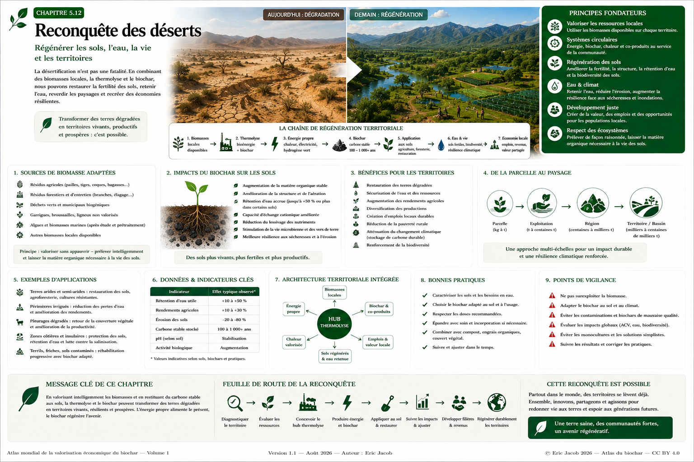

# Chapitre 5 — Reconquête des déserts : biochar, eau et régénération territoriale

> **Atlas mondial de la valorisation économique du biochar — Volume 1**  
> Version 1.1 — Août 2026 · Auteur : Eric Jacob

**[← Guide de l’acheteur](ch5_fr_guide_acheteur.md) · [↑ Sommaire de l’Atlas](README.md) · [Territoires & résilience →](ch5_fr_territoires_resilience.md)**

---

## Régénérer les sols, l’eau, la vie et les territoires

La désertification et la dégradation des terres ne sont pas un problème unique et ne disposent pas d’une solution universelle. Elles résultent de combinaisons variables : climat, érosion, perte de matière organique, pratiques agricoles, pression sur l’eau, salinisation, incendies, déforestation, surexploitation ou abandon des terres.

Le biochar ne « reverdit » donc pas mécaniquement un désert. En revanche, **dans les sols, climats et systèmes agronomiques appropriés**, il peut devenir une composante d’une stratégie plus large associant restauration de la matière organique, couverture végétale, gestion de l’eau, composts, agroforesterie et économie circulaire.

L’enjeu dépasse l’amendement d’une parcelle : il consiste à organiser une boucle territoriale dans laquelle certaines biomasses locales sont transformées par thermolyse en **biochar et flux énergétiques utiles**, puis réinjectées dans une économie qui restaure progressivement ses sols.



**Figure 1 — Reconquête des déserts : de terres dégradées à des territoires régénérés.**  
L’infographie illustre une architecture prospective. Les performances réelles dépendent du sol, du climat, du biochar, de la dose, de l’eau et des pratiques. Les valeurs chiffrées visibles sont illustratives et ne doivent pas être interprétées comme des performances universelles.  
© Eric Jacob 2026 — Atlas mondial du biochar — CC BY 4.0.

---

## 1. La reconquête commence par un diagnostic

Avant d’apporter du biochar, il faut comprendre pourquoi le territoire se dégrade.

Le diagnostic peut intégrer :

- texture et structure des sols ;
- carbone organique ;
- pH ;
- salinité ;
- capacité de rétention en eau ;
- infiltration et ruissellement ;
- érosion éolienne et hydrique ;
- climat et pluviométrie ;
- végétation existante ;
- biodiversité ;
- ressources hydriques ;
- usages agricoles et pastoraux ;
- disponibilité réelle des biomasses ;
- contraintes économiques et sociales.

> **Un sol sec n’est pas nécessairement un sol dégradé, et un désert naturel n’est pas une terre à convertir.**

L’objectif est la restauration des terres dégradées et des systèmes humains vulnérables, pas l’artificialisation des écosystèmes désertiques naturels.

---

## 2. Préserver avant de prélever

La thermolyse a besoin de matière, mais une politique de régénération ne peut pas appauvrir les écosystèmes pour alimenter les installations.

La ressource mobilisable doit être distinguée de la ressource théorique :

```text
BIOMASSE THÉORIQUE
− MATIÈRE À LAISSER AU SOL
− USAGES EXISTANTS
− CONTRAINTES DE BIODIVERSITÉ
− RESSOURCES NON DURABLES
− PERTES ET CONTRAINTES LOGISTIQUES
= BIOMASSE POTENTIELLEMENT MOBILISABLE
```

Cette règle est fondamentale : **prélever intelligemment et restituer durablement du carbone aux sols**.

---

## 3. Quelles biomasses ?

Selon le territoire, les flux à étudier peuvent comprendre :

- résidus agricoles ;
- tailles et élagages ;
- résidus forestiers réellement mobilisables ;
- sous-produits agro-industriels ;
- certaines biomasses urbaines biogéniques ;
- résidus d’entretien des territoires ;
- biomasses invasives lorsque leur valorisation est écologiquement pertinente ;
- certaines biomasses marines après caractérisation et prétraitement appropriés.

Aucune catégorie n’est automatiquement adaptée. Humidité, sels, contaminants, minéraux, usages concurrents et logistique doivent être étudiés.

---

## 4. La thermolyse comme nœud territorial

Une installation de thermolyse ne produit pas uniquement du biochar.

Selon la technologie et l’architecture du projet, elle peut s’inscrire dans une boucle :

```text
BIOMASSES LOCALES
       ↓
THERMOLYSE
       ↓
BIOCHAR + GAZ / ÉNERGIE + CHALEUR + COPRODUITS
       ↓
SOLS / AGRICULTURE / MATÉRIAUX
       +
CONSOMMATEURS ÉNERGÉTIQUES LOCAUX
       ↓
VALEUR ÉCONOMIQUE TERRITORIALE
```

La valeur du système dépend de la capacité à trouver **des usages réels** pour chacun des flux.

Une chaleur sans consommateur proche n’a pas la même valeur qu’une chaleur substituant effectivement une consommation existante.

---

## 5. Pourquoi le biochar peut aider certains sols dégradés

Selon ses caractéristiques et le contexte, le biochar peut contribuer à modifier :

- structure ;
- porosité ;
- rétention en eau ;
- capacité d’échange ;
- habitat microbien ;
- disponibilité de certains nutriments ;
- stabilité de la matière carbonée ;
- résistance à certaines formes d’érosion.

Ces effets sont variables.

Ils dépendent notamment :

```text
EFFET = f(SOL, BIOCHAR, DOSE, CLIMAT, EAU, CULTURE, PRATIQUES, TEMPS)
```

Il faut donc mesurer plutôt que promettre.

---

## 6. L’eau : ressource centrale

Dans les zones arides et semi-arides, la stratégie doit être pensée autour de l’eau.

Le biochar peut être étudié avec :

- récupération des eaux pluviales ;
- irrigation raisonnée ;
- goutte-à-goutte ;
- paillage ;
- couverture végétale ;
- compost ;
- microbassins ;
- agroforesterie ;
- restauration des sols.

L’objectif n’est pas simplement de « retenir plus d’eau », mais d’améliorer l’efficacité avec laquelle le système sol-plante utilise une ressource limitée.

---

## 7. Le biochar ne remplace pas la matière organique vivante

Un sol fertile ne se résume pas à du carbone stable.

Il a également besoin :

- de racines ;
- de microorganismes ;
- de résidus organiques ;
- de nutriments ;
- de structure ;
- d’eau ;
- d’une couverture adaptée.

Le biochar peut constituer une **infrastructure carbonée durable**, mais il doit généralement s’intégrer à un système biologique plus large.

---

## 8. Combiner biochar et compost

Une stratégie fréquemment étudiée consiste à associer biochar et matières organiques biologiquement actives.

Conceptuellement :

```text
BIOCHAR
+ COMPOST / MATIÈRE ORGANIQUE
+ EAU
+ COUVERTURE VÉGÉTALE
+ PRATIQUES ADAPTÉES
        ↓
SYSTÈME DE RESTAURATION
```

La formulation, les doses et les conditions d’application doivent être déterminées localement.

---

## 9. Du kilogramme au territoire

La montée en échelle doit être progressive.

| Échelle | Objectif |
|---|---|
| laboratoire | caractériser sol et biochar |
| micro-parcelle | détecter effets et risques |
| parcelle | vérifier la reproductibilité |
| exploitation | tester économie et logistique |
| bassin territorial | intégrer eau, biomasse, énergie et débouchés |
| région | coordonner infrastructures et politiques |

Une réussite à petite échelle ne garantit pas automatiquement une réussite régionale.

---

## 10. Agriculture et sécurité alimentaire

Sur des terres agricoles dégradées, une amélioration durable de la productivité peut :

- réduire la vulnérabilité ;
- améliorer les revenus ;
- renforcer la sécurité alimentaire ;
- diminuer certaines pressions d’expansion agricole ;
- faciliter la diversification des cultures.

Mais la priorité doit rester la **résilience du système**, pas la recherche d’un rendement maximal au prix de nouvelles dépendances.

---

## 11. Agroforesterie et végétation pérenne

Les arbres et plantes pérennes peuvent jouer plusieurs rôles :

- ombrage ;
- protection contre le vent ;
- stabilisation des sols ;
- habitat ;
- production de biomasse ;
- alimentation ;
- amélioration du microclimat ;
- stockage biologique du carbone.

Le biochar peut être étudié comme l’une des composantes de ces systèmes, notamment lors de l’implantation ou de la restauration.

---

## 12. Érosion et protection des sols

Un sol nu est vulnérable.

La restauration doit donc chercher à combiner :

```text
STRUCTURE DU SOL
+ COUVERTURE
+ RACINES
+ GESTION DE L'EAU
+ BRise-VENT
+ MATIÈRE ORGANIQUE
```

Le biochar seul ne remplace aucun de ces éléments.

---

## 13. Salinisation : prudence

Dans certains territoires arides, la salinité constitue une contrainte majeure.

Tous les biochars ne conviennent pas aux sols salins. Certaines biomasses peuvent elles-mêmes contenir des quantités importantes de sels.

Il faut donc analyser :

- conductivité ;
- composition minérale ;
- sodium et autres ions pertinents ;
- eau d’irrigation ;
- drainage ;
- évolution du sol.

La logique de l’Atlas reste : **caractériser avant d’appliquer**.

---

## 14. Biomasses marines et sargasses

Certaines régions accumulent d’importantes biomasses marines ou algales.

Elles peuvent constituer une piste de valorisation, mais leur utilisation thermochimique doit étudier :

- sels ;
- sable ;
- humidité ;
- éléments minéraux ;
- contaminants ;
- prétraitement ;
- corrosion ;
- qualité du biochar produit ;
- bilan énergétique du séchage.

Le **[Jumeau numérique](ch5_fr_jumeau_numerique.md)** peut être utilisé pour explorer des scénarios, mais seuls les essais réels permettent de valider la compatibilité industrielle.

---

## 15. Le carbone stable comme héritage

Une partie de l’intérêt du biochar réside dans la possibilité de transformer une fraction du carbone biogénique en formes plus persistantes.

Mais il faut distinguer :

```text
BIOCHAR PRODUIT
↓
CARBONE MESURÉ
↓
STABILITÉ ESTIMÉE
↓
ÉMISSIONS DE LA CHAÎNE
↓
RETRAIT NET ÉVENTUEL
↓
CERTIFICATION ÉVENTUELLE
```

Voir **[Métrologie du carbone](ch5_fr_metrologie_carbone.md)**.

La restauration d’un territoire et la certification carbone sont deux objectifs compatibles dans certains projets, mais ils ne doivent pas être confondus.

---

## 16. Restaurer sans créer une monoculture énergétique

Une stratégie de reconquête ne doit pas remplacer un territoire dégradé par une monoculture destinée uniquement à alimenter une usine.

Les ressources doivent être évaluées selon :

- biodiversité ;
- eau ;
- usages alimentaires ;
- usages traditionnels ;
- résilience ;
- qualité des sols ;
- bénéfices locaux.

La biomasse énergétique ou thermochimique doit rester compatible avec la santé du territoire.

---

## 17. L’énergie peut financer la restauration

La particularité d’une architecture thermochimique est de pouvoir associer **flux énergétique et carbone solide**.

Lorsque l’énergie, la chaleur ou d’autres coproduits trouvent des utilisateurs, ils peuvent contribuer au modèle économique du projet.

Cela ouvre une logique importante :

```text
ÉNERGIE UTILE
       +
BIOCHAR VALORISÉ
       +
CARBONE ÉVENTUELLEMENT CERTIFIÉ
       +
SERVICES TERRITORIAUX
       ↓
ÉCONOMIE DE LA RÉGÉNÉRATION
```

Il faut cependant éviter de compter plusieurs fois la même valeur environnementale.

---

## 18. Créer des emplois locaux

Une filière territoriale peut mobiliser :

- collecte ;
- préparation de biomasse ;
- exploitation industrielle ;
- maintenance ;
- laboratoires ;
- logistique ;
- agriculture ;
- compostage ;
- application ;
- suivi environnemental ;
- recherche.

La qualité des emplois, la sécurité et la formation font partie de la durabilité du projet.

---

## 19. Des hubs de régénération

La thermolyse peut devenir le cœur d’un **hub territorial** reliant plusieurs besoins.

```text
                    BIOCHAR → SOLS
                   ↗
BIOMASSES → THERMOLYSE → ÉNERGIE → CONSOMMATEURS
                   ↘
                    CHALEUR → ACTIVITÉS LOCALES
```

Autour de ce nœud peuvent s’organiser agriculture, serres, séchage, transformation agroalimentaire, matériaux, plateformes logistiques ou autres activités compatibles.

Cette architecture prépare le chapitre **[Territoires & résilience](ch5_fr_territoires_resilience.md)**.

---

## 20. Mesurer la reconquête

Une politique de restauration doit disposer d’un état initial.

Les indicateurs peuvent inclure :

- carbone organique du sol ;
- infiltration ;
- humidité ;
- stabilité structurale ;
- érosion ;
- couverture végétale ;
- biodiversité ;
- rendement ;
- consommation d’eau ;
- revenus ;
- emplois ;
- biochar appliqué et caractérisé.

Sans état initial, il devient difficile de démontrer une amélioration.

---

## 21. Suivre pendant des années

La restauration des sols est un processus temporel.

Le suivi peut distinguer :

```text
T0 : ÉTAT INITIAL
T1 : APRÈS APPLICATION
T2 : PREMIÈRES SAISONS
T3 : MOYEN TERME
T4 : LONG TERME
```

Le **[Passeport numérique](ch5_fr_passeport_biochar.md)** peut identifier les lots et le **[Jumeau numérique](ch5_fr_jumeau_numerique.md)** relier les observations au contexte.

---

## 22. Économie réelle avant scénario idéal

Un projet doit intégrer :

- coût de la biomasse ;
- préparation ;
- installation ;
- énergie ;
- maintenance ;
- transport ;
- biochar ;
- application ;
- eau ;
- suivi ;
- financement ;
- revenus réellement accessibles.

La rentabilité ne doit pas dépendre exclusivement d’un prix futur hypothétique du carbone.

---

## 23. Risques à intégrer

Les principaux risques comprennent :

- surexploitation de biomasse ;
- biochar inadapté ;
- contamination ;
- salinisation ;
- manque d’eau ;
- échec agronomique ;
- incendie ;
- rupture logistique ;
- modèle économique fragile ;
- dépendance à une subvention ;
- conflits d’usage ;
- changement climatique.

Voir **[Gestion des risques](ch5_fr_gestion_risques.md)**.

---

## 24. Une méthode de déploiement

### Étape 1 — Diagnostiquer
Sol, eau, climat, biomasses, besoins et économie.

### Étape 2 — Caractériser
Analyser biomasses, biochars et risques.

### Étape 3 — Tester
Essais de procédé et essais agronomiques limités.

### Étape 4 — Concevoir
Dimensionner l’unité et les flux selon les ressources et débouchés.

### Étape 5 — Contractualiser
Sécuriser biomasse, énergie, biochar et utilisateurs.

### Étape 6 — Déployer progressivement
Passer de parcelles pilotes à des ensembles plus importants.

### Étape 7 — Mesurer
Suivre sols, eau, carbone, économie et biodiversité.

### Étape 8 — Corriger
Adapter procédé, biochar, dose et pratiques.

---

## 25. Un modèle réplicable, jamais copié aveuglément

Une architecture réussie dans un territoire ne doit pas être reproduite à l’identique ailleurs.

Ce qui peut être répliqué est **la méthode** :

```text
DIAGNOSTIC
→ RESSOURCES
→ PROCÉDÉ
→ PRODUITS
→ USAGES
→ MESURE
→ APPRENTISSAGE
```

Les paramètres, eux, doivent rester locaux.

---

## 26. Une vision mondiale

Les terres dégradées représentent simultanément un défi écologique, agricole, social et économique.

Le biochar ne constitue pas à lui seul la réponse. Mais associé à une gestion intelligente de la biomasse, de l’eau, des sols et de l’énergie, il peut devenir l’une des briques d’une **économie de régénération**.

L’ambition n’est pas de transformer tous les déserts en champs.

Elle est plus précise :

> **restaurer les terres que l’activité humaine et les changements environnementaux ont dégradées, protéger les écosystèmes naturels, et construire des territoires capables de produire de la nourriture, de l’énergie et de la valeur sans épuiser leur capital naturel.**

---

## 27. De la reconquête au territoire résilient

La reconquête des terres ouvre une question plus large.

Que se passe-t-il lorsque la même architecture est reliée non seulement à des exploitations agricoles, mais également à :

- villages ;
- villes ;
- métropoles ;
- hôpitaux ;
- industries ;
- plateformes logistiques ;
- réseaux de chaleur ;
- grands consommateurs énergétiques ;
- datacenters ?

La thermolyse devient alors potentiellement une **infrastructure territoriale multi-services** : elle valorise certaines biomasses, produit du biochar, fournit des flux énergétiques et crée des boucles locales de matière et de valeur.

C’est l’objet du chapitre suivant :

**[Territoires & résilience : du biochar aux infrastructures territoriales](ch5_fr_territoires_resilience.md)**.

---

## Conclusion

La reconquête des terres dégradées ne sera durable que si écologie et économie cessent d’être pensées séparément.

Une boucle territoriale bien conçue peut chercher simultanément à :

```text
PRÉSERVER LES RESSOURCES
+ VALORISER CERTAINES BIOMASSES
+ PRODUIRE UNE ÉNERGIE UTILE
+ RESTITUER DU CARBONE STABLE
+ AMÉLIORER LES SOLS
+ ÉCONOMISER L'EAU
+ CRÉER DE LA VALEUR LOCALE
+ MESURER LES RÉSULTATS
```

Le rêve porté par cette partie de l’Atlas n’est donc pas celui d’une technologie qui « sauve » seule un désert.

C’est celui de **territoires qui retrouvent progressivement l’eau, les sols, la végétation, la biodiversité et une économie capable d’entretenir cette régénération dans le temps**.

---

## Figure et documents associés

- [Infographie — Reconquête des déserts](ch5_fr_reconquete_deserts.png)
- [Gestion des risques](ch5_fr_gestion_risques.md)
- [Guide de l’acheteur](ch5_fr_guide_acheteur.md)
- [Métrologie du carbone](ch5_fr_metrologie_carbone.md)
- [Jumeau numérique](ch5_fr_jumeau_numerique.md)
- [Passeport numérique](ch5_fr_passeport_biochar.md)
- [Analyse du cycle de vie](ch4_fr_analyse_cycle_vie.md)
- [Territoires & résilience](ch5_fr_territoires_resilience.md)

---

**[← Guide de l’acheteur](ch5_fr_guide_acheteur.md) · [↑ Sommaire de l’Atlas](README.md) · [Territoires & résilience →](ch5_fr_territoires_resilience.md)**

---

*Atlas mondial de la valorisation économique du biochar — Eric Jacob — Version 1.1 — Août 2026*  
*Licence : Creative Commons CC BY 4.0*
