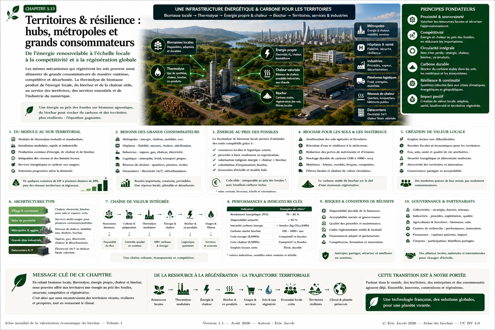

# Chapitre 5 — Territoires & résilience : hubs, infrastructures et solutions par décideur

> **Atlas mondial de la valorisation économique du biochar — Volume 1**  
> Version 1.2 — Août 2026 · Auteur : Eric Jacob

**[← Reconquête des déserts](ch5_fr_reconquete_deserts.md) · [↑ Sommaire de l’Atlas](README.md) · [Feuille de route 2050 →](ch5_fr_feuille_route_2050.md)**

---

<a id="sommaire-sectoriel"></a>

## Accès direct — Quel est votre secteur ?

Cette page est conçue comme une **porte d’entrée pour les décideurs**.  
Chaque lien conduit directement au cas d’usage correspondant.

| Je suis… | Mon enjeu principal | Accès direct |
|---|---|---|
| Collectivité / métropole | énergie, chaleur, résilience, flux territoriaux | [Métropoles](#metropoles) |
| Direction RSE / ESG | décarbonation, ACV, Scope 1–2–3, MRV | [RSE / ESG](#rse-esg) |
| Direction industrielle | chaleur, gaz, H₂, compétitivité | [Industries](#industries) |
| Datacenter / campus IA | énergie pilotable 24/7, chaleur fatale | [Datacenters](#datacenters) |
| Hôpital / infrastructure critique | continuité énergétique, chaleur | [Hôpitaux](#hopitaux) |
| Logisticien / distributeur | entrepôts, froid, transport, flux | [Logistique & distribution](#logistique) |
| Port / zone industrialo-portuaire | énergie, molécules, transport, industries | [Ports](#ports) |
| Aéroport / aviation | SAF et décarbonation des carburants | [Aviation / SAF](#aviation) |
| Agroalimentaire / chaîne du froid | résidus, froid, chaleur, énergie | [Agroalimentaire](#agroalimentaire) |
| Agriculture / coopérative | résidus, sols, biochar, énergie | [Agriculture](#agriculture) |
| Réseau de chaleur / immobilier | substitution du gaz, chaleur locale | [Chaleur urbaine](#chaleur) |
| Défense / base isolée | autonomie, résilience, logistique énergétique | [Défense](#defense) |
| Forêt / SDIS / territoire | prévention incendie, résidus forestiers | [Forêts & incendies](#forets) |
| Producteur de carburants / chimie | syngaz, H₂, méthanol, molécules | [Molécules renouvelables](#molecules) |
| Financeur / investisseur | bancabilité, contrats, risques | [Finance](#finance) |
| Responsable carbone | biochar, permanence, crédits carbone | [Carbone & MRV](#carbone) |

[Retour au sommaire sectoriel](#sommaire-sectoriel)

---

## Le principe : chercher les intersections, pas les machines

La question n’est pas d’abord : **« Où installer une unité ? »**

La question est :

> **Où se rencontrent une ressource de biomasse durablement mobilisable, un besoin énergétique réel, une possibilité de valoriser la chaleur ou les molécules produites, un débouché pour le biochar/biocarbone et une volonté de décarbonation ?**

```text
BIOMASSES / RÉSIDUS
        ↓
THERMOLYSE
        ↓
┌─────────────────────────────────────────────┐
│ GAZ / ÉNERGIE │ CHALEUR │ H₂ / MOLÉCULES  │
│ BIOCHAR / BIOCARBONE selon configuration   │
└─────────────────────────────────────────────┘
        ↓
INDUSTRIES + SERVICES + TERRITOIRES + SOLS
        ↓
DÉCARBONATION + RÉSILIENCE + VALEUR LOCALE
```



**Figure 1 — Le hub territorial multi-énergies.**  
Une même infrastructure peut servir plusieurs marchés, mais chaque projet doit être dimensionné selon les ressources, les besoins, la réglementation et les performances réellement démontrées. © Eric Jacob 2026 — Atlas mondial du biochar — CC BY 4.0.

---

<a id="haffner"></a>

## Haffner Energy : cas industriel français étudié dans l’Atlas

L’Atlas est consacré au biochar, mais celui-ci est replacé dans le système thermochimique qui le produit. Haffner Energy constitue un cas industriel français particulièrement intéressant pour étudier cette articulation entre biomasse, thermolyse, gaz renouvelable, énergie, hydrogène et carbone biogénique.

Les informations disponibles en 2026 distinguent plusieurs architectures et gammes. Certaines communications évoquent notamment des ordres de grandeur autour de **1,7 MW / 50 kg H₂/h** pour certaines configurations CORE/C-iC et jusqu’à environ **17 MW / 500 kg H₂/h** pour des architectures SCALE. D’autres communications historiques ou techniques ont utilisé des valeurs différentes.

**L’Atlas conserve volontairement cette ambiguïté lorsqu’elle n’est pas publiquement résolue.** Les spécifications commerciales doivent être vérifiées au moment de chaque projet.

De même, il faut distinguer les configurations privilégiant davantage la valorisation énergétique du carbone de celles facilitant la conservation d’une fraction plus importante sous forme de biochar/biocarbone. Le bilan matière exact dépend de l’architecture réelle.

[↑ Accès direct](#sommaire-sectoriel)

---

<a id="rse-esg"></a>

## Direction RSE / ESG — transformer la technologie en trajectoire mesurable

Pour une direction RSE, le sujet n’est pas « acheter de la thermolyse ». Il est de réduire des impacts démontrables.

Une étude doit distinguer :

- **Scope 1** : combustibles fossiles directement consommés par le site ;
- **Scope 2** : électricité ou énergie achetée ;
- **Scope 3** : chaîne d’approvisionnement, transport, matières, produits et fin de vie selon le périmètre ;
- émissions biogéniques ;
- retraits de carbone éventuels ;
- émissions évitées, qui ne doivent pas être confondues avec les retraits.

La thermolyse peut être pertinente lorsqu’elle substitue effectivement une énergie fossile, valorise un résidu pertinent ou produit un biochar dont la permanence est correctement démontrée.

### Dossier qu’une direction RSE devrait demander

```text
ÉTAT INITIAL
+ PÉRIMÈTRE
+ ACV
+ TRAÇABILITÉ BIOMASSE
+ MESURES ÉNERGÉTIQUES
+ BILAN CARBONE
+ MÉTROLOGIE BIOCHAR
+ MRV
+ RISQUES
+ INDICATEURS ANNUELS
```

Voir [Analyse du cycle de vie](ch4_fr_analyse_cycle_vie.md), [Métrologie du carbone](ch5_fr_metrologie_carbone.md) et [Passeport numérique](ch5_fr_passeport_biochar.md).

[↑ Accès direct](#sommaire-sectoriel)

---

<a id="metropoles"></a>

## Métropoles et collectivités — organiser les flux du territoire

Une métropole concentre simultanément :

- bâtiments publics ;
- hôpitaux ;
- réseaux de chaleur ;
- activités économiques ;
- infrastructures numériques ;
- plateformes logistiques ;
- flux de biomasse et résidus biogéniques ;
- espaces verts et agriculture périurbaine.

La collectivité peut jouer un rôle d’**orchestrateur** : cartographier les ressources, rapprocher producteurs et consommateurs, faciliter le foncier et intégrer énergie, chaleur, carbone et sols dans une stratégie territoriale cohérente.

Le meilleur site n’est pas nécessairement celui qui possède le plus de biomasse ou le plus grand consommateur : c’est souvent celui où **plusieurs flux se complètent**.

[↑ Accès direct](#sommaire-sectoriel)

---

<a id="industries"></a>

## Industries — décarboner chaleur, gaz et molécules

L’industrie constitue l’un des débouchés les plus naturels lorsque les besoins thermiques sont réguliers.

Applications à étudier :

- chaleur de procédé ;
- vapeur ;
- substitution partielle de gaz fossile ;
- gaz renouvelable ;
- hydrogène selon configuration ;
- méthanol ou autres dérivés du syngaz ;
- biocarbone pour certains usages industriels.

Pour une direction industrielle, les critères décisifs sont généralement :

```text
PRIX DE L'ÉNERGIE UTILE
+ DISPONIBILITÉ
+ QUALITÉ DU GAZ / PRODUIT
+ CAPEX / OPEX
+ CONTRAT BIOMASSE
+ MAINTENANCE
+ CO₂ ÉVITÉ
+ RISQUE INDUSTRIEL
```

L’objectif de compétitivité avec les fossiles doit être démontré site par site, et non présenté comme un prix universel.

[↑ Accès direct](#sommaire-sectoriel)

---

<a id="datacenters"></a>

## Datacenters et campus IA — énergie pilotable et chaleur fatale

Les datacenters cumulent trois caractéristiques :

1. forte consommation électrique ;
2. besoin de disponibilité 24/7 ;
3. rejet d’une quantité importante de chaleur.

Une architecture territoriale peut donc étudier :

```text
THERMOLYSE → GAZ / ÉNERGIE PILOTABLE → DATACENTER
                                         ↓
                                   CHALEUR FATALE
                                         ↓
                       RÉSEAU / SERRES / INDUSTRIE
```

La puissance du gaz produit ne doit jamais être confondue avec la puissance électrique nette :

$P_{élec} = P_{gaz} \times \eta_{conversion} - P_{auxiliaires}$

Un datacenter critique conserve également réseau, redondances, stockage et secours adaptés.

Le biochar éventuellement coproduit n’a pas besoin d’être consommé par le datacenter : il peut alimenter agriculture, matériaux ou marchés carbone dans le même territoire.

[↑ Accès direct](#sommaire-sectoriel)

---

<a id="hopitaux"></a>

## Hôpitaux — décarboner sans compromettre la continuité de service

Un hôpital consomme continuellement :

- électricité ;
- chaleur ;
- eau chaude ;
- froid ;
- parfois vapeur.

La thermolyse peut être étudiée comme source locale complémentaire, particulièrement lorsque chaleur et électricité peuvent toutes deux être valorisées.

Mais la priorité absolue reste la continuité des fonctions vitales. Une solution renouvelable ne remplace pas les obligations de redondance, les groupes de secours ou les règles propres aux établissements de santé.

L’intérêt pour un directeur d’hôpital est donc double : **décarbonation + résilience**, à condition que l’architecture énergétique soit conçue comme une infrastructure critique.

[↑ Accès direct](#sommaire-sectoriel)

---

<a id="logistique"></a>

## Hubs logistiques et distribution — là où convergent matières, énergie et transport

Les plateformes logistiques sont particulièrement intéressantes parce qu’elles possèdent déjà ce que beaucoup de projets doivent construire :

- accès routier ;
- parfois rail ou voie d’eau ;
- pesage ;
- stockage ;
- manutention ;
- entrepôts ;
- froid ;
- flottes ;
- grands consommateurs électriques ;
- organisation de flux entrants et sortants.

Elles peuvent donc devenir de véritables **carrefours de décarbonation**.

### Centre de distribution

Un grand centre de distribution peut combiner :

```text
ÉLECTRICITÉ DES ENTREPÔTS
+ FROID
+ CHARGE DES VÉHICULES
+ CHAUFFAGE
+ FLUX DE MARCHANDISES
+ RETOURS / EMBALLAGES / RÉSIDUS PERTINENTS
```

Une implantation thermochimique proche peut alimenter certains besoins énergétiques tandis que les infrastructures logistiques existantes facilitent la réception de biomasses et l’expédition du biochar ou d’autres produits.

### Hub multimodal

Lorsque route, rail, fleuve ou port se rencontrent, le hub peut réduire le coût logistique de ressources pondéreuses.

Il devient possible de raisonner non seulement en kilomètres mais en :

$C_{log} = f(distance,\ masse,\ mode,\ humidité,\ densité,\ stockage)$

### Chaînes nationales de distribution

Pour un grand groupe disposant de dizaines d’entrepôts, la démarche peut commencer par classer les sites :

```text
BIOMASSE À PROXIMITÉ
× BESOIN ÉNERGÉTIQUE
× CHALEUR VALORISABLE
× INFRASTRUCTURES
× FONCIER
× DÉBOUCHÉS BIOCHAR
```

Les meilleurs sites deviennent des démonstrateurs réplicables.

[↑ Accès direct](#sommaire-sectoriel)

---

<a id="ports"></a>

## Ports et zones industrialo-portuaires — hubs énergétiques naturels

Un port concentre :

- industries ;
- stockage ;
- transport lourd ;
- navires ;
- rail et route ;
- besoins thermiques ;
- grands réseaux électriques ;
- import/export de matières.

C’est donc un emplacement naturel pour étudier des chaînes :

```text
BIOMASSE / RÉSIDUS
      ↓
THERMOLYSE
      ↓
SYNGAS / H₂ / MOLÉCULES / CHALEUR
      ↓
INDUSTRIES + MOBILITÉ + CARBURANTS
```

Le biochar ou biocarbone peut parallèlement être distribué par les infrastructures portuaires vers des marchés régionaux ou internationaux.

La prudence essentielle concerne la provenance des biomasses : un port facilite l’importation, mais **une biomasse transportée sur de longues distances n’est pas automatiquement durable ou économiquement pertinente**.

[↑ Accès direct](#sommaire-sectoriel)

---

<a id="aviation"></a>

## Aéroports et aviation — la voie SAF

La décarbonation de l’aviation nécessite des carburants compatibles avec des contraintes énergétiques très élevées.

Le syngaz issu de ressources biogéniques peut constituer un intermédiaire vers des molécules et carburants de synthèse, sous réserve :

- du procédé aval ;
- du rendement global ;
- de la qualité des intrants ;
- de l’hydrogène complémentaire éventuel ;
- de la certification ;
- de l’ACV complète.

Pour un aéroport, l’intérêt territorial peut dépasser le carburant : chaleur, logistique, fret, zones industrielles et grands consommateurs peuvent créer un véritable **hub aéroportuaire énergétique**.

Les articles existants du dépôt sur le SAF constituent une base d’analyse sectorielle ; leurs chiffres techniques doivent être réactualisés avant réemploi dans un dossier commercial.

[↑ Accès direct](#sommaire-sectoriel)

---

<a id="agroalimentaire"></a>

## Agroalimentaire et chaîne du froid — fermer la boucle

Une plateforme agroalimentaire peut disposer simultanément :

- de résidus biogéniques ;
- de besoins de séchage ;
- de vapeur ou chaleur ;
- de froid ;
- d’électricité ;
- de flux logistiques ;
- de producteurs agricoles à proximité.

Cela permet une boucle particulièrement cohérente :

```text
PRODUCTION AGRICOLE
      ↓
TRANSFORMATION → RÉSIDUS PERTINENTS
      ↓
THERMOLYSE → ÉNERGIE POUR TRANSFORMATION / FROID
      ↓
BIOCHAR selon configuration
      ↓
RETOUR VERS LES SOLS lorsque pertinent
```

Chaque résidu doit cependant être comparé à ses usages existants : alimentation animale, compostage, méthanisation ou valorisation matière peuvent parfois être préférables.

[↑ Accès direct](#sommaire-sectoriel)

---

<a id="agriculture"></a>

## Agriculture et coopératives — énergie, résidus et sols

Une coopérative peut agréger des volumes de résidus que des exploitations isolées ne pourraient pas valoriser économiquement.

Elle peut aussi mutualiser :

- préparation des biomasses ;
- stockage ;
- analyses ;
- production énergétique ;
- distribution du biochar ;
- essais agronomiques ;
- traçabilité.

Le retour du biochar aux sols n’est pertinent que si sa qualité et les besoins du sol le justifient.

La boucle idéale n’est donc pas « tout résidu devient biochar », mais :

> **chaque flux est orienté vers l’usage qui crée la meilleure valeur agronomique, énergétique, économique et environnementale.**

[↑ Accès direct](#sommaire-sectoriel)

---

<a id="chaleur"></a>

## Réseaux de chaleur, quartiers et grands ensembles immobiliers

La chaleur est souvent la ressource oubliée des projets énergétiques.

Les consommateurs possibles comprennent :

- logements collectifs ;
- bâtiments publics ;
- piscines ;
- universités ;
- campus ;
- centres commerciaux ;
- serres ;
- établissements de santé.

Une unité proche d’un réseau existant peut avoir une valeur différente d’une unité identique sans débouché thermique.

La cartographie doit donc relier **température, puissance, distance et saisonnalité**.

[↑ Accès direct](#sommaire-sectoriel)

---

<a id="defense"></a>

## Défense, bases isolées et infrastructures stratégiques

Pour une base militaire ou une infrastructure isolée, la question principale est la résilience :

- dépendance aux livraisons de carburants ;
- vulnérabilité du réseau ;
- disponibilité de ressources locales ;
- stockage ;
- capacité de fonctionnement en mode dégradé.

Une production locale à partir de ressources appropriées peut contribuer à une architecture multi-source.

Elle ne doit pas être présentée comme une autonomie absolue : pièces, maintenance, biomasse, eau, réseaux et systèmes de secours restent des dépendances critiques.

Cette logique s’étend aux îles, mines, chantiers isolés, bases scientifiques et certains sites de sécurité civile.

[↑ Accès direct](#sommaire-sectoriel)

---

<a id="forets"></a>

## Forêts, prévention des incendies et entretien des territoires

L’entretien préventif peut générer des biomasses ligneuses dont la valorisation est parfois coûteuse.

Une filière locale peut étudier :

```text
DÉBROUSSAILLEMENT / RÉSIDUS
          ↓
COLLECTE RAISONNÉE
          ↓
THERMOLYSE
          ↓
ÉNERGIE + CARBONE SOLIDE selon configuration
```

Mais l’objectif énergétique ne doit jamais conduire à retirer le bois mort nécessaire aux écosystèmes ou à surexploiter la forêt.

Le bénéfice potentiel réside dans la possibilité de donner une valeur économique à **une fraction des opérations de prévention qui doivent de toute façon être réalisées**.

[↑ Accès direct](#sommaire-sectoriel)

---

<a id="molecules"></a>

## Hydrogène, méthanol et molécules renouvelables

Le gaz de synthèse est une plateforme chimique potentielle.

Selon sa composition et les procédés aval, il peut ouvrir des voies vers :

- hydrogène ;
- méthanol ;
- méthane de synthèse ;
- carburants ;
- intermédiaires chimiques.

Pour un décideur, il faut comparer la chaîne complète :

```text
BIOMASSE
→ PRÉPARATION
→ THERMOLYSE
→ CONDITIONNEMENT DU GAZ
→ CONVERSION
→ PURIFICATION
→ PRODUIT FINAL
```

Le rendement et le coût du produit final ne peuvent être déduits de la seule puissance thermique du syngaz.

[↑ Accès direct](#sommaire-sectoriel)

---

<a id="carbone"></a>

## Biochar, carbone durable et crédits carbone

La valeur carbone peut être importante dans les configurations qui conservent effectivement une fraction appropriée du carbone sous forme de biochar.

Mais :

```text
1 t BIOCHAR
≠ 1 t CARBONE
≠ 1 t CO₂ RETIRÉ
≠ 1 CRÉDIT CARBONE
```

Il faut relier :

- masse sèche ;
- carbone mesuré ;
- stabilité ;
- origine de biomasse ;
- émissions de la chaîne ;
- usage final ;
- permanence ;
- MRV ;
- référentiel de certification ;
- absence de double comptage.

Une direction carbone doit donc considérer le biochar comme un **actif physique mesurable**, avant de le considérer comme un actif financier.

Voir [Métrologie du carbone](ch5_fr_metrologie_carbone.md).

[↑ Accès direct](#sommaire-sectoriel)

---

<a id="finance"></a>

## Investisseurs, banques et directions financières — rendre le hub bancable

Un hub multi-produits peut disposer de plusieurs revenus :

- énergie ;
- chaleur ;
- gaz ;
- molécules ;
- biochar/biocarbone ;
- carbone certifié lorsqu’éligible ;
- services de valorisation de certains flux.

Mais davantage de revenus signifie aussi davantage de contrats.

La bancabilité repose notamment sur :

```text
CONTRAT BIOMASSE
+ CONTRAT ÉNERGIE
+ DÉBOUCHÉ CHALEUR
+ DÉBOUCHÉ BIOCHAR
+ DISPONIBILITÉ TECHNOLOGIQUE
+ GARANTIES
+ FINANCEMENT
+ ASSURANCE
```

Le scénario de base doit rester viable sans attribuer simultanément à chaque coproduit sa valeur maximale théorique.

[↑ Accès direct](#sommaire-sectoriel)

---

<a id="matrice"></a>

## Matrice générale des opportunités

| Secteur | Électricité | Chaleur | Gaz/H₂/molécules | Biochar | Résidus locaux | Valeur carbone |
|---|:---:|:---:|:---:|:---:|:---:|:---:|
| Métropole | ● | ● | ○ | ● | ● | ● |
| Industrie | ● | ● | ● | ○ | ○ | ● |
| Datacenter | ●● | ○* | ○ | ○ | ○ | ● |
| Hôpital | ●● | ● | ○ | ○ | ○ | ● |
| Logistique | ● | ● | ● | ○ | ○ | ● |
| Port | ● | ● | ●● | ● | ● | ● |
| Aéroport | ● | ○ | ●● | ○ | ○ | ● |
| Agroalimentaire | ● | ●● | ○ | ● | ●● | ● |
| Agriculture | ○ | ● | ○ | ●● | ●● | ●● |
| Réseau chaleur | ○ | ●● | ● | ○ | ● | ● |
| Défense / isolé | ●● | ● | ● | ○ | ● | ○ |
| Forêt / incendies | ○ | ● | ○ | ● | ●● | ● |

`●●` : synergie potentiellement structurante · `●` : synergie possible · `○` : dépend fortement du projet.  
`*` Pour un datacenter, la chaleur valorisable est principalement la chaleur fatale du datacenter lui-même ; son niveau de température et son débouché doivent être étudiés.

Cette matrice est un outil d’orientation, pas une étude de faisabilité.

[↑ Accès direct](#sommaire-sectoriel)

---

<a id="selection"></a>

## Comment sélectionner les meilleurs projets ?

Une présélection territoriale peut utiliser six axes :

$S = w_BB + w_EE + w_CC + w_LL + w_DD + w_RR$

avec :

- $B$ : qualité et sécurité de la ressource biomasse ;
- $E$ : besoin énergétique substituable ;
- $C$ : potentiel de valorisation chaleur/coproduits ;
- $L$ : qualité logistique ;
- $D$ : débouchés biochar/biocarbone ;
- $R$ : contribution à la résilience et décarbonation.

Les poids $w_i$ dépendent du décideur.

Un datacenter donnera un poids élevé à la disponibilité énergétique ; une coopérative agricole au couple biomasse–sols ; un port à la logistique et aux molécules ; une direction RSE à l’ACV et à la réduction vérifiable.

---

<a id="decision"></a>

## Ce que chaque décideur doit pouvoir obtenir en une première étude

Une étude préliminaire devrait répondre à dix questions :

1. Quelles biomasses sont réellement disponibles ?
2. Quels usages existants ne doivent pas être détruits ?
3. Quel besoin énergétique peut être substitué ?
4. Quelle disponibilité est requise ?
5. La chaleur a-t-elle un débouché ?
6. Quel produit thermochimique est réellement recherché ?
7. Le biochar/biocarbone a-t-il un marché local ?
8. Quel est le bilan carbone complet ?
9. Le projet est-il compétitif sans hypothèses excessives ?
10. Quelle première tranche permet de démontrer le modèle ?

---

<a id="sources-depot"></a>

## Articles sectoriels déjà présents dans le dépôt

Cette synthèse s’appuie également sur les axes déjà explorés dans le dépôt **Manifeste de souveraineté technologique**, notamment :

- hôpital autonome et décarbonation ;
- autonomie énergétique tactique et défense ;
- agriculture et souveraineté alimentaire ;
- datacenters et intelligence artificielle ;
- logistique et transport ;
- SAF et aviation ;
- chauffage urbain ;
- indépendance territoriale en hydrogène ;
- prévention des feux de forêt ;
- modélisation économique H6 / S-iC et dérivés du syngas ;
- usages du biochar ;
- comparaison des sources d’énergie.

Ces articles constituent une **bibliothèque de cas d’usage et d’idées**. Lorsqu’ils contiennent des chiffres industriels anciens, ceux-ci doivent être vérifiés avant d’être réutilisés, car les gammes et communications techniques ont évolué.

---

## Conclusion — une porte d’entrée différente pour chaque décideur

La même infrastructure ne se vend pas avec le même argument à tout le monde.

Pour un directeur industriel, elle peut être une voie de substitution au gaz fossile.  
Pour un datacenter, une source potentielle d’énergie pilotable intégrée à un hub.  
Pour un logisticien, un moyen de relier énergie, transport et flux de matières.  
Pour un agriculteur, une boucle entre résidus, énergie et sols.  
Pour une métropole, une infrastructure territoriale.  
Pour une direction RSE, une trajectoire de décarbonation à mesurer.  
Pour un responsable carbone, une chaîne de preuve.  
Pour un investisseur, un ensemble de contrats et de revenus à rendre bancable.

> **La force de la thermolyse n’est donc pas de proposer une solution identique à tous les secteurs, mais de fournir une plateforme capable de relier des ressources locales à des besoins différents.**

L’étape suivante consiste à transformer ces cas d’usage en trajectoire de déploiement :

**[Feuille de route 2050 →](ch5_fr_feuille_route_2050.md)**

---

**[← Reconquête des déserts](ch5_fr_reconquete_deserts.md) · [↑ Sommaire de l’Atlas](README.md) · [Feuille de route 2050 →](ch5_fr_feuille_route_2050.md)**

---

*Atlas mondial de la valorisation économique du biochar — Eric Jacob — Version 1.2 — Août 2026*  
*Licence : Creative Commons CC BY 4.0*
