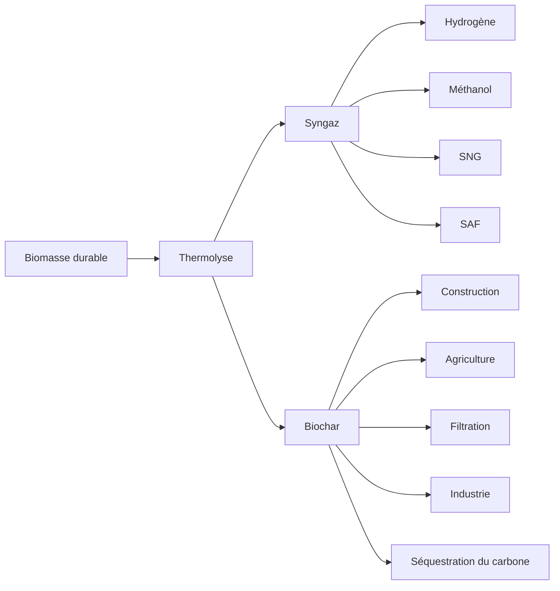

# Chapitre 1 — Le biochar : un matériau stratégique du XXIᵉ siècle

> **Le biochar se situe à la convergence de la transition énergétique, de l'économie circulaire et de la décarbonation industrielle. Longtemps considéré comme un simple coproduit de la thermolyse, il devient progressivement un matériau technique à forte valeur ajoutée.**

---

## Introduction

La lutte contre le changement climatique ne consiste plus uniquement à réduire les émissions de gaz à effet de serre. Elle implique également de développer des solutions capables de retirer durablement du carbone de l'atmosphère tout en créant une activité économique viable.

Le biochar répond à cette double exigence.

Produit à partir de biomasses renouvelables par thermolyse ou pyrolyse en atmosphère pauvre en oxygène, il concentre une partie importante du carbone initial sous une forme extrêmement stable.

Contrairement à une combustion classique qui libère immédiatement le carbone sous forme de CO₂, la thermolyse permet de conserver une fraction importante de ce carbone dans un solide poreux pouvant rester stable pendant plusieurs siècles, voire plusieurs millénaires selon les conditions de production et d'utilisation.

Cette propriété exceptionnelle explique l'intérêt croissant porté au biochar par :

- les industriels ;
- les producteurs d'énergie renouvelable ;
- les acteurs du bâtiment ;
- les marchés du carbone ;
- les collectivités ;
- les chercheurs.

---

# Le principe

---

# Les trois piliers du biochar

## 🌍 Environnement

Le biochar immobilise durablement une partie du carbone contenu dans la biomasse.

Il participe ainsi aux stratégies de retrait du carbone lorsque les critères scientifiques et les référentiels de certification sont respectés.

---

## 🏭 Industrie

Le biochar est désormais considéré comme un matériau technique.

Ses propriétés physiques peuvent être exploitées dans :

- les bétons bas carbone ;
- les ciments ;
- les composites ;
- la filtration ;
- certains matériaux avancés.

---

## 💰 Économie

Le biochar peut générer plusieurs flux de revenus :

- vente du matériau ;
- valorisation industrielle ;
- économies de matières premières ;
- certificats de retrait du carbone lorsque les conditions sont réunies.

Cette approche multifilière distingue le biochar de nombreuses autres technologies de décarbonation.

---

# Pourquoi le biochar attire-t-il autant d'investissements ?

Le biochar présente une caractéristique rare :

il combine simultanément :

✔ économie circulaire

✔ valorisation de déchets biomasse

✔ stockage durable du carbone

✔ création de matériaux techniques

✔ production d'énergie renouvelable

Peu de technologies permettent aujourd'hui de réunir ces cinq fonctions.

---

# Chiffres clés

| Indicateur | Ordre de grandeur |
|------------|------------------:|
| Température de thermolyse | 450 à 700 °C |
| Durée potentielle de stockage du carbone | plusieurs siècles à plusieurs millénaires |
| Principales biomasses | bois, bambou, résidus forestiers, coques végétales |
| Principaux débouchés | agriculture, bâtiment, filtration, industrie |
| Marchés associés | matériaux, énergie, carbone |

---

# À retenir

Le biochar n'est plus un simple résidu de procédé.

Il devient progressivement un matériau industriel capable de créer simultanément une valeur économique, environnementale et climatique.

Sa qualité dépend toutefois directement de la biomasse utilisée, du procédé de production et de sa destination finale.
