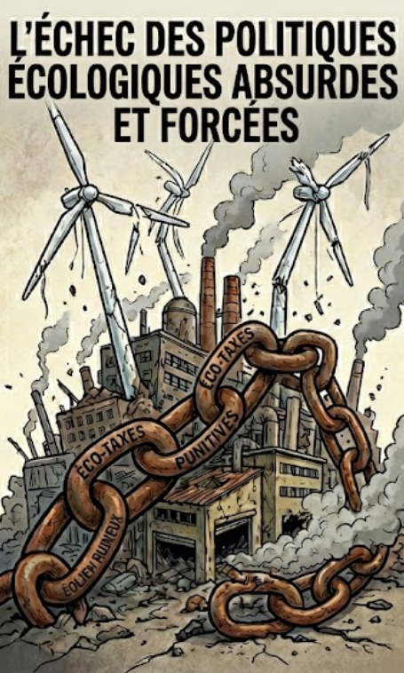
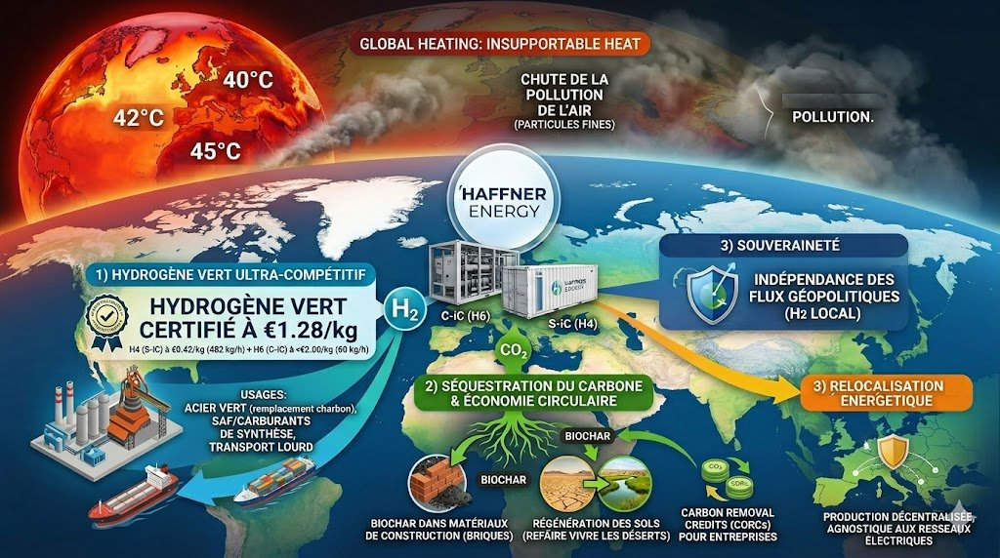
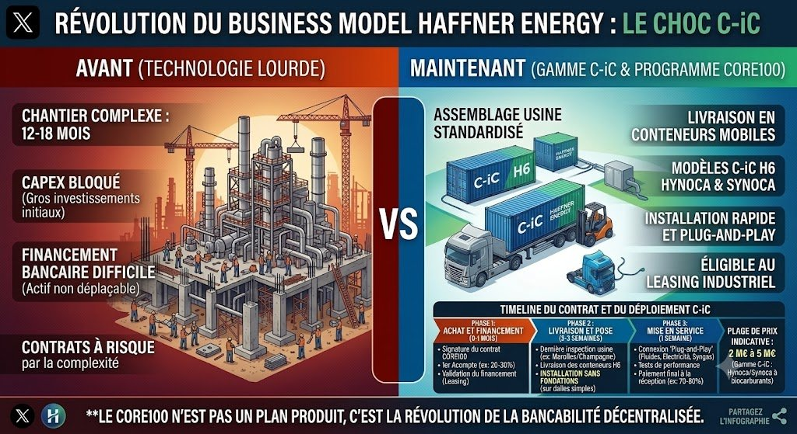

# MANIFESTE POUR LA SOUVERAINETÉ ET LA RÉSILIENCE TECHNOLOGIQUE

*Vers un écosystème national d\'autonomie énergétique, sanitaire et agricole*

Note Stratégique Indépendante - EJS - Juin 2026

## I. Constat : L\'érosion silencieuse de notre souveraineté

La France traverse une crise stratégique majeure, marquée par un décalage croissant entre ses capacités d\'innovation technologique et sa réalité industrielle. Sous couvert d\'orthodoxie administrative et
d\'une gestion court-termiste, nous sacrifions nos fleurons industriels sur l\'autel de la bureaucratie. Ce constat est sans appel : notre nation, historiquement pionnière dans l\'ingénierie et l\'énergie, est en train de perdre sa maîtrise technologique.

Pendant que nos PME de haute valeur, porteuses de ruptures majeures, sont soumises à une prédation financière acharnée, à des faillites évitables ou à l\'exil forcé vers des terres plus accueillantes, nos brevets sont captés par des puissances étrangères. Ces nations, plus pragmatiques, ont compris l\'urgence de s\'approprier les technologies de demain tandis que nous les abandonnons en haut lieu par manque de vision stratégique.

Le modèle énergétique que nous suivons actuellement est, à bien des égards, une impasse financière et écologique. Fondé sur une dépendance excessive aux réseaux centralisés et sur une confiance aveugle dans des technologies non écologiques comme l\'électrolyse produite avec des énergies fossiles ou nucléaires, si bien que cet hydrogène se retrouve en compétition avec les intelligences artificielles, les cryptomonnaies ou l'industrie, ce système crée de l'inflation, épuise nos ressources
financières et sature nos infrastructures électriques. L\'électrolyse en réseau agit comme un goulot d\'étranglement qui congestionne une infrastructure électrique nationale déjà saturée par l\'électrification massive des usages. En privilégiant des solutions qui consomment une énergie précieuse au lieu de la générer intelligemment, nous entrons dans un cercle vicieux au nom d'une écologie factice.

Cette stratégie fragilise non seulement notre économie, mais elle hypothèque également notre capacité à soutenir le développement futur de l\'intelligence artificielle et de la robotique, qui exigeront une puissance disponible massive, décentralisée et, surtout, souveraine. 
Chaque térawattheure gaspillé dans l\'électrolyse est un térawattheure arraché aux supercalculateurs et à la souveraineté numérique de la France. Il est temps de mettre fin à cet aveuglément qui promeut notre déclin industriel par l'entremise d'une rupture technologique immédiate et radicale.

La complaisance n\'est plus une option. Nous ne pouvons plus nous permettre de laisser nos ingénieurs et nos entrepreneurs être les architectes de la prospérité d\'autrui. La souveraineté ne se décrète pas ; elle se bâtit sur la maîtrise de la chaîne de valeur, du déchet à la ressource, de l\'atome à la machine. Il est impératif de restaurer une souveraineté industrielle qui ne repose plus sur l\'importation de solutions étrangères fragiles, instables, créant une dépendance et des
guerres, mais sur la valorisation locale et intelligente de notre biomasse et de nos gisements énergétiques.

Nous sommes à la croisée des chemins : soit nous continuons à regarder nos capacités de rebond s\'éroder jusqu'à l'effondrement, soit nous reprenons, dès aujourd\'hui, le contrôle total de notre destin technologique et énergétique par le déploiement massif de systèmes de thermolyse décentralisée.

## II. La Solution : La thermolyse de biomasse décentralisée à très fort rendement

**Le piège thermodynamique global : L\'illusion des énergies propres face à l\'urgence du puits de carbone**

L\'erreur conceptuelle majeure des politiques énergétiques actuelles réside dans l\'oubli des lois les plus élémentaires de la thermodynamique. Déployer massivement l\'électrolyse reposant sur le nucléaire ou un hydrogène d\'origine fossile mal compensé ne résout en rien la crise climatique si l\'on continue à saturer l\'atmosphère de vecteurs thermiques sans décarboner en parallèle. Toute production massive d\'énergie, même étiquetée comme propre, génère structurellement
une chaleur anthropique dissipée qui vient réchauffer l\'enveloppe terrestre. Or, tant que le stock de CO₂ historique reste présent dans l\'atmosphère, il agit comme une serre verrouillée, empêchant cette chaleur de s\'évacuer vers l\'espace. Vouloir consommer toujours plus d\'énergie dans un système saturé en carbone sans créer de puits de carbone simultané est une aberration physique.

À cet égard, l\'avènement imminent de l\'intelligence artificielle générative et de la robotique lourde va agir comme un accélérateur exponentiel de ce phénomène. Ce baby drill technologique --- l'usage frénétique, global et inconsidéré de la puissance de calcul et des flottes de machines --- va créer un appel d\'air énergétique sans précédent dans l\'histoire humaine, menant la Terre vers une impasse écologique irréversible si l\'infrastructure sous-jacente reste inchangée.

Dans ce contexte de tension absolue, la technologie de thermolyse développée par Haffner Energy s\'impose comme la seule architecture industrielle au monde capable de résoudre cette double équation simultanément : elle génère une énergie propre, hautement compétitive, tout en extrayant et en séquestrant définitivement le carbone sous forme de biochar solide. Elle ne se contente pas d\'être neutre ; elle est négative en carbone. Elle offre enfin une mission vertueuse à la
révolution robotique : plutôt que de saturer les réseaux, les systèmes automatisés et les robots de demain doivent être mis au service de la dépollution active de la planète---notamment en collectant et en triant nos millions de tonnes de déchets plastiques et organiques pour alimenter ces modules de transformation. C\'est ainsi que nous produirons des carburants de synthèse et de l\'hydrogène à un coût inférieur aux énergies fossiles, tout en guérissant activement la
biosphère.

La technologie de thermolyse constitue le pilier d\'un nouveau modèle de société, un paradigme où chaque territoire --- du quartier urbain à la coopérative agricole --- cesse d\'être un simple consommateur passif pour devenir son propre producteur d\'indépendance. Ce n\'est pas seulement une alternative énergétique, c\'est une architecture
écologique d'autonomie parfaite produisant proprement et massivement à des prix proches du fossile.

**1. Une production énergétique et chimique multi-flux : la fin du gaspillage**

Ce système transforme radicalement le \"déchet\", qui ne coûte plus à enfouir ou à brûler, en une matière première de richesse souveraine. Par un processus de thermolyse contrôlée, la matière organique est décomposée pour en extraire une gamme complète de produits stratégiques :

-   **Hydrogène de proximité :** En produisant l\'hydrogène directement sur le lieu de consommation (la station locale de production est également une station-service d'hydrogène pour les véhicules), nous éliminons les pertes liées au transport et au stockage haute pression. Cette production sur site permet d\'alimenter instantanément les flottes de mobilité lourde, comme les véhicules du SAMU, les bus, les trains, tramways, camions... garantissant une autonomie totale des services au niveau local, abolissant les notions de chaîne logistique nationale et de dépendance à l'OPEP.

-   **Biométhane et SAF (Sustainable Aviation Fuel) :** La technologie
    permet de générer des carburants durables à haute densité
    énergétique. Ces vecteurs sont essentiels pour assurer l\'autonomie
    stratégique de nos infrastructures de transport, qu\'il s\'agisse de
    soutenir le maillage logistique civil ou de sécuriser les besoins en
    carburants aéronautiques de nos forces aériennes. Par un raccourci
    thermodynamique direct du solide au gaz de synthèse, elle évite les
    cascades de conversion inefficaces des filières biocarburants
    concurrentes (comme l\'AtJ ou l\'e-SAF).

-   **Chimie de synthèse décentralisée :** Le procédé ouvre par ailleurs
    la voie à une production locale d\'ammoniac à partir des déchets de
    biomasses, composant fondamental des engrais. En maîtrisant cette
    synthèse au plus proche des exploitations agricoles via les
    coopératives, nous brisons le monopole des marchés mondiaux et
    l\'influence des puissances étrangères sur notre sécurité
    alimentaire. Nos agriculteurs ne seront plus à la merci de la
    volatilité des cours du gaz naturel.

**2. Le Biochar enrichi, or noir des sols et actif réglementaire**

C\'est ici que la boucle se referme par une décarbonisation très
importante de l'atmosphère. Par la récupération méthodique du phosphore,
du calcium et des oligo-éléments contenus dans les résidus organiques
(qu\'il s\'agisse de restes de cantines ou de déchets hospitaliers), la
technique de thermolyse produit un biochar de haute qualité. Ce produit
ne se contente pas d\'amender les sols : il les transforme. Il restaure
durablement la structure biologique des terres appauvries ou des zones
arides, agit comme une éponge à nutriments, lutte efficacement contre la
désertification et, surtout, devient un puits de carbone solide et
stable pour les siècles à venir.

Sur le plan réglementaire européen, le biochar offre à l\'État un levier
de conformité unique. En inscrivant ces volumes de carbone séquestré de
haute qualité (crédits CORC) dans son Plan National Intégré
Énergie-Climat (PNIEC), la France efface sa dette carbone et évite les
pénalités financières colossales de Bruxelles pour non-atteinte des
objectifs de puits de carbone.

Nous ne nous contentons plus de polluer moins en évitant les nids à
bactéries et particules fines ; nous restaurons activement la fertilité
de notre planète. En unifiant ces flux, la thermolyse ne se contente pas
de générer de l\'énergie : elle recrée une cohérence entre l\'économie,
la terre et la santé publique. Chaque unité installée sur le territoire
devient un maillon de la reconstruction de notre autonomie nationale.

**3. Sécurité et Résilience Globale : L\'hôpital et le territoire au cœur de l\'autonomie**

La véritable souveraineté repose sur la capacité d\'une nation à maintenir ses services essentiels, même sous la pression d'incompétences étatiques, d'un refus systémique de l'intelligence artificielle ou de la dette. En intégrant la thermolyse à l\'automatisation de pointe, nous transformons nos infrastructures critiques en de véritables forteresses énergétiques, écologiques et sanitaires.

-   **Hubs Hôpitaux-Cités : L\'hôpital autonome et circulaire :**
    L\'hôpital, centre névralgique de notre système de santé, doit cesser d\'être une dépendance fragile du réseau. En couplant la technologie de thermolyse à l\'automatisation robotisée (un robot de type Optimus peut s'en charger), nous créons un circuit fermé d\'une efficacité inégalée. Les robots prennent en charge la logistique interne complexe : ils collectent et trient, avec une précision et une sécurité chirurgicale, les déchets hospitaliers et organiques urbains. Ces matières sont acheminées en temps réel vers l\'unité de thermolyse intégrée au site. Le résultat est une autosuffisance totale : l\'énergie produite alimente les blocs opératoires, tandis que la chaleur fatale génère, par des systèmes de machines à absorption le chauffage des bâtiments ou bien le froid nécessaire à la conservation des médicaments, des vaccins et au fonctionnement des morgues. Ce système protège le personnel soignant des risques de manipulation des déchets infectieux et assure la continuité des soins, indépendamment des aléas extérieurs.

-   **La révolution de la mobilité militaire : La miniaturisation au
    service de l\'autonomie tactique :** La vulnérabilité des forces
    armées réside trop souvent dans leurs lignes de vie : le
    ravitaillement constant en carburant. La miniaturisation de modules
    de thermolyse pourrait changer radicalement la donne. Capables
    d\'être transportés sur des plateformes mobiles, ces systèmes à très
    faibles coûts d\'investissement (CAPEX) permettent à un détachement
    militaire d\'extraire son énergie à partir de la biomasse rencontrée
    sur le terrain ou des déchets générés par l\'unité elle-même. En
    s\'affranchissant des convois logistiques, cibles prioritaires de
    l\'ennemi, nos forces gagnent une agilité opérationnelle sans
    précédent. C\'est la fin de la dépendance aux flux pétroliers
    extérieurs ; c\'est, sur le champ de bataille, la garantie de
    l\'autonomie et de la supériorité opérationnelle.

-   **Dépollution et Santé publique : Une économie du vivant :** Il est
    temps de rompre avec les méthodes archaïques de l\'incinération
    systématique, responsables d\'une pollution atmosphérique chronique
    qui pèse lourdement sur notre système de santé. La thermolyse, en
    traitant les déchets de la biomasse par transformation thermique
    contrôlée, supprime considérablement l\'émission de particules fines
    et de composés toxiques associés à la combustion fossile.
    L'hydrogène ultra-pur produit fait fonctionner l'économie. Ce n\'est
    pas seulement un gain environnemental, c\'est une mesure de santé
    publique majeure. En acceptant d'assainir l\'air de nos cités et en
    éliminant les sources de pollution locale, nous réduisons les
    pathologies respiratoires et cardio-vasculaires, générant des
    économies structurelles massives pour notre système de santé
    publique. En soignant notre environnement, nous nous soignons
    nous-mêmes et nous allégeons durablement la charge financière pesant
    sur le budget national.

    

    

-   **Prévention des risques : Des charges d'assurances en chute libre :** Aujourd'hui, beaucoup de terrains ne sont pas entretenus du fait du coût que cela entraîne. Ces négligences entraînent souvent des feux de forêts qui ensuite mettent en péril des habitations. Demain, le défrichage systématique des zones à risque sera un travail fortement rémunéré étant donné le très haut rendement des modules.
    Toute biomasse donnera de très importantes quantités d'hydrogène et de Biochar, ce dernier ayant une valeur commerciale.

## III. Bilan Économique et Choc Macroéconomique : L\'inversion de la courbe du déclin par l\'autonomie territoriale

Le modèle de thermolyse décentralisée ne se limite pas à une prouesse technique ; il constitue un levier de restructuration budgétaire profonde pour la nation, capable de redéfinir la structure même de notre Produit Intérieur Brut (PIB). Notre système étatique actuel, structurellement déficitaire, est, d'une part, exploité par les politiques pour asseoir leurs élections, et est, d'autre part, asservi aux fluctuations des marchés mondiaux de l\'énergie et aux coûts croissants du traitement des déchets. Le déploiement de cette technologie permettrait de briser ce cycle par trois leviers macroéconomiques directs :

-   **La fin de l\'hémorragie des importations fossiles et le redressement de la balance commerciale :** En valorisant nos propres ressources --- biomasse agricole, gisements forestiers et déchets municipaux --- nous cessons de transférer des milliards d\'euros vers l\'étranger pour acheter des énergies fossiles qui réchaufferont l'atmosphère. La facture énergétique de la France s\'élève chaque année entre 60 et 80 milliards d\'euros, constituant la cause majeure de notre déficit commercial chronique. En y ajoutant les 3 milliards d\'euros d\'importations d\'engrais et d\'ammoniac basés sur le gaz fossile, notre souveraineté financière est littéralement siphonnée. Substituer ces importations par une production thermochimique décentralisée et transformer la France en exportatrice nette de Biochar haute performance (crédits CORC) permettrait de redresser la balance commerciale à hauteur de 30 à 40 milliards d\'euros par an, effaçant d\'un coup près de la moitié du déficit national.

-   **L\'effet multiplicateur sur le PIB et l\'allègement de la dette publique :** Chaque milliard d\'euros qui n\'est plus versé aux cartels pétroliers ou aux puissances gazières étrangères reste injecté dans l\'économie réelle de nos territoires. Ce basculement des flux financiers génère un gain mécanique de 1,5 à 2 points de PIB annuel. Ce regain de richesse souveraine offre à l\'État des recettes fiscales organiques nouvelles sans alourdir la fiscalité des ménages, amorçant le seul véritable processus viable de remboursement de notre dette publique abyssale par l\'augmentation de la richesse produite et non par l\'austérité.

-   **Le dividende social : Emplois souverains et confort de vie sanitaire :** Contrairement aux industries lourdes centralisées, l\'architecture modulaire de 2MW à 5MW appelle un maillage industriel de proximité. C\'est la promesse de la création de 50 000 à 80 000 emplois non délocalisables au cœur de nos campagnes et de nos municipalités. Parallèlement, le remplacement progressif de l\'incinération de masse par la thermolyse propre assainit l\'air de nos cités. En éliminant les particules fines et les polluants de combustion, cette transition élève radicalement le confort de vie et la santé publique, allégeant de plusieurs milliards d\'euros par an la charge financière structurelle qui pèse sur les budgets de la Sécurité Sociale.

    

-   **Flexibilité et agilité des modèles de déploiement :** Pour garantir une adoption massive et rapide, le système modulaire peu coûteux d'une puissance allant de 2MW à 5MW par module, mobile, ne demandant pas de fondation, presque pas d'électricité, opérationnel en 3 semaines, offre un retour sur investissement unique et une adaptabilité financière totale. Qu\'il s\'agisse de contrats de leasing, d\'achat direct par des acteurs privés ou de la création de coopératives territoriales d\'énergie, chaque solution est conçue pour maximiser la réactivité. Cette agilité permet à chaque acteur, du plus petit agriculteur à la plus grande collectivité, d\'accéder à l\'indépendance énergétique sans subir le frein des lourdeurs bancaires traditionnelles.

-   **Le rendement par la valorisation de la valeur :** Cette technologie transforme en transmutant les déchets de biomasse,
    c'est-à-dire les charges, en actifs et en revenus. Aujourd\'hui, le traitement des déchets est une perte financière engloutie par des coûts de gestion lourds. Demain, cette même matière peut devenir une source constante d\'énergie et d\'engrais. Cette valeur économique, au lieu de disparaître dans des processus d\'élimination coûteux, polluants et contribuant au réchauffement climatique, reste captée sur le territoire, stimulant l\'emploi local, finançant les services publics et renforçant durablement la trésorerie des collectivités.

**Données techniques et économiques de référence (Module C-iC H6)**

  -----------------------------------------------------------------------
  **Puissance            Module modulaire décentralisé de 2 MW à 5 MW
  thermochimique**       nominal.
  ---------------------- ------------------------------------------------
  **Débit de production  Production continue de 60 kg d\'hydrogène
  unique**               ultra-pur (H2) par heure et par module C-iC de
                         base.

  **Rendement de         De 75% à plus de 80% d\'efficacité énergétique
  conversion**           globale (solide → gaz utile), sans aucune
                         cascade biochimique.

  **Intrants &           \~1 tonne de biomasse brute/heure (Paille de
  Consommation**         blé, résidus forestiers, Bois B, algues, CSR
                         séchés, 140 types testés avec succès). Procédé
                         auto-thermique sans besoin électrique
                         significatif du réseau.

  **CAPEX initial        2 à 5 millions d\'euros par module d\'ingénierie
  estimé**               conteneurisé selon le carburant souhaité
                         (Syngas, H2, biométhane, SAF...). Assemblage
                         usine, installation rapide en \<1 mois sans
                         génie civil.

  **OPEX net cible**     Coût de revient inférieur à 2 €/kg d\'hydrogène
                         de haute pureté ou équivalent carburant
                         (SAF/méthane), amortissement inclus et équilibré
                         par la valorisation des co-produits.

  **Co-produit           Production de 200kg de biochar solide par tonne
  valorisé**             de biomasse (amendement agricole à haute valeur
                         et crédits de séquestration carbone CORC).
  -----------------------------------------------------------------------

## IV. Appel à l\'action : Choc de souveraineté nationale

Il est impératif que l\'État cesse d\'être l\'observateur passif de son propre déclassement. Le bon sens exige une rupture immédiate dans la conduite destructrice de la politique industrielle en France et ailleurs:

-   **L\'Audit des valeurs stratégiques :** L\'État doit lancer, sans délai, un recensement national des PME technologiques de rupture dont le savoir-faire est critique pour notre survie. Ces entreprises doivent être sanctuarisées, protégées de la prédation financière étrangère et accompagnées pour passer à l\'échelle industrielle.
    L\'État doit impérativement mettre en place un bouclier financier --- un Fonds Anti-Dilution de Souveraineté --- pour interdire le recours forcé à des structures prédatrices de financement alternatif (fonds spéculatifs abusant des lignes d\'OCEANE ou de BSA) qui spolient et détruisent l'épargne des investisseurs français logée dans les PEA-PME. Ces mécanismes prédateurs organisent la vente à découvert systématique de nos pépites cotées ; ils diluent massivement le capital social par l\'émission de millions, voire de milliards d\'actions nouvelles, et provoquent l\'assaut immédiat de Hedge Funds en position short dès la signature des contrats. Ces pratiques rendent toute gouvernance stable impossible, pulvérisent la valorisation boursière et bloquent définitivement l\'accès au crédit bancaire traditionnel, offrant ainsi notre propriété intellectuelle aux puissances étrangères sur un plateau.

-   **La Réforme des outils de financement :** Les verrous statutaires qui empêchent des organismes comme la BPI de soutenir les entreprises de souveraineté en période de risque doivent être levés.
    Si une technologie est vitale pour la nation, si elle peut sauver la planète et désendetter le pays, le risque financier est, par nature, un risque national que l\'État se doit de couvrir. Le financement ne doit plus être une simple opération comptable confiée à un irresponsable, mais un investissement stratégique pour la pérennité du pays.

-   **L\'instauration d\'un « Fast-Track Réglementaire » pour les projets de souveraineté :** L\'orthodoxie administrative française et la complexité des instructions d\'urbanisme ou des procédures ICPE (Installations Classées pour la Protection de l\'Environnement) constituent aujourd\'hui des goulots d\'étranglement qui tuent l\'innovation dans l\'œuf, imposant des délais de 18 à 24 mois avant la moindre mise en service. Face à l\'urgence budgétaire et climatique, l\'État doit instaurer un mécanisme de « Fast-Track » réglementaire, accordant un droit à l\'expérimentation immédiate et des autorisations d\'exploitation provisoires en moins de 3 mois pour toute installation modulaire décentralisée couplée à une infrastructure critique (hôpitaux, bases logistiques, coopératives agricoles). La bureaucratie ne doit plus être le fossoyeur de notre résilience territoriale.

-   **La Priorisation absolue de la commande publique :** La puissance de l\'État doit servir de levier d\'entraînement. Si les performances de cette technologie sont confirmées, il faut une systématisation du déploiement de ces unités dans toutes les infrastructures critiques : hôpitaux, bases logistiques militaires et zones agricoles prioritaires. En devenant le premier client de ses propres innovations, la France créera l\'effet d\'entraînement nécessaire pour conquérir les marchés mondiaux.

## Conclusion : Le choix de l\'Histoire

La sanctuarisation d\'un gisement agnostique et non conflictuel : L\'une des forces majeures de cette rupture technologique réside dans son agnosticisme total vis-à-vis des intrants. Contrairement aux filières de biocarburants de première génération qui entrent en conflit direct avec les terres agricoles alimentaires, ou aux projets de biomasse lourde menaçant le couvert forestier, le modèle de thermolyse décentralisée s\'appuie exclusivement sur des gisements résiduels non valorisés.
Pailles de céréales, résidus sylvicoles, bois de récupération en fin de vie (Classe B), biodéchets urbains ou combustibles solides de récupération (CSR) issus des refus de tri : le gisement national exploitable se compte en dizaines de millions de tonnes par an. C\'est une ressource locale, fatale, aujourd\'hui considérée comme une charge financière ou environnementale, que nous transformons en actif stratégique sans aucune pression sur la souveraineté alimentaire ou forestière de la Nation.

  

  

  
La technologie de la thermolyse sèche décentralisée ne propose pas une
simple alternative, elle pose les bases d\'une résilience
civilisationnelle. Fuir une Terre devenue inhabitable pour aller vivre
dans l\'espace ne peut et ne doit pas être la seule ambition de
l\'humanité. Notre devoir est de réparer notre monde avec le génie de
notre ingénierie. L\'avenir de la France et du monde sera autonome,
robotisé, décarboné et souverain, ou il ne sera pas. Nous avons les
machines pour dépolluer, le procédé pour transmuter le déchet en énergie
pure, et le mécanisme pour refroidir l\'atmosphère par la séquestration
du carbone. Il est temps de cesser de laisser mourir nos technologies
révolutionnaires, de les abandonner à la bureaucratie ou de les livrer
en pâture à la prédation financière. La France possède les ressources
pour mener cette renaissance ; il ne manque plus que la volonté
politique de reprendre le contrôle de notre destin industriel et de
passer à l\'action.

---

## 📚 Analyses complémentaires sectorielles

Ce manifeste a été décliné en notes techniques ciblées par public :

- 🏥 [Hôpital autonome et circulaire : la thermolyse au service de la résilience sanitaire](analyses/HOPITAL_AUTONOME_DECARBONATION_ET_ENERGIE_VERTE_SOLUTION_THERMOLYSE_HAFFNER_ENERGY.md)
- 🪖 [Autonomie énergétique tactique : défense et souveraineté militaire](analyses/AUTONOMIE_ENERGETIQUE_TACTIQUE_DEFENSE_SOUVERAINETE_MILITAIRE.md)
- 🌾 [L'indépendance en hydrogène à portée de chaque territoire (collectivités, élus ruraux)](analyses/L_INDEPENDANCE_EN_HYDROGENE_A_PORTEE_DE_CHAQUE_TERRITOIRE_COLLECTIVITES_ELUS_RURAUX.md)
- ✈️ [Le SAF Haffner Energy : une solution française immédiate pour la décarbonation de l'aviation](analyses/LE_SAF_HAFFNER_ENERGY_UNE_SOLUTION_FRANCAISE_IMMEDIATE_POUR_LA_DECARBONATION_DE_L_AVIATION.md)
- 🇫🇷 [Haffner Energy : la France laisse partir sa révolution énergétique à l'étranger](analyses/REVOLUTION_ENERGETIQUE_ET_ABANDON_DE_SOUVERAINETE_NATIONALE.md)
- 📊 [Comparaison mondiale des sources d'énergie : pourquoi la thermolyse Haffner Energy change tout](analyses/COMPARAISON_SOURCES_ENERGIE_THERMOLYSE_HAFFNER_ENERGY.md)
- 🌡️ [Classement climatique des sources d'énergie : chaleur anthropique incluse](analyses/CLASSEMENT_CLIMATIQUE_SOURCES_ENERGIE_CHALEUR_ANTHROPIQUE.md)

---

**Avertissement :** *Cette note stratégique est une contribution
indépendante au débat public sur la souveraineté industrielle et
énergétique. L'auteur exprime des opinions personnelles fondées sur des
données publiques et n\'agit en aucun cas pour le compte de
l\'entreprise citée. Étant lui-même actionnaire à titre individuel, ce
texte est partagé dans un esprit de transparence, à des fins
exclusivement informatives et d\'analyse macroéconomique. Il ne
constitue en aucun cas un conseil en investissement, une incitation à
l\'achat ou une recommandation d\'ordre boursier.*
