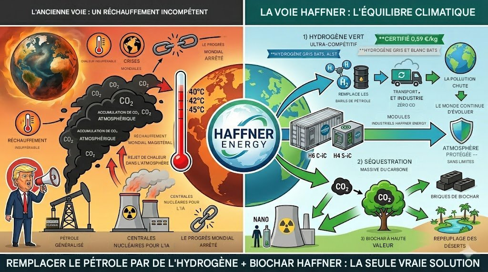
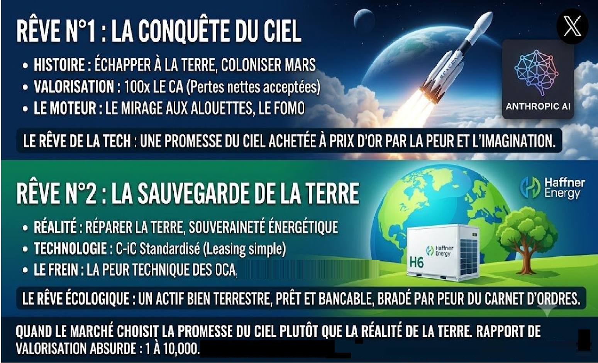
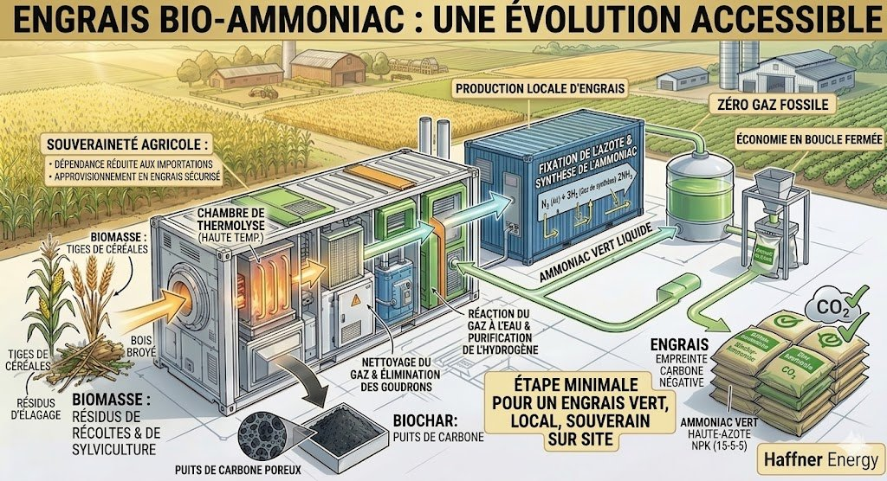
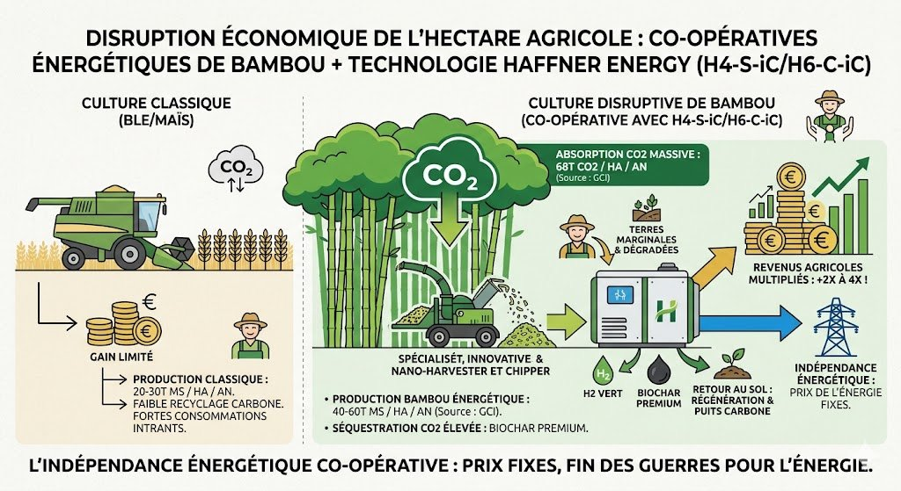
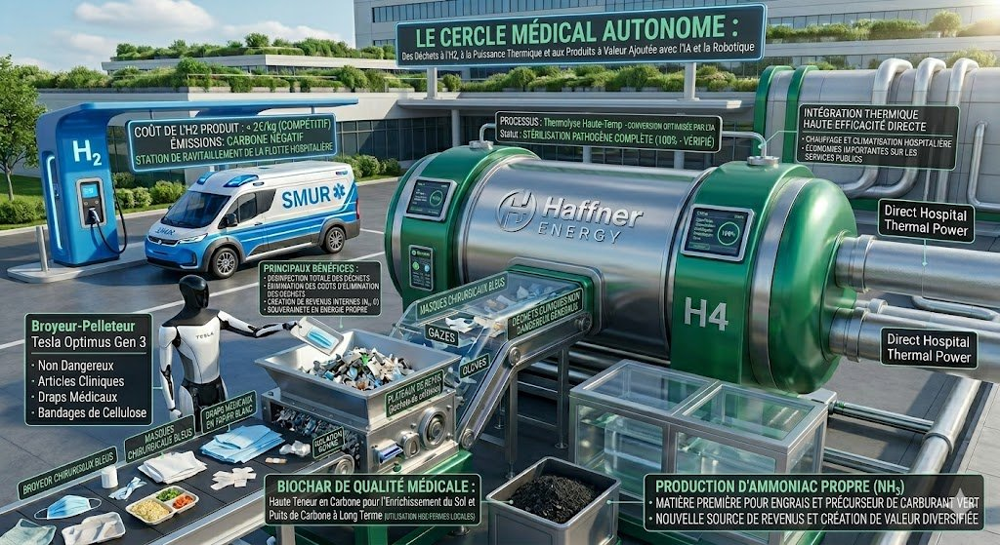
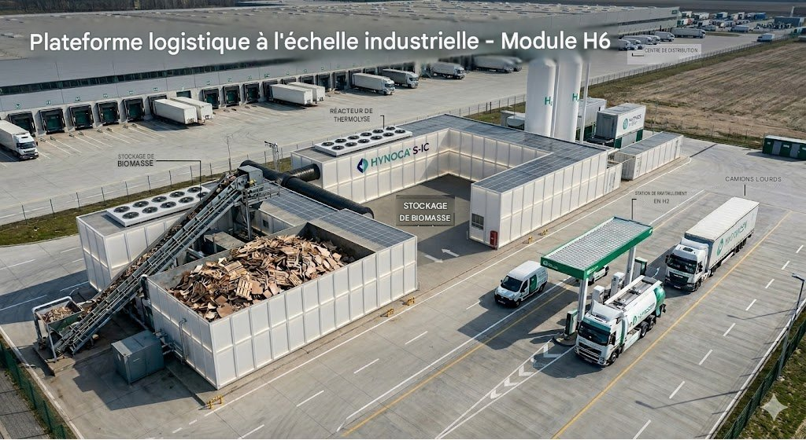
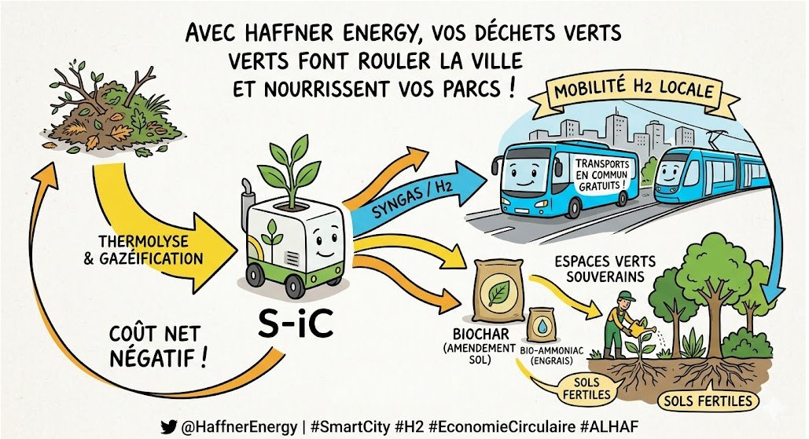
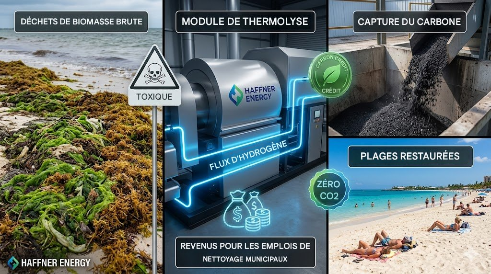
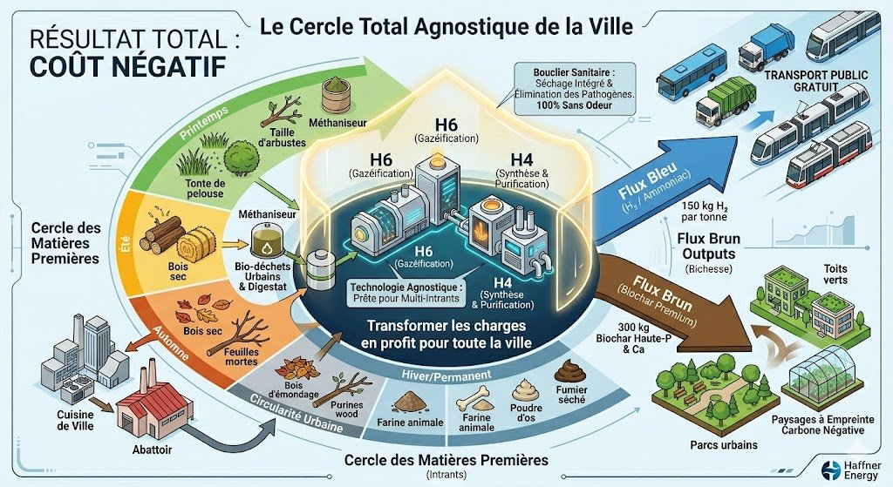

# MANIFESTE POUR LA SOUVERAINETÉ ET LA RÉSILIENCE TECHNOLOGIQUE [(English version - EN)](MANIFESTO_FOR_TECHNOLOGICAL_SOVEREIGNTY_AND_RESILIENCE.md)

*Vers un écosystème national d'autonomie énergétique, sanitaire et agricole*

📥 [Consultez le Manifeste pour la souveraineté et la résilience technologiques](README.md)

Note Stratégique Indépendante - EJS - Juin 2026

> **Note de transparence :** Ce texte défend une technologie précise, la thermolyse développée par Haffner Energy, dont l'auteur est actionnaire individuel. Il ne s'agit pas d'un conseil en investissement mais d'une analyse argumentée, publiée dans un souci de transparence : l'auteur assume pleinement le parti pris de ce texte, qu'il juge justifié par l'avance technologique et le nombre de brevets déposés par cette entreprise dans ce domaine.

## I. Constat : une souveraineté industrielle sous pression

La France traverse une période de tension stratégique, marquée par un décalage croissant entre ses capacités d'innovation et sa réalité industrielle. Entre lourdeurs administratives et pilotage à court terme, plusieurs de nos fleurons industriels peinent à passer à l'échelle. Ce constat mérite d'être posé sans détour : notre nation, historiquement pionnière dans l'ingénierie et l'énergie, risque de perdre une partie de sa maîtrise technologique si rien ne change.

Pendant que certaines de nos PME porteuses de ruptures technologiques majeures subissent des pressions financières fortes, des difficultés évitables ou choisissent l'exil vers des marchés plus accueillants, des brevets et des savoir-faire s'exportent vers des puissances étrangères plus promptes à s'approprier les technologies de demain.

Le modèle énergétique actuel repose largement sur des réseaux centralisés et sur des technologies comme l'électrolyse alimentée par des énergies fossiles ou nucléaires — un hydrogène qui se retrouve alors en concurrence directe avec l'intelligence artificielle, les cryptomonnaies ou l'industrie pour l'accès à l'électricité. Ce choix contribue à l'inflation, sollicite fortement nos ressources financières et sature nos infrastructures électriques. L'électrolyse en réseau agit comme un goulot d'étranglement sur une infrastructure électrique déjà mise sous tension par l'électrification massive des usages.

Cette stratégie fragilise notre économie et pèse sur notre capacité à soutenir le développement futur de l'intelligence artificielle et de la robotique, qui exigeront une puissance disponible massive, décentralisée et si possible souveraine. Chaque térawattheure consacré à l'électrolyse est un térawattheure de moins pour les supercalculateurs et la souveraineté numérique française. Une rupture technologique permettrait de desserrer cette contrainte.

La souveraineté ne se décrète pas ; elle se construit sur la maîtrise de la chaîne de valeur, du déchet à la ressource, de l'atome à la machine. Il devient nécessaire de restaurer une souveraineté industrielle qui repose moins sur l'importation de solutions étrangères instables, et davantage sur la valorisation locale et intelligente de notre biomasse et de nos gisements énergétiques.

Nous sommes à un moment charnière : continuer sur la trajectoire actuelle au risque de voir s'éroder nos capacités de rebond, ou reprendre en main notre destin technologique et énergétique par le déploiement de systèmes de thermolyse décentralisée.

## II. La Solution : la thermolyse de biomasse décentralisée à fort rendement

**Le défi thermodynamique : les limites des énergies dites propres face à l'urgence de séquestrer le carbone**

Un angle mort fréquent des politiques énergétiques actuelles est de négliger un point de thermodynamique de base. Déployer massivement l'électrolyse à partir du nucléaire ou d'un hydrogène d'origine fossile mal compensé ne suffit pas à résoudre la crise climatique si l'on continue, en parallèle, à ne pas décarboner l'atmosphère. Toute production massive d'énergie, même qualifiée de propre, génère structurellement de la chaleur anthropique dissipée. Or tant que le stock de CO₂ historique reste présent dans l'atmosphère, il retient une partie de cette chaleur près de la surface. Consommer toujours plus d'énergie dans un système déjà saturé en carbone, sans créer de puits de carbone en parallèle, pose un problème physique réel.

L'essor de l'intelligence artificielle générative et de la robotique lourde va amplifier ce phénomène : l'usage croissant de la puissance de calcul et des flottes de machines va créer une demande énergétique sans précédent, ce qui rend d'autant plus urgent de faire évoluer l'infrastructure énergétique sous-jacente.

Dans ce contexte, la technologie de thermolyse développée par Haffner Energy est l'une des rares architectures industrielles à ce jour capables de répondre à cette double contrainte : produire une énergie compétitive tout en extrayant et séquestrant durablement le carbone sous forme de biochar solide. Elle ne se contente pas d'être neutre en carbone ; elle est conçue pour être négative en carbone. Elle donne aussi un rôle utile à la robotique : plutôt que de simplement consommer de l'énergie, les systèmes automatisés de demain pourraient collecter et trier les déchets plastiques et organiques pour alimenter ces modules de transformation — produisant ainsi des carburants de synthèse et de l'hydrogène à un coût compétitif face aux énergies fossiles, tout en réduisant la pollution.

La technologie de thermolyse pourrait constituer le pilier d'un nouveau modèle où chaque territoire — du quartier urbain à la coopérative agricole — cesse d'être un simple consommateur pour devenir producteur de sa propre indépendance énergétique.

**1. Une production énergétique et chimique multi-flux : moins de gaspillage**

Ce système transforme le "déchet", qui coûte aujourd'hui à enfouir ou à brûler, en matière première valorisable. Par thermolyse contrôlée, la matière organique est décomposée pour en extraire une gamme de produits utiles :

- **Hydrogène de proximité :** produit directement sur le lieu de consommation (la station locale de production peut aussi servir de station-service à hydrogène), ce qui réduit les pertes liées au transport et au stockage haute pression. Cette production sur site peut alimenter des flottes de mobilité lourde — véhicules du SAMU, bus, trains, tramways, camions — renforçant l'autonomie des services au niveau local.

- **Biométhane et SAF (Sustainable Aviation Fuel) :** la technologie permet de produire des carburants durables à haute densité énergétique, utiles pour le transport civil comme pour les besoins aéronautiques. Un raccourci thermodynamique direct du solide au gaz de synthèse permet d'éviter certaines cascades de conversion moins efficaces d'autres filières de biocarburants (comme l'AtJ ou l'e-SAF).

- **Chimie de synthèse décentralisée :** le procédé ouvre la voie à une production locale d'ammoniac à partir de déchets de biomasse, composant clé des engrais. En rapprochant cette synthèse des exploitations agricoles via des coopératives, on réduit la dépendance de nos agriculteurs à la volatilité des cours mondiaux du gaz naturel.

**2. Le biochar enrichi, un actif pour les sols et pour la réglementation**

Par la récupération du phosphore, du calcium et des oligo-éléments contenus dans les résidus organiques (restes de cantines, déchets hospitaliers), la thermolyse produit un biochar de qualité qui peut restaurer la structure biologique des sols appauvris ou arides, limiter la désertification et constituer un puits de carbone stable sur le long terme.

Sur le plan réglementaire européen, le biochar offre à l'État un levier de conformité intéressant. En inscrivant ces volumes de carbone séquestré (crédits CORC) dans le Plan National Intégré Énergie-Climat (PNIEC), la France pourrait réduire sa dette carbone et limiter les pénalités liées à la non-atteinte des objectifs de puits de carbone.

En unifiant ces flux, la thermolyse ne se contente pas de produire de l'énergie : elle relie économie, agriculture et santé publique. Chaque unité installée devient un maillon de l'autonomie territoriale.

**3. Sécurité et résilience territoriale : l'hôpital et le territoire au cœur de l'autonomie**

La souveraineté repose aussi sur la capacité d'une nation à maintenir ses services essentiels en toute circonstance. En couplant la thermolyse à l'automatisation, il devient possible de renforcer la résilience énergétique, écologique et sanitaire de nos infrastructures critiques.

- **Hubs Hôpitaux-Cités : l'hôpital autonome et circulaire :** l'hôpital pourrait réduire sa dépendance au réseau en couplant thermolyse et automatisation robotisée pour la logistique interne (collecte et tri des déchets hospitaliers et organiques urbains). L'énergie produite alimenterait les blocs opératoires, tandis que la chaleur récupérée servirait au chauffage des bâtiments ou à la production de froid pour la conservation des médicaments, des vaccins et le fonctionnement des morgues — tout en réduisant l'exposition du personnel aux déchets infectieux.

- **Mobilité militaire tactique :** la vulnérabilité logistique des forces armées tient souvent à leur dépendance au ravitaillement en carburant. Des modules de thermolyse miniaturisés, transportables sur plateformes mobiles, pourraient permettre à un détachement d'extraire de l'énergie à partir de la biomasse locale ou de ses propres déchets, réduisant sa dépendance aux convois logistiques.

- **Dépollution et santé publique :** en remplaçant progressivement l'incinération systématique, source de pollution atmosphérique, la thermolyse réduit les émissions de particules fines et de composés toxiques liés à la combustion fossile. C'est un gain environnemental, mais aussi potentiellement un gain de santé publique, en réduisant certaines pathologies respiratoires et cardio-vasculaires liées à la pollution de l'air.

    

    

- **Prévention des risques :** aujourd'hui, l'entretien de certains terrains est freiné par son coût, ce qui peut favoriser les feux de forêt. Le débroussaillage pourrait devenir une activité rémunératrice si la biomasse récoltée alimente des modules à haut rendement, produisant hydrogène et biochar valorisables.

## III. Bilan économique : un levier de restructuration budgétaire

Le modèle de thermolyse décentralisée dépasse la simple prouesse technique : c'est un levier de restructuration budgétaire potentiellement significatif pour la nation. Notre système actuel reste largement exposé aux fluctuations des marchés mondiaux de l'énergie et aux coûts croissants du traitement des déchets. Le déploiement de cette technologie pourrait agir sur trois leviers macroéconomiques :

- **Réduction des importations fossiles et amélioration de la balance commerciale :** en valorisant nos propres ressources — biomasse agricole, gisements forestiers, déchets municipaux — la France réduirait ses transferts financiers vers l'étranger pour l'achat d'énergies fossiles. La facture énergétique française s'élève chaque année entre 60 et 80 milliards d'euros, une cause majeure du déficit commercial. En ajoutant les 3 milliards d'euros d'importations d'engrais et d'ammoniac liés au gaz fossile, substituer ces importations par une production thermochimique décentralisée et devenir exportateur net de biochar (crédits CORC) pourrait améliorer la balance commerciale de 30 à 40 milliards d'euros par an.

- **Effet sur le PIB et la dette publique :** chaque milliard d'euros non versé à l'achat d'énergies fossiles reste potentiellement injecté dans l'économie réelle des territoires, ce qui pourrait générer un gain de 1,5 à 2 points de PIB annuel et de nouvelles recettes fiscales sans alourdir la fiscalité des ménages.

- **Impact social : emplois et santé publique :** l'architecture modulaire de 2 à 5 MW favorise un maillage industriel de proximité, avec un potentiel de 50 000 à 80 000 emplois non délocalisables dans les territoires. Le remplacement progressif de l'incinération de masse par la thermolyse pourrait aussi réduire la charge financière liée à certaines pathologies respiratoires sur les budgets de la Sécurité Sociale.

    

- **Flexibilité de déploiement :** le système modulaire (2 à 5 MW), mobile, sans fondation lourde, opérationnel en environ 3 semaines, offre une adaptabilité financière (leasing, achat direct, coopératives territoriales) qui pourrait faciliter l'accès à l'indépendance énergétique pour différents types d'acteurs.

- **Valorisation des déchets en actifs :** cette technologie transforme une charge (le traitement des déchets) en source de revenus (énergie, engrais), une valeur économique qui resterait captée localement plutôt que dépensée dans des processus d'élimination coûteux.

**Données techniques et économiques de référence (Module C-iC H6)**

| Paramètre | Détail |
|---|---|
| **Puissance thermochimique** | Module modulaire décentralisé de 2 MW à 5 MW nominal. |
| **Débit de production unique** | Production continue de 60 kg d'hydrogène ultra-pur (H2) par heure et par module C-iC de base. |
| **Rendement de conversion** | De 75% à plus de 80% d'efficacité énergétique globale (solide → gaz utile), sans cascade biochimique. |
| **Intrants & Consommation** | ~1 tonne de biomasse brute/heure (paille de blé, résidus forestiers, Bois B, algues, CSR séchés — 140 types testés). Procédé auto-thermique, sans besoin électrique significatif du réseau. |
| **CAPEX initial estimé** | 2 à 5 millions d'euros par module d'ingénierie conteneurisé selon le carburant souhaité (Syngas, H2, biométhane, SAF...). Assemblage usine, installation en moins d'un mois sans génie civil. |
| **OPEX net cible** | Coût de revient inférieur à 2 €/kg d'hydrogène de haute pureté ou équivalent carburant, amortissement inclus et équilibré par la valorisation des co-produits. |
| **Co-produit valorisé** | Production de 200 kg de biochar solide par tonne de biomasse (amendement agricole et crédits de séquestration carbone CORC). |

## IV. Appel à l'action

Plusieurs mesures pourraient accélérer un déploiement responsable de cette technologie :

- **Un audit des valeurs stratégiques :** un recensement des PME technologiques de rupture dont le savoir-faire est critique, accompagné de mesures pour les protéger de pressions financières excessives et les aider à passer à l'échelle industrielle. Un mécanisme de protection contre certaines pratiques de financement déstabilisantes (usage abusif d'OCEANE ou de BSA, ventes à découvert massives) pourrait aider à stabiliser la gouvernance de ces entreprises et à protéger l'épargne des investisseurs logée dans les PEA-PME.

- **Une réforme des outils de financement :** assouplir certains verrous qui limitent le soutien d'organismes comme la BPI aux entreprises stratégiques en période de risque, en considérant que le financement de technologies vitales pour la nation relève d'un investissement stratégique de long terme.

- **Un cadre réglementaire accéléré pour les projets de souveraineté :** la complexité actuelle des procédures d'urbanisme ou ICPE impose des délais de 18 à 24 mois avant mise en service. Un mécanisme de type "fast-track", avec autorisations d'exploitation provisoires en moins de 3 mois pour les installations modulaires couplées à une infrastructure critique (hôpitaux, bases logistiques, coopératives agricoles), pourrait accélérer ces déploiements sans renoncer aux exigences de sécurité.

- **Une priorité accrue dans la commande publique :** si les performances de cette technologie se confirment à l'échelle, une systématisation progressive de son déploiement dans les infrastructures critiques (hôpitaux, bases logistiques, zones agricoles prioritaires) pourrait créer un effet d'entraînement pour conquérir des marchés à l'export.

## Conclusion

Un atout de cette technologie réside dans son agnosticisme vis-à-vis des intrants. Contrairement aux filières de biocarburants de première génération, qui entrent en concurrence avec les terres agricoles alimentaires, ou aux projets de biomasse lourde qui pèsent sur le couvert forestier, le modèle de thermolyse décentralisée s'appuie sur des gisements résiduels non valorisés : pailles de céréales, résidus sylvicoles, bois de récupération en fin de vie (Classe B), biodéchets urbains, combustibles solides de récupération (CSR). Le gisement national exploitable se compte en dizaines de millions de tonnes par an — une ressource aujourd'hui perçue comme une charge, que cette technologie transforme en actif, sans pression supplémentaire sur la souveraineté alimentaire ou forestière.

  

  

La thermolyse sèche décentralisée ne se présente pas comme une simple alternative parmi d'autres, mais comme une brique possible d'une résilience de long terme. Réparer notre environnement avec les outils de l'ingénierie reste, à mon sens, une voie plus praticable à court terme que l'exploration spatiale pour répondre aux défis énergétiques et climatiques actuels. La France dispose des ressources et du savoir-faire pour porter cette transition ; la question reste celle de la volonté politique et industrielle de s'en saisir pleinement.

---

## 📚 Analyses complémentaires sectorielles

Ce manifeste a été décliné en notes techniques ciblées par public :

- 🏥 [Datacenters et Intelligence Artificielle : Vers un seul scénario vertueux](analyses/Datacenters_et_Intelligence_Artificielle_-_le_seul_scenario_vertueux.md)
- 🏥 [Hôpital autonome et circulaire : la thermolyse au service de la résilience sanitaire](analyses/HOPITAL_AUTONOME_DECARBONATION_ET_ENERGIE_VERTE_SOLUTION_THERMOLYSE_HAFFNER_ENERGY.md)
- 🪖 [Autonomie énergétique tactique : défense et souveraineté militaire](analyses/AUTONOMIE_ENERGETIQUE_TACTIQUE_DEFENSE_SOUVERAINETE_MILITAIRE.md)
- 🌾 [L'indépendance en hydrogène à portée de chaque territoire (collectivités, élus ruraux)](analyses/L_INDEPENDANCE_EN_HYDROGENE_A_PORTEE_DE_CHAQUE_TERRITOIRE_COLLECTIVITES_ELUS_RURAUX.md)
- ✈️ [Le SAF Haffner Energy : une solution française immédiate pour la décarbonation de l'aviation](analyses/LE_SAF_HAFFNER_ENERGY_UNE_SOLUTION_FRANCAISE_IMMEDIATE_POUR_LA_DECARBONATION_DE_L_AVIATION.md)
- 🇫🇷 [Haffner Energy : la France laisse partir sa révolution énergétique à l'étranger](analyses/REVOLUTION_ENERGETIQUE_ET_ABANDON_DE_SOUVERAINETE_NATIONALE.md)
- 📊 [Comparaison mondiale des sources d'énergie : pourquoi la thermolyse Haffner Energy change tout](analyses/COMPARAISON_SOURCES_ENERGIE_THERMOLYSE_HAFFNER_ENERGY.md)
- 🌡️ [Classement climatique des sources d'énergie : chaleur anthropique incluse](analyses/CLASSEMENT_CLIMATIQUE_SOURCES_ENERGIE_CHALEUR_ANTHROPIQUE.md)

---

**Avertissement :** *Cette note stratégique est une contribution indépendante au débat public sur la souveraineté industrielle et énergétique. L'auteur exprime des opinions personnelles fondées sur des données publiques et n'agit en aucun cas pour le compte de l'entreprise citée. Étant lui-même actionnaire à titre individuel, ce texte est partagé dans un esprit de transparence, à des fins exclusivement informatives et d'analyse macroéconomique. Il ne constitue en aucun cas un conseil en investissement, une incitation à l'achat ou une recommandation d'ordre boursier.*
