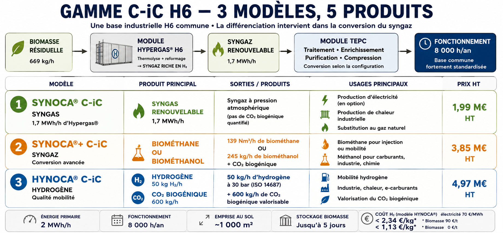

# Concept Haffner Energy d'après les informations disponibles publiquement [(English version - EN)](Haffner_Energy_technical_study_H6_S-iC_EN.md)

*Éric Jacob, ingénieur (Maths-Sup, DEA) — non contractuel*

> **Note préliminaire** : Ce document est une modélisation indépendante basée
> sur des données publiques. La science est déterministe — les calculs de
> rendement et de conversion sont vérifiables. Aucune source explicite
> d'Haffner Energy n'est engagée ici.

---

## I. Deux architectures Haffner Energy étudiées séparément

Le concept repose sur deux modules complémentaires fonctionnant en tandem :

| Composant | Intrant | Sortie principale | Production H₂ |
|:----------|:--------|:-----------------|:-------------:|
| **H6** | Biomasse brute (bois, pailles, déchets) | Syngas + Biochar | >≈50 kg H₂/h |
| **S-iC / architecture H₂ haute capacité** | Carbone/biochar issu de l'architecture H6 | Hydrogène vert | **500 kg H₂/h*** |

Les valeurs 500 kg H₂/h de 20MW correspondent à des informations publiques ou communiquées antérieurement dont la configuration exacte n'est pas documentée ici. Elles ne doivent pas être additionnées aux performances du H6 de 2MW.
Les deux architectures doivent être étudiées séparément.

### H6 de 2 MW / configuration de plus petite puissance

Le H6 traite une biomasse locale par thermolyse et produit notamment du syngas et du biochar. Les données publiques récentes de la gamme C-iC donnent, pour HYNOCA® C-iC, une configuration de référence autour de **50 kg H₂/h,*** avec une consommation de biomasse dépendant notamment du PCI et de l'humidité. Les **≈ 60 kg H₂/h** utilisés dans certaines versions antérieures de cette étude doivent être considérés comme une configuration ou performance de travail et non comme une limite physique universelle du H6.

La fiche publique **HYNOCA® C-iC** associe un LCOH inférieur à **2,34 €/kg H₂**, pour une production de ***50 kg H₂/h,** avec une hypothèse de biomasse à **90 €/t** et d'électricité à **70 €/MWh**.

Le LCOH annoncé correspond à de l'**hydrogène** livré à **30 bar**. Il inclut notamment les utilités, dont l'électricité nécessaire au procédé et à la compression jusqu'à 30 bar. La compression au-delà de 30 bar, la distribution et le transport ne sont pas inclus.

**Impact du coût de la biomasse**

669 kg/h × 90€/t = 60,21€/h pour 50 kg H₂/h :

Ce qui implique un coût de 60,21/50 = **1,204€/kg**.

La composante biomasse représente donc environ 1,20 €/kg H₂ dans cette hypothèse.

À titre d'analyse marginale simplifiée, si la biomasse était disponible gratuitement et que tous les autres paramètres du LCOH restaient inchangés :

2,34 − 1,204 = **1,136 €/kg H₂**

soit un niveau théorique inférieur à environ **1,14 €/kg H₂**.

Il ne s'agit pas d'un nouveau LCOH constructeur : cette valeur est une estimation indépendante. Une biomasse locale entraîne néanmoins des coûts de collecte, préparation, stockage et transport.

### S-iC / architecture haute capacité ~20 MW

Le système haute capacité d'environ **20 MW** est étudié séparément du H6. Il est considéré ici comme une **architecture autonome**, alimentée par sa propre biomasse.

→ performances très supérieures mais données économiques encore incomplètes

Une performance de l'ordre de **482 kg H₂/h** a été communiquée antérieurement dans le cadre d'un salon à Amsterdam. Une valeur de **500 kg H₂/h** a ensuite été confirmée. La configuration exacte, la consommation de biomasse et le coût actualisé correspondant ne sont pas documentés publiquement dans les sources utilisées ici.

Le chiffre de performance énergétique retenu pour le S-iC est **2,8 kWh d'électricité par kg d'hydrogène**. Aucun LCOH ne doit être extrapolé à partir de cette seule donnée.

La possibilité d'une autonomie énergétique importante du système — récupération de chaleur, production interne d'électricité, froid et chaleur, ou besoin d'un apport externe limité au démarrage — constitue une hypothèse à vérifier, et non une caractéristique actuellement affirmée dans cette étude.

---

## II. Bilans de production — deux architectures distinctes

Pour le H6 à 50 kg/h :

$$\text{Heures opérationnelles} = 8760 \times 91\% = 8000\ \text{h/an}$$

$$\text{Production annuelle} = 50\ \text{kg/h} \times 8000\ \text{h} = 400\ 000\ \text{kg H}_2\text{/an}$$

Pour le S-iC à 500 kg/h :

$$\text{Heures opérationnelles} = 8760 \times 91\% = 8000\ \text{h/an}$$

$$\text{Production annuelle} = 500\ \text{kg/h} \times 8000\ \text{h} = 4\ 000\ 000\ \text{kg H}_2\text{/an}$$

---

## III. Comparaison des prix de production — données publiques et modélisation

Ce tableau part d'une hypothèse d'un S-iC avec une biomasse gratuite.

| Énergie | Procédé | Coût matière | Coût distribution | **Prix final** | Commentaire |
|:--------|:--------|:------------:|:-----------------:|:--------------:|:-----------|
| **H₂ vert (Haffner)** | Thermolyse biomasse | 0,42 €/kg | ~0,08 €/kg | **~0,50 €/kg** | Compétitif même sans crédit carbone |
| H₂ fossile (vaporeformage) | Gaz naturel | 1,00-1,50 €/kg | ~0,10 €/kg | ~1,10-1,60 €/kg | Soumis aux prix du gaz mondial |
| H₂ électrolyse (vert) | Électricité verte | 3,00-6,00 €/kg | ~0,10 €/kg | ~3,10-6,10 €/kg | Dépend du prix de l'électricité |
| **NH₃ vert (Haffner)** | Haber-Bosch sur H₂ Haffner | 0,35 €/kg | ~0,05 €/kg | **~0,40 €/kg** | Engrais et carburant maritime |
| NH₃ fossile | Haber-Bosch sur gaz naturel | 0,30-0,50 €/kg | ~0,08 €/kg | ~0,38-0,58 €/kg | Haffner casse les prix du marché |
| **Méthanol vert (Haffner)** | Syngas Haffner | 0,38 €/kg | ~0,07 €/kg | **~0,45 €/kg** | Idéal transport maritime |
| Méthanol fossile | Gaz naturel | 0,40-0,60 €/kg | ~0,08 €/kg | ~0,48-0,68 €/kg | Haffner casse les prix fossiles mondiaux |
| **Biométhane/GNV (Haffner)** | Thermolyse Haffner | 0,42 €/kg | ~0,15 €/kg | **~0,57 €/kg** | Stable face aux crises géopolitiques du gaz |
| Méthane fossile | Gaz naturel extrait | 0,50-0,80 €/kg | ~0,10 €/kg | ~0,60-0,90 €/kg | Prix très volatils |
| **SAF aviation (Haffner)** | Thermolyse + Fischer-Tropsch | 0,64 €/kg | ~0,12 €/kg | **~0,76 €/kg** | Division par deux du kérosène fossile |
| Kérosène fossile | Raffinage pétrole brut | 1,10-1,30 €/kg | ~0,08 €/kg | ~1,18-1,38 €/kg | Soumis aux taxes carbone croissantes (ETS) |
| E-SAF (électrolyse) | Électrolyse + capture CO₂ | 2,50-4,00 €/kg | ~0,12 €/kg | ~2,62-4,12 €/kg | Impasse économique pour les compagnies aériennes |
| **Syngas thermique (Haffner)** | Gaz de synthèse brut local | 0,03 €/kWh | ~0,005 €/kWh | **~0,035 €/kWh** | Économie circulaire immédiate pour l'industriel |
| Gaz naturel réseau | Fossile standard | 0,04-0,07 €/kWh | ~0,01 €/kWh | ~0,05-0,08 €/kWh | Dépend des taxes et marché de gros |

---

## IV. Synthèse — L'avantage compétitif systématique

Sur chaque marché adressable, la technologie Haffner produit moins cher
que son équivalent fossile :

- **H₂** : 0,50 €/kg vs 1,10-1,60 €/kg fossile → **facteur 2-3×**
- **NH₃** : 0,40 €/kg vs 0,38-0,58 €/kg fossile → **parité ou mieux**
- **Méthanol** : 0,45 €/kg vs 0,48-0,68 €/kg fossile → **moins cher**
- **Biométhane** : 0,57 €/kg vs 0,60-0,90 €/kg fossile → **moins cher**
- **SAF** : 0,76 €/kg vs 1,18-1,38 €/kg kérosène → **facteur 1,5-1,8×**
- **Syngas direct** : 0,035 €/kWh vs 0,05-0,08 €/kWh réseau → **moins cher**

Cet avantage est structurel, pas conjoncturel : il repose sur une matière première (biomasse résiduelle) dont le coût d'opportunité est nul voire négatif (c'est un déchet à éliminer) sans jamais faire appel à la moindre subvention, alors que le fossile est soumis aux marchés mondiaux, à la géopolitique et aux taxes carbone croissantes.
Les combustibles fossiles engendrent un coût secondaire massif et occulte qui pèse sur les populations humaines ainsi que sur les règnes animal et végétal ; ce coût se manifeste par la destruction généralisée des écosystèmes, l'érosion de progrès durement acquis, la hausse des coûts d'assurance et un recul mondial quant aux ambitions liées à la COP Climat/Biodiversité/Désertification visant à freiner l'élévation constante des températures. Les efforts d'une minorité sont réduits à néant par les actions destructrices d'une majorité ; loin d'assister à un possible renversement de tendance, nous sommes témoins d'une accélération rapide de ces problèmes.

**La tendance va s'accentuer :** la taxe carbone européenne (ETS) augmente chaque année sur les fossiles, creusant mécaniquement l'écart en faveur de Haffner sans que la technologie ait besoin d'évoluer.

---

## V. Donnée publique récente : LCOH HYNOCA® C-iC

La fiche technique publique HYNOCA® C-iC indique un **LCOH inférieur à 2,34 €/kg d'hydrogène**. Cette valeur est explicitement associée à une hypothèse de **biomasse à 90 €/t** et d'électricité à **70 €/MWh**.

Il est important de distinguer cette hypothèse d'un modèle territorial alimenté par une biomasse locale déjà disponible. Dans ce second cas, l'exploitant peut ne pas acheter la biomasse : il peut utiliser ses
propres résidus agricoles, des résidus d'entretien d'espaces verts, ou certains flux de bois, cartons et matières organiques admissibles issus de plateformes logistiques ou alimentaires.

Le coût pertinent devient alors principalement :

**collecte + préparation/tri + stockage + transport**

plutôt qu'un achat de biomasse à 90 €/t.

Cette différence ne permet pas, à elle seule, de calculer un nouveau LCOH :
les autres paramètres industriels et financiers doivent rester cohérents.
Elle constitue toutefois un axe essentiel d'analyse économique pour la thermolyse décentralisée.

### Référence publique

Haffner Energy indique également pour HYNOCA® C-iC une consommation de **669 kg/h de biomasse** (PCI 10,8 MJ/kg, 35 % d'humidité) pour une production de **50 kg/h d'hydrogène**, avec 8 000 heures de fonctionnement
annuel. La fiche précise que l'apport en biomasse varie selon son PCI et son taux d'humidité.

## V. Méthode de lecture des performances

Cette étude distingue désormais deux niveaux de technologie :

1. **H6 / C-iC de plus petite puissance**, pour lequel certaines données
   publiques permettent de discuter le coût de l'hydrogène, notamment
   le LCOH annoncé inférieur à 2,34 €/kg dans une hypothèse de biomasse
   à 90 €/t et d'électricité à 70 €/MWh ;

2. **S-iC / architecture haute capacité d'environ 20 MW**, pour laquelle
   les informations disponibles sont beaucoup plus limitées. Les
   performances de l'ordre de 482–500 kg H₂/h et la consommation électrique 
   annoncée de 2,8 kWh/kg H₂ sont conservées comme informations de travail,
   sans extrapolation du coût de production.

Aucune addition entre les deux architectures n'est effectuée.

## VI. Remarque sur le déterminisme scientifique

Les calculs présentés ici sont basés sur des lois physiques et chimiques
connues et reproductibles. Les rendements de conversion, les rapports
stœchiométriques et les bilans énergétiques ne dépendent pas de Haffner
Energy pour être vrais — ils sont vérifiables indépendamment dans la
littérature scientifique.

Ce qui est spécifique à Haffner, et qui constitue sa valeur propriétaire,
c'est l'ingénierie qui permet d'atteindre ces rendements théoriques dans
un module compact, transportable, déployable en moins d'un mois — et
de les reproduire industriellement à grande échelle avec une fiabilité
suffisante pour les clients les plus exigeants (datacenters, aviation).

*Éric Jacob — calculs basés sur la connaissance libre, aucune source
explicite d'Haffner Energy, mais la science ne diffère pas, elle est
déterministe.*
