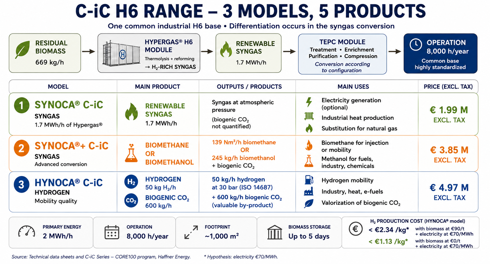

# Haffner Energy Concept Based on Publicly Available Information [(French version - FR)](Haffner_Energy_etude_technique_H6_S-iC_FR.md)

*Éric Jacob, engineer (Maths-Sup, DEA) — non-contractual*

> **Preliminary note**: This document is an independent model based on
> publicly available data. Science is deterministic — efficiency and
> conversion calculations are independently verifiable. No explicit source
> from Haffner Energy is being cited or committed here.

---

## I. Two Haffner Energy Architectures Studied Separately

The concept is based on two complementary modules operating in tandem:

| Component | Input | Main output | H₂ production |
|:----------|:--------|:-----------------|:-------------:|
| **H6** | Raw biomass (wood, straw, waste) | Syngas + Biochar | >≈50 kg H₂/h |
| **S-iC / high-capacity H₂ architecture** | Carbon/biochar from the H6 architecture | Green hydrogen | **500 kg H₂/h*** |

The 500 kg H₂/h figure for the 20 MW system corresponds to information that was previously made public or communicated, although its exact configuration is not documented here. It must not be added to the performance of the 2 MW H6.

The two architectures must be studied separately.

### 2 MW H6 / lower-power configuration

The H6 processes local biomass through thermolysis and produces, among other products, syngas and biochar. Recent public data for the C-iC range give, for HYNOCA® C-iC, a reference configuration of around **50 kg H₂/h,*** with biomass consumption depending in particular on its LHV and moisture content. The **≈ 60 kg H₂/h** used in some earlier versions of this study should be considered a working configuration or performance, rather than a universal physical limit of the H6.

The public **HYNOCA® C-iC** datasheet gives an LCOH below **€2.34/kg H₂**, for a production of ***50 kg H₂/h,** based on an assumption of biomass at **€90/t** and electricity at **€70/MWh**.

The announced LCOH corresponds to **hydrogen** delivered at **30 bar**. It includes utilities, including the electricity required for the process and for compression up to 30 bar. Compression beyond 30 bar, distribution and transport are not included.

**Impact of Biomass Cost**

669 kg/h × €90/t = €60.21/h for 50 kg H₂/h:

This implies a cost of 60.21/50 = **€1.204/kg**.

The biomass component therefore represents approximately €1.20/kg H₂ under this assumption.

As a simplified marginal analysis, if biomass were available free of charge and all other LCOH parameters remained unchanged:

2.34 − 1.204 = **€1.136/kg H₂**

i.e. a theoretical level below approximately **€1.14/kg H₂**.

This is not a new manufacturer LCOH: this value is an independent estimate. Local biomass nevertheless entails collection, preparation, storage and transport costs.

### S-iC / ~20 MW high-capacity architecture

The high-capacity system (approx. **20 MW**) is being studied separately from the H6. It is treated here as a **standalone architecture**, powered by its own biomass supply.

It is plausible that a 20 MW unit would have a significantly lower LCOH than a 2–5 MW unit—not because the thermolysis process itself is inherently twice as efficient, but because scaling up can drastically reduce specific CAPEX, auxiliary power consumption, and fixed costs per kilogram of H₂ produced.

→ superior performance, but economic data still incomplete

A performance level of approximately **482 kg H₂/h** was previously reported at a trade show in Amsterdam. A figure of **500 kg H₂/h** was subsequently confirmed. The exact configuration, biomass consumption, and corresponding levelized cost of hydrogen (LCOH) are not publicly documented in the sources used here.

The energy performance figure that was temporarily cited—and which I am adopting for the S-iC—is **2.8 kWh of electricity per kilogram of hydrogen**. No LCOH figure should be extrapolated from this single data point.

The potential for significant system energy autonomy—through heat recovery, internal generation of electricity, cooling and heating, or an external energy input limited to startup—is a hypothesis to be verified, rather than a confirmed characteristic of the current study.

The amount of electricity required to produce one kilogram of H₂ may be lower at the system level than in an electrolysis-based architecture, where electricity serves as the primary energy input.

- *2.8 kWh/kg H₂ → potentially very low electricity cost.*
- *Very low-cost biomass → second major lever.*
- *Large 20 MW unit → third lever: potentially significant reduction in CAPEX/OPEX per kg.*
- *Valorizable CO₂ → fourth potential revenue stream.*

| Electricity | Electric cost / kg H₂ |
| :--- | :--- |
| **5 c€/kWh** | 0.14 €/kg |
| **7 c€/kWh** | 0.196 €/kg |
| **10 c€/kWh** | 0.28 €/kg |
| **15 c€/kWh** | 0.42 €/kg (This price serves as a basis) |
| **20 c€/kWh** | 0.56 €/kg |

---

## II. Production Balances — Two Distinct Architectures

For the H6 at 50 kg/h:

$$\text{Operating hours} = 8760 \times 91\% = 8000\ \text{h/year}$$

$$\text{Annual production} = 50\ \text{kg/h} \times 8000\ \text{h} = 400\ 000\ \text{kg H}_2\text{/year}$$

For the S-iC at 500 kg/h:

$$\text{Operating hours} = 8760 \times 91\% = 8000\ \text{h/year}$$

$$\text{Annual production} = 500\ \text{kg/h} \times 8000\ \text{h} = 4\ 000\ 000\ \text{kg H}_2\text{/year}$$

---

## III. Comparison of Production Costs — Public Data and Modeling

This table is based on the assumption of an S-iC using free biomass.

| Energy | Process | Material cost | Distribution cost | **Final price** | Comment |
|:--------|:--------|:------------:|:-----------------:|:--------------:|:-----------|
| **Green H₂ (Haffner)** | Biomass thermolysis | €0.42/kg | ~€0.08/kg | **~€0.50/kg** | Competitive even without carbon credits |
| Fossil H₂ (steam methane reforming) | Natural gas | €1.00–1.50/kg | ~€0.10/kg | ~€1.10–1.60/kg | Subject to global gas prices |
| Electrolysis H₂ (green) | Renewable electricity | €3.00–6.00/kg | ~€0.10/kg | ~€3.10–6.10/kg | Depends on electricity price |
| **Green NH₃ (Haffner)** | Haber-Bosch using Haffner H₂ | €0.35/kg | ~€0.05/kg | **~€0.40/kg** | Fertilizer and marine fuel |
| Fossil NH₃ | Haber-Bosch using natural gas | €0.30–0.50/kg | ~€0.08/kg | ~€0.38–0.58/kg | Haffner undercuts market prices |
| **Green methanol (Haffner)** | Haffner syngas | €0.38/kg | ~€0.07/kg | **~€0.45/kg** | Ideal for maritime transport |
| Fossil methanol | Natural gas | €0.40–0.60/kg | ~€0.08/kg | ~€0.48–0.68/kg | Haffner undercuts global fossil prices |
| **Biomethane/CNG (Haffner)** | Haffner thermolysis | €0.42/kg | ~€0.15/kg | **~€0.57/kg** | Stable despite geopolitical gas crises |
| Fossil methane | Extracted natural gas | €0.50–0.80/kg | ~€0.10/kg | ~€0.60–0.90/kg | Highly volatile prices |
| **Aviation SAF (Haffner)** | Thermolysis + Fischer-Tropsch | €0.64/kg | ~€0.12/kg | **~€0.76/kg** | Half the price of fossil kerosene |
| Fossil kerosene | Crude oil refining | €1.10–1.30/kg | ~€0.08/kg | ~€1.18–1.38/kg | Subject to rising carbon taxes (ETS) |
| E-SAF (electrolysis) | Electrolysis + CO₂ capture | €2.50–4.00/kg | ~€0.12/kg | ~€2.62–4.12/kg | Economic dead end for airlines |
| **Thermal syngas (Haffner)** | Local raw synthesis gas | €0.03/kWh | ~€0.005/kWh | **~€0.035/kWh** | Immediate circular economy for industry |
| Grid natural gas | Standard fossil fuel | €0.04–0.07/kWh | ~€0.01/kWh | ~€0.05–0.08/kWh | Depends on taxes and wholesale market |

---

## IV. Summary — The Systematic Competitive Advantage

Across every addressable market, Haffner technology produces at a lower cost
than its fossil equivalent:

- **H₂**: €0.50/kg vs €1.10–1.60/kg fossil → **2–3× lower**
- **NH₃**: €0.40/kg vs €0.38–0.58/kg fossil → **at parity or better**
- **Methanol**: €0.45/kg vs €0.48–0.68/kg fossil → **lower cost**
- **Biomethane**: €0.57/kg vs €0.60–0.90/kg fossil → **lower cost**
- **SAF**: €0.76/kg vs €1.18–1.38/kg kerosene → **1.5–1.8× lower**
- **Direct syngas**: €0.035/kWh vs €0.05–0.08/kWh grid gas → **lower cost**

This advantage is structural, not cyclical: it is based on a feedstock
(residual biomass) whose opportunity cost is zero or even negative (it is a
waste stream that otherwise has to be disposed of), whereas fossil fuels are
subject to global markets, geopolitics and rising carbon taxes.

**The trend will intensify:** the European carbon tax (ETS) increases
every year on fossil fuels, mechanically widening the gap in Haffner's
favor without the technology needing to evolve.

---

## V. Recent Public Data: HYNOCA® C-iC LCOH

The public HYNOCA® C-iC technical datasheet indicates an **LCOH below
€2.34/kg of hydrogen**. This value is explicitly associated with an
assumption of **biomass at €90/t** and electricity at **€70/MWh**.

It is important to distinguish this assumption from a territorial model
supplied by biomass that is already locally available. In the latter case,
the operator may not need to purchase the biomass: it can use its own
agricultural residues, green-space maintenance residues, or certain
admissible wood, cardboard and organic-material streams from logistics or
food platforms.

The relevant cost then becomes primarily:

**collection + preparation/sorting + storage + transport**

rather than purchasing biomass at €90/t.

This difference alone does not make it possible to calculate a new LCOH:
the other industrial and financial parameters must remain consistent. It is
nevertheless a key area of economic analysis for decentralized thermolysis.

### Public Reference

Haffner Energy also indicates for HYNOCA® C-iC a consumption of
**669 kg/h of biomass** (LHV 10.8 MJ/kg, 35% moisture) for a production of
**50 kg/h of hydrogen**, with 8,000 operating hours per year. The datasheet
specifies that biomass input varies according to its LHV and moisture
content.

## V. Method for Interpreting Performance Data

This study now distinguishes two levels of technology:

1. **Lower-power H6 / C-iC**, for which certain public data make it possible
   to discuss hydrogen cost, notably the LCOH announced below €2.34/kg under
   an assumption of biomass at €90/t and electricity at €70/MWh;

2. **S-iC / high-capacity architecture of approximately 20 MW**, for which
   the available information is much more limited. Performance figures in
   the range of 482–500 kg H₂/h and the reported electricity consumption of
   2.8 kWh/kg H₂ are retained as working information, without extrapolating
   a production cost.

No addition between the two architectures is made.

## VI. Note on Scientific Determinism

The calculations presented here are based on known and reproducible
physical and chemical laws. Conversion efficiencies, stoichiometric ratios
and energy balances do not depend on Haffner Energy to be true — they can be
independently verified in the scientific literature.

What is specific to Haffner, and constitutes its proprietary value, is the
engineering that makes it possible to achieve these theoretical efficiencies
in a compact, transportable module, deployable in less than one month — and
to reproduce them industrially at large scale with sufficient reliability
for the most demanding customers (data centers, aviation).

*Éric Jacob — calculations based on freely available knowledge, no explicit
Haffner Energy source, but science does not differ; it is deterministic.*
